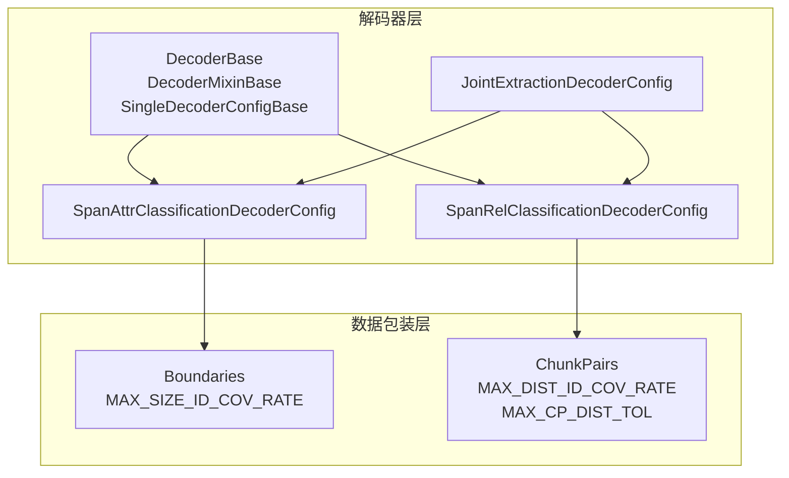
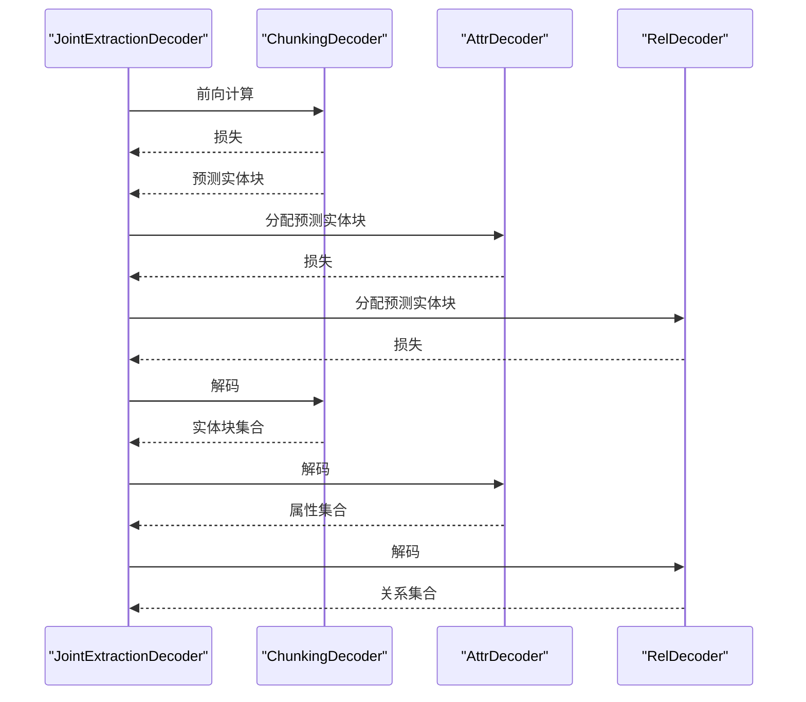
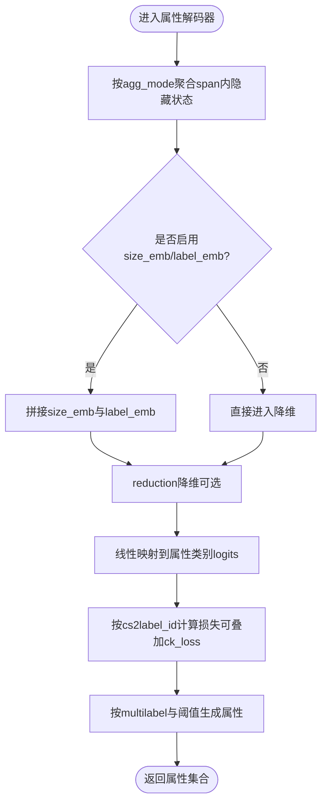
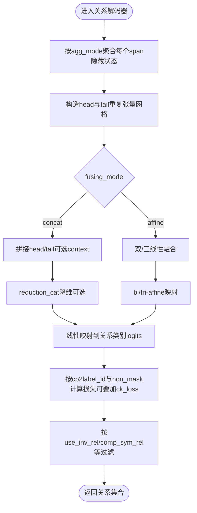
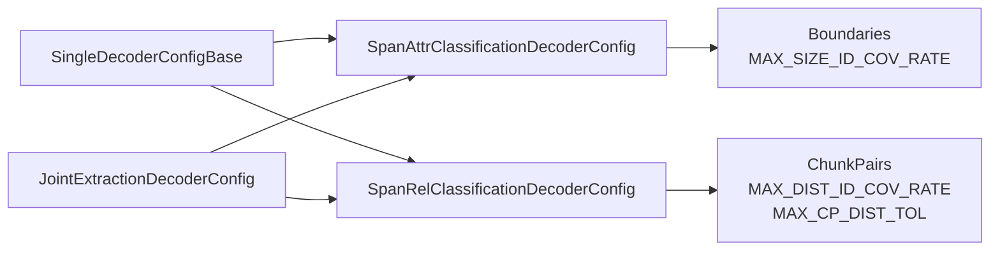

# 属性与关系解码器配置

<cite>
**本文引用的文件列表**
- [joint_extraction.py](file://eznlp/model/decoder/joint_extraction.py)
- [base.py](file://eznlp/model/decoder/base.py)
- [span_attr_classification.py](file://eznlp/model/decoder/span_attr_classification.py)
- [span_rel_classification.py](file://eznlp/model/decoder/span_rel_classification.py)
- [boundaries.py](file://eznlp/model/decoder/boundaries.py)
- [chunks.py](file://eznlp/model/decoder/chunks.py)
- [span_bert_like.py](file://eznlp/model/span_bert_like.py)
- [test_span_attr_classification.py](file://tests/model/test_span_attr_classification.py)
- [test_span_rel_classification.py](file://tests/model/test_span_rel_classification.py)
- [test_chunks.py](file://tests/model/test_chunks.py)
</cite>

## 目录
1. [引言](#引言)
2. [项目结构](#项目结构)
3. [核心组件](#核心组件)
4. [架构总览](#架构总览)
5. [详细组件分析](#详细组件分析)
6. [依赖关系分析](#依赖关系分析)
7. [性能考量](#性能考量)
8. [故障排查指南](#故障排查指南)
9. [结论](#结论)
10. [附录](#附录)

## 引言
本文件围绕属性解码器（span_attr_classification）与关系解码器（span_rel_classification）的配置体系进行深入解析，重点覆盖以下主题：
- 配置项“span_attr_classification”与“span_rel_classification”的工作机制与参数含义
- 标签嵌入维度（label_emb_dim）对属性分类性能的影响路径
- 关系分类中负采样策略（neg_sampling_rate）对稀疏关系类型的优化作用
- 聚合模式（agg_mode）在属性与关系分类中的特征融合机制
- 最大尺寸ID（max_size_id）参数对嵌套实体处理的约束条件
- 多任务联合训练时解码器组合的最佳实践方案

## 项目结构
本仓库采用模块化设计，解码器位于模型子模块下，分别提供序列标注、边界选择、以及基于span的分类解码器。属性与关系解码器均继承自统一的单解码器配置基类，并通过联合解码器将多个解码器组合为多任务学习框架。

图表来源
- [base.py](file://eznlp/model/decoder/base.py#L1-L114)
- [span_attr_classification.py](file://eznlp/model/decoder/span_attr_classification.py#L91-L193)
- [span_rel_classification.py](file://eznlp/model/decoder/span_rel_classification.py#L156-L317)
- [joint_extraction.py](file://eznlp/model/decoder/joint_extraction.py#L68-L153)
- [boundaries.py](file://eznlp/model/decoder/boundaries.py#L1-L353)
- [chunks.py](file://eznlp/model/decoder/chunks.py#L1-L342)

章节来源
- [joint_extraction.py](file://eznlp/model/decoder/joint_extraction.py#L68-L153)
- [base.py](file://eznlp/model/decoder/base.py#L1-L114)

## 核心组件
- 单解码器配置基类：提供通用的损失函数选择（交叉熵、焦点损失、平滑标签）、置信度阈值、多标签开关等基础能力。
- 属性解码器配置：支持标签嵌入维度（label_emb_dim）、尺寸嵌入维度（size_emb_dim）、聚合模式（agg_mode）、降维网络（reduction）、负采样率（neg_sampling_rate）、块级分类辅助损失权重（ck_loss_weight）等。
- 关系解码器配置：支持上下文使用（use_context）、融合模式（fusing_mode，concat/affine）、降维网络（reduction/reduction_ctx/reduction_cat）、负采样率（neg_sampling_rate）、对称关系补全（comp_sym_rel）、逆关系（use_inv_rel）、简化软标签平滑（ss_epsilon）等。
- 联合解码器配置：将块级分类（chunking）、属性分类、关系分类三者组合，支持各自损失权重（ck_loss_weight、attr_loss_weight、rel_loss_weight），并按顺序执行前向与解码。

章节来源
- [base.py](file://eznlp/model/decoder/base.py#L52-L114)
- [span_attr_classification.py](file://eznlp/model/decoder/span_attr_classification.py#L91-L193)
- [span_rel_classification.py](file://eznlp/model/decoder/span_rel_classification.py#L156-L317)
- [joint_extraction.py](file://eznlp/model/decoder/joint_extraction.py#L68-L153)

## 架构总览
联合解码器在前向阶段依次调用块级分类解码器，随后根据预测的实体块分配给属性与关系解码器；在解码阶段同样按顺序产出三类结果。属性与关系解码器内部通过聚合模块（池化或注意力）将span内的隐藏状态聚合为span表征，再经降维与分类头得到logits。

图表来源
- [joint_extraction.py](file://eznlp/model/decoder/joint_extraction.py#L154-L193)

章节来源
- [joint_extraction.py](file://eznlp/model/decoder/joint_extraction.py#L154-L193)

## 详细组件分析

### 属性解码器（span_attr_classification）
- 配置要点
  - label_emb_dim：为块级标签（chunk label）引入嵌入，参与特征拼接与融合，提升对不同实体类型的一致性建模。
  - size_emb_dim：为span长度引入嵌入，帮助模型区分短长span的语义差异。
  - reduction：可选的FFN降维模块，用于将聚合后的span表征映射到属性类别logits空间。
  - agg_mode：支持max_pooling、mean_pooling、attention族（dot、multiplicative、additive、biaffine）等，决定span内token序列如何聚合。
  - neg_sampling_rate：控制负样本采样概率，稀疏属性场景下可提高正样本权重，缓解类别不平衡。
  - ck_loss_weight：与块级分类的辅助损失权重，联合训练时可稳定块级预测。
  - multilabel：默认开启，支持多标签属性预测；非多标签时以softmax+阈值筛选。
- 数据包装与约束
  - 通过ChunkSingles包装实体块及其属性，构建span_size_ids并受max_size_id约束。
  - 训练时若启用neg_sampling_rate，则对每个实体块按概率采样是否纳入损失计算。
- 特征融合机制
  - 聚合：对span内token隐藏状态进行池化或注意力加权，得到固定长度的span表征。
  - 嵌入：可选地拼接size_emb与label_emb，扩展输入维度。
  - 降维与分类：经reduction（若配置）后线性映射至属性类别数，输出logits。

图表来源
- [span_attr_classification.py](file://eznlp/model/decoder/span_attr_classification.py#L250-L386)
- [chunks.py](file://eznlp/model/decoder/chunks.py#L259-L342)

章节来源
- [span_attr_classification.py](file://eznlp/model/decoder/span_attr_classification.py#L91-L193)
- [span_attr_classification.py](file://eznlp/model/decoder/span_attr_classification.py#L195-L386)
- [chunks.py](file://eznlp/model/decoder/chunks.py#L259-L342)

### 关系解码器（span_rel_classification）
- 配置要点
  - use_context：是否引入span间上下文（如head与tail之间的片段）作为额外特征。
  - fusing_mode：concat或affine两类融合方式。concat直接拼接head/tail表征（可选context）；affine通过双线性/三线性融合头。
  - reduction/reduction_ctx/reduction_cat：对应不同融合模式下的降维与映射模块。
  - neg_sampling_rate：对关系矩阵进行伯努利采样，稀疏关系类型下提高正样本权重。
  - comp_sym_rel：对称关系补全，自动补齐缺失的对称边。
  - use_inv_rel：支持逆关系标签，推理时自动对称翻转。
  - ss_epsilon：简化软标签平滑，缓解类别不平衡与过拟合。
  - ck_loss_weight：与块级分类的辅助损失权重。
- 数据包装与约束
  - 通过ChunkPairs枚举所有合法的实体对（考虑句子边界、距离容忍、自环过滤、标签存在性等），构建cp_dist_ids并受max_dist_id约束。
  - 训练时若启用neg_sampling_rate，则对关系矩阵按概率采样有效位置。
- 特征融合机制
  - 聚合：与属性解码器一致，对每个span进行聚合。
  - 融合：concat模式拼接head/tail（可选context）后降维；affine模式通过双/三线性融合头直接计算关系logits。
  - 上下文：当use_context为真时，收集head与tail之间的片段作为上下文向量，参与融合。

图表来源
- [span_rel_classification.py](file://eznlp/model/decoder/span_rel_classification.py#L319-L585)
- [chunks.py](file://eznlp/model/decoder/chunks.py#L1-L193)

章节来源
- [span_rel_classification.py](file://eznlp/model/decoder/span_rel_classification.py#L156-L317)
- [span_rel_classification.py](file://eznlp/model/decoder/span_rel_classification.py#L319-L585)
- [chunks.py](file://eznlp/model/decoder/chunks.py#L1-L193)

### 联合解码器（JointExtraction）
- 组合策略
  - 支持同时启用属性解码器与关系解码器，且至少包含块级分类解码器。
  - 通过loss权重（ck_loss_weight、attr_loss_weight、rel_loss_weight）平衡多任务损失。
- 执行流程
  - 前向：先计算块级损失，再将预测实体块分配给属性与关系解码器，分别计算各自损失并加权求和。
  - 解码：先解码块级，再依序解码属性与关系。

章节来源
- [joint_extraction.py](file://eznlp/model/decoder/joint_extraction.py#L68-L153)
- [joint_extraction.py](file://eznlp/model/decoder/joint_extraction.py#L154-L193)

## 依赖关系分析
- 配置基类与损失函数
  - SingleDecoderConfigBase提供损失函数工厂（交叉熵、焦点损失、平滑标签），并支持多标签与置信度阈值。
- span聚合与嵌入
  - SequencePooling与SequenceAttention用于序列聚合；Embedding用于size_emb与label_emb。
- span大小与距离约束
  - MAX_SIZE_ID_COV_RATE与MAX_DIST_ID_COV_RATE用于统计span长度与关系距离的分位点，确定max_size_id与max_dist_id。
  - MAX_CP_DIST_TOL用于关系对距离容忍，避免极端远距离对的干扰。
- 联合解码器耦合
  - 联合解码器将三个解码器串联，共享块级预测结果，形成端到端的多任务学习。

图表来源
- [base.py](file://eznlp/model/decoder/base.py#L52-L114)
- [boundaries.py](file://eznlp/model/decoder/boundaries.py#L1-L353)
- [chunks.py](file://eznlp/model/decoder/chunks.py#L1-L193)
- [joint_extraction.py](file://eznlp/model/decoder/joint_extraction.py#L68-L153)

章节来源
- [base.py](file://eznlp/model/decoder/base.py#L52-L114)
- [boundaries.py](file://eznlp/model/decoder/boundaries.py#L1-L353)
- [chunks.py](file://eznlp/model/decoder/chunks.py#L1-L193)
- [joint_extraction.py](file://eznlp/model/decoder/joint_extraction.py#L68-L153)

## 性能考量
- 标签嵌入维度（label_emb_dim）
  - 在属性解码器中，label_emb_dim用于将块级标签映射为嵌入，有助于模型学习不同类型实体的共性表示，减少标签噪声影响，提升跨实体类型的泛化能力。
  - 在关系解码器中，label_emb_dim用于将块级标签映射为嵌入，配合head/tail的标签嵌入，增强关系分类对实体类型差异的敏感度。
- 负采样策略（neg_sampling_rate）
  - 在属性与关系解码器中，neg_sampling_rate通过伯努利采样控制负样本的有效性，稀疏关系场景下可显著提升正样本权重，缓解类别不平衡问题。
  - 对于关系解码器，还可结合距离容忍（MAX_CP_DIST_TOL）与自环过滤，进一步提升训练稳定性。
- 聚合模式（agg_mode）
  - 池化（max/mean）适合简单稳健的全局表征；注意力（dot/multiplicative/additive/biaffine）可自适应地关注span内重要token，提升复杂span的表达能力。
- 最大尺寸ID（max_size_id）
  - 通过统计span长度分位数确定max_size_id，超过阈值的span会被截断为同一ID，避免极端长span对模型与内存造成负担。
- 多任务联合训练
  - 使用JointExtractionDecoderConfig组合块级、属性与关系解码器，合理设置各任务损失权重，可在共享表示上协同提升整体性能。

章节来源
- [span_attr_classification.py](file://eznlp/model/decoder/span_attr_classification.py#L195-L386)
- [span_rel_classification.py](file://eznlp/model/decoder/span_rel_classification.py#L319-L585)
- [chunks.py](file://eznlp/model/decoder/chunks.py#L83-L193)
- [boundaries.py](file://eznlp/model/decoder/boundaries.py#L136-L181)
- [joint_extraction.py](file://eznlp/model/decoder/joint_extraction.py#L68-L153)

## 故障排查指南
- 训练不稳定或收敛缓慢
  - 检查neg_sampling_rate是否过低导致正样本不足；适当提高以缓解稀疏关系问题。
  - 检查multilabel与conf_thresh设置，确保多标签场景下阈值合理。
- 关系召回不足
  - 检查use_context与fusing_mode设置；在稀疏关系场景下建议使用affine融合并开启use_context。
  - 检查comp_sym_rel与use_inv_rel配置，确保对称与逆关系被正确补全与翻转。
- 内存占用过高
  - 检查max_span_size与max_size_id设置，避免极端长span；必要时降低max_span_size或增大max_size_id以截断长span。
- 联合训练不收敛
  - 调整ck_loss_weight、attr_loss_weight、rel_loss_weight，使各任务损失处于合理比例；从较小权重开始逐步增加。

章节来源
- [test_span_attr_classification.py](file://tests/model/test_span_attr_classification.py#L1-L101)
- [test_span_rel_classification.py](file://tests/model/test_span_rel_classification.py#L1-L118)
- [test_chunks.py](file://tests/model/test_chunks.py#L1-L168)

## 结论
- 属性与关系解码器通过统一的配置基类与数据包装层，实现了灵活的特征融合与损失设计。
- label_emb_dim与size_emb_dim在属性与关系分类中分别承担实体类型与span长度的建模，有助于提升跨实体与跨尺度的泛化能力。
- neg_sampling_rate在关系稀疏场景下具有关键作用，应结合距离容忍与标签过滤策略综合使用。
- agg_mode决定了span内信息的聚合方式，注意力族通常优于池化，但需注意计算开销。
- max_size_id与max_dist_id对嵌套实体与远距离关系提供了有效的约束，避免极端情况影响训练稳定性。
- 多任务联合训练可通过JointExtractionDecoderConfig实现，合理设置损失权重与融合策略可获得更好的整体性能。

## 附录
- 测试用例参考
  - 属性解码器：验证批一致性、可训练性与BERT集成。
  - 关系解码器：验证上下文、融合模式、软标签平滑与逆关系处理。
  - 块对对象：验证关系对枚举、掩码与标签构建逻辑。

章节来源
- [test_span_attr_classification.py](file://tests/model/test_span_attr_classification.py#L1-L101)
- [test_span_rel_classification.py](file://tests/model/test_span_rel_classification.py#L1-L118)
- [test_chunks.py](file://tests/model/test_chunks.py#L1-L168)