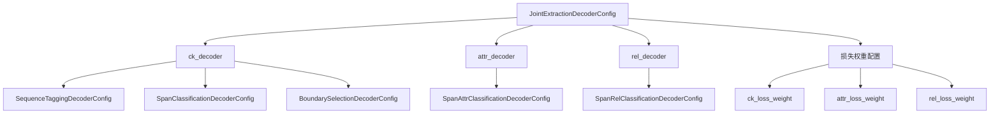
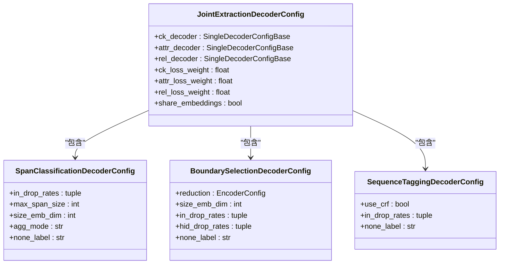
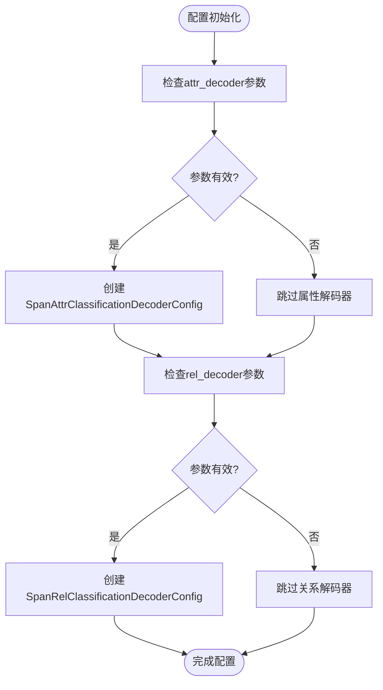
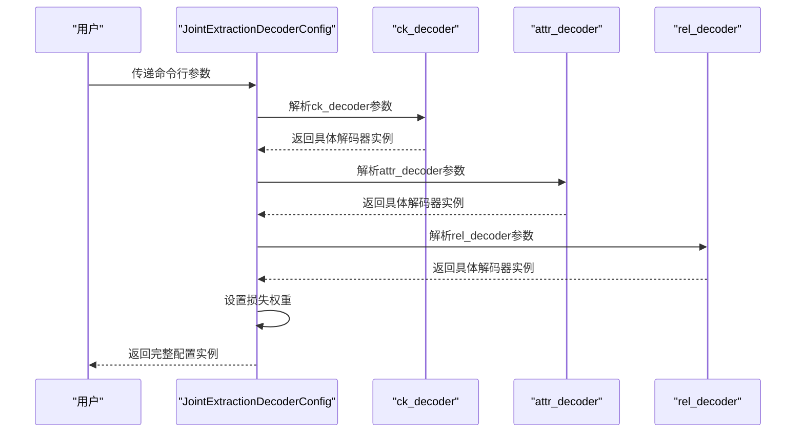
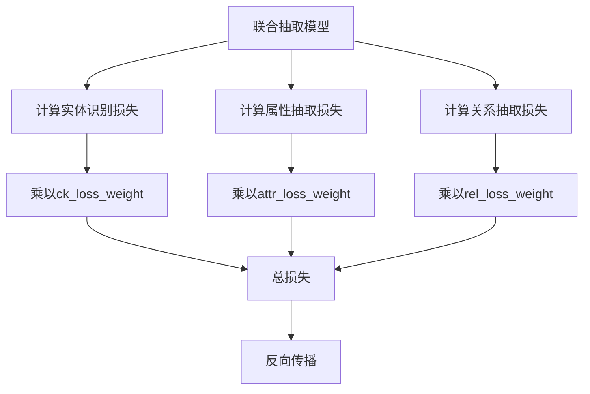
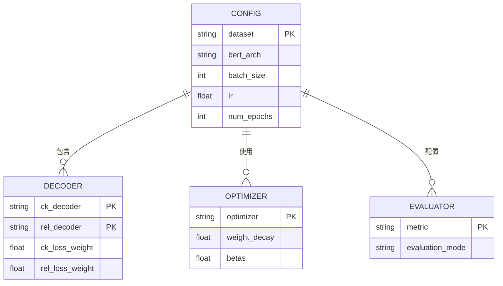

# 联合抽取配置详解

<cite>
**本文档引用的文件**   
- [joint_extraction.py](file://eznlp/model/decoder/joint_extraction.py)
- [span_classification.py](file://eznlp/model/decoder/span_classification.py)
- [boundary_selection.py](file://eznlp/model/decoder/boundary_selection.py)
- [span_attr_classification.py](file://eznlp/model/decoder/span_attr_classification.py)
- [span_rel_classification.py](file://eznlp/model/decoder/span_rel_classification.py)
- [config.py](file://eznlp/config.py)
- [test_joint_extraction.py](file://tests/model/test_joint_extraction.py)
</cite>

## 目录
1. [引言](#引言)
2. [配置体系概述](#配置体系概述)
3. [核心解码器配置](#核心解码器配置)
4. [联合抽取配置构建](#联合抽取配置构建)
5. [多任务损失权重配置](#多任务损失权重配置)
6. [Conll-2004数据集配置示例](#conll-2004数据集配置示例)
7. [结论](#结论)

## 引言
联合抽取配置体系是实体识别与关系抽取任务的核心组成部分，通过灵活的配置选项实现多种抽取方法的组合。本文档详细解析`joint_extraction.py`脚本中的配置机制，重点说明`build_joint_config`函数如何根据命令行参数构建`JointExtractionDecoderConfig`实例，以及各解码器的配置选项和组合方式。

## 配置体系概述



**图示来源**
- [joint_extraction.py](file://eznlp/model/decoder/joint_extraction.py#L68-L193)

**本节来源**
- [joint_extraction.py](file://eznlp/model/decoder/joint_extraction.py#L1-L193)

## 核心解码器配置

### 实体识别方法选择策略
联合抽取系统支持多种实体识别方法，通过`ck_decoder`参数选择不同的解码器配置：

- **序列标注方法**：使用`sequence_tagging`作为参数值，对应`SequenceTaggingDecoderConfig`
- **跨度分类方法**：使用`span_classification`作为参数值，对应`SpanClassificationDecoderConfig`
- **边界选择方法**：使用`boundary_selection`作为参数值，对应`BoundarySelectionDecoderConfig`



**图示来源**
- [joint_extraction.py](file://eznlp/model/decoder/joint_extraction.py#L71-L86)
- [span_classification.py](file://eznlp/model/decoder/span_classification.py#L27-L161)
- [boundary_selection.py](file://eznlp/model/decoder/boundary_selection.py#L92-L198)

**本节来源**
- [joint_extraction.py](file://eznlp/model/decoder/joint_extraction.py#L71-L86)
- [span_classification.py](file://eznlp/model/decoder/span_classification.py#L27-L161)
- [boundary_selection.py](file://eznlp/model/decoder/boundary_selection.py#L92-L198)

### 属性与关系解码器配置
属性抽取和关系抽取分别由`attr_decoder`和`rel_decoder`参数控制：

- **属性解码器**：使用`span_attr_classification`作为参数值，对应`SpanAttrClassificationDecoderConfig`
- **关系解码器**：使用`span_rel_classification`作为参数值，对应`SpanRelClassificationDecoderConfig`



**图示来源**
- [joint_extraction.py](file://eznlp/model/decoder/joint_extraction.py#L87-L99)
- [span_attr_classification.py](file://eznlp/model/decoder/span_attr_classification.py#L91-L192)
- [span_rel_classification.py](file://eznlp/model/decoder/span_rel_classification.py#L156-L316)

**本节来源**
- [joint_extraction.py](file://eznlp/model/decoder/joint_extraction.py#L87-L99)
- [span_attr_classification.py](file://eznlp/model/decoder/span_attr_classification.py#L91-L192)
- [span_rel_classification.py](file://eznlp/model/decoder/span_rel_classification.py#L156-L316)

## 联合抽取配置构建

### build_joint_config函数工作机制
`build_joint_config`函数根据命令行参数构建`JointExtractionDecoderConfig`实例，其核心逻辑如下：



**图示来源**
- [joint_extraction.py](file://eznlp/model/decoder/joint_extraction.py#L69-L109)

**本节来源**
- [joint_extraction.py](file://eznlp/model/decoder/joint_extraction.py#L69-L109)

### 配置参数继承与共享
配置参数的继承与共享机制确保了各解码器之间的协调：

```mermaid
classDiagram
class Config {
+in_dim : int
+valid : bool
+name : str
}
class JointExtractionDecoderConfig {
+in_dim : int
+min_span_size : int
+max_span_size : int
+max_size_id : int
}
class SingleDecoderConfigBase {
+in_dim : int
+multilabel : bool
+conf_thresh : float
}
Config <|-- JointExtractionDecoderConfig
Config <|-- SingleDecoderConfigBase
JointExtractionDecoderConfig --> SingleDecoderConfigBase : "包含多个"
JointExtractionDecoderConfig --> Config : "继承"
note right of JointExtractionDecoderConfig
in_dim设置会同步到所有子解码器
min_span_size等属性从ck_decoder继承
end note
```

**图示来源**
- [joint_extraction.py](file://eznlp/model/decoder/joint_extraction.py#L126-L144)
- [config.py](file://eznlp/config.py#L20-L71)

**本节来源**
- [joint_extraction.py](file://eznlp/model/decoder/joint_extraction.py#L126-L144)
- [config.py](file://eznlp/config.py#L20-L71)

## 多任务损失权重配置

### 损失权重配置机制
多任务学习中的损失权重配置通过以下参数实现：

- **ck_loss_weight**: 实体识别任务的损失权重，默认值为1.0
- **attr_loss_weight**: 属性抽取任务的损失权重，默认值为1.0
- **rel_loss_weight**: 关系抽取任务的损失权重，默认值为1.0



**图示来源**
- [joint_extraction.py](file://eznlp/model/decoder/joint_extraction.py#L101-L103)
- [joint_extraction.py](file://eznlp/model/decoder/joint_extraction.py#L167-L176)

**本节来源**
- [joint_extraction.py](file://eznlp/model/decoder/joint_extraction.py#L101-L103)
- [joint_extraction.py](file://eznlp/model/decoder/joint_extraction.py#L167-L176)

### 损失权重对模型训练的调节作用
损失权重的配置对模型训练有重要影响：

- **平衡多任务学习**：通过调整不同任务的损失权重，可以平衡各任务在训练过程中的重要性
- **防止任务主导**：当某个任务的损失值远大于其他任务时，可以通过降低其权重防止该任务主导模型更新
- **优化训练过程**：合理的权重配置可以加速模型收敛，提高整体性能

## Conll-2004数据集配置示例

### 完整配置参数设置
在Conll-2004数据集上的完整配置示例如下：



**图示来源**
- [test_joint_extraction.py](file://tests/model/test_joint_extraction.py#L69-L80)
- [exp_launcher.py](file://scripts/exp_launcher.py#L144-L159)

**本节来源**
- [test_joint_extraction.py](file://tests/model/test_joint_extraction.py#L69-L80)
- [exp_launcher.py](file://scripts/exp_launcher.py#L144-L159)

### 预训练模型集成与优化器选择
具体参数配置包括：

- **预训练模型**：支持BERT_base、RoBERTa_base等多种预训练模型架构
- **优化器选择**：可选择AdamW优化器，配置学习率和权重衰减参数
- **评估指标**：使用Micro-F1作为主要评估指标，支持多种评估模式

## 结论
联合抽取配置体系通过灵活的参数设计，实现了多种实体识别方法的无缝集成。`build_joint_config`函数作为配置构建的核心，能够根据命令行参数智能地创建相应的解码器实例。通过合理配置`ck_loss_weight`、`rel_loss_weight`等多任务损失权重参数，可以有效调节模型在不同任务间的平衡，优化整体训练效果。在Conll-2004等标准数据集上的应用表明，该配置体系具有良好的扩展性和实用性。