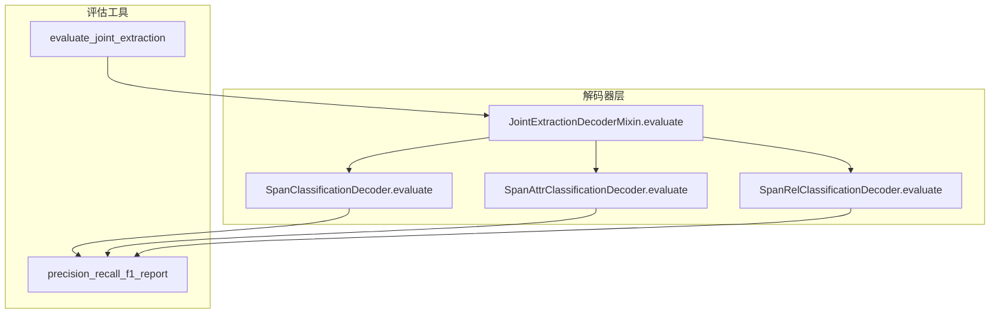
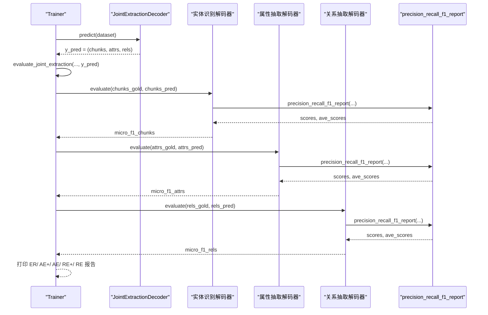
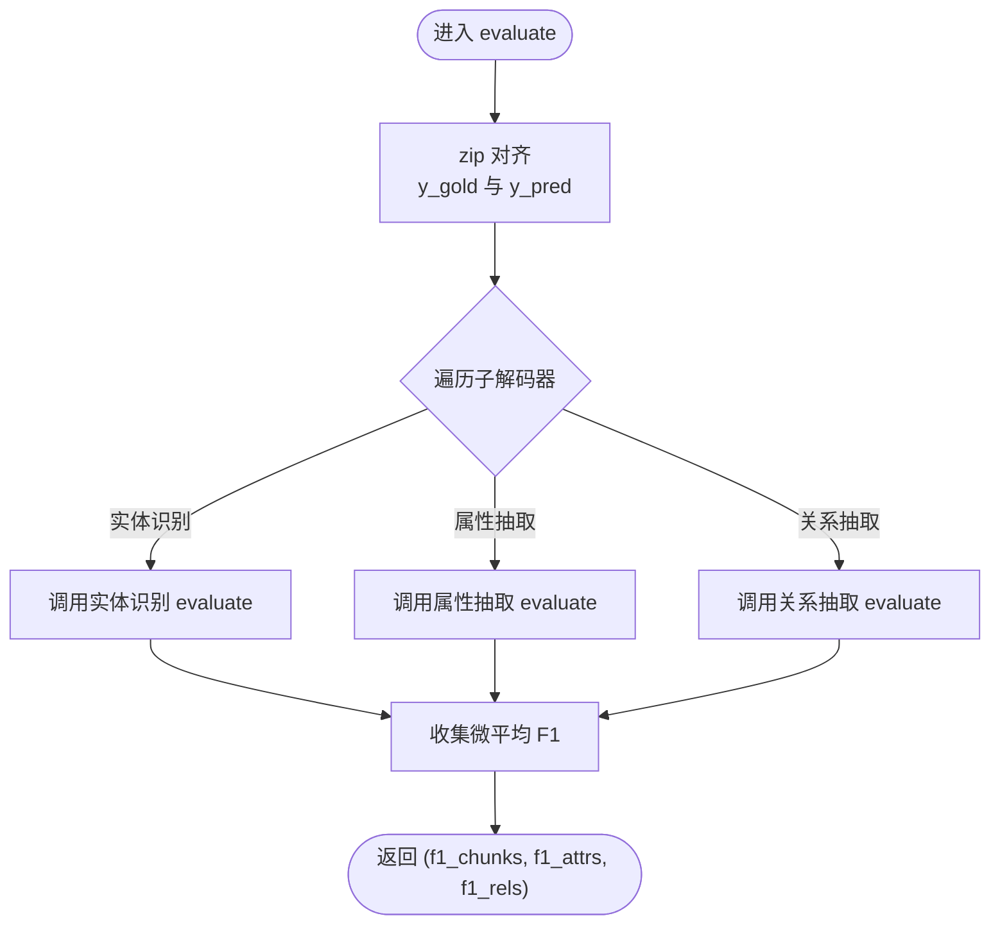
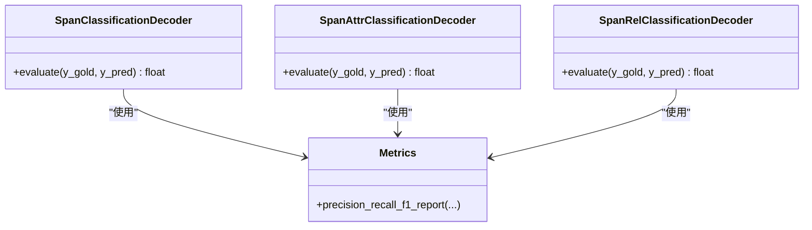
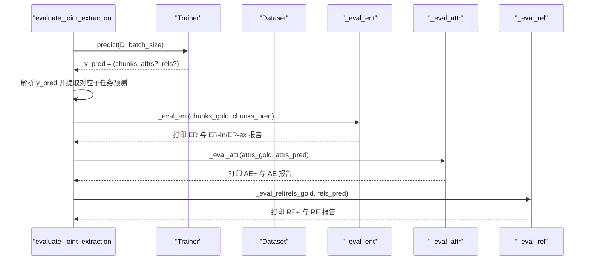
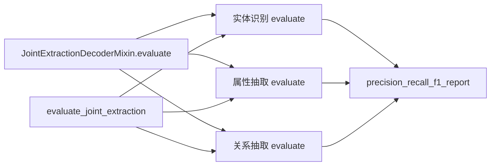

# 多任务评估机制

<cite>
**本文引用的文件**
- [joint_extraction.py](file://eznlp/model/decoder/joint_extraction.py)
- [base.py](file://eznlp/model/decoder/base.py)
- [span_classification.py](file://eznlp/model/decoder/span_classification.py)
- [span_attr_classification.py](file://eznlp/model/decoder/span_attr_classification.py)
- [span_rel_classification.py](file://eznlp/model/decoder/span_rel_classification.py)
- [metrics.py](file://eznlp/metrics.py)
- [evaluation.py](file://eznlp/training/evaluation.py)
- [test_joint_extraction.py](file://tests/model/test_joint_extraction.py)
</cite>

## 目录
1. [引言](#引言)
2. [项目结构](#项目结构)
3. [核心组件](#核心组件)
4. [架构总览](#架构总览)
5. [详细组件分析](#详细组件分析)
6. [依赖分析](#依赖分析)
7. [性能考虑](#性能考虑)
8. [故障排查指南](#故障排查指南)
9. [结论](#结论)
10. [附录](#附录)

## 引言
本文件聚焦于联合抽取任务中的多任务评估机制，系统性解析 JointExtractionDecoderMixin.evaluate 方法如何协调实体识别、属性抽取与关系抽取三个子任务的评估过程。文档将阐明：
- evaluate 接收 y_gold 与 y_pred 后，如何通过 zip 对齐不同解码器的评估结果；
- 每个子解码器 evaluate 的返回值（微平均 F1）如何组合为元组；
- 训练流程中 evaluate_joint_extraction 如何解析多任务评估结果并输出可读的性能报告；
- 评估输入数据格式、指标聚合方式以及各子任务的指标含义。

## 项目结构
围绕多任务评估的关键文件组织如下：
- 解码器层：联合解码器与各子解码器（实体识别、属性抽取、关系抽取）
- 评估工具：通用指标计算与训练阶段的评估入口
- 测试用例：覆盖联合抽取模型的训练一致性与可训练性

图表来源
- [joint_extraction.py](file://eznlp/model/decoder/joint_extraction.py#L59-L66)
- [span_classification.py](file://eznlp/model/decoder/span_classification.py#L300-L344)
- [span_attr_classification.py](file://eznlp/model/decoder/span_attr_classification.py#L72-L89)
- [span_rel_classification.py](file://eznlp/model/decoder/span_rel_classification.py#L83-L90)
- [metrics.py](file://eznlp/metrics.py#L98-L153)
- [evaluation.py](file://eznlp/training/evaluation.py#L155-L190)

章节来源
- [joint_extraction.py](file://eznlp/model/decoder/joint_extraction.py#L1-L193)
- [evaluation.py](file://eznlp/training/evaluation.py#L1-L203)

## 核心组件
- 联合解码器混合类：提供 decoders 迭代器、evaluate 组合逻辑与指标数量统计
- 子解码器：实体识别、属性抽取、关系抽取各自实现 evaluate，返回微平均 F1
- 评估工具：precision_recall_f1_report 提供宏/微平均指标；evaluate_joint_extraction 在训练流程中解析并打印报告
- 基类约束：DecoderMixinBase 定义 evaluate 接口与 num_metrics 约束

章节来源
- [joint_extraction.py](file://eznlp/model/decoder/joint_extraction.py#L19-L66)
- [base.py](file://eznlp/model/decoder/base.py#L11-L50)
- [metrics.py](file://eznlp/metrics.py#L98-L153)
- [evaluation.py](file://eznlp/training/evaluation.py#L155-L190)

## 架构总览
联合解码器在 decode 阶段按顺序产出三类预测：实体块集合、属性列表、关系列表；在 evaluate 阶段将 gold 与 pred 按样本维度对齐，分别调用各子解码器的 evaluate，最终返回一个由三个微平均 F1 组成的元组。训练流程中的 evaluate_joint_extraction 则从模型预测中提取对应子任务的预测，再调用各自的评估函数输出报告。

图表来源
- [joint_extraction.py](file://eznlp/model/decoder/joint_extraction.py#L180-L193)
- [evaluation.py](file://eznlp/training/evaluation.py#L155-L190)
- [metrics.py](file://eznlp/metrics.py#L98-L153)

## 详细组件分析

### 联合解码器评估：JointExtractionDecoderMixin.evaluate
- 输入输出
  - 输入：y_gold 与 y_pred 均为 List[List[tuple]]，按样本索引一一对应
  - 输出：tuple，包含每个子解码器的微平均 F1
- 实现要点
  - 使用 decoders 迭代器依次获取实体识别、属性抽取、关系抽取解码器
  - 通过 zip 将 y_gold 与 y_pred 按样本对齐，分别调用各子解码器 evaluate
  - 返回由三个微平均 F1 组成的元组，顺序与 decoders 迭代顺序一致

图表来源
- [joint_extraction.py](file://eznlp/model/decoder/joint_extraction.py#L59-L66)

章节来源
- [joint_extraction.py](file://eznlp/model/decoder/joint_extraction.py#L59-L66)

### 子解码器评估：实体识别、属性抽取、关系抽取
- 实体识别（SpanClassificationDecoder）
  - evaluate 返回微平均 F1（针对实体块集合）
  - 评估输入为 List[List[tuple]]，元素为 (label, start, end)
- 属性抽取（SpanAttrClassificationDecoder）
  - evaluate 返回微平均 F1（针对属性，格式为 (attr_type, chunk)）
  - 支持多标签，内部会过滤不合法标签
- 关系抽取（SpanRelClassificationDecoder）
  - evaluate 返回微平均 F1（针对关系，格式为 (rel_type, head, tail)）
  - 支持反向关系与对称关系处理

图表来源
- [span_classification.py](file://eznlp/model/decoder/span_classification.py#L300-L344)
- [span_attr_classification.py](file://eznlp/model/decoder/span_attr_classification.py#L72-L89)
- [span_rel_classification.py](file://eznlp/model/decoder/span_rel_classification.py#L83-L90)
- [metrics.py](file://eznlp/metrics.py#L98-L153)

章节来源
- [span_classification.py](file://eznlp/model/decoder/span_classification.py#L300-L344)
- [span_attr_classification.py](file://eznlp/model/decoder/span_attr_classification.py#L72-L89)
- [span_rel_classification.py](file://eznlp/model/decoder/span_rel_classification.py#L83-L90)

### 指标计算：precision_recall_f1_report
- 功能
  - 计算宏平均与微平均指标（precision、recall、f1）
  - 支持按类型或按样本聚合
- 返回
  - scores：按类型/样本的详细指标字典
  - ave_scores：包含 micro 与 macro 的平均指标字典
- 调用点
  - 各子解码器 evaluate 内部调用
  - 训练流程 evaluate_joint_extraction 中用于打印报告

章节来源
- [metrics.py](file://eznlp/metrics.py#L98-L153)

### 训练流程中的多任务评估：evaluate_joint_extraction
- 输入
  - trainer：训练器
  - dataset：数据集
  - has_attr / has_rel：是否启用属性抽取与关系抽取
  - batch_size：批大小
  - save_preds：是否保存预测结果
- 行为
  - 调用 trainer.predict 获取 y_pred
  - 从 y_pred 中按顺序提取 chunks、attrs、rels
  - 分别调用实体识别、属性抽取、关系抽取的评估函数，打印 ER、AE+、AE、RE+、RE 报告
- 注意
  - 若 save_preds=True，则将预测写回 dataset.data，便于离线分析

图表来源
- [evaluation.py](file://eznlp/training/evaluation.py#L155-L190)

章节来源
- [evaluation.py](file://eznlp/training/evaluation.py#L155-L190)

## 依赖分析
- 联合解码器依赖
  - decoders 迭代器顺序：实体识别 → 属性抽取（可选）→ 关系抽取（可选）
  - evaluate 返回元组顺序与 decoders 顺序一致
- 子解码器依赖
  - 各自 evaluate 依赖 precision_recall_f1_report
  - 属性抽取与关系抽取支持标签过滤与特殊关系处理
- 训练流程依赖
  - evaluate_joint_extraction 依赖各子任务的评估函数与日志打印

图表来源
- [joint_extraction.py](file://eznlp/model/decoder/joint_extraction.py#L59-L66)
- [span_classification.py](file://eznlp/model/decoder/span_classification.py#L300-L344)
- [span_attr_classification.py](file://eznlp/model/decoder/span_attr_classification.py#L72-L89)
- [span_rel_classification.py](file://eznlp/model/decoder/span_rel_classification.py#L83-L90)
- [metrics.py](file://eznlp/metrics.py#L98-L153)
- [evaluation.py](file://eznlp/training/evaluation.py#L155-L190)

章节来源
- [joint_extraction.py](file://eznlp/model/decoder/joint_extraction.py#L19-L66)
- [metrics.py](file://eznlp/metrics.py#L98-L153)
- [evaluation.py](file://eznlp/training/evaluation.py#L155-L190)

## 性能考虑
- 评估复杂度
  - 每个样本的实体、属性、关系集合均转换为集合进行交集计算，时间复杂度近似 O(N_samples × N_entities_per_sample)
- 批处理与内存
  - 训练流程中建议合理设置 batch_size，避免单样本过大导致显存压力
- 指标聚合
  - 微平均直接汇总 TP、FP、FN，适合整体评估；宏平均按类型/样本平均，适合类别不平衡场景

[本节为一般性指导，无需列出具体文件来源]

## 故障排查指南
- 评估结果为空或异常
  - 检查 y_pred 是否正确解包（chunks、attrs、rels 顺序与 has_attr/has_rel 配置一致）
  - 确认数据集中是否存在相应字段（chunks、attributes、relations）
- 指标异常偏低
  - 检查标签过滤逻辑（属性抽取与关系抽取的标签检查）
  - 确认评估输入格式是否符合要求（实体为 (label, start, end)，属性为 (attr_type, chunk)，关系为 (rel_type, head, tail)）
- 日志未输出
  - 确认日志级别配置与训练流程调用路径

章节来源
- [evaluation.py](file://eznlp/training/evaluation.py#L155-L190)
- [span_attr_classification.py](file://eznlp/model/decoder/span_attr_classification.py#L72-L89)
- [span_rel_classification.py](file://eznlp/model/decoder/span_rel_classification.py#L83-L90)

## 结论
联合抽取任务的多任务评估通过 JointExtractionDecoderMixin.evaluate 将实体识别、属性抽取、关系抽取三个子任务的评估结果统一为元组返回，训练流程 evaluate_joint_extraction 则负责解析并输出可读的性能报告。该设计保持了解码器职责清晰、评估接口一致，便于扩展更多子任务与灵活组合。

[本节为总结性内容，无需列出具体文件来源]

## 附录

### 评估输入与输出规范
- 输入格式
  - y_gold/y_pred：List[List[tuple]]，按样本索引一一对应
  - 实体识别：(label, start, end)
  - 属性抽取：(attr_type, chunk)
  - 关系抽取：(rel_type, head, tail)
- 输出格式
  - 元组：(f1_chunks, f1_attrs, f1_rels)
  - 位置含义：第 0 位为实体识别微平均 F1，第 1 位为属性抽取微平均 F1（若启用），第 2 位为关系抽取微平均 F1（若启用）

章节来源
- [joint_extraction.py](file://eznlp/model/decoder/joint_extraction.py#L59-L66)
- [evaluation.py](file://eznlp/training/evaluation.py#L155-L190)

### 训练流程调用示例（路径参考）
- 联合评估入口：evaluate_joint_extraction
- 实体识别评估：_eval_ent
- 属性抽取评估：_eval_attr
- 关系抽取评估：_eval_rel
- 指标计算：precision_recall_f1_report

章节来源
- [evaluation.py](file://eznlp/training/evaluation.py#L155-L190)
- [metrics.py](file://eznlp/metrics.py#L98-L153)