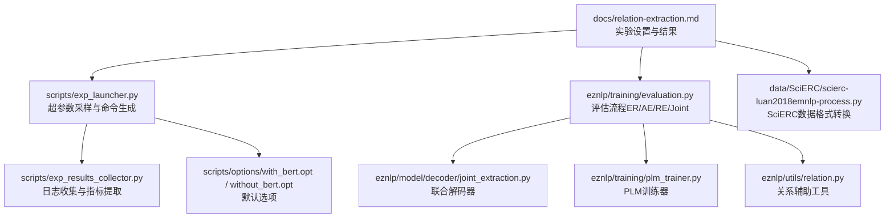
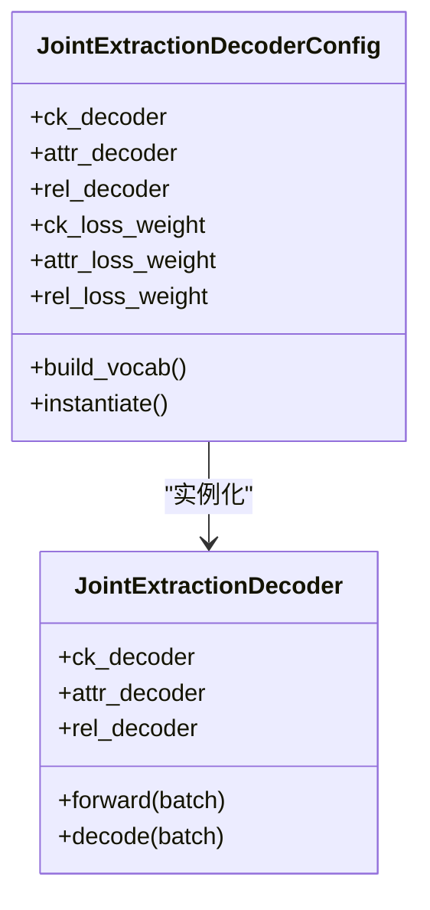
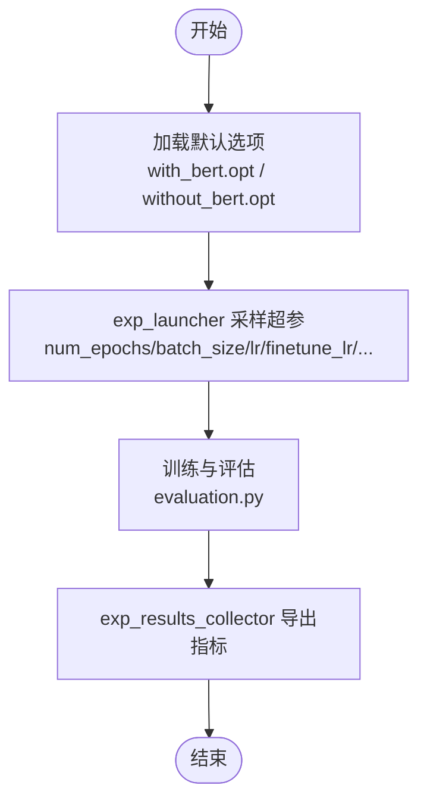
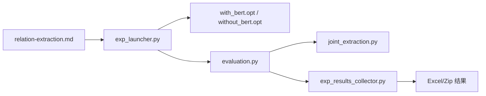

# 数据集性能分析

<cite>
**本文引用的文件列表**
- [relation-extraction.md](file://docs/relation-extraction.md)
- [joint_extraction.py](file://eznlp/model/decoder/joint_extraction.py)
- [evaluation.py](file://eznlp/training/evaluation.py)
- [scierc-luan2018emnlp-process.py](file://data/SciERC/scierc-luan2018emnlp-process.py)
- [exp_launcher.py](file://scripts/exp_launcher.py)
- [with_bert.opt](file://scripts/options/with_bert.opt)
- [without_bert.opt](file://scripts/options/without_bert.opt)
- [exp_results_collector.py](file://scripts/exp_results_collector.py)
- [plm_trainer.py](file://eznlp/training/plm_trainer.py)
- [relation.py](file://eznlp/utils/relation.py)
</cite>

## 目录
1. [引言](#引言)
2. [项目结构](#项目结构)
3. [核心组件](#核心组件)
4. [架构总览](#架构总览)
5. [详细组件分析](#详细组件分析)
6. [依赖分析](#依赖分析)
7. [性能考量](#性能考量)
8. [故障排查指南](#故障排查指南)
9. [结论](#结论)

## 引言
本文件围绕联合抽取模型在英文数据集 CoNLL-2004 与 SciERC 上的性能表现展开，重点解析 relation-extraction.md 中的实验结果，对比不同预训练模型（BERT-base、RoBERTa-base）及架构变体（+LSTM）对实体识别与关系抽取的影响；深入解读表格中标注“Reported F1”与“Our Imp. F1”的差异；分析 pipeline 与 joint 模式在实体识别与关系抽取任务上的性能权衡；特别关注 SciERC 数据集中 F1 值后标注 ♠️ 的含义及其对关系抽取评估的影响；结合 joint_extraction.py 中的解码器配置与 scripts/exp_launcher.py 中的超参数设置，说明实验配置对性能结果的潜在影响。

## 项目结构
本仓库采用模块化组织，关系抽取相关的实验与实现主要分布在以下位置：
- 文档与实验设置：docs/relation-extraction.md
- 联合抽取解码器：eznlp/model/decoder/joint_extraction.py
- 训练与评估：eznlp/training/evaluation.py、scripts/exp_launcher.py、scripts/exp_results_collector.py
- 数据处理：data/SciERC/scierc-luan2018emnlp-process.py
- 预训练模型训练器：eznlp/training/plm_trainer.py
- 关系工具函数：eznlp/utils/relation.py



图表来源
- [relation-extraction.md](file://docs/relation-extraction.md#L1-L49)
- [exp_launcher.py](file://scripts/exp_launcher.py#L181-L216)
- [exp_results_collector.py](file://scripts/exp_results_collector.py#L1-L139)
- [evaluation.py](file://eznlp/training/evaluation.py#L37-L202)
- [joint_extraction.py](file://eznlp/model/decoder/joint_extraction.py#L1-L193)
- [scierc-luan2018emnlp-process.py](file://data/SciERC/scierc-luan2018emnlp-process.py#L1-L42)
- [with_bert.opt](file://scripts/options/with_bert.opt#L1-L11)
- [without_bert.opt](file://scripts/options/without_bert.opt#L1-L2)
- [plm_trainer.py](file://eznlp/training/plm_trainer.py#L1-L35)
- [relation.py](file://eznlp/utils/relation.py#L1-L31)

章节来源
- [relation-extraction.md](file://docs/relation-extraction.md#L1-L49)
- [exp_launcher.py](file://scripts/exp_launcher.py#L181-L216)
- [evaluation.py](file://eznlp/training/evaluation.py#L37-L202)
- [joint_extraction.py](file://eznlp/model/decoder/joint_extraction.py#L1-L193)
- [scierc-luan2018emnlp-process.py](file://data/SciERC/scierc-luan2018emnlp-process.py#L1-L42)
- [with_bert.opt](file://scripts/options/with_bert.opt#L1-L11)
- [without_bert.opt](file://scripts/options/without_bert.opt#L1-L2)
- [plm_trainer.py](file://eznlp/training/plm_trainer.py#L1-L35)
- [relation.py](file://eznlp/utils/relation.py#L1-L31)

## 核心组件
- 实验设置与结果：relation-extraction.md 提供 CoNLL-2004 与 SciERC 的实验设置、Reported F1 与 Our Imp. F1 对比，并标注 ♦ 与 ♠️ 的特殊说明。
- 联合抽取解码器：joint_extraction.py 定义了联合解码器配置与实现，支持实体边界/序列标注/边界选择等多种主任务配置，以及属性与关系子任务的组合。
- 评估流程：evaluation.py 提供实体识别（ER）、属性抽取（AE）、关系抽取（RE）与联合抽取（Joint）的评估接口，其中 RE 的输出会区分“RE+”（包含实体类型）与“RE”（不考虑实体类型）两种报告。
- 数据处理：scierc-luan2018emnlp-process.py 将原始 SciERC JSON 按句子切分并重写为每句一条样本的格式，便于下游模型训练与评估。
- 超参数与采样：exp_launcher.py 在 joint_extraction 任务下提供批量超参采样（如优化器、学习率、batch size、层数、BERT 架构等），并与默认选项文件配合使用。
- 日志与结果汇总：exp_results_collector.py 从训练日志中提取指标，支持导出 Excel/Zip，便于横向比较。
- PLM 训练器：plm_trainer.py 提供掩码语言建模训练器，用于预训练阶段或微调阶段的损失计算。
- 关系工具：relation.py 提供关系缺失检测与逆关系推断等辅助能力，有助于理解关系评估细节。

章节来源
- [relation-extraction.md](file://docs/relation-extraction.md#L1-L49)
- [joint_extraction.py](file://eznlp/model/decoder/joint_extraction.py#L1-L193)
- [evaluation.py](file://eznlp/training/evaluation.py#L37-L202)
- [scierc-luan2018emnlp-process.py](file://data/SciERC/scierc-luan2018emnlp-process.py#L1-L42)
- [exp_launcher.py](file://scripts/exp_launcher.py#L181-L216)
- [exp_results_collector.py](file://scripts/exp_results_collector.py#L1-L139)
- [plm_trainer.py](file://eznlp/training/plm_trainer.py#L1-L35)
- [relation.py](file://eznlp/utils/relation.py#L1-L31)

## 架构总览
联合抽取的整体流程包括：数据准备（含 SciERC 处理）、模型配置（联合解码器、BERT/RoBERTa 等）、训练与评估（ER/AE/RE/Joint）、结果汇总与可视化。下图展示从实验设置到评估的关键路径。

```mermaid
sequenceDiagram
participant Doc as "relation-extraction.md"
participant Launcher as "exp_launcher.py"
participant Opt as "with_bert.opt / without_bert.opt"
participant Eval as "evaluation.py"
participant Dec as "joint_extraction.py"
participant Data as "scierc-luan2018emnlp-process.py"
participant Log as "exp_results_collector.py"
Doc->>Launcher : "读取实验设置与超参范围"
Launcher->>Opt : "加载默认选项"
Launcher->>Eval : "生成训练命令并执行"
Eval->>Dec : "构建联合解码器配置"
Data-->>Eval : "SciERC数据已按句切分"
Eval->>Eval : "evaluate_joint_extraction / evaluate_relation_extraction"
Eval-->>Log : "记录ER/AE/RE/Joint指标"
Log-->>Doc : "汇总Excel/Zip结果"
```

图表来源
- [relation-extraction.md](file://docs/relation-extraction.md#L1-L49)
- [exp_launcher.py](file://scripts/exp_launcher.py#L181-L216)
- [with_bert.opt](file://scripts/options/with_bert.opt#L1-L11)
- [without_bert.opt](file://scripts/options/without_bert.opt#L1-L2)
- [evaluation.py](file://eznlp/training/evaluation.py#L155-L189)
- [joint_extraction.py](file://eznlp/model/decoder/joint_extraction.py#L68-L153)
- [scierc-luan2018emnlp-process.py](file://data/SciERC/scierc-luan2018emnlp-process.py#L1-L42)
- [exp_results_collector.py](file://scripts/exp_results_collector.py#L1-L139)

## 详细组件分析

### 性能对比与差异解读（Reported F1 vs Our Imp. F1）
- CoNLL-2004：表格显示在相同基座模型（BERT-base 或 RoBERTa-base）下，加入 LSTM 变体通常能提升联合 F1；同时，Our Imp. F1（Joint）普遍高于 Pipeline，表明联合训练在实体与关系之间存在协同增益。
- SciERC：同样呈现“BERT/RoBERTa + LSTM”优于仅基础模型的趋势；Our Imp. F1（Joint）在多数情况下优于 Pipeline；SciERC 的 F1 值后标注 ♠️，表示“不考虑实体类型正确性”的关系抽取评估结果。

章节来源
- [relation-extraction.md](file://docs/relation-extraction.md#L25-L42)

### pipeline 与 joint 模式的性能权衡
- pipeline 模式：先做实体识别，再做关系抽取。优点是模块化清晰、可复用已有实体识别模型；缺点是“错误传播”，实体识别错误会直接影响关系抽取。
- joint 模式：在同一框架内同时预测实体边界、实体属性与关系，共享上下文表征，减少错误传播，通常在联合 F1 上取得更优表现。evaluation.py 的联合评估流程明确分离 ER、AE、RE 的输出，便于对比。

章节来源
- [evaluation.py](file://eznlp/training/evaluation.py#L155-L189)

### SciERC 数据集的 ♠️ 标注与“不考虑实体类型正确性”
- 在 SciERC 的关系抽取评估中，标注 ♠️ 表示“不考虑实体类型正确性”。这意味着在计算关系 F1 时，仅比较关系类型的匹配，而不强制要求头尾实体的类型也必须正确。这会导致 RE 与 RE+（考虑实体类型）的数值差异。
- relation.py 提供逆关系与缺失关系检测工具，有助于理解关系评估的边界情况与潜在偏差。

章节来源
- [relation-extraction.md](file://docs/relation-extraction.md#L22-L24)
- [evaluation.py](file://eznlp/training/evaluation.py#L113-L127)
- [relation.py](file://eznlp/utils/relation.py#L1-L31)

### 联合解码器配置与架构变体（+LSTM）
- joint_extraction.py 支持多种主任务解码器（如 span_classification、sequence_tagging、boundary_selection 等），以及可选的属性与关系子任务。通过配置 rel_decoder 与 attr_decoder，可灵活组合不同架构。
- “+LSTM”体现在主任务配置中可选择带 LSTM 的边界选择或序列标注方案，从而增强局部上下文建模能力。



图表来源
- [joint_extraction.py](file://eznlp/model/decoder/joint_extraction.py#L68-L153)

章节来源
- [joint_extraction.py](file://eznlp/model/decoder/joint_extraction.py#L1-L193)

### 超参数配置对性能的影响（batch size、优化器、学习率、调度器）
- relation-extraction.md 给出了英文数据集的典型设置：无 PLM 时使用 Adadelta（lr=1.0），batch size=64；有 PLM 时使用 AdamW（lr=1e-3/2e-3，ft_lr=1e-4），batch size=48，学习率采用 warmup 后线性衰减。
- exp_launcher.py 在 joint_extraction 任务下提供批量超参采样，包括 num_epochs、batch_size、lr、finetune_lr、bert_drop_rate、bert_arch 等，覆盖 BERT_base、RoBERTa_base、SciBERT 等。
- with_bert.opt / without_bert.opt 提供默认选项，便于快速启动实验。



图表来源
- [relation-extraction.md](file://docs/relation-extraction.md#L8-L20)
- [exp_launcher.py](file://scripts/exp_launcher.py#L181-L216)
- [with_bert.opt](file://scripts/options/with_bert.opt#L1-L11)
- [without_bert.opt](file://scripts/options/without_bert.opt#L1-L2)
- [evaluation.py](file://eznlp/training/evaluation.py#L155-L189)
- [exp_results_collector.py](file://scripts/exp_results_collector.py#L1-L139)

章节来源
- [relation-extraction.md](file://docs/relation-extraction.md#L8-L20)
- [exp_launcher.py](file://scripts/exp_launcher.py#L181-L216)
- [with_bert.opt](file://scripts/options/with_bert.opt#L1-L11)
- [without_bert.opt](file://scripts/options/without_bert.opt#L1-L2)
- [evaluation.py](file://eznlp/training/evaluation.py#L155-L189)
- [exp_results_collector.py](file://scripts/exp_results_collector.py#L1-L139)

### SciERC 数据格式转换与实体/关系映射
- scierc-luan2018emnlp-process.py 将多句 JSON 按句子切分为独立样本，重新计算实体与关系的跨度索引，确保关系头尾实体以“实体在当前句内的索引”形式出现，避免跨句索引导致的评估偏差。

章节来源
- [scierc-luan2018emnlp-process.py](file://data/SciERC/scierc-luan2018emnlp-process.py#L1-L42)

## 依赖分析
联合抽取的依赖关系主要体现在：实验设置驱动超参采样，超参采样决定训练配置，训练产出日志，日志被汇总器解析为可比较的指标，最终回填到文档中进行对比。



图表来源
- [relation-extraction.md](file://docs/relation-extraction.md#L1-L49)
- [exp_launcher.py](file://scripts/exp_launcher.py#L181-L216)
- [with_bert.opt](file://scripts/options/with_bert.opt#L1-L11)
- [without_bert.opt](file://scripts/options/without_bert.opt#L1-L2)
- [evaluation.py](file://eznlp/training/evaluation.py#L155-L189)
- [joint_extraction.py](file://eznlp/model/decoder/joint_extraction.py#L68-L153)
- [exp_results_collector.py](file://scripts/exp_results_collector.py#L1-L139)

章节来源
- [relation-extraction.md](file://docs/relation-extraction.md#L1-L49)
- [exp_launcher.py](file://scripts/exp_launcher.py#L181-L216)
- [evaluation.py](file://eznlp/training/evaluation.py#L155-L189)
- [joint_extraction.py](file://eznlp/model/decoder/joint_extraction.py#L68-L153)
- [exp_results_collector.py](file://scripts/exp_results_collector.py#L1-L139)

## 性能考量
- 预训练模型选择：BERT-base 与 RoBERTa-base 在 CoNLL-2004 与 SciERC 上均优于无 PLM 基线；RoBERTa 在 SciERC 上略具优势，可能与其优化策略更稳健有关。
- 架构变体：+LSTM 的边界选择或序列标注通常带来更好的局部建模能力，联合模式下进一步提升实体与关系的协同效果。
- 评估策略：SciERC 的 ♠️ 标注强调“不考虑实体类型正确性”，这会拉高 RE 数值但掩盖实体识别误差；若需严格评估，应参考 RE+（考虑实体类型）。
- 训练稳定性：PLM 微调建议使用 warmup+线性衰减的学习率调度，batch size 与学习率需与显存容量平衡；AdamW 通常优于 Adadelta 于大规模预训练模型微调。

## 故障排查指南
- 评估指标异常偏低：检查是否误用了“不考虑实体类型正确性”的评估方式；确认是否将 RE 与 RE+ 混淆。
- 训练不稳定或收敛慢：调整学习率范围与 warmup 步数；适当降低 batch size 并增加梯度累积步数；确保 bert_drop_rate 设置合理。
- 数据切分问题：确认 SciERC 已按句子切分并重写实体/关系索引，避免跨句索引导致的关系抽取失败。
- 日志解析失败：exp_results_collector.py 依赖日志中的固定格式字段，若自定义输出格式，需同步更新解析正则。

章节来源
- [evaluation.py](file://eznlp/training/evaluation.py#L113-L127)
- [exp_results_collector.py](file://scripts/exp_results_collector.py#L1-L139)
- [scierc-luan2018emnlp-process.py](file://data/SciERC/scierc-luan2018emnlp-process.py#L1-L42)

## 结论
- 在 CoNLL-2004 与 SciERC 上，BERT-base 与 RoBERTa-base 均显著优于无 PLM 基线；+LSTM 的边界选择/序列标注进一步提升联合抽取性能。
- joint 模式在实体与关系抽取上通常优于 pipeline，体现为更高的联合 F1；但在 SciERC 上，RE 与 RE+ 的差异由 ♠️ 标注所揭示，需谨慎解读。
- 实验配置（优化器、学习率、batch size、调度器、BERT 架构）对性能有显著影响，建议结合 warmup 与线性衰减策略，并根据显存与数据规模调整 batch size 与梯度累积。
- 数据层面，SciERC 的句子级切分与实体/关系索引重写至关重要，确保关系抽取评估的一致性与可比性。