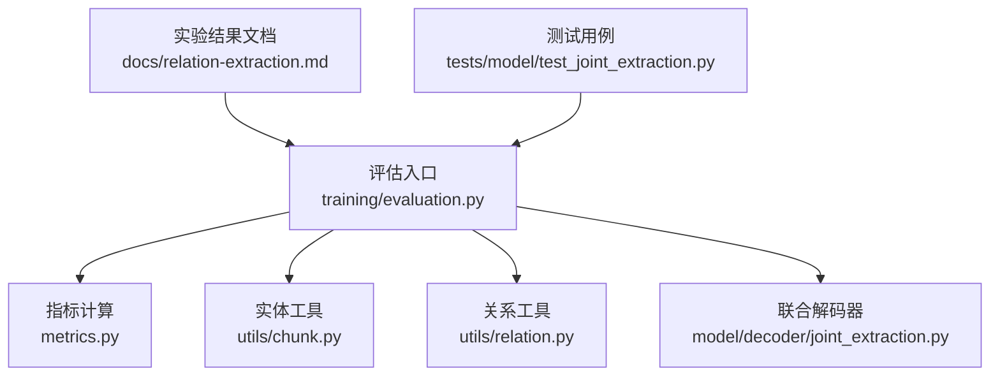
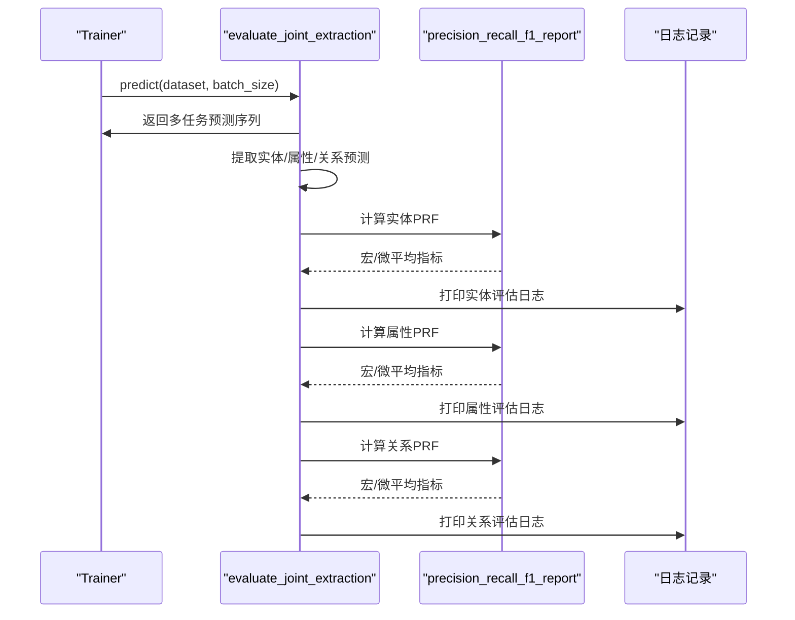
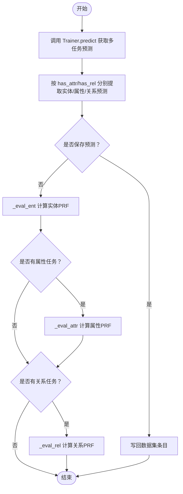
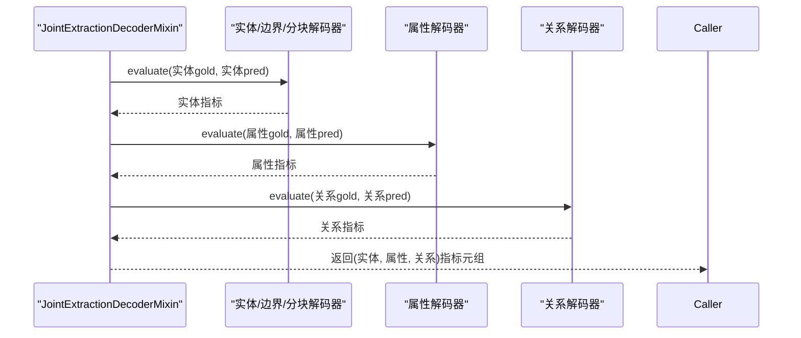
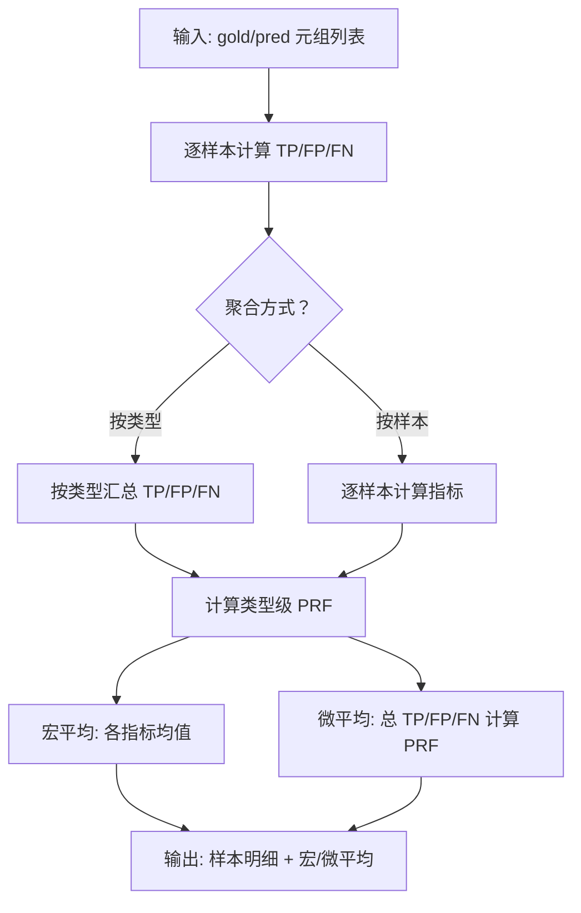
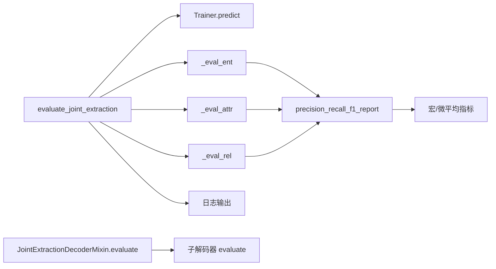

# 评估与性能分析

<cite>
**本文引用的文件列表**
- [joint_extraction.py](file://eznlp/model/decoder/joint_extraction.py)
- [evaluation.py](file://eznlp/training/evaluation.py)
- [metrics.py](file://eznlp/metrics.py)
- [chunk.py](file://eznlp/utils/chunk.py)
- [relation.py](file://eznlp/utils/relation.py)
- [relation-extraction.md](file://docs/relation-extraction.md)
- [test_joint_extraction.py](file://tests/model/test_joint_extraction.py)
</cite>

## 目录
1. [引言](#引言)
2. [项目结构](#项目结构)
3. [核心组件](#核心组件)
4. [架构总览](#架构总览)
5. [详细组件分析](#详细组件分析)
6. [依赖关系分析](#依赖关系分析)
7. [性能考量](#性能考量)
8. [故障排查指南](#故障排查指南)
9. [结论](#结论)
10. [附录](#附录)

## 引言
本文件围绕联合抽取任务的评估机制展开，重点解析 evaluate_joint_extraction 函数的实现原理及其与 JointExtractionDecoderMixin.evaluate 方法的协作关系；结合 relation-extraction.md 中的实验结果，说明 F1 值等评估指标的计算方式（包括实体识别与关系抽取的联合评估策略）；阐述在 CoNLL-2004 和 SciERC 数据集上的性能表现，分析 pipeline 与 joint 模式的差异；最后说明如何通过 evaluate 返回的多任务评估结果进行模型诊断，并给出基于实验结果的超参数调优建议。

## 项目结构
本仓库中与联合抽取评估直接相关的模块主要分布在以下路径：
- 评估入口与指标：training/evaluation.py、metrics.py
- 联合解码器与混合评估：model/decoder/joint_extraction.py
- 实体/关系评估辅助工具：utils/chunk.py、utils/relation.py
- 实验结果参考：docs/relation-extraction.md
- 测试用例：tests/model/test_joint_extraction.py

图表来源
- [evaluation.py](file://eznlp/training/evaluation.py#L1-L203)
- [metrics.py](file://eznlp/metrics.py#L1-L153)
- [joint_extraction.py](file://eznlp/model/decoder/joint_extraction.py#L1-L193)
- [chunk.py](file://eznlp/utils/chunk.py#L1-L250)
- [relation.py](file://eznlp/utils/relation.py#L1-L31)
- [relation-extraction.md](file://docs/relation-extraction.md#L1-L49)
- [test_joint_extraction.py](file://tests/model/test_joint_extraction.py#L1-L211)

章节来源
- [evaluation.py](file://eznlp/training/evaluation.py#L1-L203)
- [metrics.py](file://eznlp/metrics.py#L1-L153)
- [joint_extraction.py](file://eznlp/model/decoder/joint_extraction.py#L1-L193)
- [chunk.py](file://eznlp/utils/chunk.py#L1-L250)
- [relation.py](file://eznlp/utils/relation.py#L1-L31)
- [relation-extraction.md](file://docs/relation-extraction.md#L1-L49)
- [test_joint_extraction.py](file://tests/model/test_joint_extraction.py#L1-L211)

## 核心组件
- evaluate_joint_extraction：联合抽取评估入口，负责从 Trainer.predict 获取多任务预测结果，并分别对实体、属性、关系进行评估。
- JointExtractionDecoderMixin.evaluate：联合解码器混入类的评估方法，按子解码器顺序对每类任务独立评估，返回元组形式的多任务指标。
- precision_recall_f1_report：通用 PRF 计算函数，支持按类型或样本聚合，输出宏平均与微平均指标。
- _eval_ent/_eval_attr/_eval_rel：针对实体、属性、关系的评估包装，统一输出日志与可选的内部/外部实体拆分统计。
- 关系评估特殊处理：relation-extraction.md 中明确指出在某些设置下不考虑实体类型正确性时的关系评估策略。

章节来源
- [evaluation.py](file://eznlp/training/evaluation.py#L155-L190)
- [joint_extraction.py](file://eznlp/model/decoder/joint_extraction.py#L56-L66)
- [metrics.py](file://eznlp/metrics.py#L98-L153)
- [relation-extraction.md](file://docs/relation-extraction.md#L21-L33)

## 架构总览
联合抽取评估的整体流程如下：
- Trainer.predict 返回一个包含多个任务预测结果的序列（如实体、属性、关系），evaluate_joint_extraction 按索引提取各任务预测集合。
- 对每个任务调用对应的评估函数（实体/属性/关系），内部使用 precision_recall_f1_report 计算宏平均与微平均指标。
- 若开启保存预测，则将预测结果写回数据集条目；否则直接打印评估日志。

图表来源
- [evaluation.py](file://eznlp/training/evaluation.py#L155-L190)
- [metrics.py](file://eznlp/metrics.py#L98-L153)

## 详细组件分析

### evaluate_joint_extraction 的实现与协作
- 输入参数：trainer、dataset、has_attr、has_rel、batch_size、save_preds。
- 预测阶段：trainer.predict 返回多任务预测序列，evaluate_joint_extraction 通过索引提取实体、属性、关系预测。
- 评估阶段：分别调用 _eval_ent/_eval_attr/_eval_rel，内部使用 precision_recall_f1_report 计算宏/微平均指标，并打印日志。
- 保存预测：当 save_preds=True 时，将预测结果写回数据集条目，便于离线分析。

图表来源
- [evaluation.py](file://eznlp/training/evaluation.py#L155-L190)

章节来源
- [evaluation.py](file://eznlp/training/evaluation.py#L155-L190)

### JointExtractionDecoderMixin.evaluate 的协作关系
- JointExtractionDecoderMixin.evaluate 将多任务预测按子解码器顺序传入各自 evaluate 方法，返回一个包含各任务指标的元组。
- 这个元组与 evaluate_joint_extraction 的返回值保持一致，便于上层统一处理与日志输出。

图表来源
- [joint_extraction.py](file://eznlp/model/decoder/joint_extraction.py#L56-L66)

章节来源
- [joint_extraction.py](file://eznlp/model/decoder/joint_extraction.py#L56-L66)

### 指标计算：precision_recall_f1_report
- 输入：两个列表的元组集合（gold/pred），每个元组代表实体/关系等结构化项。
- 计算步骤：
  - 对每个样本计算 n_gold、n_pred、n_true_positive，进而得到该样本的 precision、recall、f1。
  - 支持两种聚合方式：
    - 按类型聚合：先按类型汇总 TP/FP/FN，再计算类型级指标，最后对各指标取均值得到 macro 平均。
    - 按样本聚合：对每个样本单独计算指标，最后对各指标取均值得到 macro 平均。
  - 微平均：对所有样本的 TP、FP、FN求和后计算 precision、recall、f1。
- 输出：每个样本的明细指标与宏/微平均指标字典。

图表来源
- [metrics.py](file://eznlp/metrics.py#L32-L153)

章节来源
- [metrics.py](file://eznlp/metrics.py#L1-L153)

### 实体/属性/关系评估的特殊处理
- 实体评估：支持内部/外部实体拆分（ER-in/ER-ex），通过 detect_nested 判断嵌套与非嵌套部分，分别评估。
- 关系评估：relation-extraction.md 明确指出在某些设置下不考虑实体类型正确性时的关系评估策略（例如仅比较头尾实体位置而不考虑类型）。
- 关系对称性检测：relation.py 提供缺失对称关系与逆关系的检测工具，可用于关系评估的扩展分析。

章节来源
- [evaluation.py](file://eznlp/training/evaluation.py#L39-L62)
- [relation-extraction.md](file://docs/relation-extraction.md#L21-L33)
- [relation.py](file://eznlp/utils/relation.py#L1-L31)

### 在 CoNLL-2004 与 SciERC 上的性能表现
- CoNLL-2004：relation-extraction.md 报告了不同模型在 Pipeline 与 Joint 模式下的 F1 结果（宏/微），并标注了不同配置下的对比。
- SciERC：同样提供了 Joint 模式下的 F1 数值，以及在不考虑实体类型正确性时的关系评估（标记 ♠️）。
- 注意：文档中明确“此处实验结果为非正式”，正式结果请参考已发表论文。

章节来源
- [relation-extraction.md](file://docs/relation-extraction.md#L21-L42)

### pipeline 与 joint 模式的差异
- pipeline 模式：通常先独立训练实体识别，再训练关系抽取，二者共享实体边界但无端到端联合优化。
- joint 模式：通过 JointExtractionDecoder 将实体、属性、关系解码器组合在一个模型中，共享表示并联合优化损失（可通过 ck/attr/rel 的 loss 权重调节）。
- 评估差异：joint 模式下 evaluate_joint_extraction 会同时输出实体、属性、关系的 PRF 指标；pipeline 模式通常分别评估实体与关系，且可能在关系评估时采用不同的实体类型处理策略（如 relation-extraction.md 中的 ♠️ 标注）。

章节来源
- [evaluation.py](file://eznlp/training/evaluation.py#L155-L190)
- [joint_extraction.py](file://eznlp/model/decoder/joint_extraction.py#L154-L193)
- [relation-extraction.md](file://docs/relation-extraction.md#L21-L33)

## 依赖关系分析
- evaluate_joint_extraction 依赖：
  - Trainer.predict：获取多任务预测序列。
  - _eval_ent/_eval_attr/_eval_rel：分别评估实体、属性、关系。
  - precision_recall_f1_report：通用 PRF 计算。
  - 日志记录：用于输出宏/微平均指标。
- JointExtractionDecoderMixin.evaluate 依赖：
  - 各子解码器各自的 evaluate 方法，返回多任务指标元组。
- 工具函数：
  - detect_nested：实体嵌套/非嵌套拆分。
  - detect_missing_symmetric/detect_inverse：关系对称性与逆关系检测。

图表来源
- [evaluation.py](file://eznlp/training/evaluation.py#L155-L190)
- [metrics.py](file://eznlp/metrics.py#L98-L153)
- [joint_extraction.py](file://eznlp/model/decoder/joint_extraction.py#L56-L66)

章节来源
- [evaluation.py](file://eznlp/training/evaluation.py#L155-L190)
- [metrics.py](file://eznlp/metrics.py#L98-L153)
- [joint_extraction.py](file://eznlp/model/decoder/joint_extraction.py#L56-L66)

## 性能考量
- 多任务损失权重：JointExtractionDecoderConfig 提供 ck_loss_weight、attr_loss_weight、rel_loss_weight，可在联合训练中平衡各任务贡献。
- 解码器组合：实体识别（如 span_classification/boundary_selection/sequence_tagging）与关系抽取（如 span_rel_classification/specific_span_rel_classification/unfiltered_specific_span_rel_classification）的组合会影响最终性能。
- 评估粒度：relation-extraction.md 中的关系评估策略（如不考虑实体类型正确性）会影响 F1 值，需根据下游任务需求选择合适的评估方式。
- 数据集特性：CoNLL-2004 与 SciERC 的领域差异较大，应结合数据分布调整超参数与评估策略。

章节来源
- [joint_extraction.py](file://eznlp/model/decoder/joint_extraction.py#L68-L110)
- [relation-extraction.md](file://docs/relation-extraction.md#L21-L42)

## 故障排查指南
- 预测结果为空或维度不匹配：
  - 确认 evaluate_joint_extraction 的 has_attr/has_rel 参数与模型配置一致。
  - 检查 Trainer.predict 是否返回多任务序列，且各任务预测长度与数据集一致。
- 指标异常偏低：
  - 检查实体/关系标签体系是否一致（类型映射、边界对齐）。
  - 使用 detect_nested 对嵌套/非嵌套实体进行拆分评估，定位问题来源。
- 关系评估偏差：
  - 若采用不考虑实体类型正确性的评估策略，需确保数据标注与评估逻辑一致。
  - 使用 relation.py 工具检查缺失对称关系与逆关系数量，辅助定位数据问题。
- 日志输出：
  - evaluate_joint_extraction 会在 save_preds=False 时打印宏/微平均指标，若未见日志，检查日志级别与输出通道。

章节来源
- [evaluation.py](file://eznlp/training/evaluation.py#L155-L190)
- [chunk.py](file://eznlp/utils/chunk.py#L63-L80)
- [relation.py](file://eznlp/utils/relation.py#L1-L31)

## 结论
- evaluate_joint_extraction 以统一入口对实体、属性、关系进行联合评估，内部依赖 precision_recall_f1_report 实现宏/微平均指标计算。
- JointExtractionDecoderMixin.evaluate 将多任务评估结果以元组形式返回，便于上层统一处理。
- relation-extraction.md 提供了 CoNLL-2004 与 SciERC 的性能参考，强调了 pipeline 与 joint 模式在不同设置下的差异。
- 通过 detect_nested 与 relation.py 工具，可进一步诊断实体嵌套与关系对称性问题，提升模型诊断效率。

## 附录
- 模型诊断建议：
  - 观察 ER-in/ER-ex 指标差异，定位嵌套实体识别问题。
  - 对比关系评估在“考虑实体类型”与“不考虑实体类型”的差异，判断标注一致性与模型学习效果。
  - 调整 ck/attr/rel 的 loss 权重，观察联合优化对各任务的影响。
- 超参数调优建议（基于实验设置）：
  - 学习率与优化器：relation-extraction.md 给出了含/不含预训练语言模型时的学习率与优化器设置，可作为参考。
  - 训练轮数与批大小：根据数据规模与显存情况调整，确保收敛稳定。
  - 关系评估策略：若下游任务允许忽略实体类型，可采用相应评估策略以获得更贴近业务的 F1 指标。

章节来源
- [relation-extraction.md](file://docs/relation-extraction.md#L8-L20)
- [test_joint_extraction.py](file://tests/model/test_joint_extraction.py#L67-L121)