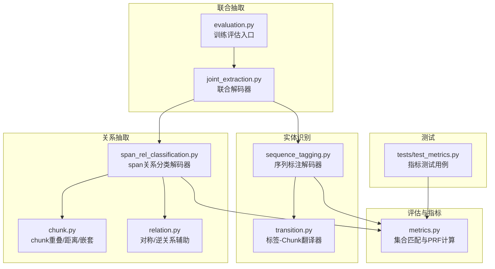
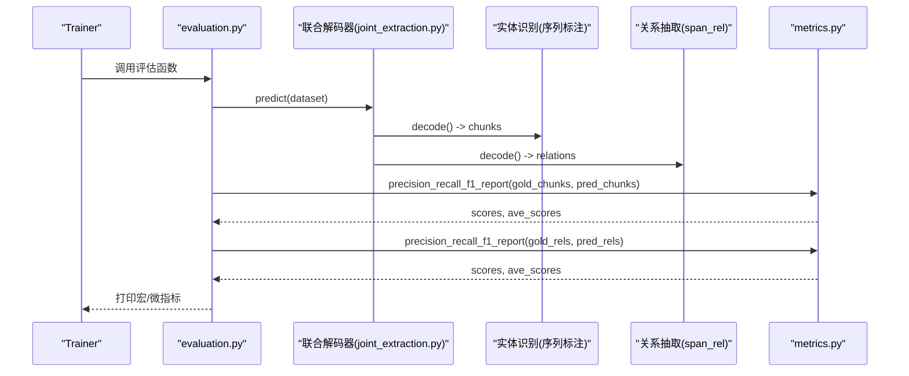
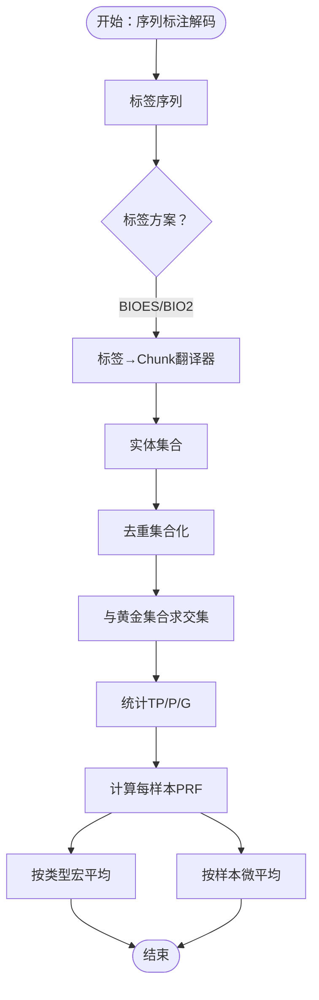
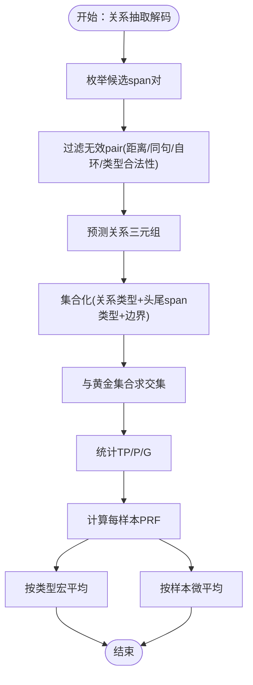
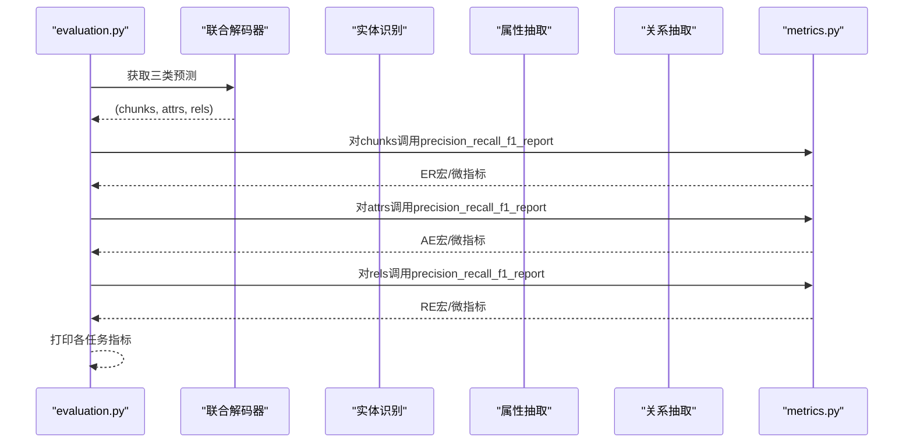
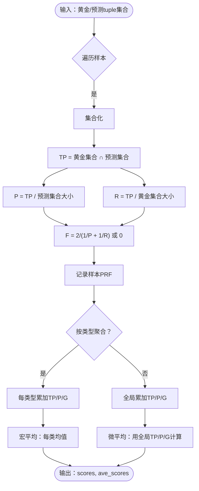
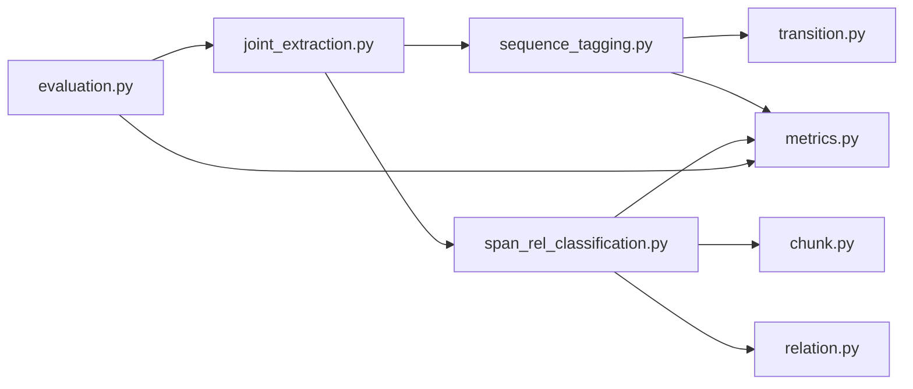

# 评估指标计算方法

<cite>
**本文引用的文件列表**
- [metrics.py](file://eznlp/metrics.py)
- [sequence_tagging.py](file://eznlp/model/decoder/sequence_tagging.py)
- [span_rel_classification.py](file://eznlp/model/decoder/span_rel_classification.py)
- [joint_extraction.py](file://eznlp/model/decoder/joint_extraction.py)
- [evaluation.py](file://eznlp/training/evaluation.py)
- [test_metrics.py](file://tests/test_metrics.py)
- [transition.py](file://eznlp/utils/transition.py)
- [chunk.py](file://eznlp/utils/chunk.py)
- [relation.py](file://eznlp/utils/relation.py)
</cite>

## 目录
1. [引言](#引言)
2. [项目结构](#项目结构)
3. [核心组件](#核心组件)
4. [架构总览](#架构总览)
5. [详细组件分析](#详细组件分析)
6. [依赖分析](#依赖分析)
7. [性能考虑](#性能考虑)
8. [故障排查指南](#故障排查指南)
9. [结论](#结论)

## 引言
本文件系统性阐述联合抽取任务中的评估指标（Precision、Recall、F1）计算方法，重点覆盖：
- 实体识别：基于序列标注解码器的BIOES/BIO2标签方案的chunk-level匹配规则
- 关系抽取：基于span关系分类解码器的span边界与关系类型同时匹配的正确性判定
- 集合匹配与计数：在metrics.py中对预测与真实标签进行集合交集统计，以及多类别宏平均/微平均F1的计算流程
- 联合抽取：在联合解码器中分别对实体、属性、关系进行独立评估，并汇总输出

## 项目结构
围绕评估指标的关键文件分布如下：
- 指标计算核心：metrics.py
- 实体识别（序列标注）：sequence_tagging.py
- 关系抽取（span关系分类）：span_rel_classification.py
- 联合抽取：joint_extraction.py
- 训练/评估入口：evaluation.py
- 标签到chunk转换工具：transition.py
- chunk与文本互转、重叠检测：chunk.py
- 关系对称性与逆关系辅助：relation.py
- 单元测试：tests/test_metrics.py

图表来源
- [metrics.py](file://eznlp/metrics.py#L1-L153)
- [sequence_tagging.py](file://eznlp/model/decoder/sequence_tagging.py#L1-L198)
- [span_rel_classification.py](file://eznlp/model/decoder/span_rel_classification.py#L1-L585)
- [joint_extraction.py](file://eznlp/model/decoder/joint_extraction.py#L1-L193)
- [evaluation.py](file://eznlp/training/evaluation.py#L1-L203)
- [transition.py](file://eznlp/utils/transition.py#L1-L133)
- [chunk.py](file://eznlp/utils/chunk.py#L1-L250)
- [relation.py](file://eznlp/utils/relation.py#L1-L31)
- [test_metrics.py](file://tests/test_metrics.py#L1-L79)

章节来源
- [metrics.py](file://eznlp/metrics.py#L1-L153)
- [sequence_tagging.py](file://eznlp/model/decoder/sequence_tagging.py#L1-L198)
- [span_rel_classification.py](file://eznlp/model/decoder/span_rel_classification.py#L1-L585)
- [joint_extraction.py](file://eznlp/model/decoder/joint_extraction.py#L1-L193)
- [evaluation.py](file://eznlp/training/evaluation.py#L1-L203)
- [transition.py](file://eznlp/utils/transition.py#L1-L133)
- [chunk.py](file://eznlp/utils/chunk.py#L1-L250)
- [relation.py](file://eznlp/utils/relation.py#L1-L31)
- [test_metrics.py](file://tests/test_metrics.py#L1-L79)

## 核心组件
- 指标计算函数族：在metrics.py中实现集合级别的Precision/Recall/F1计算，并支持按“类型”或“样本”两种粒度的宏平均，以及基于全局TP/P/G的微平均。
- 序列标注解码器：将标签序列转换为chunk集合，用于实体识别评估；evaluate接口返回微平均F1。
- span关系分类解码器：枚举候选span对，过滤无效pair，输出关系三元组；evaluate接口返回微平均F1。
- 联合抽取解码器：组合实体、属性、关系三个子解码器，分别评估并汇总。
- 评估入口：evaluation.py封装了ER/AE/RE/Joint等任务的评估流程，统一调用precision_recall_f1_report并打印宏/微指标。

章节来源
- [metrics.py](file://eznlp/metrics.py#L1-L153)
- [sequence_tagging.py](file://eznlp/model/decoder/sequence_tagging.py#L1-L198)
- [span_rel_classification.py](file://eznlp/model/decoder/span_rel_classification.py#L1-L585)
- [joint_extraction.py](file://eznlp/model/decoder/joint_extraction.py#L1-L193)
- [evaluation.py](file://eznlp/training/evaluation.py#L1-L203)

## 架构总览
下图展示了从预测到评估的整体流程，包括实体识别与关系抽取两条主线，以及联合抽取的组合式评估。

图表来源
- [evaluation.py](file://eznlp/training/evaluation.py#L155-L189)
- [joint_extraction.py](file://eznlp/model/decoder/joint_extraction.py#L166-L193)
- [sequence_tagging.py](file://eznlp/model/decoder/sequence_tagging.py#L195-L198)
- [span_rel_classification.py](file://eznlp/model/decoder/span_rel_classification.py#L562-L585)
- [metrics.py](file://eznlp/metrics.py#L98-L153)

## 详细组件分析

### 实体识别评估：序列标注解码器与BIOES/BIO2匹配规则
- 标签到chunk转换：通过ChunksTagsTranslator在不同标签方案（如BIOES、BIO2）之间进行转换，确保实体边界与类型一致。
- chunk-level匹配：评估时将每个样本的实体集合作为tuple集合进行比较，匹配条件为“类型+起止位置完全一致”，即集合交集决定TP数量。
- 宏/微平均：宏平均按实体类型平均PRF；微平均先累加全局TP/P/G，再计算整体PRF。

图表来源
- [sequence_tagging.py](file://eznlp/model/decoder/sequence_tagging.py#L16-L24)
- [transition.py](file://eznlp/utils/transition.py#L12-L133)
- [metrics.py](file://eznlp/metrics.py#L32-L55)
- [metrics.py](file://eznlp/metrics.py#L57-L96)
- [metrics.py](file://eznlp/metrics.py#L98-L153)

章节来源
- [sequence_tagging.py](file://eznlp/model/decoder/sequence_tagging.py#L1-L198)
- [transition.py](file://eznlp/utils/transition.py#L1-L133)
- [metrics.py](file://eznlp/metrics.py#L1-L153)
- [test_metrics.py](file://tests/test_metrics.py#L1-L79)

### 关系抽取评估：span边界与关系类型同时匹配
- 候选生成与过滤：span_rel_classification解码器枚举所有实体span对，根据跨句、距离阈值、自环、头尾类型合法性等规则过滤无效pair。
- 正确性判定：仅当“关系类型+头尾span类型+边界(start,end)”三者均与黄金一致时，才计入TP。
- 宏/微平均：同样支持按类型宏平均与全局微平均。

图表来源
- [span_rel_classification.py](file://eznlp/model/decoder/span_rel_classification.py#L127-L154)
- [span_rel_classification.py](file://eznlp/model/decoder/span_rel_classification.py#L562-L585)
- [metrics.py](file://eznlp/metrics.py#L32-L55)
- [metrics.py](file://eznlp/metrics.py#L57-L96)
- [metrics.py](file://eznlp/metrics.py#L98-L153)

章节来源
- [span_rel_classification.py](file://eznlp/model/decoder/span_rel_classification.py#L1-L585)
- [metrics.py](file://eznlp/metrics.py#L1-L153)

### 联合抽取评估：实体/属性/关系的组合评估
- 组合策略：联合解码器分别产出chunks、attributes、relations，训练评估入口对三类分别调用precision_recall_f1_report。
- 评估粒度：实体识别与关系抽取均采用微平均F1；属性抽取在ER内部有额外的“去除实体边界”处理后再次评估。

图表来源
- [evaluation.py](file://eznlp/training/evaluation.py#L155-L189)
- [joint_extraction.py](file://eznlp/model/decoder/joint_extraction.py#L166-L193)
- [metrics.py](file://eznlp/metrics.py#L98-L153)

章节来源
- [evaluation.py](file://eznlp/training/evaluation.py#L1-L203)
- [joint_extraction.py](file://eznlp/model/decoder/joint_extraction.py#L1-L193)

### 指标计算细节：集合匹配与宏/微平均
- 集合匹配：对每个样本，将黄金与预测都转换为tuple集合，TP为集合交集大小，P与R分别为交集与黄金/预测集合大小之比。
- 宏平均：按类型（type_pos指定）分别统计TP/P/G，再对每类PRF取均值得到宏平均。
- 微平均：先对所有样本的TP/P/G求和，再用全局TP/P/G计算微平均PRF。

图表来源
- [metrics.py](file://eznlp/metrics.py#L32-L55)
- [metrics.py](file://eznlp/metrics.py#L57-L96)
- [metrics.py](file://eznlp/metrics.py#L98-L153)

章节来源
- [metrics.py](file://eznlp/metrics.py#L1-L153)

### 代码片段路径示例（不直接展示代码内容）
- 实体识别评估入口（微平均F1）：[evaluate](file://eznlp/model/decoder/sequence_tagging.py#L54-L63)
- 关系抽取评估入口（微平均F1）：[evaluate](file://eznlp/model/decoder/span_rel_classification.py#L86-L89)
- 联合抽取评估入口（分别评估三类）：[evaluate_joint_extraction](file://eznlp/training/evaluation.py#L155-L189)
- 指标计算核心（集合匹配与宏/微平均）：[precision_recall_f1_report](file://eznlp/metrics.py#L98-L153)
- 标签到chunk转换（BIOES/BIO2）：[chunks2tags/tags2chunks](file://eznlp/utils/transition.py#L12-L133)
- span关系过滤与解码：[enumerate_chunk_pairs/decode](file://eznlp/model/decoder/span_rel_classification.py#L127-L154), [decode](file://eznlp/model/decoder/span_rel_classification.py#L562-L585)

章节来源
- [sequence_tagging.py](file://eznlp/model/decoder/sequence_tagging.py#L1-L198)
- [span_rel_classification.py](file://eznlp/model/decoder/span_rel_classification.py#L1-L585)
- [evaluation.py](file://eznlp/training/evaluation.py#L1-L203)
- [metrics.py](file://eznlp/metrics.py#L1-L153)
- [transition.py](file://eznlp/utils/transition.py#L1-L133)

## 依赖分析
- 解耦与内聚：实体识别与关系抽取各自维护独立的评估逻辑，通过metrics.py统一的集合匹配接口实现，内聚度高、耦合度低。
- 外部依赖：关系抽取依赖chunk.py的距离与嵌套判断、relation.py的对称/逆关系辅助；实体识别依赖transition.py的标签-chunk转换。
- 评估入口：evaluation.py集中管理ER/AE/RE/Joint评估流程，避免重复代码。

图表来源
- [sequence_tagging.py](file://eznlp/model/decoder/sequence_tagging.py#L1-L198)
- [span_rel_classification.py](file://eznlp/model/decoder/span_rel_classification.py#L1-L585)
- [joint_extraction.py](file://eznlp/model/decoder/joint_extraction.py#L1-L193)
- [evaluation.py](file://eznlp/training/evaluation.py#L1-L203)
- [metrics.py](file://eznlp/metrics.py#L1-L153)
- [transition.py](file://eznlp/utils/transition.py#L1-L133)
- [chunk.py](file://eznlp/utils/chunk.py#L1-L250)
- [relation.py](file://eznlp/utils/relation.py#L1-L31)

章节来源
- [sequence_tagging.py](file://eznlp/model/decoder/sequence_tagging.py#L1-L198)
- [span_rel_classification.py](file://eznlp/model/decoder/span_rel_classification.py#L1-L585)
- [joint_extraction.py](file://eznlp/model/decoder/joint_extraction.py#L1-L193)
- [evaluation.py](file://eznlp/training/evaluation.py#L1-L203)
- [metrics.py](file://eznlp/metrics.py#L1-L153)
- [transition.py](file://eznlp/utils/transition.py#L1-L133)
- [chunk.py](file://eznlp/utils/chunk.py#L1-L250)
- [relation.py](file://eznlp/utils/relation.py#L1-L31)

## 性能考虑
- 集合操作复杂度：对每个样本，集合化与求交集的时间复杂度约为O(N)，其中N为实体/关系数量；整体复杂度与样本数线性相关。
- 过滤开销：关系抽取的枚举与过滤会引入额外开销，可通过合理设置最大距离、类型合法性约束降低无效pair数量。
- 内存占用：集合化与中间变量较多，建议在大批量评估时分批处理，避免峰值内存过高。

## 故障排查指南
- 预测与黄金格式不一致：确认实体与关系的tuple格式是否符合约定（实体：(类型, 起始, 结束)；关系：(关系类型, (头类型, 起始, 结束), (尾类型, 起始, 结束))）。
- 标签方案不匹配：若使用BIOES/BIO2，请确保解码器scheme与标签转换器一致，避免边界错位导致匹配失败。
- 关系过滤导致漏检：检查枚举与过滤逻辑（跨句、距离、自环、头尾类型合法性），必要时放宽约束以定位问题。
- 宏/微平均差异过大：若宏平均显著低于微平均，可能由少数类型样本过少或误报过多导致，可查看按类型PRF分布。

章节来源
- [metrics.py](file://eznlp/metrics.py#L98-L153)
- [span_rel_classification.py](file://eznlp/model/decoder/span_rel_classification.py#L127-L154)
- [sequence_tagging.py](file://eznlp/model/decoder/sequence_tagging.py#L16-L24)

## 结论
本项目通过metrics.py提供的统一集合匹配接口，实现了实体识别与关系抽取的一致化评估。实体识别采用chunk-level匹配（类型+边界），关系抽取采用span边界与关系类型的联合匹配。评估支持宏平均与微平均两种聚合方式，联合抽取在训练入口中分别对三类任务进行评估，便于精细化分析与优化。