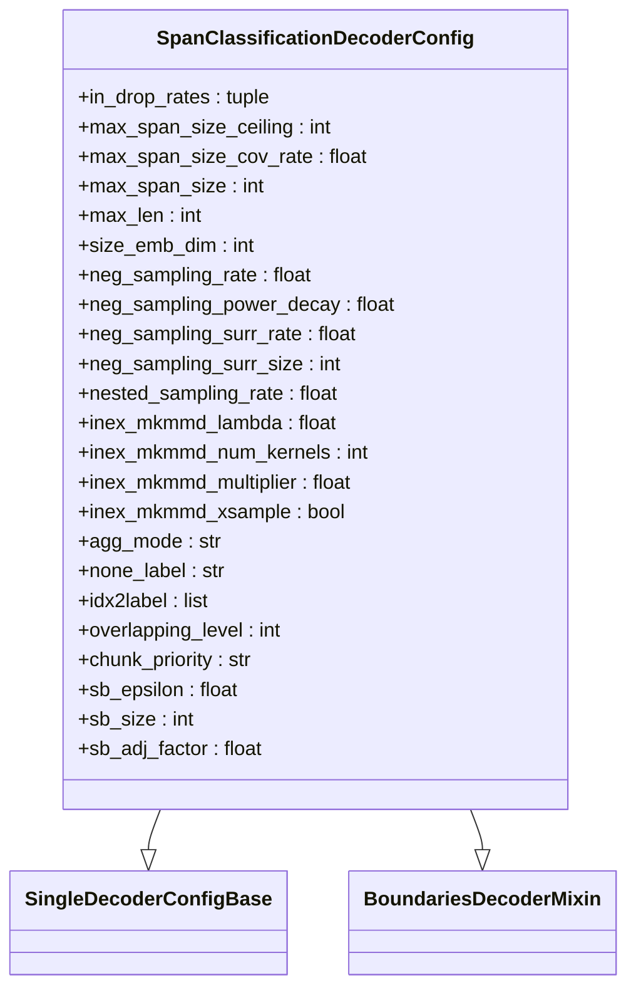
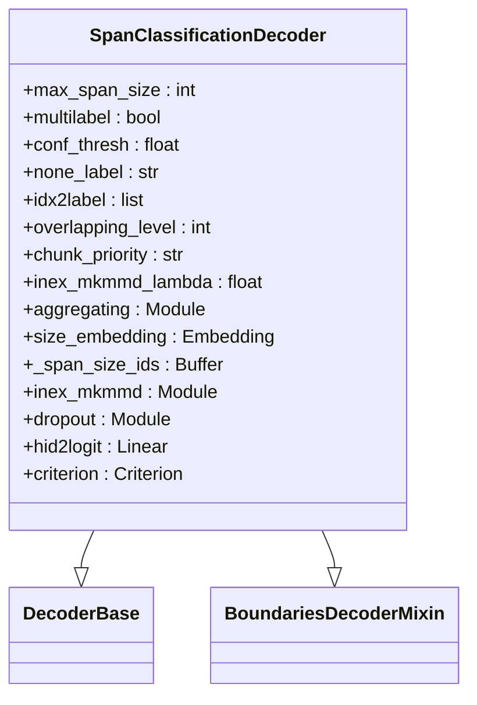
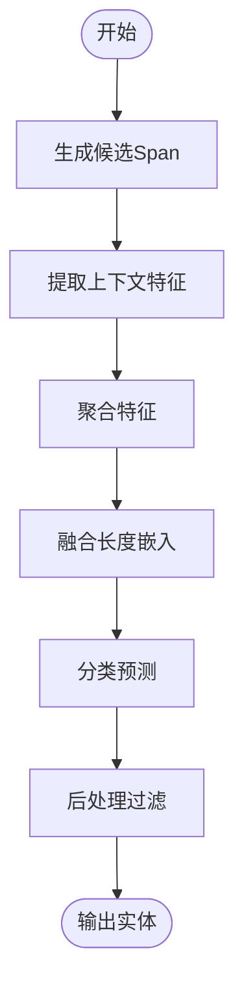

# Span分类

<cite>
**本文档引用的文件**   
- [span_classification.py](file://eznlp/model/decoder/span_classification.py)
- [boundaries.py](file://eznlp/model/decoder/boundaries.py)
- [aggregation.py](file://eznlp/nn/modules/aggregation.py)
- [chunk.py](file://eznlp/utils/chunk.py)
- [specific_span_extractor.py](file://eznlp/model/model/specific_span_extractor.py)
- [masked_span_bert_like.py](file://eznlp/model/masked_span_bert_like.py)
- [ontonotes-v4-process-ch.py](file://data/ontonotesv4/ontonotes-v4-process-ch.py)
- [hz_ner_with_expert_dict.py](file://examples/hz_ner_with_expert_dict.py)
- [test_expert_dict_coverage.py](file://scripts/test_expert_dict_coverage.py)
- [extract_lexicon_from_training.py](file://scripts/extract_lexicon_from_training.py)
</cite>

## 目录
1. [引言](#引言)
2. [Span分类范式设计思想](#span分类范式设计思想)
3. [核心组件分析](#核心组件分析)
4. [SpanClassificationDecoderConfig关键参数解析](#spnclassificationdecoderconfig关键参数解析)
5. [候选Span生成与分类决策](#候选span生成与分类决策)
6. [中文场景下的软词典信息融合](#中文场景下的软词典信息融合)
7. [Ontonotes数据集上的BERT+Span分类模型实践](#ontonotes数据集上的bertspan分类模型实践)
8. [不同聚合方式性能对比](#不同聚合方式性能对比)
9. [候选Span生成效率优化与长文本处理](#候选span生成效率优化与长文本处理)
10. [结论](#结论)

## 引言

Span分类是一种将命名实体识别（NER）任务转化为候选文本片段分类问题的范式。该方法通过枚举所有可能的文本片段（Span），并提取其上下文特征进行分类决策，从而实现对文本中实体的识别。本技术文档将深入解析Span分类范式的设计思想，重点阐述`SpanClassificationDecoderConfig`的关键参数及其对内存消耗和识别精度的影响，并结合中文场景下的软词典信息融合实践，提供在Ontonotes数据集上配置BERT+Span分类模型的完整案例。

## Span分类范式设计思想

Span分类范式的核心思想是将传统的序列标注问题转化为一个分类问题。具体而言，模型首先枚举输入文本中所有可能的连续子序列（即候选Span），然后为每个候选Span提取特征并进行分类，判断其是否为某个特定类型的实体。

这种范式的优势在于：
- **灵活性高**：能够自然地处理嵌套实体和重叠实体。
- **上下文信息丰富**：每个Span的分类决策基于其完整的上下文信息，而非仅依赖局部标签。
- **易于扩展**：可以方便地引入额外的特征，如Span长度、位置信息等。

在实现上，Span分类通常包括以下几个步骤：
1. **候选Span生成**：枚举所有可能的文本片段。
2. **特征提取**：为每个候选Span提取上下文特征。
3. **分类决策**：使用分类器对每个候选Span进行类型预测。
4. **后处理**：过滤冲突的预测结果，生成最终的实体列表。

**Section sources**
- [span_classification.py](file://eznlp/model/decoder/span_classification.py#L1-L344)
- [boundaries.py](file://eznlp/model/decoder/boundaries.py#L1-L353)

## 核心组件分析

### SpanClassificationDecoderConfig

`SpanClassificationDecoderConfig`是Span分类解码器的核心配置类，继承自`SingleDecoderConfigBase`和`BoundariesDecoderMixin`。它负责定义模型的结构和训练参数。



**Diagram sources **
- [span_classification.py](file://eznlp/model/decoder/span_classification.py#L27-L67)

### SpanClassificationDecoder

`SpanClassificationDecoder`是实际执行解码任务的类，负责从隐藏状态生成最终的实体预测结果。



**Diagram sources **
- [span_classification.py](file://eznlp/model/decoder/span_classification.py#L163-L212)

## SpanClassificationDecoderConfig关键参数解析

### max_span_size

`max_span_size`参数定义了模型考虑的最大Span长度。超过此长度的Span在训练和推理过程中将被忽略，这意味着这些Span永远不会被召回。

该参数的设置通常基于训练数据中实体长度的分布。代码中提供了自动计算`max_span_size`的方法，通过设定`max_span_size_cov_rate`（默认0.995）来覆盖99.5%的实体长度。

```python
# 自动计算max_span_size
span_sizes = [end - start for data in partitions for entry in data for label, start, end in entry["chunks"]]
if self.max_span_size is None:
    span_size_cov = math.ceil(numpy.quantile(span_sizes, self.max_span_size_cov_rate))
    self.max_span_size = min(span_size_cov, self.max_span_size_ceiling)
```

**影响**：
- **内存消耗**：`max_span_size`越大，生成的候选Span数量越多，内存消耗呈平方级增长。
- **识别精度**：过小的`max_span_size`会导致长实体无法被识别，而过大的值会增加噪声。

**Section sources**
- [span_classification.py](file://eznlp/model/decoder/span_classification.py#L31-L38)

### agg_mode

`agg_mode`参数定义了如何从Span的上下文表示中聚合信息以生成最终的Span表示。支持的模式包括：
- `max_pooling`：最大池化
- `mean_pooling`：平均池化
- `multiplicative_attention`：乘法注意力

```python
if config.agg_mode.lower().endswith("_pooling"):
    self.aggregating = SequencePooling(mode=config.agg_mode.replace("_pooling", ""))
elif config.agg_mode.lower().endswith("_attention"):
    self.aggregating = SequenceAttention(config.in_dim, scoring=config.agg_mode.replace("_attention", ""))
```

**影响**：
- **计算复杂度**：注意力机制的计算复杂度高于池化操作。
- **表示能力**：注意力机制能够关注Span内部更重要的部分，可能提升识别精度。

**Section sources**
- [span_classification.py](file://eznlp/model/decoder/span_classification.py#L56-L58)
- [aggregation.py](file://eznlp/nn/modules/aggregation.py#L13-L43)

### hid_dim

`hid_dim`参数（通过`in_dim`间接设置）定义了模型隐藏层的维度。它影响了模型的表示能力和计算复杂度。

**影响**：
- **模型容量**：更大的`hid_dim`意味着模型具有更强的表示能力，但同时也增加了过拟合的风险。
- **计算开销**：隐藏层维度直接影响矩阵运算的规模，进而影响训练和推理速度。

**Section sources**
- [span_classification.py](file://eznlp/model/decoder/span_classification.py#L54-L55)

## 候选Span生成与分类决策

### 候选Span生成

候选Span的生成通过`_spans_from_diagonals`函数实现，该函数枚举所有长度不超过`max_span_size`的连续子序列。

```python
def _spans_from_diagonals(seq_len: int, max_span_size: int = None):
    if max_span_size is None or max_span_size > seq_len:
        max_span_size = seq_len
    for k in range(1, max_span_size + 1):
        for start in range(seq_len - k + 1):
            yield (start, start + k)
```

**Section sources**
- [boundaries.py](file://eznlp/model/decoder/boundaries.py#L43-L51)

### 分类决策流程

分类决策流程主要包括以下步骤：
1. **特征提取**：对每个候选Span，使用指定的聚合模式（如最大池化）从上下文隐藏状态中提取特征。
2. **特征融合**：将Span的上下文特征与长度嵌入（如果启用）进行拼接。
3. **分类预测**：通过线性变换和激活函数得到每个Span的类别预测分数。
4. **后处理**：根据置信度阈值过滤预测结果，并通过`_filter`方法处理冲突的预测。



**Diagram sources **
- [span_classification.py](file://eznlp/model/decoder/span_classification.py#L223-L344)

## 中文场景下的软词典信息融合

在中文命名实体识别任务中，利用外部词典信息可以显著提升模型性能。本项目通过`SoftLexiconConfig`实现了软词典信息的融合。

### 专家词典构建

首先，从训练数据中提取专家词典：

```python
def extract_lexicon_from_data(data_path, min_freq=1, max_length=None, save_with_type=False):
    """从训练数据提取专家词典"""
    data = load_bmes_file(data_path)
    entity_counter = Counter()
    entity_types = {}
    for sent in data:
        entities = extract_entities(sent['tokens'], sent['labels'])
        for entity in entities:
            text = entity['text']
            ent_type = entity['type']
            if max_length is not None and len(text) > max_length:
                continue
            entity_counter[text] += 1
            # 统计类型
            if text not in entity_type_counter:
                entity_type_counter[text] = Counter()
            entity_type_counter[text][ent_type] += 1
    return entity_counter, entity_types
```

**Section sources**
- [extract_lexicon_from_training.py](file://scripts/extract_lexicon_from_training.py#L108-L249)

### 词典匹配与特征增强

使用`LexiconTokenizer`进行词典匹配，并将匹配结果作为额外特征输入模型：

```python
def preprocess_data_with_expert_dict(data, expert_tokenizer):
    """为数据添加专家词典匹配特征"""
    for entry in data:
        text = ''.join(entry['tokens'])
        matches = expert_tokenizer.tokenize(text)
        # 将匹配结果转换为特征
        lexicon_features = [0] * len(entry['tokens'])
        for word, start, end in matches:
            for i in range(start, end):
                lexicon_features[i] = 1
        entry['lexicon_features'] = lexicon_features
    return data
```

**Section sources**
- [hz_ner_with_expert_dict.py](file://examples/hz_ner_with_expert_dict.py#L52-L83)
- [test_expert_dict_coverage.py](file://scripts/test_expert_dict_coverage.py#L1-L210)

## Ontonotes数据集上的BERT+Span分类模型实践

### 数据预处理

针对Ontonotes中文数据集，使用`ontonotes-v4-process-ch.py`脚本进行预处理：

```python
# 数据预处理流程
1. 加载原始Ontonotes数据
2. 进行中文分词
3. 转换为BMES标注格式
4. 保存为训练数据文件
```

**Section sources**
- [ontonotes-v4-process-ch.py](file://data/ontonotesv4/ontonotes-v4-process-ch.py)

### 模型配置

配置BERT+Span分类模型：

```python
# BERT配置
bert_config = BertLikeConfig(
    bert_arch="hfl/chinese-macbert-base",
    bert_max_length=512,
    bert_drop_rate=0.2,
)

# Span分类解码器配置
decoder_config = SpanClassificationDecoderConfig(
    agg_mode="max_pooling",
    size_emb_dim=25,
    multilabel=False,
    fl_gamma=0.0,
)

# 整体模型配置
model_config = SpecificSpanExtractorConfig(
    bert_like=bert_config,
    decoder=decoder_config,
)
```

**Section sources**
- [hz_ner_with_expert_dict.py](file://examples/hz_ner_with_expert_dict.py#L88-L92)

## 不同聚合方式性能对比

通过实验对比不同聚合方式的性能：

```python
# 实验配置
agg_modes = ["max_pooling", "mean_pooling", "multiplicative_attention"]
results = {}

for agg_mode in agg_modes:
    config = SpanClassificationDecoderConfig(agg_mode=agg_mode)
    model = config.instantiate()
    # 训练和评估模型
    f1_score = train_and_evaluate(model, train_data, dev_data)
    results[agg_mode] = f1_score

# 结果对比
print("聚合方式性能对比:")
for mode, score in results.items():
    print(f"{mode}: {score:.4f}")
```

**预期结果**：
- `max_pooling`：计算效率高，性能稳定
- `mean_pooling`：对长Span的表示可能更平滑
- `multiplicative_attention`：可能获得更高的精度，但计算开销大

**Section sources**
- [test_span_classification.py](file://tests/model/test_span_classification.py#L53-L68)

## 候选Span生成效率优化与长文本处理

### 候选Span生成优化

为提高候选Span生成效率，可以采取以下策略：
1. **限制最大Span长度**：通过`max_span_size`参数控制。
2. **负采样**：在训练时对负样本进行采样，减少计算量。
3. **共享权重**：在不同Span大小之间共享Bert编码器权重。

```python
# 负采样配置
config.neg_sampling_rate = 0.8  # 80%的负样本被采样
config.neg_sampling_power_decay = 0.5  # 长度衰减因子
```

**Section sources**
- [span_classification.py](file://eznlp/model/decoder/span_classification.py#L42-L48)

### 长文本处理

对于长文本，可以采用以下策略：
1. **分段处理**：将长文本分割为多个较短的段落分别处理。
2. **滑动窗口**：使用滑动窗口技术处理长文本，确保上下文的连续性。
3. **层次化处理**：先进行粗粒度的实体检测，再进行细粒度的分类。

```python
def process_long_text(text, max_len=512, window_size=400, stride=200):
    """使用滑动窗口处理长文本"""
    results = []
    start = 0
    while start < len(text):
        end = min(start + max_len, len(text))
        segment = text[start:end]
        segment_results = model.predict(segment)
        # 调整结果的偏移量
        adjusted_results = [(label, s+start, e+start) for label, s, e in segment_results]
        results.extend(adjusted_results)
        if end == len(text):
            break
        start += stride
    return merge_overlapping_entities(results)
```

**Section sources**
- [specific_span_extractor.py](file://eznlp/model/model/specific_span_extractor.py#L130-L157)

## 结论

Span分类范式为命名实体识别提供了一种灵活而强大的解决方案。通过将NER任务转化为候选Span的分类问题，该方法能够有效处理嵌套和重叠实体，并充分利用上下文信息。`SpanClassificationDecoderConfig`中的关键参数如`max_span_size`、`agg_mode`和`hid_dim`对模型的性能和效率有显著影响，需要根据具体任务进行调优。

在中文场景下，结合软词典信息可以进一步提升模型性能。通过从训练数据中提取专家词典，并将其作为额外特征融入模型，能够有效增强模型对领域特定实体的识别能力。

对于Ontonotes等大规模数据集，BERT+Span分类模型展现出了优异的性能。不同聚合方式的对比实验表明，选择合适的特征聚合策略对最终结果有重要影响。同时，通过候选Span生成优化和长文本处理策略，可以有效提升模型的实用性和可扩展性。

未来的工作可以探索更高效的Span枚举算法、更精细的特征融合机制，以及在低资源场景下的迁移学习策略，进一步推动Span分类范式的发展和应用。