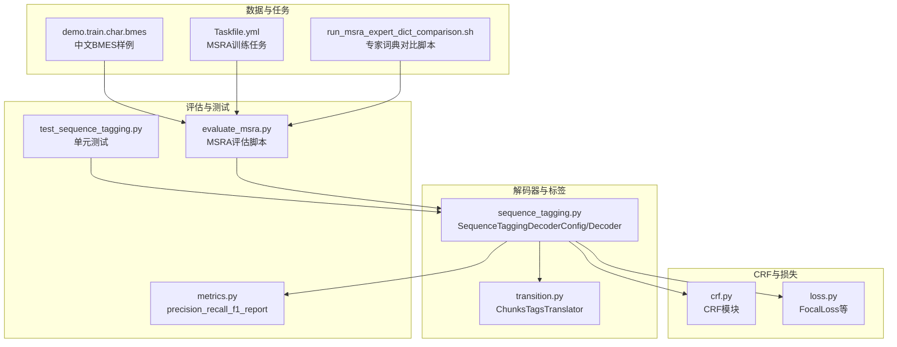
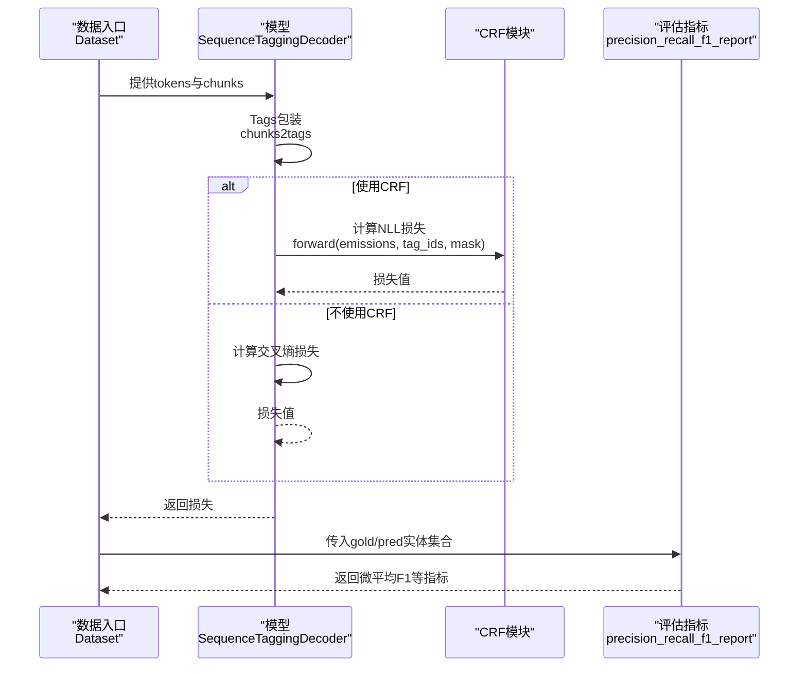
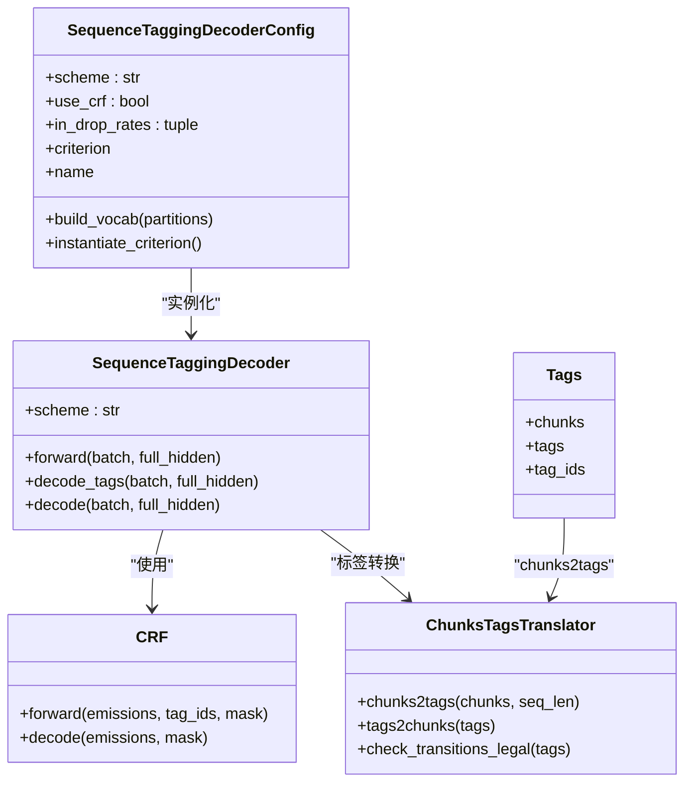
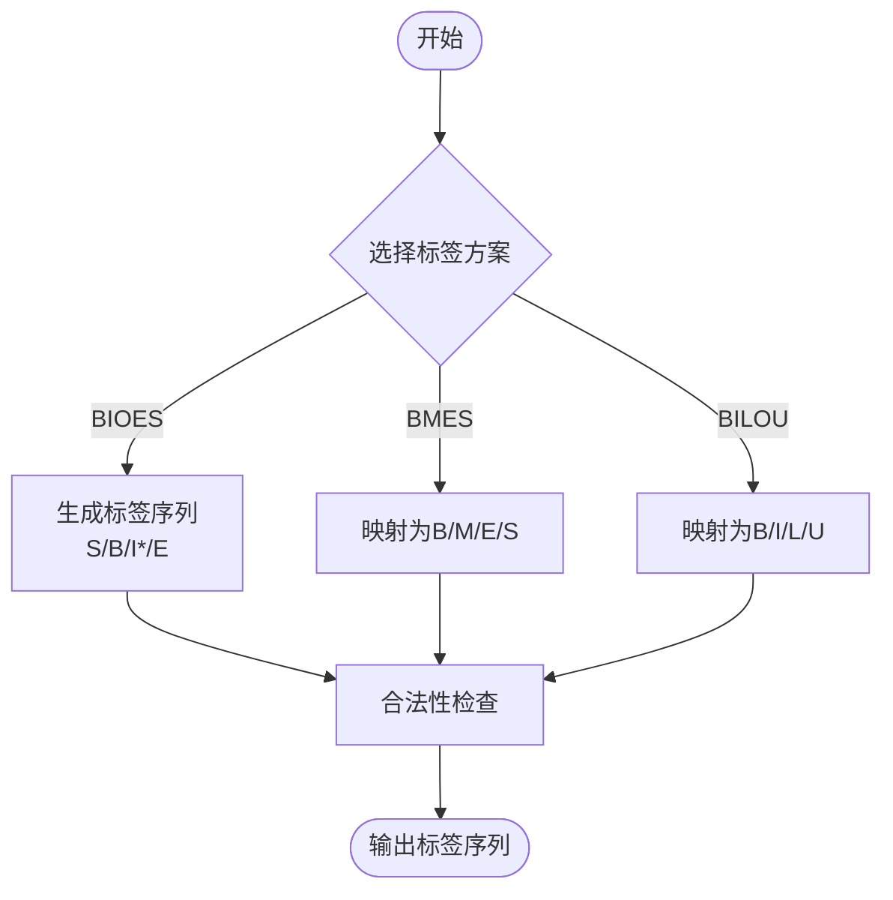
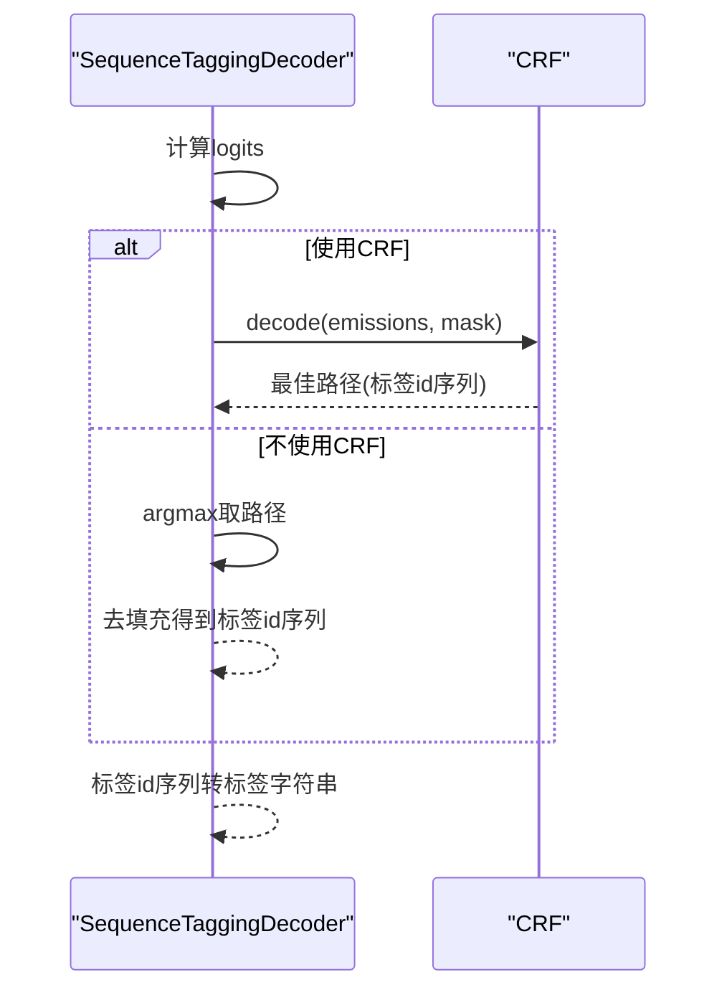
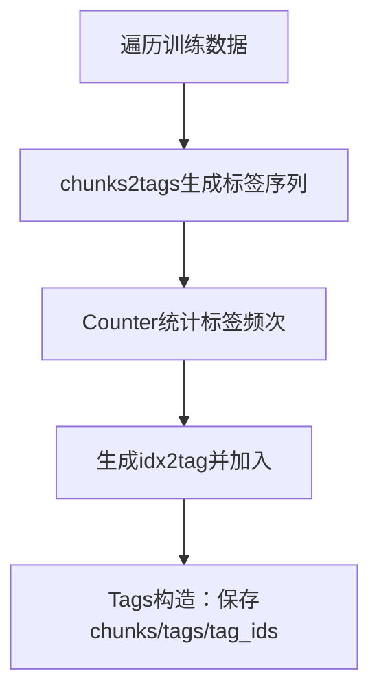
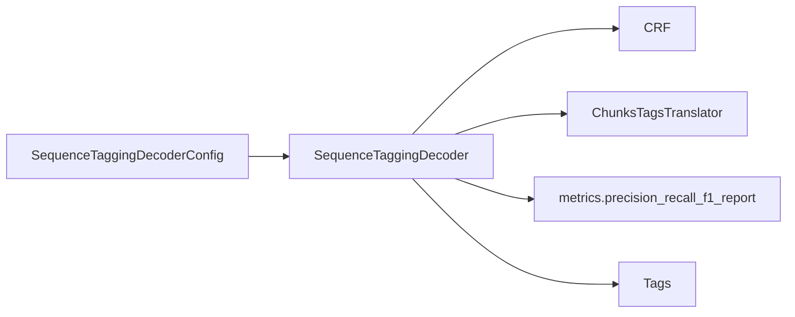

# 序列标注

<cite>
**本文引用的文件列表**
- [sequence_tagging.py](file://eznlp/model/decoder/sequence_tagging.py)
- [crf.py](file://eznlp/nn/modules/crf.py)
- [transition.py](file://eznlp/utils/transition.py)
- [metrics.py](file://eznlp/metrics.py)
- [loss.py](file://eznlp/nn/modules/loss.py)
- [test_sequence_tagging.py](file://tests/model/test_sequence_tagging.py)
- [evaluate_msra.py](file://_8TOOL/evaluate_msra.py)
- [Taskfile.yml](file://Taskfile.yml)
- [run_msra_expert_dict_comparison.sh](file://scripts/run_msra_expert_dict_comparison.sh)
- [demo.train.char.bmes](file://data/ResumeNER/demo.train.char.bmes)
</cite>

## 目录
1. [简介](#简介)
2. [项目结构](#项目结构)
3. [核心组件](#核心组件)
4. [架构总览](#架构总览)
5. [详细组件分析](#详细组件分析)
6. [依赖关系分析](#依赖关系分析)
7. [性能考量](#性能考量)
8. [故障排查指南](#故障排查指南)
9. [结论](#结论)
10. [附录](#附录)

## 简介
本指南围绕序列标注范式，系统讲解BIOES/BIO标注方案在中文命名实体识别（NER）中的实现原理与工程实践，重点覆盖：
- SequenceTaggingDecoderConfig的配置参数（scheme、use_crf、in_drop_rates）及其对模型性能的影响
- 标签词汇表构建、CRF解码器集成、标签序列的编码与解码流程
- Tags类在目标包装中的作用，以及decode_tags与decode方法的实现逻辑
- Focal Loss与CRF联合使用的优化策略
- 在MSRA数据集上配置LSTM+CRF模型的完整示例
- 常见问题（标签不平衡、解码错误路径）的排查方法

## 项目结构
该仓库采用模块化设计，序列标注相关的核心代码集中在以下位置：
- 解码器与标签转换：decoder/sequence_tagging.py、utils/transition.py
- CRF实现：nn/modules/crf.py
- 评估指标：metrics.py
- 损失函数（含Focal Loss）：nn/modules/loss.py
- 测试与示例：tests/model/test_sequence_tagging.py、_8TOOL/evaluate_msra.py、scripts/run_msra_expert_dict_comparison.sh
- 数据样例：data/ResumeNER/demo.train.char.bmes

图表来源
- [sequence_tagging.py](file://eznlp/model/decoder/sequence_tagging.py#L1-L198)
- [crf.py](file://eznlp/nn/modules/crf.py#L1-L204)
- [transition.py](file://eznlp/utils/transition.py#L1-L267)
- [metrics.py](file://eznlp/metrics.py#L1-L153)
- [loss.py](file://eznlp/nn/modules/loss.py#L1-L89)
- [test_sequence_tagging.py](file://tests/model/test_sequence_tagging.py#L1-L213)
- [evaluate_msra.py](file://_8TOOL/evaluate_msra.py#L1-L65)
- [Taskfile.yml](file://Taskfile.yml#L1-L56)
- [run_msra_expert_dict_comparison.sh](file://scripts/run_msra_expert_dict_comparison.sh#L1-L41)
- [demo.train.char.bmes](file://data/ResumeNER/demo.train.char.bmes#L1-L351)

章节来源
- [sequence_tagging.py](file://eznlp/model/decoder/sequence_tagging.py#L1-L198)
- [transition.py](file://eznlp/utils/transition.py#L1-L267)
- [crf.py](file://eznlp/nn/modules/crf.py#L1-L204)
- [metrics.py](file://eznlp/metrics.py#L1-L153)
- [loss.py](file://eznlp/nn/modules/loss.py#L1-L89)
- [test_sequence_tagging.py](file://tests/model/test_sequence_tagging.py#L1-L213)
- [evaluate_msra.py](file://_8TOOL/evaluate_msra.py#L1-L65)
- [Taskfile.yml](file://Taskfile.yml#L1-L56)
- [run_msra_expert_dict_comparison.sh](file://scripts/run_msra_expert_dict_comparison.sh#L1-L41)
- [demo.train.char.bmes](file://data/ResumeNER/demo.train.char.bmes#L1-L351)

## 核心组件
- SequenceTaggingDecoderConfig：序列标注解码器的配置对象，负责标签方案选择、是否使用CRF、损失函数选择、标签词表构建等。
- SequenceTaggingDecoder：解码器实例，包含前向损失计算、标签解码与实体块提取。
- Tags：目标包装器，将样本的chunks转换为标签序列及索引，供训练与评估使用。
- ChunksTagsTranslator：在不同标签方案（如BIOES、BMES、BILOU等）之间进行转换与合法性检查。
- CRF：线性链条件随机场，提供损失计算与Viterbi解码。
- FocalLoss：用于缓解类别不平衡的损失函数，可与CRF联合使用（通过替换非CRF路径的损失）。

章节来源
- [sequence_tagging.py](file://eznlp/model/decoder/sequence_tagging.py#L93-L198)
- [transition.py](file://eznlp/utils/transition.py#L1-L267)
- [crf.py](file://eznlp/nn/modules/crf.py#L1-L204)
- [loss.py](file://eznlp/nn/modules/loss.py#L1-L89)

## 架构总览
下图展示了从数据到预测的整体流程，以及各模块之间的交互关系。

图表来源
- [sequence_tagging.py](file://eznlp/model/decoder/sequence_tagging.py#L143-L198)
- [crf.py](file://eznlp/nn/modules/crf.py#L69-L90)
- [metrics.py](file://eznlp/metrics.py#L98-L153)

## 详细组件分析

### SequenceTaggingDecoderConfig与SequenceTaggingDecoder
- 关键参数
  - scheme：标签方案，支持“BIOES”、“BIO1”、“BIO2”、“BMES”、“BILOU”等，默认“BIOES”
  - use_crf：是否启用CRF作为损失/解码器，默认True
  - in_drop_rates：输入层dropout组合，用于正则化
  - idx2tag：标签词表，若未提供则由build_vocab基于训练数据统计生成
- 构建标签词表：build_vocab遍历数据，调用ChunksTagsTranslator将chunks转为标签序列，统计标签频次后生成idx2tag
- 损失函数选择：当use_crf为真时，instantiated criterion为CRF；否则沿用父类默认交叉熵
- 前向计算：若使用CRF，按batch拼接标签序列并计算带mask的NLL；否则逐样本计算交叉熵
- 解码流程：
  - decode_tags：若使用CRF，调用CRF的decode得到最佳路径；否则取argmax并去填充
  - decode：将标签序列通过ChunksTagsTranslator还原为chunks

图表来源
- [sequence_tagging.py](file://eznlp/model/decoder/sequence_tagging.py#L93-L198)
- [transition.py](file://eznlp/utils/transition.py#L1-L267)
- [crf.py](file://eznlp/nn/modules/crf.py#L1-L204)

章节来源
- [sequence_tagging.py](file://eznlp/model/decoder/sequence_tagging.py#L93-L198)
- [transition.py](file://eznlp/utils/transition.py#L80-L217)

### 标签方案与转换（BIOES/BIO/BMES/BILOU）
- BIOES：单字实体用S、多字实体用B-I*-E，适合边界清晰的中文NER
- BIO1/BIO2：B/I规则差异，BIOES更严格地约束边界
- BMES/BILOU：将B/I/E映射为M（中间）、或映射为L/U，便于与某些工具链兼容
- 转换合法性：通过预定义的转移矩阵校验相邻标签的合法性，确保序列符合语义约束

图表来源
- [transition.py](file://eznlp/utils/transition.py#L105-L155)

章节来源
- [transition.py](file://eznlp/utils/transition.py#L1-L267)

### CRF解码与Viterbi解码
- CRF模块提供forward与decode两个关键接口：
  - forward：计算负对数似然损失，支持batch_first与mask
  - decode：执行Viterbi解码，返回最佳标签路径
- 在SequenceTaggingDecoder中，若use_crf为真，则使用CRF的decode进行解码；否则直接取argmax并去填充

图表来源
- [sequence_tagging.py](file://eznlp/model/decoder/sequence_tagging.py#L181-L198)
- [crf.py](file://eznlp/nn/modules/crf.py#L84-L90)

章节来源
- [crf.py](file://eznlp/nn/modules/crf.py#L69-L204)
- [sequence_tagging.py](file://eznlp/model/decoder/sequence_tagging.py#L181-L198)

### 标签词表构建与目标包装（Tags）
- 标签词表构建：build_vocab统计所有标签，生成idx2tag并自动包含"<pad>"
- 目标包装Tags：将chunks转换为tags与tag_ids，供训练阶段使用
- idx2tag/tag2idx：解码器内部维护，用于标签字符串与索引互转

图表来源
- [sequence_tagging.py](file://eznlp/model/decoder/sequence_tagging.py#L129-L138)
- [sequence_tagging.py](file://eznlp/model/decoder/sequence_tagging.py#L85-L91)

章节来源
- [sequence_tagging.py](file://eznlp/model/decoder/sequence_tagging.py#L85-L138)

### 评估指标与F1计算
- 使用precision_recall_f1_report计算宏/微平均F1，支持按类型或按样本聚合
- 微平均F1用于实体识别的标准评测指标

章节来源
- [metrics.py](file://eznlp/metrics.py#L98-L153)

### Focal Loss与CRF联合使用策略
- 当use_crf为真时，损失函数由CRF提供；当use_crf为假时，可使用FocalLoss等替代损失
- 在测试用例中可见同时配置use_crf、fl_gamma、sl_epsilon的组合，表明可灵活切换损失策略
- 优化建议：
  - 标签不平衡场景优先考虑Focal Loss（gamma>0），缓解多数类主导
  - 若追求全局一致性与边界约束，优先CRF
  - 也可在非CRF路径下引入Focal Loss以提升小类召回

章节来源
- [test_sequence_tagging.py](file://tests/model/test_sequence_tagging.py#L61-L83)
- [loss.py](file://eznlp/nn/modules/loss.py#L60-L89)

## 依赖关系分析
- SequenceTaggingDecoderConfig依赖：
  - CRF：当use_crf为真时实例化
  - ChunksTagsTranslator：构建标签词表与标签序列转换
  - metrics：评估阶段使用
- SequenceTaggingDecoder依赖：
  - CRF（可选）
  - CombinedDropout与线性层：将隐藏态映射到标签空间
  - Tags：训练阶段的目标包装

图表来源
- [sequence_tagging.py](file://eznlp/model/decoder/sequence_tagging.py#L93-L198)
- [metrics.py](file://eznlp/metrics.py#L98-L153)

章节来源
- [sequence_tagging.py](file://eznlp/model/decoder/sequence_tagging.py#L93-L198)
- [metrics.py](file://eznlp/metrics.py#L98-L153)

## 性能考量
- 标签方案选择：
  - BIOES在中文NER中边界明确，适合大多数场景
  - BMES/BILOU便于与外部工具链对接
- CRF vs 非CRF：
  - CRF在序列一致性与边界约束上通常更优，但训练/推理开销略增
  - 非CRF路径可配合Focal Loss应对类别不平衡
- Dropout与正则：
  - in_drop_rates可有效降低过拟合，建议在编码器/解码器均设置合理dropout
- 掩码与批处理：
  - CRF需正确传递mask，避免对填充位置施加损失
- 评估指标：
  - 使用微平均F1作为主要指标，关注实体级别的召回与精度平衡

## 故障排查指南
- 标签不平衡导致小类召回低
  - 症状：小类F1显著低于大类
  - 处理：尝试增大Focal Loss的gamma；或在非CRF路径下使用Focal Loss
  - 参考：测试用例中同时配置use_crf与fl_gamma的组合
- 解码错误路径
  - 症状：预测实体边界错误、跨实体断裂
  - 排查：检查标签方案与转移矩阵合法性；确认CRF掩码mask正确
  - 参考：使用ChunksTagsTranslator的合法性检查与Viterbi解码
- 标签词表不一致
  - 症状：训练与推理阶段idx2tag不一致
  - 处理：统一使用build_vocab生成标签词表；确保idx2tag与tag2idx同步
- 评估指标异常
  - 症状：宏/微平均F1波动较大
  - 处理：核对gold/pred格式一致性；确保实体边界对齐

章节来源
- [test_sequence_tagging.py](file://tests/model/test_sequence_tagging.py#L61-L83)
- [transition.py](file://eznlp/utils/transition.py#L58-L70)
- [metrics.py](file://eznlp/metrics.py#L98-L153)

## 结论
本指南系统梳理了序列标注在中文NER中的实现要点，强调了BIOES/BIO/BMES/BILOU等标签方案的适用场景，阐明了SequenceTaggingDecoderConfig的关键参数与工作流，给出了CRF与Focal Loss的联合优化策略，并提供了在MSRA数据集上配置LSTM+CRF模型的完整参考路径。通过规范化的标签词表构建、严格的解码流程与合理的损失函数选择，可在中文NER任务中取得稳健的性能表现。

## 附录

### 在MSRA数据集上配置LSTM+CRF模型的完整示例
- 使用任务脚本快速启动训练
  - 参考：Taskfile.yml中的train:msra:lstm+crf任务
- 使用专家词典对比实验脚本
  - 参考：scripts/run_msra_expert_dict_comparison.sh
- 评估脚本示例
  - 参考：_8TOOL/evaluate_msra.py，演示加载数据、模型与评估流程

章节来源
- [Taskfile.yml](file://Taskfile.yml#L16-L21)
- [run_msra_expert_dict_comparison.sh](file://scripts/run_msra_expert_dict_comparison.sh#L1-L41)
- [evaluate_msra.py](file://_8TOOL/evaluate_msra.py#L1-L65)

### 中文BMES样例数据
- ResumeNER样例展示了BMES标签格式，可用于理解中文实体边界标注
- 参考：data/ResumeNER/demo.train.char.bmes

章节来源
- [demo.train.char.bmes](file://data/ResumeNER/demo.train.char.bmes#L1-L351)