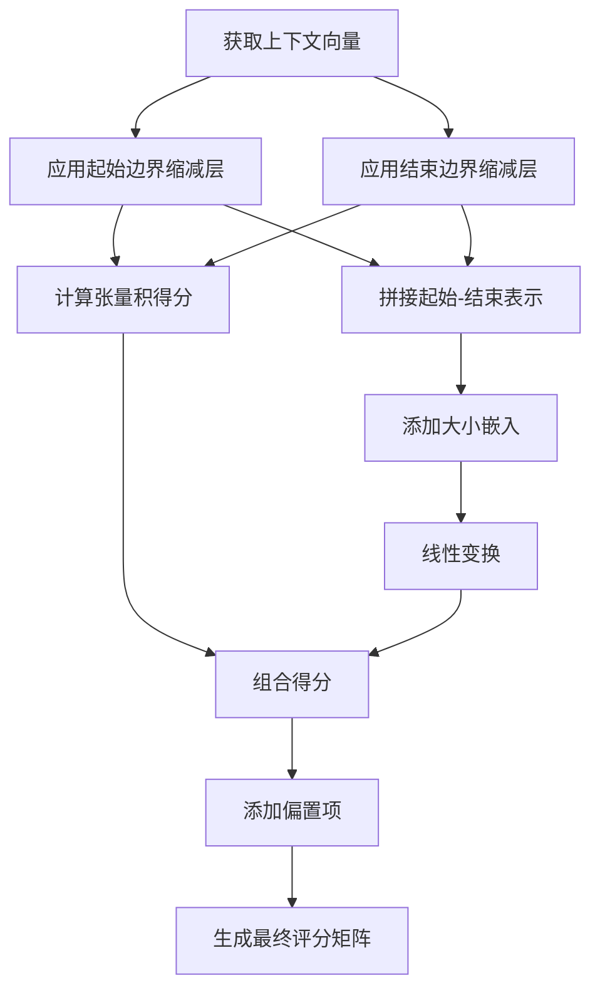
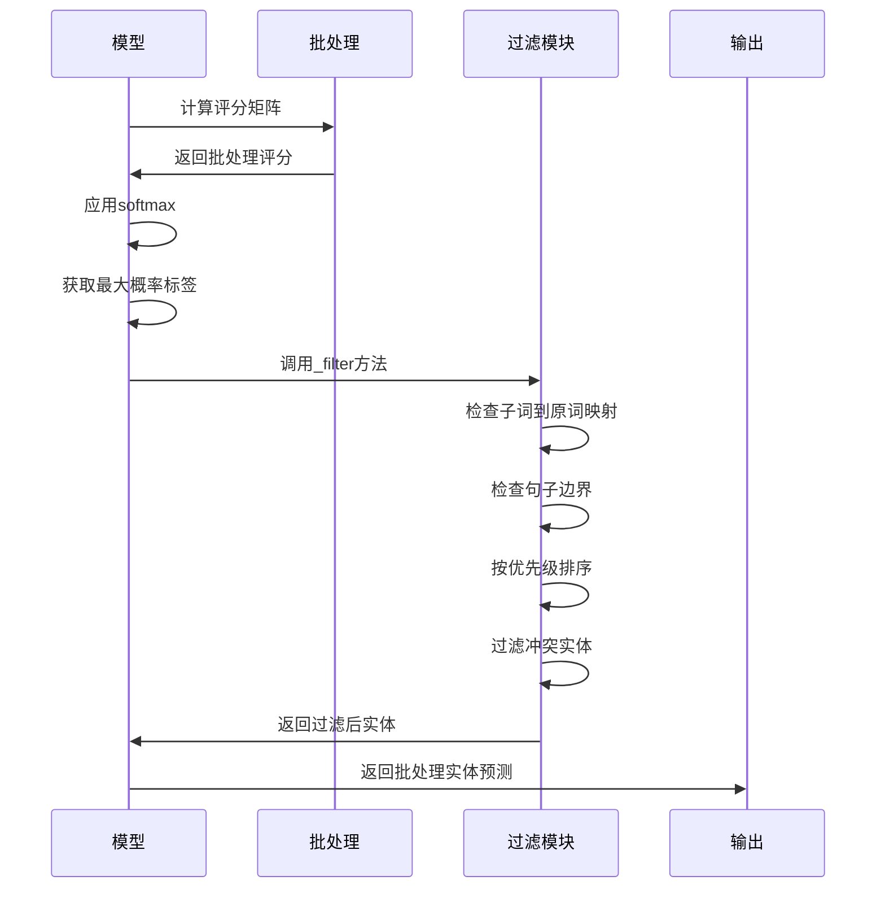
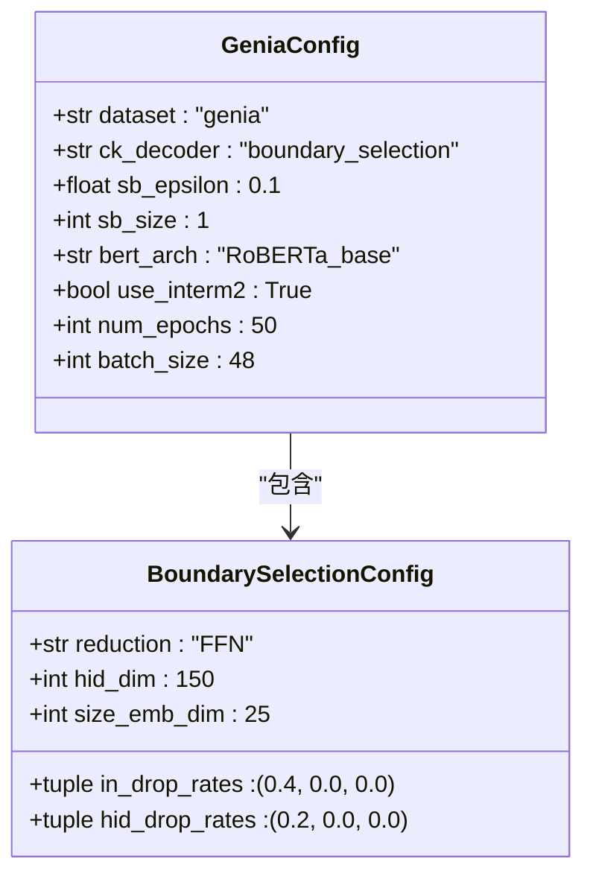

# 边界选择

<cite>
**本文档中引用的文件**   
- [boundary_selection.py](file://eznlp/model/decoder/boundary_selection.py)
- [boundaries.py](file://eznlp/model/decoder/boundaries.py)
- [test_boundary_selection.py](file://eznlp/tests/model/test_boundary_selection.py)
- [GENIA-NER-process.py](file://data/GENIA/GENIA-NER-process.py)
- [genia-yu2020acl-process.py](file://data/genia-yu2020acl/genia-yu2020acl-process.py)
- [boundary-smoothing.md](file://docs/boundary-smoothing.md)
</cite>

## 目录
1. [引言](#引言)
2. [边界选择机制详解](#边界选择机制详解)
3. [配置参数解析](#配置参数解析)
4. [边界评分矩阵构建](#边界评分矩阵构建)
5. [解码过程与约束条件](#解码过程与约束条件)
6. [Genia数据集配置方案](#genia数据集配置方案)
7. [嵌套实体识别分析](#嵌套实体识别分析)
8. [结论](#结论)

## 引言

边界选择范式是一种基于跨度的命名实体识别方法，通过预测实体边界的起始和结束位置来识别命名实体。该方法在生物医学领域实体识别任务中表现出色，特别是在处理Genia等复杂生物实体数据集时具有高精度。本技术文档将深入剖析边界选择范式的实现机制、核心配置参数及其在实际应用中的表现。

**Section sources**
- [boundary_selection.py](file://eznlp/model/decoder/boundary_selection.py#L1-L384)
- [boundaries.py](file://eznlp/model/decoder/boundaries.py#L1-L353)

## 边界选择机制详解

边界选择范式的核心思想是将命名实体识别问题转化为边界预测问题。模型首先通过编码器获取上下文向量表示，然后利用这些向量计算每个位置作为实体边界的概率分布。具体来说，模型预测每个可能的起始-结束位置对（span）属于某个实体类别的概率。

该机制的关键在于构建一个二维的边界评分矩阵，其中每个元素表示特定起始和结束位置构成的span属于某个实体类别的得分。模型通过组合起始边界和结束边界的表示来计算最终的span得分。这种机制允许模型同时考虑局部和全局上下文信息，从而提高实体识别的准确性。

在实现上，边界选择解码器使用两个独立的缩减层（reduction layers）分别处理起始边界和结束边界。这些缩减层通常采用前馈神经网络（FFN）或LSTM架构，将上下文向量映射到低维表示空间。然后通过张量运算和线性变换组合这些表示，生成最终的边界评分矩阵。

**Section sources**
- [boundary_selection.py](file://eznlp/model/decoder/boundary_selection.py#L201-L384)
- [boundaries.py](file://eznlp/model/decoder/boundaries.py#L90-L353)

## 配置参数解析

### BoundarySelectionDecoderConfig参数配置原则

`BoundarySelectionDecoderConfig`类定义了边界选择解码器的核心配置参数，其配置原则如下：

- **in_dim**: 输入维度，自动从编码器的输出维度继承。该参数决定了模型接收的上下文向量的特征维度。
- **hid_dim**: 隐藏层维度，控制缩减层的宽度。较大的值可以捕捉更复杂的特征，但会增加计算成本。
- **dropout_rate**: 丢弃率，用于防止过拟合。包括输入丢弃率(`in_drop_rates`)和隐藏层丢弃率(`hid_drop_rates`)，通常设置为(0.4, 0.0, 0.0)和(0.2, 0.0, 0.0)。
- **size_emb_dim**: 大小嵌入维度，用于编码span的长度信息。实验表明25是一个有效的默认值。
- **sb_epsilon** 和 **sb_size**: 边界平滑参数，用于提高模型鲁棒性。`sb_epsilon`控制平滑强度，`sb_size`定义平滑范围。

这些参数的配置需要根据具体任务和数据集进行调整。例如，在Genia数据集上，推荐使用边界平滑（`sb_epsilon=0.1`）来提高性能。

**Section sources**
- [boundary_selection.py](file://eznlp/model/decoder/boundary_selection.py#L93-L127)
- [test_boundary_selection.py](file://eznlp/tests/model/test_boundary_selection.py#L54-L67)

## 边界评分矩阵构建

边界评分矩阵的构建是边界选择范式的核心计算过程。模型通过以下步骤构建评分矩阵：

**Diagram sources**
- [boundary_selection.py](file://eznlp/model/decoder/boundary_selection.py#L257-L305)

具体实现中，模型首先对上下文向量应用输入丢弃，然后通过独立的缩减层处理起始和结束边界。张量积得分通过矩阵乘法计算：`scores1 = reduced_start.matmul(U).matmul(reduced_end.permute(0,2,1))`。同时，模型将起始和结束表示拼接，并可选择性地加入span大小嵌入，通过线性变换得到第二部分得分。最终得分是两部分得分的和加上偏置项。

**Section sources**
- [boundary_selection.py](file://eznlp/model/decoder/boundary_selection.py#L257-L305)

## 解码过程与约束条件

### 解码流程

解码过程将边界评分矩阵转换为实际的实体预测结果。模型首先对评分矩阵应用softmax函数，将得分转换为概率分布。然后根据置信度阈值筛选出有效的实体候选。

**Diagram sources**
- [boundary_selection.py](file://eznlp/model/decoder/boundary_selection.py#L325-L382)

### 约束条件

解码过程包含多个约束条件：
- **最大span长度限制**: 通过`max_span_size`参数限制预测实体的最大长度，避免过长的无效预测。
- **置信度阈值**: 通过`conf_thresh`参数过滤低置信度的预测结果。
- **冲突实体处理**: 使用`filter_clashed_by_priority`函数处理重叠实体，根据`chunk_priority`参数决定优先级（按置信度或长度排序）。
- **嵌套级别控制**: 通过`overlapping_level`参数控制允许的实体重叠程度。

**Section sources**
- [boundary_selection.py](file://eznlp/model/decoder/boundary_selection.py#L325-L382)
- [chunk.py](file://eznlp/utils/chunk.py#L40-L48)

## Genia数据集配置方案

在Genia数据集上实现高精度生物实体识别的配置方案如下：

**Diagram sources**
- [boundary-smoothing.md](file://docs/boundary-smoothing.md#L44-L55)
- [GENIA-NER-process.py](file://data/GENIA/GENIA-NER-process.py#L1-L92)

关键配置要点：
1. 使用RoBERTa作为预训练语言模型，因其在生物医学文本上的优异表现
2. 启用边界平滑（`sb_epsilon=0.1`）以提高模型鲁棒性
3. 设置合理的训练轮数（50轮）和批量大小（48）
4. 使用中间层（`use_interm2`）增强特征表示能力
5. 对Genia数据集进行适当的预处理，包括实体类型归一化

**Section sources**
- [boundary-smoothing.md](file://docs/boundary-smoothing.md#L44-L55)
- [GENIA-NER-process.py](file://data/GENIA/GENIA-NER-process.py#L76-L89)

## 嵌套实体识别分析

### 优势

边界选择范式在嵌套实体识别中具有显著优势：
- **自然支持嵌套结构**: 通过独立预测边界位置，模型可以自然地识别嵌套实体，无需复杂的后处理。
- **灵活性高**: 可以通过调整`overlapping_level`参数控制允许的嵌套程度。
- **上下文感知**: 模型在预测每个span时都考虑了完整的上下文信息，有助于准确识别复杂嵌套关系。

### 挑战

尽管具有优势，但也面临一些挑战：
- **计算复杂度**: 评分矩阵的大小为O(n²)，对于长文本计算成本较高。
- **标注不一致性**: 在某些数据集中，嵌套实体的标注可能存在不一致性，影响模型性能。
- **长距离依赖**: 对于跨越多个句子的嵌套实体，模型可能难以捕捉长距离依赖关系。

通过结合预训练语言模型和适当的正则化技术，可以有效缓解这些挑战，在Genia等复杂数据集上实现高精度的嵌套实体识别。

**Section sources**
- [boundary_selection.py](file://eznlp/model/decoder/boundary_selection.py#L176-L181)
- [chunk.py](file://eznlp/utils/chunk.py#L51-L60)

## 结论

边界选择范式提供了一种高效且灵活的命名实体识别方法，特别适用于生物医学领域的复杂实体识别任务。通过预测实体边界位置，该范式能够自然地处理嵌套实体结构，并在Genia等数据集上实现高精度识别。合理的参数配置，特别是边界平滑和预训练语言模型的使用，对提升模型性能至关重要。未来的工作可以进一步优化计算效率，探索更有效的嵌套实体处理策略。