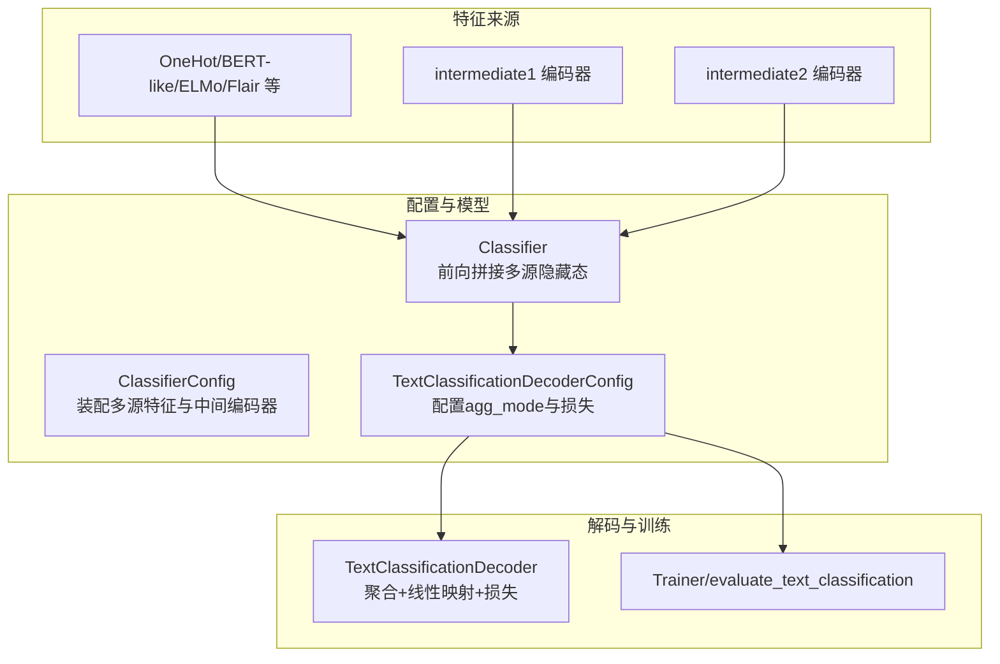
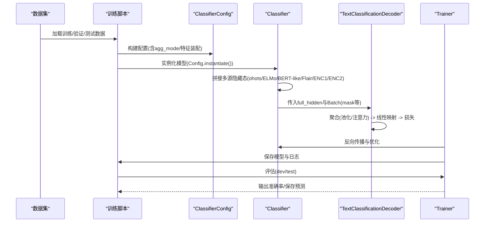
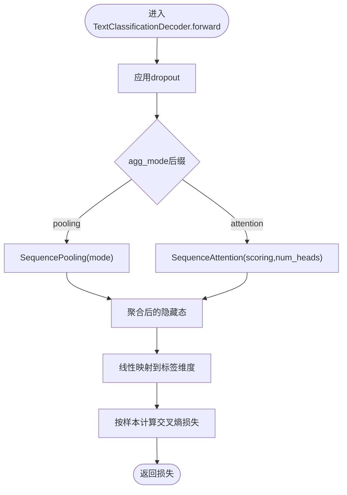
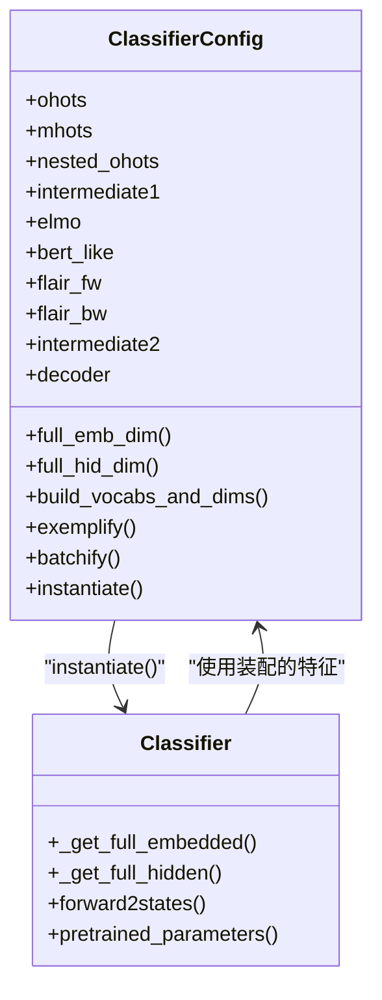
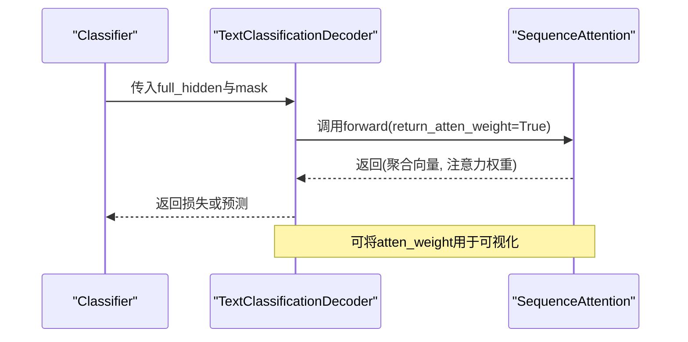
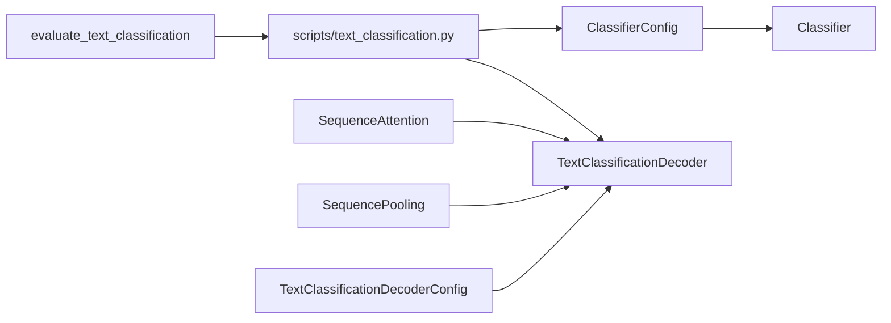
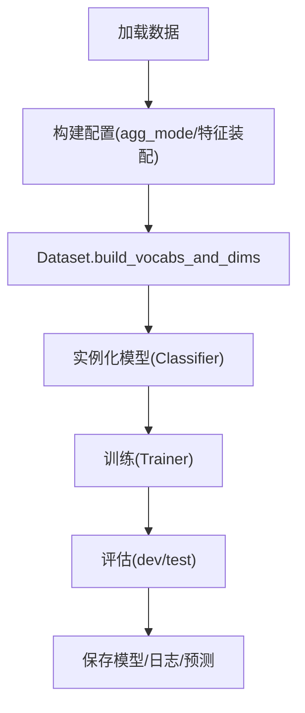

# 单标签文本分类

<cite>
**本文引用的文件**
- [eznlp/model/decoder/text_classification.py](file://eznlp/model/decoder/text_classification.py)
- [eznlp/model/model/classifier.py](file://eznlp/model/model/classifier.py)
- [eznlp/nn/modules/aggregation.py](file://eznlp/nn/modules/aggregation.py)
- [eznlp/nn/modules/attention.py](file://eznlp/nn/modules/attention.py)
- [eznlp/nn/modules/loss.py](file://eznlp/nn/modules/loss.py)
- [scripts/text_classification.py](file://scripts/text_classification.py)
- [docs/text-classification.md](file://docs/text-classification.md)
- [eznlp/training/evaluation.py](file://eznlp/training/evaluation.py)
- [tests/model/test_text_classification.py](file://tests/model/test_text_classification.py)
</cite>

## 目录
1. [引言](#引言)
2. [项目结构](#项目结构)
3. [核心组件](#核心组件)
4. [架构总览](#架构总览)
5. [详细组件分析](#详细组件分析)
6. [依赖关系分析](#依赖关系分析)
7. [性能考量](#性能考量)
8. [故障排查指南](#故障排查指南)
9. [结论](#结论)
10. [附录：从数据到训练评估的完整流程](#附录从数据到训练评估的完整流程)

## 引言
本节面向eznlp中的单标签文本分类任务，系统阐述TextClassificationDecoderConfig如何通过agg_mode参数选择最大池化、平均池化或多种注意力机制（点积、缩放点积、乘法、加法、双线性）进行序列级特征聚合；并结合IMDb与ChnSentiCorp两个数据集的实验设置，说明如何使用ClassifierConfig组合词嵌入、ELMo、BERT等多源特征构建分类模型。文档还解释交叉熵损失函数在英文与中文数据集上的应用与性能差异，并给出从数据加载、模型构建到训练评估的完整流程路径与注意事项，最后讨论注意力权重的可视化方法及其对模型可解释性的提升。

## 项目结构
eznlp采用“配置驱动 + 模块化组件”的设计，文本分类由以下关键模块协同完成：
- 解码器层：TextClassificationDecoderConfig与TextClassificationDecoder负责标签空间映射、特征聚合与损失计算
- 分类器配置：ClassifierConfig组织多源特征（词嵌入、ELMo、BERT-like、Flair等）与中间编码器，统一构建输入维度与解码器维度
- 聚合模块：SequencePooling与SequenceAttention分别实现池化与注意力聚合
- 注意力模块：SequenceAttention支持多种打分策略与多头注意力
- 训练脚本：scripts/text_classification.py提供完整的数据准备、模型装配、训练与评估流程
- 文档与基准：docs/text-classification.md汇总英文与中文数据集的实验设置与性能参考

图表来源
- [eznlp/model/model/classifier.py](file://eznlp/model/model/classifier.py#L16-L118)
- [eznlp/model/decoder/text_classification.py](file://eznlp/model/decoder/text_classification.py#L48-L117)
- [scripts/text_classification.py](file://scripts/text_classification.py#L149-L304)
- [eznlp/training/evaluation.py](file://eznlp/training/evaluation.py#L14-L26)

章节来源
- [eznlp/model/model/classifier.py](file://eznlp/model/model/classifier.py#L16-L118)
- [eznlp/model/decoder/text_classification.py](file://eznlp/model/decoder/text_classification.py#L48-L117)
- [scripts/text_classification.py](file://scripts/text_classification.py#L149-L304)

## 核心组件
- TextClassificationDecoderConfig
  - 关键属性：in_drop_rates、agg_mode、criterion
  - 作用：构建标签字典、实例化解码器、生成名称（包含agg_mode与criterion）
- TextClassificationDecoder
  - 特征聚合：根据agg_mode自动选择SequencePooling或SequenceAttention
  - 前向：dropout -> 聚合 -> 线性映射 -> 损失计算
  - 解码：同前向但不返回损失，直接返回预测标签
- ClassifierConfig
  - 组装多源特征：ohots/mhots/nested_ohots、ELMo、BERT-like、Flair、intermediate1/2
  - 维度计算：累计嵌入维度与预训练维度，设置decoder与中间编码器维度
  - 数据示例化与批处理：为各子模块生成示例与批处理张量
- SequencePooling/SequenceAttention
  - SequencePooling：支持mean/max/min/wtd_mean/rnn_last
  - SequenceAttention：支持多打分策略与多头注意力，可返回注意力权重
- 训练脚本与评估
  - scripts/text_classification.py：解析参数、装配配置、数据预处理、训练与评估
  - evaluate_text_classification：输出准确率并可保存预测结果

章节来源
- [eznlp/model/decoder/text_classification.py](file://eznlp/model/decoder/text_classification.py#L48-L117)
- [eznlp/model/model/classifier.py](file://eznlp/model/model/classifier.py#L16-L118)
- [eznlp/nn/modules/aggregation.py](file://eznlp/nn/modules/aggregation.py#L13-L43)
- [eznlp/nn/modules/attention.py](file://eznlp/nn/modules/attention.py#L10-L233)
- [scripts/text_classification.py](file://scripts/text_classification.py#L149-L304)
- [eznlp/training/evaluation.py](file://eznlp/training/evaluation.py#L14-L26)

## 架构总览
下图展示了从数据到模型再到训练评估的整体流程，以及注意力权重在推理阶段的可选输出路径。

图表来源
- [scripts/text_classification.py](file://scripts/text_classification.py#L204-L304)
- [eznlp/model/model/classifier.py](file://eznlp/model/model/classifier.py#L186-L249)
- [eznlp/model/decoder/text_classification.py](file://eznlp/model/decoder/text_classification.py#L99-L117)
- [eznlp/training/evaluation.py](file://eznlp/training/evaluation.py#L14-L26)

## 详细组件分析

### TextClassificationDecoderConfig与特征聚合
- agg_mode配置项
  - 以“_pooling”结尾：使用SequencePooling，支持mean/max/min/wtd_mean/rnn_last
  - 以“_attention”结尾：使用SequenceAttention，支持dot/scaled_dot/multiplicative/additive/biaffine打分与多头注意力
- 内部逻辑
  - 在构造时读取in_drop_rates与agg_mode
  - forward中先dropout再聚合，然后线性映射到标签维度，最后计算损失
  - decode中仅做聚合与预测，不计算损失
- 名称与repr
  - 名称包含agg_mode与criterion，便于区分不同聚合策略与损失类型

图表来源
- [eznlp/model/decoder/text_classification.py](file://eznlp/model/decoder/text_classification.py#L88-L106)

章节来源
- [eznlp/model/decoder/text_classification.py](file://eznlp/model/decoder/text_classification.py#L48-L117)
- [eznlp/nn/modules/aggregation.py](file://eznlp/nn/modules/aggregation.py#L13-L43)
- [eznlp/nn/modules/attention.py](file://eznlp/nn/modules/attention.py#L10-L233)

### ClassifierConfig与多源特征融合
- 特征装配
  - ohots/mhots/nested_ohots：词级别嵌入
  - elmo：基于LSTM的语言模型上下文表示
  - bert_like：BERT类预训练模型（可带tokenizer）
  - flair_fw/flair_bw：前向/后向语言模型
  - intermediate1/intermediate2：RNN/卷积等中间编码器
- 维度计算
  - full_emb_dim：统计ohots/mhots/nested_ohots的输出维度之和
  - full_hid_dim：若存在intermediate1则取其输出，否则取full_emb_dim；再累加elmo/bert_like/flair的输出维度
  - 设置intermediate2.in_dim与decoder.in_dim
- 数据处理
  - exemplify：为每种特征生成示例
  - batchify：将示例批量化，并在BERT重分词时替换mask/seq_lens
  - forward2states：返回full_hidden供解码器使用

图表来源
- [eznlp/model/model/classifier.py](file://eznlp/model/model/classifier.py#L16-L249)

章节来源
- [eznlp/model/model/classifier.py](file://eznlp/model/model/classifier.py#L16-L249)

### 注意力机制与权重可视化
- SequenceAttention支持的打分方式
  - dot、scaled_dot、multiplicative、additive、biaffine
  - 支持多头注意力，可返回atten_weight
- 可视化思路
  - 在推理时调用return_atten_weight获取注意力权重张量
  - 将权重与token序列对齐，绘制热力图，标注显著token位置
  - 该过程有助于解释模型关注哪些词或片段，提升可解释性

图表来源
- [eznlp/model/decoder/text_classification.py](file://eznlp/model/decoder/text_classification.py#L99-L117)
- [eznlp/nn/modules/attention.py](file://eznlp/nn/modules/attention.py#L156-L229)

章节来源
- [eznlp/nn/modules/attention.py](file://eznlp/nn/modules/attention.py#L10-L233)
- [tests/model/test_text_classification.py](file://tests/model/test_text_classification.py#L53-L106)

### 交叉熵损失函数与性能差异
- 损失函数
  - 文本分类默认使用交叉熵损失（SoftLabel/SmoothLabel/FocalLoss等变体亦可选）
  - 在英文与中文数据集上均可使用，具体超参与优化策略见文档
- 英文数据集（如IMDb/Yelp）与中文数据集（如ChnSentiCorp/THUCNews-10）的实验设置与性能参考
  - 英文：优化器、学习率、warmup与衰减策略、PLM微调策略等
  - 中文：优化器、学习率、warmup与衰减策略、PLM微调策略等
  - 性能对比：文档提供了多模型在不同数据集上的准确率参考

章节来源
- [eznlp/nn/modules/loss.py](file://eznlp/nn/modules/loss.py#L11-L89)
- [docs/text-classification.md](file://docs/text-classification.md#L1-L93)

## 依赖关系分析
- 组件耦合
  - ClassifierConfig与Classifier强耦合：前者决定后者装配哪些特征与中间层，后者负责拼接与前向
  - TextClassificationDecoderConfig与Decoder：前者配置agg_mode与损失，后者实现聚合与损失计算
  - SequencePooling/SequenceAttention作为底层模块被Decoder复用
- 外部依赖
  - 训练脚本依赖Trainer与evaluate_text_classification进行训练与评估
  - 测试用例覆盖多种agg_mode与BERT配置，验证模型一致性与可训练性

图表来源
- [eznlp/model/model/classifier.py](file://eznlp/model/model/classifier.py#L16-L249)
- [eznlp/model/decoder/text_classification.py](file://eznlp/model/decoder/text_classification.py#L48-L117)
- [eznlp/nn/modules/aggregation.py](file://eznlp/nn/modules/aggregation.py#L13-L43)
- [eznlp/nn/modules/attention.py](file://eznlp/nn/modules/attention.py#L10-L233)
- [scripts/text_classification.py](file://scripts/text_classification.py#L149-L304)
- [eznlp/training/evaluation.py](file://eznlp/training/evaluation.py#L14-L26)

章节来源
- [eznlp/model/model/classifier.py](file://eznlp/model/model/classifier.py#L16-L249)
- [eznlp/model/decoder/text_classification.py](file://eznlp/model/decoder/text_classification.py#L48-L117)
- [eznlp/nn/modules/aggregation.py](file://eznlp/nn/modules/aggregation.py#L13-L43)
- [eznlp/nn/modules/attention.py](file://eznlp/nn/modules/attention.py#L10-L233)
- [scripts/text_classification.py](file://scripts/text_classification.py#L149-L304)
- [eznlp/training/evaluation.py](file://eznlp/training/evaluation.py#L14-L26)

## 性能考量
- 聚合策略选择
  - 池化（max/mean/min）简单高效，适合快速baseline
  - 注意力（dot/scaled_dot/multiplicative/additive/biaffine）更灵活，通常在有足够数据与合适打分时效果更好
- 预训练模型与冻结策略
  - BERT-like/ELMo/Flair等预训练模型可显著提升性能，需注意学习率与warmup策略
  - 冻结部分参数可缓解过拟合并加速收敛
- 数据预处理
  - 英文BERT数据需考虑分词与长度截断
  - 中文长文本可采用截断策略避免内存压力
- 批大小与设备
  - GPU显存有限时适当降低batch size或启用梯度累积
  - 自动设备选择与参数计数工具可用于资源规划

[本节为通用建议，无需列出具体文件来源]

## 故障排查指南
- 训练不稳定或精度偏低
  - 检查agg_mode是否与数据规模匹配（注意力需要更多数据）
  - 调整学习率、warmup步数与优化器参数
- 内存不足
  - 减小batch size或缩短序列长度
  - 对BERT-like启用更严格的截断策略
- 预训练模型维度不一致
  - 确认from_tokenized与re-tokenization逻辑，必要时替换mask/seq_lens
- 注意力权重异常
  - 确保mask正确传递，避免全零注意力
  - 检查打分策略与多头数量是否合理

章节来源
- [eznlp/model/model/classifier.py](file://eznlp/model/model/classifier.py#L16-L118)
- [eznlp/nn/modules/attention.py](file://eznlp/nn/modules/attention.py#L156-L229)
- [scripts/text_classification.py](file://scripts/text_classification.py#L161-L202)

## 结论
eznlp的单标签文本分类通过配置化的Decoder与多源特征融合，实现了灵活且高性能的文本分类流水线。TextClassificationDecoderConfig的agg_mode参数为特征聚合提供了统一接口，既可选择传统池化，也可使用多样注意力机制；配合ClassifierConfig的多特征装配能力，可在英文（如IMDb/Yelp）与中文（如ChnSentiCorp/THUCNews-10）数据集上取得良好性能。通过注意力权重可视化，能够增强模型的可解释性，辅助调试与改进。

[本节为总结，无需列出具体文件来源]

## 附录：从数据到训练评估的完整流程
- 数据加载与预处理
  - 使用load_data加载训练/验证/测试数据
  - 根据数据集语言与配置进行BERT分词、真大小写处理、长度截断与配对输入拼接
- 模型配置与装配
  - 构建ClassifierConfig，设置ohots/ELMo/BERT-like/Flair/intermediate1/2与decoder（指定agg_mode）
  - Dataset.build_vocabs_and_dims建立词汇表与维度
- 训练与评估
  - 实例化模型并部署到设备
  - 使用Trainer进行训练，保存最佳模型与日志
  - evaluate_text_classification在开发集与测试集上评估准确率，可选保存预测

图表来源
- [scripts/text_classification.py](file://scripts/text_classification.py#L204-L304)
- [eznlp/training/evaluation.py](file://eznlp/training/evaluation.py#L14-L26)

章节来源
- [scripts/text_classification.py](file://scripts/text_classification.py#L149-L304)
- [tests/model/test_text_classification.py](file://tests/model/test_text_classification.py#L53-L106)