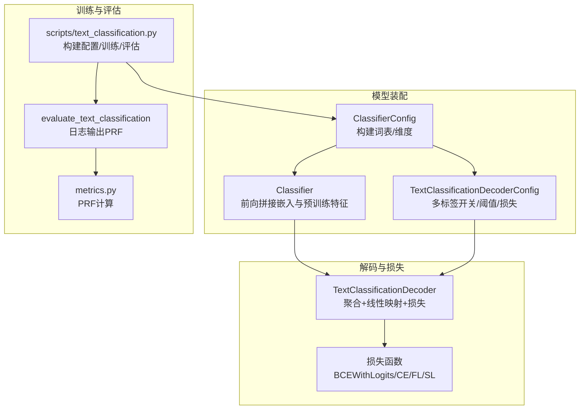
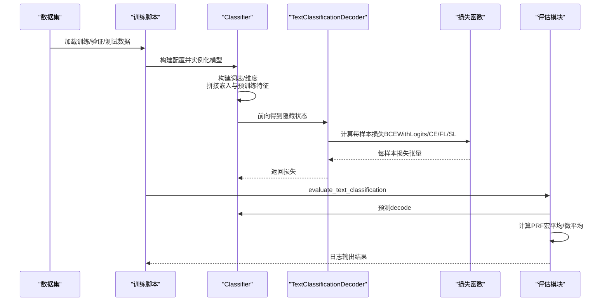
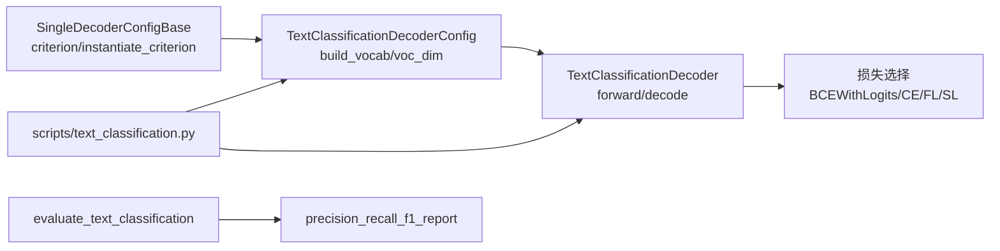

# 多标签文本分类

<cite>
**本文引用的文件列表**
- [eznlp/model/decoder/text_classification.py](file://eznlp/model/decoder/text_classification.py)
- [eznlp/model/model/classifier.py](file://eznlp/model/model/classifier.py)
- [eznlp/model/decoder/base.py](file://eznlp/model/decoder/base.py)
- [eznlp/nn/modules/loss.py](file://eznlp/nn/modules/loss.py)
- [eznlp/nn/functional.py](file://eznlp/nn/functional.py)
- [eznlp/training/evaluation.py](file://eznlp/training/evaluation.py)
- [eznlp/metrics.py](file://eznlp/metrics.py)
- [scripts/text_classification.py](file://scripts/text_classification.py)
- [data/yelp_review_full/demo.train.csv](file://data/yelp_review_full/demo.train.csv)
- [eznlp/io/tabular.py](file://eznlp/io/tabular.py)
- [third_party/dice_loss_for_NLP/loss/focal_loss.py](file://third_party/dice_loss_for_NLP/loss/focal_loss.py)
- [third_party/dice_loss_for_NLP/loss/dice_loss.py](file://third_party/dice_loss_for_NLP/loss/dice_loss.py)
</cite>

## 目录
1. [引言](#引言)
2. [项目结构](#项目结构)
3. [核心组件](#核心组件)
4. [架构总览](#架构总览)
5. [详细组件分析](#详细组件分析)
6. [依赖关系分析](#依赖关系分析)
7. [性能与优化建议](#性能与优化建议)
8. [故障排查指南](#故障排查指南)
9. [结论](#结论)
10. [附录：在Yelp Full上的配置示例](#附录在yelp-full上的配置示例)

## 引言
本文件系统性解析 eznlp 在多标签文本分类任务中的支持方案，重点围绕以下目标展开：
- 如何通过修改损失函数（BCEWithLogitsLoss）与标签编码方式实现多标签场景；
- 在 Yelp Full 等数据集上的具体配置方法，包括标签空间维度的自动推导、正负样本不平衡处理策略（如 Focal Loss 应用）、以及 sigmoid 激活函数的输出层设计；
- 多标签评估指标（精确率、召回率、F1 值）的计算方法；
- 结合实际代码演示如何调整 TextClassificationDecoderConfig 以适配多标签任务需求。

## 项目结构
eznlp 的文本分类模块由“模型配置”“解码器”“损失与评估工具”“训练脚本”等组成。其中：
- 解码器负责将编码器隐藏状态映射到标签空间，并根据配置选择损失函数；
- 训练脚本负责构建配置、加载数据、训练与评估；
- 评估模块提供准确率与多标签 PRF 报告；
- 损失模块提供交叉熵、平滑标签、Focal Loss 等；同时提供基于函数式接口的通用损失实现。

图表来源
- [eznlp/model/model/classifier.py](file://eznlp/model/model/classifier.py#L1-L120)
- [eznlp/model/decoder/text_classification.py](file://eznlp/model/decoder/text_classification.py#L48-L117)
- [eznlp/model/decoder/base.py](file://eznlp/model/decoder/base.py#L52-L88)
- [eznlp/training/evaluation.py](file://eznlp/training/evaluation.py#L14-L37)
- [eznlp/metrics.py](file://eznlp/metrics.py#L1-L60)
- [scripts/text_classification.py](file://scripts/text_classification.py#L149-L160)

章节来源
- [eznlp/model/model/classifier.py](file://eznlp/model/model/classifier.py#L1-L120)
- [eznlp/model/decoder/text_classification.py](file://eznlp/model/decoder/text_classification.py#L48-L117)
- [eznlp/model/decoder/base.py](file://eznlp/model/decoder/base.py#L52-L88)
- [scripts/text_classification.py](file://scripts/text_classification.py#L149-L160)

## 核心组件
- 文本分类解码器配置（TextClassificationDecoderConfig）
  - 支持多标签开关 multilabel、置信度阈值 conf_thresh、Focal Loss 参数 fl_gamma、平滑标签参数 sl_epsilon；
  - 自动推导标签空间维度 voc_dim，构建标签索引 idx2label；
  - 根据 criterion 动态实例化损失函数（BCEWithLogitsLoss、CrossEntropyLoss、FocalLoss、SmoothLabelCrossEntropyLoss）。
- 文本分类解码器（TextClassificationDecoder）
  - 聚合隐藏序列（注意力或池化），线性映射到标签维度；
  - 使用配置的损失函数返回每样本损失；
  - decode 方法使用 argmax 获取类别预测。
- 分类器配置（ClassifierConfig）
  - 组装嵌入、预训练编码器与中间层，最终连接解码器；
  - 构建词表与维度，设置解码器输入维度与标签词表。
- 训练脚本（scripts/text_classification.py）
  - 构建配置，加载数据，训练与评估；
  - 评估阶段调用 evaluate_text_classification 输出准确率与 PRF 报告。

章节来源
- [eznlp/model/decoder/text_classification.py](file://eznlp/model/decoder/text_classification.py#L48-L117)
- [eznlp/model/decoder/base.py](file://eznlp/model/decoder/base.py#L52-L88)
- [eznlp/model/model/classifier.py](file://eznlp/model/model/classifier.py#L92-L118)
- [scripts/text_classification.py](file://scripts/text_classification.py#L149-L160)

## 架构总览
下图展示从数据到预测再到评估的整体流程，突出多标签的关键点：损失函数选择、标签维度推导、阈值决策与评估指标。

图表来源
- [scripts/text_classification.py](file://scripts/text_classification.py#L244-L304)
- [eznlp/model/model/classifier.py](file://eznlp/model/model/classifier.py#L210-L249)
- [eznlp/model/decoder/text_classification.py](file://eznlp/model/decoder/text_classification.py#L99-L117)
- [eznlp/training/evaluation.py](file://eznlp/training/evaluation.py#L14-L37)
- [eznlp/metrics.py](file://eznlp/metrics.py#L98-L153)

## 详细组件分析

### 多标签损失与标签编码
- 多标签开关与损失函数
  - 在解码器配置中，multilabel 为 True 时，criterion 名称前缀为 “B”，表示使用二元交叉熵（BCEWithLogitsLoss）；
  - BCEWithLogitsLoss 适合多标签场景，每个标签独立预测，输出层采用 sigmoid 激活；
  - 若 multilabel 为 False，则使用标准交叉熵（CrossEntropyLoss）。
- 标签维度与索引
  - 解码器配置 build_vocab 会统计所有标签，形成 idx2label 列表；
  - voc_dim = len(label2idx)，即标签空间维度；
  - 解码器 forward 中，hid2logit 将隐藏状态映射到 voc_dim，再由 BCEWithLogitsLoss 计算损失；
  - 解码 decode 中，使用 argmax 获取类别预测（单标签）；多标签需配合 conf_thresh 进行阈值决策（见后续“多标签预测与阈值”）。

章节来源
- [eznlp/model/decoder/base.py](file://eznlp/model/decoder/base.py#L52-L88)
- [eznlp/model/decoder/text_classification.py](file://eznlp/model/decoder/text_classification.py#L69-L74)
- [eznlp/model/decoder/text_classification.py](file://eznlp/model/decoder/text_classification.py#L84-L106)

### 输出层与激活函数设计
- 线性映射与激活
  - 解码器在隐藏状态上执行 dropout 后，经线性层映射到 voc_dim；
  - 线性层初始化采用 sigmoid（reinit_layer_ 调用），这与 BCEWithLogitsLoss 的输入格式一致；
  - 多标签场景通常使用 sigmoid 激活，但当前实现中线性层初始化为 sigmoid，可能与 BCEWithLogitsLoss 的组合存在不一致风险；更常见做法是直接输出 logits，由损失函数内部应用 sigmoid 或 log-sigmoid。
- 注意力/池化聚合
  - 支持多种聚合模式（注意力或池化），用于将序列隐藏状态压缩为固定长度向量，再送入线性层。

章节来源
- [eznlp/model/decoder/text_classification.py](file://eznlp/model/decoder/text_classification.py#L84-L106)

### 多标签预测与阈值决策
- 当前解码器 decode 使用 argmax 获取类别（单标签）；
- 多标签任务需要按阈值（conf_thresh，默认 0.5）将 logits 转换为二元标签集合；
- 建议扩展：在 decode 中增加多标签分支，对每个标签独立判断是否超过阈值，从而生成多标签预测集合。

章节来源
- [eznlp/model/decoder/text_classification.py](file://eznlp/model/decoder/text_classification.py#L112-L117)
- [eznlp/model/decoder/base.py](file://eznlp/model/decoder/base.py#L52-L63)

### 正负样本不平衡处理（Focal Loss）
- Focal Loss 参数 fl_gamma 可在配置中设置；
- 当 criterion 为 “FL(gamma)” 时，解码器配置 instantiate_criterion 将返回 FocalLoss；
- Focal Loss 通过降低易分样本权重、提升难分样本权重，缓解类别不平衡问题；
- 第三方实现位于 third_party，eznlp 内部也提供了基于函数式接口的 Focal Loss 实现。

章节来源
- [eznlp/model/decoder/base.py](file://eznlp/model/decoder/base.py#L52-L88)
- [eznlp/nn/modules/loss.py](file://eznlp/nn/modules/loss.py#L60-L89)
- [eznlp/nn/functional.py](file://eznlp/nn/functional.py#L273-L314)
- [third_party/dice_loss_for_NLP/loss/focal_loss.py](file://third_party/dice_loss_for_NLP/loss/focal_loss.py#L1-L77)

### 平滑标签与软标签（可选）
- 平滑标签（SmoothLabelCrossEntropyLoss）与软标签（SoftLabelCrossEntropyLoss）也可作为替代损失；
- 它们分别通过平滑目标分布或使用软目标分布进行训练，有助于提高泛化能力。

章节来源
- [eznlp/nn/modules/loss.py](file://eznlp/nn/modules/loss.py#L1-L58)
- [eznlp/nn/functional.py](file://eznlp/nn/functional.py#L200-L271)

### 多标签评估指标（精确率、召回率、F1）
- 评估模块提供 precision_recall_f1_report，支持按类型（macro）与按样本（micro）两种平均方式；
- 对于多标签任务，应将每个样本的预测标签集合与真实标签集合转换为集合形式，再计算 TP、FP、FN，进而得到 P、R、F1；
- 当前评估脚本针对文本分类使用准确率，若要获得多标签 PRF，需在评估流程中替换为多标签 PRF 计算逻辑。

章节来源
- [eznlp/training/evaluation.py](file://eznlp/training/evaluation.py#L14-L37)
- [eznlp/metrics.py](file://eznlp/metrics.py#L98-L153)

### 数据加载与标签空间维度推导
- 数据加载通过 TabularIO 读取 CSV，构造包含 tokens 与 label 的条目；
- ClassifierConfig.build_vocabs_and_dims 会调用解码器的 build_vocab 推导标签空间维度；
- Yelp Full 示例数据包含评分标签，可直接用于多标签分类（需将评分离散化为多标签）。

章节来源
- [eznlp/io/tabular.py](file://eznlp/io/tabular.py#L50-L66)
- [eznlp/model/model/classifier.py](file://eznlp/model/model/classifier.py#L92-L118)
- [data/yelp_review_full/demo.train.csv](file://data/yelp_review_full/demo.train.csv#L1-L11)

## 依赖关系分析
- 解码器配置与损失函数
  - TextClassificationDecoderConfig.criterion 根据 multilabel、fl_gamma、sl_epsilon 动态决定损失名称；
  - instantiate_criterion 根据名称返回对应损失实例；
- 解码器与损失
  - TextClassificationDecoder.forward 使用配置的损失函数计算每样本损失；
  - decode 使用 argmax 获取类别（单标签）；
- 训练脚本与评估
  - scripts/text_classification.py 构建配置并训练；
  - evaluate_text_classification 调用评估模块输出准确率与 PRF 报告。

图表来源
- [eznlp/model/decoder/base.py](file://eznlp/model/decoder/base.py#L52-L88)
- [eznlp/model/decoder/text_classification.py](file://eznlp/model/decoder/text_classification.py#L69-L117)
- [eznlp/training/evaluation.py](file://eznlp/training/evaluation.py#L14-L37)
- [eznlp/metrics.py](file://eznlp/metrics.py#L98-L153)

## 性能与优化建议
- 多标签损失选择
  - BCEWithLogitsLoss 适合多标签场景，避免 softmax 的全局归一化开销；
  - 若类别极度不平衡，优先考虑 Focal Loss（fl_gamma > 0）。
- 标签维度与内存
  - voc_dim 由标签数量决定，标签过多会显著增加线性层参数；
  - 可通过标签过滤或分层策略控制标签规模。
- 阈值调优
  - conf_thresh 默认 0.5，可根据验证集 PRF 曲线进行调优；
  - 建议在 decode 中加入多标签阈值分支，按标签独立阈值决策。
- 评估指标
  - 使用 macro 与 micro 两种平均方式对比，宏观平均更关注少数类，微观平均更关注整体覆盖。

[本节为通用指导，无需列出具体文件来源]

## 故障排查指南
- 准确率与 PRF 不一致
  - evaluate_text_classification 默认输出准确率，若要多标签 PRF，需在评估流程中替换为多标签 PRF 计算；
  - 确认标签集合转换正确（将预测/真实转为集合形式）。
- 多标签阈值未生效
  - 当前 decode 使用 argmax，未按 conf_thresh 进行多标签判定；
  - 需扩展 decode 逻辑，对每个标签独立判断是否超过阈值。
- BCEWithLogitsLoss 与 sigmoid 初始化冲突
  - 线性层初始化为 sigmoid，而 BCEWithLogitsLoss 期望直接输出 logits；
  - 建议移除线性层初始化中的 sigmoid，保持输出 logits 与损失函数的一致性。
- 类别不平衡导致欠拟合
  - 提升 fl_gamma，或引入 Focal Loss；
  - 检查权重 weight 是否传入，必要时按类别频率设置权重。

章节来源
- [eznlp/model/decoder/text_classification.py](file://eznlp/model/decoder/text_classification.py#L84-L106)
- [eznlp/training/evaluation.py](file://eznlp/training/evaluation.py#L14-L37)
- [eznlp/metrics.py](file://eznlp/metrics.py#L98-L153)

## 结论
eznlp 已具备多标签文本分类的基础能力：通过 multilabel 开关与 BCEWithLogitsLoss 实现多标签建模，标签维度通过 build_vocab 自动推导，损失函数可按配置动态选择。为进一步完善多标签体验，建议：
- 在 decode 中增加多标签阈值决策；
- 移除线性层初始化中的 sigmoid，确保与 BCEWithLogitsLoss 的一致性；
- 在评估阶段引入多标签 PRF 报告；
- 在不平衡场景中启用 Focal Loss，并合理设置 gamma 与权重。

[本节为总结，无需列出具体文件来源]

## 附录：在Yelp Full上的配置示例
- 数据准备
  - 使用 TabularIO 读取 CSV，构造 tokens 与 label 字段；
  - Yelp Full 示例数据包含评分标签，可直接用于多标签分类（需将评分离散化为多标签）。
- 配置要点
  - 设置 multilabel=True，使 criterion 为 “BCEWithLogitsLoss”；
  - 可选设置 fl_gamma 提升不平衡场景效果；
  - 通过 ClassifierConfig.build_vocabs_and_dims 自动推导标签空间维度；
  - 训练脚本 scripts/text_classification.py 提供完整的配置构建与训练流程。
- 评估建议
  - 使用 evaluate_text_classification 输出准确率；
  - 若需多标签 PRF，替换评估逻辑为多标签 PRF 计算。

章节来源
- [eznlp/io/tabular.py](file://eznlp/io/tabular.py#L50-L66)
- [eznlp/model/model/classifier.py](file://eznlp/model/model/classifier.py#L92-L118)
- [eznlp/model/decoder/base.py](file://eznlp/model/decoder/base.py#L52-L88)
- [scripts/text_classification.py](file://scripts/text_classification.py#L149-L160)
- [data/yelp_review_full/demo.train.csv](file://data/yelp_review_full/demo.train.csv#L1-L11)