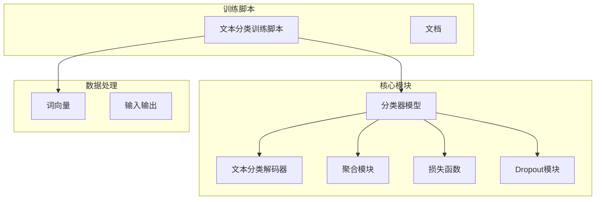
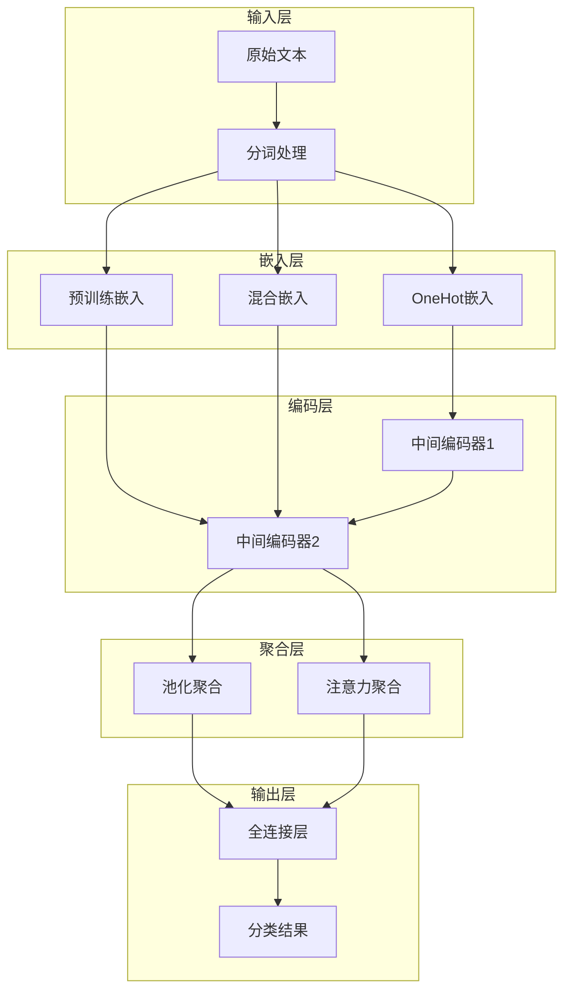
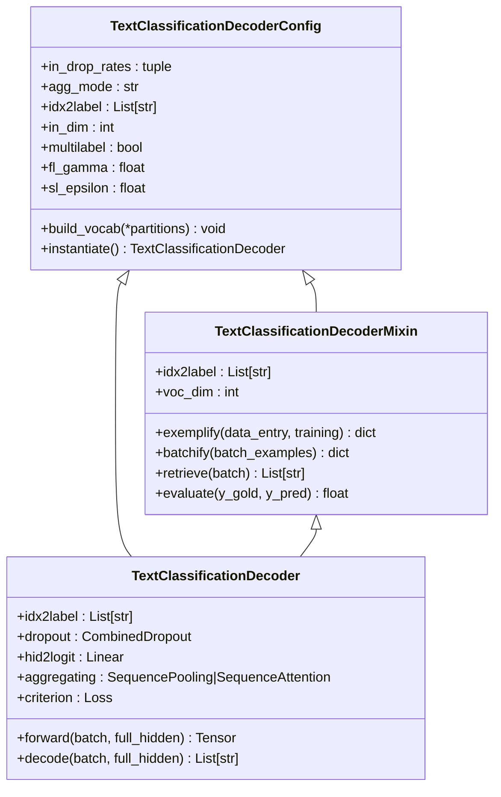
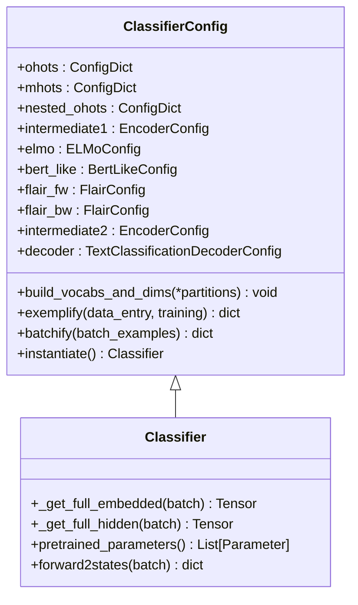
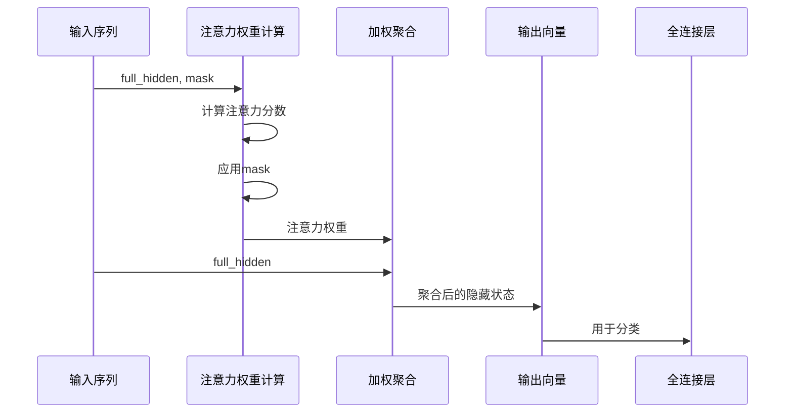
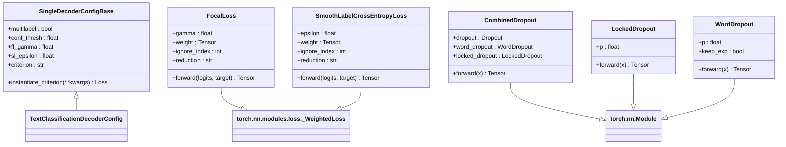
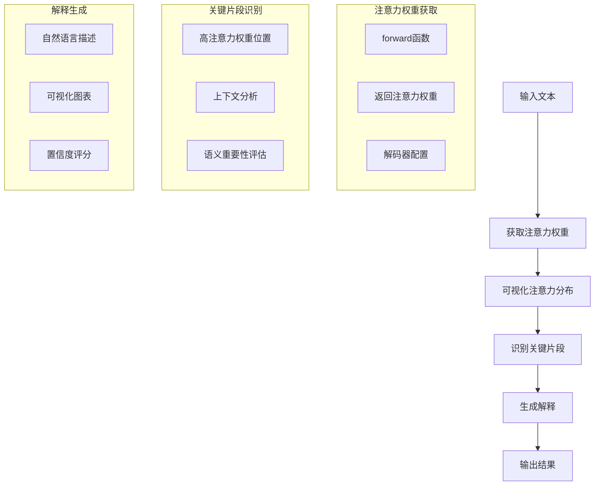
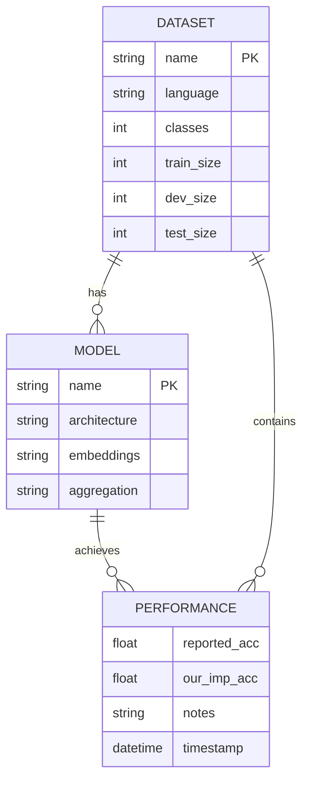

# 文本分类详解

<cite>
**本文档中引用的文件**  
- [text_classification.py](file://scripts/text_classification.py)
- [text_classification.py](file://eznlp/model/decoder/text_classification.py)
- [classifier.py](file://eznlp/model/model/classifier.py)
- [vectors.py](file://eznlp/vectors.py)
- [aggregation.py](file://eznlp/nn/modules/aggregation.py)
- [loss.py](file://eznlp/nn/modules/loss.py)
- [dropout.py](file://eznlp/nn/modules/dropout.py)
- [text-classification.md](file://docs/text-classification.md)
</cite>

## 目录
1. [项目结构](#项目结构)
2. [核心组件](#核心组件)
3. [架构概述](#架构概述)
4. [详细组件分析](#详细组件分析)
5. [注意力机制实现](#注意力机制实现)
6. [超参数配置](#超参数配置)
7. [损失函数与过拟合预防](#损失函数与过拟合预防)
8. [模型解释性分析](#模型解释性分析)
9. [性能基准](#性能基准)

## 项目结构



**图示来源**
- [text_classification.py](file://scripts/text_classification.py)
- [classifier.py](file://eznlp/model/model/classifier.py)
- [aggregation.py](file://eznlp/nn/modules/aggregation.py)

**本节来源**
- [text_classification.py](file://scripts/text_classification.py)
- [classifier.py](file://eznlp/model/model/classifier.py)

## 核心组件

在eznlp中，文本分类任务的核心实现基于`TextClassificationDecoderConfig`和`ClassifierConfig`两个关键配置类。`TextClassificationDecoderConfig`负责定义分类头的配置，包括聚合模式、Dropout率等参数。`ClassifierConfig`则定义了整个分类模型的架构，支持LSTM+Attention、CNN、BERT等多种模型架构的组合。

该实现支持单标签与多标签分类场景，通过`multilabel`参数进行区分。分类器能够集成多种预训练模型（如ELMo、BERT、Flair）和传统嵌入（如GloVe、腾讯词向量），并通过中间编码器（intermediate1和intermediate2）进行特征融合。

**本节来源**
- [text_classification.py](file://scripts/text_classification.py#L149-L158)
- [classifier.py](file://eznlp/model/model/classifier.py#L16-L41)
- [text_classification.py](file://eznlp/model/decoder/text_classification.py#L48-L56)

## 架构概述



**图示来源**
- [classifier.py](file://eznlp/model/model/classifier.py#L17-L30)
- [text_classification.py](file://eznlp/model/decoder/text_classification.py#L88-L95)

## 详细组件分析

### 文本分类解码器分析



**图示来源**
- [text_classification.py](file://eznlp/model/decoder/text_classification.py#L48-L76)
- [text_classification.py](file://eznlp/model/decoder/text_classification.py#L79-L116)

**本节来源**
- [text_classification.py](file://eznlp/model/decoder/text_classification.py#L1-L116)

### 分类器模型分析



**图示来源**
- [classifier.py](file://eznlp/model/model/classifier.py#L16-L180)
- [classifier.py](file://eznlp/model/model/classifier.py#L186-L249)

**本节来源**
- [classifier.py](file://eznlp/model/model/classifier.py#L1-L249)

## 注意力机制实现



在eznlp中，注意力机制通过`SequenceAttention`类实现，支持多种评分函数，包括点积（Dot）、缩放点积（Scaled_Dot）、乘法（Multiplicative）、加法（Additive）和双仿射（Biaffine）等。注意力机制在`TextClassificationDecoder`中被用作序列聚合方式，通过`agg_mode`参数配置为"multiplicative_attention"等模式。

注意力机制首先计算每个时间步的注意力权重，然后使用这些权重对隐藏状态进行加权求和，从而得到一个固定长度的上下文向量。这种机制允许模型关注输入序列中最相关的部分，对分类性能有显著提升。

**图示来源**
- [text_classification.py](file://eznlp/model/decoder/text_classification.py#L92-L95)
- [aggregation.py](file://eznlp/nn/modules/aggregation.py#L13-L43)

**本节来源**
- [text_classification.py](file://eznlp/model/decoder/text_classification.py#L88-L95)
- [aggregation.py](file://eznlp/nn/modules/aggregation.py#L13-L43)

## 超参数配置

```mermaid
flowchart TD
A[数据集选择] --> B[模型架构]
B --> C[嵌入层配置]
C --> D[编码层配置]
D --> E[聚合方式]
E --> F[训练参数]
F --> G[优化器]
G --> H[学习率]
H --> I[批大小]
I --> J[训练轮数]
subgraph "IMDb配置"
K[agg_mode: multiplicative_attention]
L[drop_rate: 0.5]
M[batch_size: 64]
N[num_epochs: 50]
O[optimizer: Adadelta(lr=0.5)]
P[emb_dim: 300]
Q[emb_freeze: False]
end
subgraph "Yelp配置"
R[agg_mode: max_pooling]
S[drop_rate: 0.5]
T[batch_size: 64]
U[num_epochs: 50]
V[optimizer: Adadelta(lr=0.5)]
W[emb_dim: 300]
X[emb_freeze: False]
end
subgraph "ChnSentiCorp配置"
Y[agg_mode: multiplicative_attention]
Z[drop_rate: 0.5]
AA[batch_size: 64]
AB[num_epochs: 50]
AC[optimizer: Adadelta(lr=1.0)]
AD[emb_dim: 200]
AE[emb_freeze: False]
end
```

**图示来源**
- [text-classification.md](file://docs/text-classification.md#L8-L13)
- [text-classification.md](file://docs/text-classification.md#L48-L53)
- [text_classification.py](file://scripts/text_classification.py#L69-L73)

**本节来源**
- [text-classification.md](file://docs/text-classification.md#L8-L93)
- [text_classification.py](file://scripts/text_classification.py#L69-L146)

## 损失函数与过拟合预防



在多任务分类中，eznlp提供了多种损失函数选择。对于单标签分类，默认使用交叉熵损失（CrossEntropyLoss）；对于多标签分类，使用二元交叉熵损失（BCEWithLogitsLoss）。此外，还支持Focal Loss，通过`fl_gamma`参数配置，有助于解决类别不平衡问题。

过拟合预防策略包括多种Dropout技术：普通Dropout、词Dropout（WordDropout）和锁定Dropout（LockedDropout）。其中，锁定Dropout在序列维度上对隐藏状态的特定维度进行dropout，而词Dropout则对整个词的嵌入进行dropout。这些技术通过`in_drop_rates`参数在`TextClassificationDecoderConfig`中配置。

**图示来源**
- [loss.py](file://eznlp/nn/modules/loss.py#L11-L89)
- [dropout.py](file://eznlp/nn/modules/dropout.py#L5-L22)
- [text_classification.py](file://eznlp/model/decoder/text_classification.py#L52)
- [base.py](file://eznlp/model/decoder/base.py#L52-L87)

**本节来源**
- [loss.py](file://eznlp/nn/modules/loss.py#L1-L89)
- [dropout.py](file://eznlp/nn/modules/dropout.py#L1-L92)
- [base.py](file://eznlp/model/decoder/base.py#L52-L87)

## 模型解释性分析



在eznlp中，模型解释性分析主要通过注意力机制实现。通过访问`SequenceAttention`模块的注意力权重，可以识别输入文本中对分类决策最重要的部分。这些注意力权重反映了模型在做出预测时关注的文本区域，为模型决策提供了可解释性。

对于单标签分类，注意力权重最高的位置通常对应于最具判别性的词语或短语；对于多标签分类，不同标签可能关注文本的不同部分。这种机制不仅提高了模型的透明度，还帮助研究人员理解模型的决策过程，验证其合理性。

**图示来源**
- [aggregation.py](file://eznlp/nn/modules/aggregation.py#L13-L43)
- [text_classification.py](file://eznlp/model/decoder/text_classification.py#L92-L95)

**本节来源**
- [aggregation.py](file://eznlp/nn/modules/aggregation.py#L13-L43)
- [text_classification.py](file://eznlp/model/decoder/text_classification.py#L92-L95)

## 性能基准



根据文档中的基准测试结果，eznlp在多个数据集上实现了具有竞争力的性能。在英文数据集IMDb上，使用LSTM+Attention架构达到了92.09%的准确率；在Yelp Full数据集上，使用相同架构达到了68.61%的准确率。对于中文数据集ChnSentiCorp，使用LSTM+Attention架构达到了92.42%的准确率，而使用腾讯词向量初始化后提升至93.08%。

使用BERT等预训练语言模型进一步提升了性能，在ChnSentiCorp数据集上达到了95.83%的准确率。这些结果表明，注意力机制和预训练词向量对分类性能有显著提升作用，特别是在处理中文文本时，使用领域特定的词向量（如腾讯词向量）能够带来额外的性能增益。

**图示来源**
- [text-classification.md](file://docs/text-classification.md#L21-L92)

**本节来源**
- [text-classification.md](file://docs/text-classification.md#L21-L92)