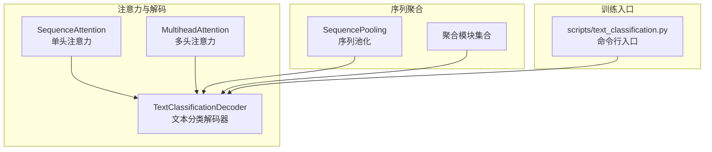
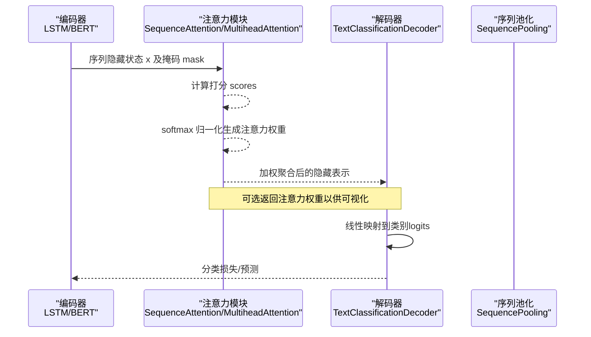
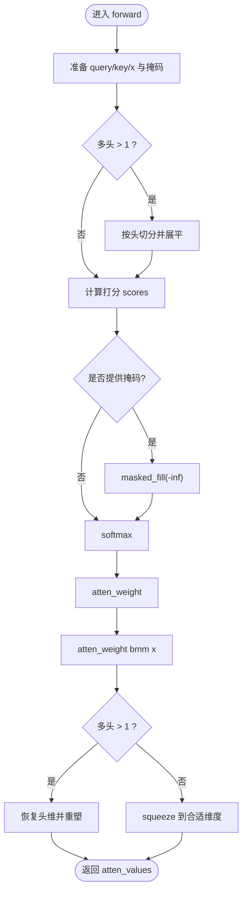
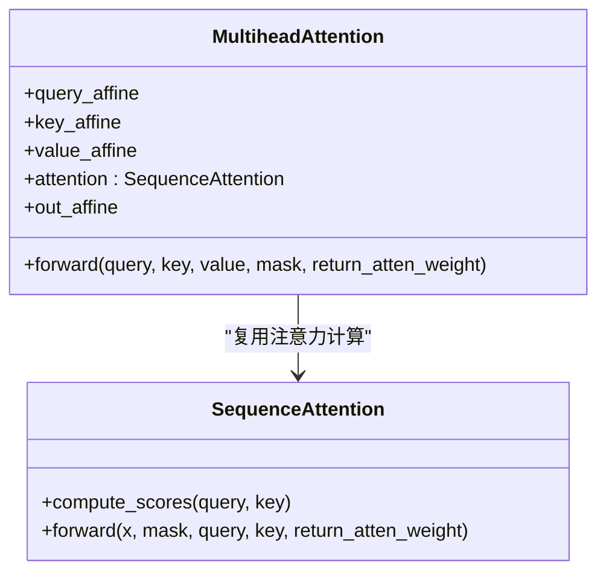
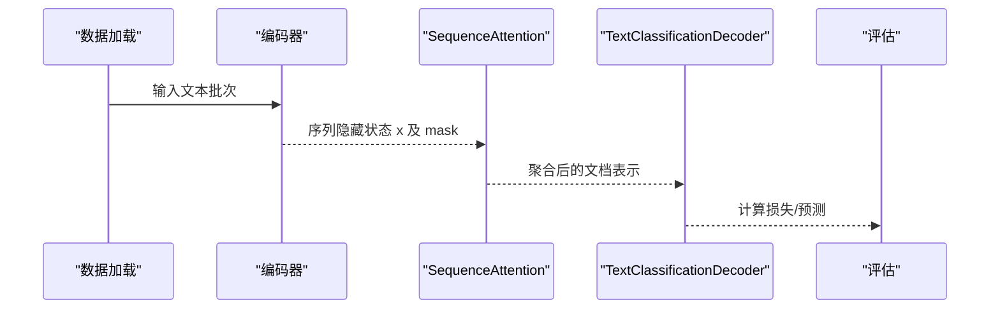
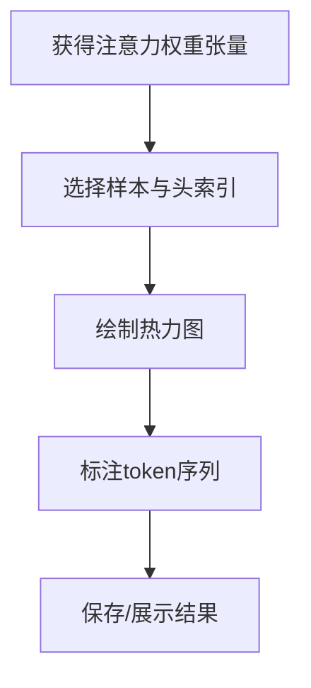
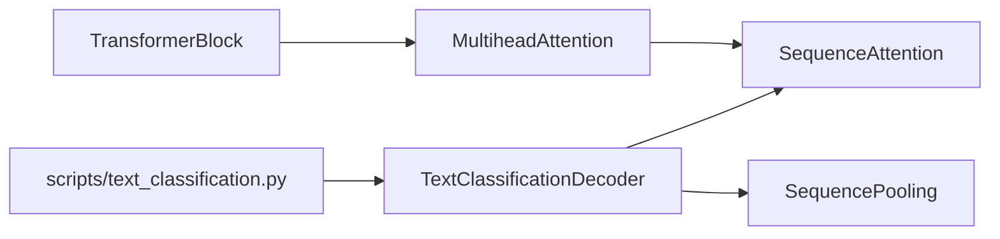

# 注意力机制实现

<cite>
**本文引用的文件**
- [attention.py](file://eznlp/nn/modules/attention.py)
- [text_classification.py](file://eznlp/model/decoder/text_classification.py)
- [text_classification.md](file://docs/text-classification.md)
- [test_attention.py](file://tests/nn/test_attention.py)
- [aggregation.py](file://eznlp/nn/modules/aggregation.py)
- [block.py](file://eznlp/nn/modules/block.py)
- [__init__.py](file://eznlp/nn/modules/__init__.py)
- [text_classification.py](file://scripts/text_classification.py)
</cite>

## 目录
1. [引言](#引言)
2. [项目结构](#项目结构)
3. [核心组件](#核心组件)
4. [架构总览](#架构总览)
5. [详细组件分析](#详细组件分析)
6. [依赖分析](#依赖分析)
7. [性能考虑](#性能考虑)
8. [故障排查指南](#故障排查指南)
9. [结论](#结论)
10. [附录](#附录)

## 引言
本文件系统性阐述eznlp中注意力机制的技术实现，围绕SequenceAttention模块解析加性注意力、乘性注意力与自注意力的数学原理与代码实现差异；说明在文本分类任务中，注意力权重如何通过softmax归一化生成，并用于加权聚合LSTM或BERT输出的隐藏状态；结合LSTM+Attention在IMDb数据集上的准确率提升案例，解释注意力机制如何捕捉关键句子片段，并提供注意力权重矩阵的可视化方法以增强模型解释性。

## 项目结构
与注意力机制直接相关的核心文件分布如下：
- 模块定义：eznlp/nn/modules/attention.py（包含SequenceAttention与MultiheadAttention）
- 文本分类解码器：eznlp/model/decoder/text_classification.py（使用SequenceAttention进行序列聚合）
- 测试用例：tests/nn/test_attention.py（覆盖多种打分模式与多头配置）
- 序列池化与聚合：eznlp/nn/modules/aggregation.py（提供多种序列聚合方式）
- Transformer块：eznlp/nn/modules/block.py（包含自注意力与交叉注意力的组合块）
- 命令行脚本：scripts/text_classification.py（提供文本分类训练入口与聚合模式参数）

图表来源
- [attention.py](file://eznlp/nn/modules/attention.py#L9-L231)
- [text_classification.py](file://eznlp/model/decoder/text_classification.py#L79-L116)
- [aggregation.py](file://eznlp/nn/modules/aggregation.py#L1-L106)
- [block.py](file://eznlp/nn/modules/block.py#L112-L262)
- [text_classification.py](file://scripts/text_classification.py#L57-L64)

章节来源
- [attention.py](file://eznlp/nn/modules/attention.py#L9-L231)
- [text_classification.py](file://eznlp/model/decoder/text_classification.py#L79-L116)
- [aggregation.py](file://eznlp/nn/modules/aggregation.py#L1-L106)
- [block.py](file://eznlp/nn/modules/block.py#L112-L262)
- [text_classification.py](file://scripts/text_classification.py#L57-L64)

## 核心组件
- SequenceAttention：支持多种打分策略（点积、缩放点积、乘性、加性、双线性），可选外部查询向量或内部参数化查询，支持多头并行计算，最终输出加权聚合后的隐藏表示与可选的注意力权重张量。
- MultiheadAttention：对输入进行仿射投影后复用SequenceAttention，实现多头注意力输出与可选的注意力权重返回。
- TextClassificationDecoder：在文本分类场景中，根据配置选择“池化”或“注意力”聚合模式，将序列隐藏状态压缩为文档级表示，再映射到类别logits。
- SequencePooling：提供均值、最大值、最小值、加权均值、RNN末态等序列聚合方式，作为注意力之外的替代方案。
- Transformer块：在编码器/解码器中集成自注意力与交叉注意力，便于构建更复杂的上下文建模。

章节来源
- [attention.py](file://eznlp/nn/modules/attention.py#L9-L231)
- [attention.py](file://eznlp/nn/modules/attention.py#L235-L297)
- [text_classification.py](file://eznlp/model/decoder/text_classification.py#L79-L116)
- [aggregation.py](file://eznlp/nn/modules/aggregation.py#L1-L106)
- [block.py](file://eznlp/nn/modules/block.py#L112-L262)

## 架构总览
下图展示文本分类任务中注意力参与的关键路径：编码器产生序列隐藏状态，解码器通过SequenceAttention或SequencePooling进行序列聚合，得到文档级表示，最后经线性层得到分类logits。

图表来源
- [attention.py](file://eznlp/nn/modules/attention.py#L156-L230)
- [text_classification.py](file://eznlp/model/decoder/text_classification.py#L79-L116)

## 详细组件分析

### SequenceAttention：数学原理与实现差异
- 打分策略
  - 点积（Dot）：query与key的矩阵乘，适合维度一致且已归一化的情况。
  - 缩放点积（Scaled_Dot）：在点积基础上除以维度开方，缓解大维度下内积过大导致softmax饱和的问题。
  - 乘性（Multiplicative）：对key进行线性投影后再与query做矩阵乘，引入可学习变换。
  - 加性（Additive）：拼接query与key后经非线性投影再求内积，具备更强的表达能力。
  - 双线性（Biaffine）：分别对query与key进行仿射变换后相加再激活，形成双线性打分。
- 多头机制
  - 将通道维按头数切分，分别计算注意力，再拼接并线性变换合并头间信息。
- 掩码与归一化
  - 支持二维或三维掩码；多头时掩码重复到各头；对打分矩阵进行masked_fill后softmax归一化。
- 输出
  - 返回加权聚合后的隐藏表示；当return_atten_weight=True时同时返回注意力权重张量，便于可视化。

图表来源
- [attention.py](file://eznlp/nn/modules/attention.py#L156-L230)

章节来源
- [attention.py](file://eznlp/nn/modules/attention.py#L9-L231)

### MultiheadAttention：自注意力的封装
- 对query/key/value分别进行仿射投影，然后调用SequenceAttention完成多头注意力计算，最后线性变换得到输出。
- 该模块常用于Transformer编码器/解码器块中，实现自注意力与交叉注意力。

图表来源
- [attention.py](file://eznlp/nn/modules/attention.py#L235-L297)
- [attention.py](file://eznlp/nn/modules/attention.py#L9-L231)

章节来源
- [attention.py](file://eznlp/nn/modules/attention.py#L235-L297)

### 文本分类中的注意力聚合
- 解码器根据配置选择聚合模式：
  - “xxx_pooling”：使用SequencePooling进行均值/最大值等池化。
  - “xxx_attention”：使用SequenceAttention进行注意力加权聚合。
- 在IMDb等数据集上，LSTM+Attention相比LSTM+MaxPooling能带来约0.5个百分点的准确率提升，表明注意力能够有效聚焦关键片段。

图表来源
- [text_classification.py](file://eznlp/model/decoder/text_classification.py#L79-L116)
- [text_classification.md](file://docs/text-classification.md#L21-L28)

章节来源
- [text_classification.py](file://eznlp/model/decoder/text_classification.py#L79-L116)
- [text_classification.md](file://docs/text-classification.md#L21-L28)

### 注意力权重矩阵可视化
- SequenceAttention在return_atten_weight=True时会返回注意力权重张量，形状通常为(batch, query_step, key_step)或(batch, num_heads, query_step, key_step)。
- 可视化建议：
  - 使用热力图展示每条样本的注意力权重矩阵，突出query对key的注意力分布。
  - 对多头情况，可分别显示各头的权重矩阵，观察不同子空间的关注焦点。
  - 结合原始token序列，标注高权重位置，帮助理解模型关注的关键词或短语。

图表来源
- [attention.py](file://eznlp/nn/modules/attention.py#L190-L218)
- [test_attention.py](file://tests/nn/test_attention.py#L8-L30)

章节来源
- [attention.py](file://eznlp/nn/modules/attention.py#L190-L218)
- [test_attention.py](file://tests/nn/test_attention.py#L8-L30)

## 依赖分析
- 组件耦合
  - TextClassificationDecoder依赖SequenceAttention/SequencePooling进行序列聚合。
  - SequenceAttention与MultiheadAttention共享相同的打分与归一化逻辑，后者通过仿射层扩展至多头。
  - Transformer块在编码器/解码器中复用MultiheadAttention，形成自注意力与交叉注意力的组合。
- 外部依赖
  - 命令行脚本提供聚合模式参数（如“multiplicative_attention”），驱动解码器选择对应聚合策略。

图表来源
- [text_classification.py](file://eznlp/model/decoder/text_classification.py#L79-L116)
- [attention.py](file://eznlp/nn/modules/attention.py#L9-L231)
- [attention.py](file://eznlp/nn/modules/attention.py#L235-L297)
- [block.py](file://eznlp/nn/modules/block.py#L112-L262)
- [text_classification.py](file://scripts/text_classification.py#L57-L64)

章节来源
- [text_classification.py](file://eznlp/model/decoder/text_classification.py#L79-L116)
- [attention.py](file://eznlp/nn/modules/attention.py#L9-L231)
- [attention.py](file://eznlp/nn/modules/attention.py#L235-L297)
- [block.py](file://eznlp/nn/modules/block.py#L112-L262)
- [text_classification.py](file://scripts/text_classification.py#L57-L64)

## 性能考虑
- 多头并行：通过将通道维切分为多个头并行计算，显著提升吞吐；注意内存占用与显存限制。
- 掩码广播：在多头场景下需将掩码重复到各头，避免额外循环开销。
- softmax稳定性：缩放点积可缓解数值问题；掩码填充使用负无穷确保权重为零。
- 训练效率：注意力权重可选返回，仅在需要可视化或调试时启用，避免不必要的计算。

## 故障排查指南
- 掩码形状不匹配
  - 现象：报错提示掩码维度不一致。
  - 处理：确认掩码为(batch, key_step)或(batch, query_step, key_step)，并在多头时正确广播。
- 维度断言失败
  - 现象：在乘性/加性/双线性模式下断言query_dim==key_dim或通道可被num_heads整除。
  - 处理：调整key_dim/query_dim或num_heads，确保满足约束。
- 多头注意力权重形状异常
  - 现象：返回权重形状与期望不符。
  - 处理：检查return_atten_weight是否开启以及多头展开/还原逻辑是否正确。
- 预期外的零权重
  - 现象：掩码位置出现非零权重。
  - 处理：确认masked_fill使用的是负无穷，且softmax前已屏蔽无效位置。

章节来源
- [attention.py](file://eznlp/nn/modules/attention.py#L58-L88)
- [attention.py](file://eznlp/nn/modules/attention.py#L133-L154)
- [attention.py](file://eznlp/nn/modules/attention.py#L190-L218)
- [test_attention.py](file://tests/nn/test_attention.py#L8-L30)

## 结论
eznlp的注意力实现以SequenceAttention为核心，覆盖点积、缩放点积、乘性、加性与双线性五种打分策略，并通过MultiheadAttention实现多头并行。在文本分类任务中，注意力聚合显著优于传统池化策略，IMDb等数据集上的实验证明了其有效性。通过返回注意力权重张量，可进行可视化分析，提升模型解释性与可调试性。

## 附录
- 命令行参数
  - --agg_mode：指定聚合模式，例如“multiplicative_attention”。
- 数据集与准确率
  - IMDb：LSTM+Attention相较LSTM+MaxPooling有约0.5个百分点的提升。

章节来源
- [text_classification.py](file://scripts/text_classification.py#L57-L64)
- [text_classification.md](file://docs/text-classification.md#L21-L28)