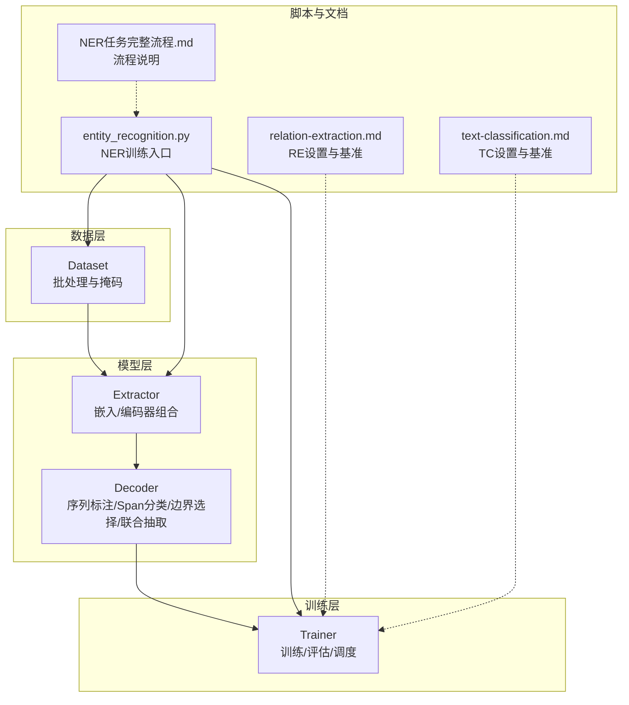
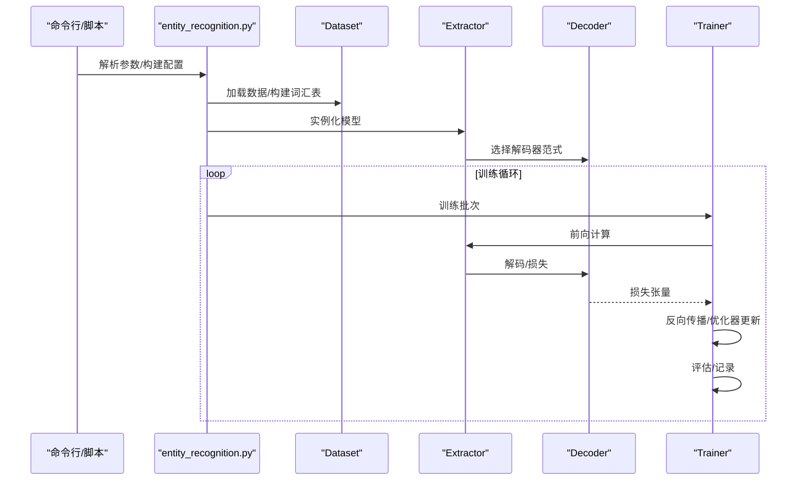
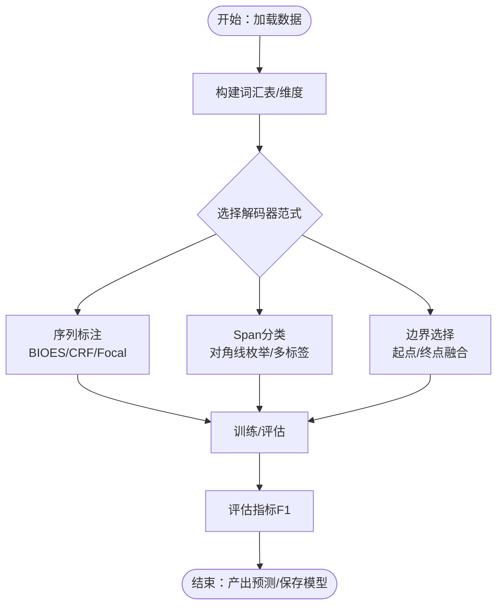
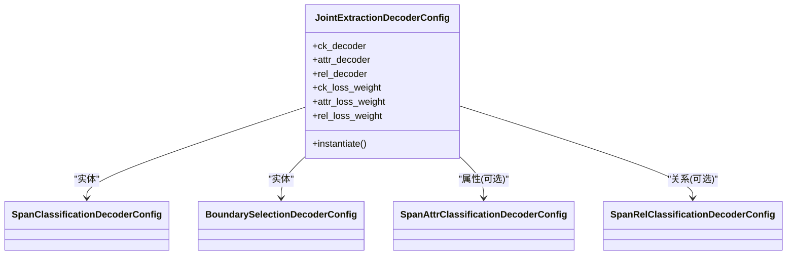
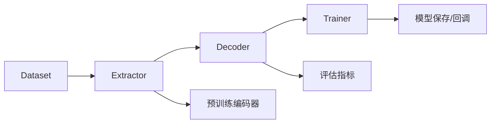

# 特定任务详解

<cite>
**本文引用的文件**
- [NER任务完整流程.md](file://docs/NER任务完整流程.md)
- [relation-extraction.md](file://docs/relation-extraction.md)
- [text-classification.md](file://docs/text-classification.md)
- [sequence_tagging.py](file://eznlp/model/decoder/sequence_tagging.py)
- [span_classification.py](file://eznlp/model/decoder/span_classification.py)
- [boundary_selection.py](file://eznlp/model/decoder/boundary_selection.py)
- [joint_extraction.py](file://eznlp/model/decoder/joint_extraction.py)
- [text_classification.py](file://eznlp/model/decoder/text_classification.py)
- [extractor.py](file://eznlp/model/model/extractor.py)
- [entity_recognition.py](file://scripts/entity_recognition.py)
- [dataset.py](file://eznlp/dataset.py)
- [trainer.py](file://eznlp/training/trainer.py)
- [chunk.py](file://eznlp/utils/chunk.py)
</cite>

## 目录
1. [引言](#引言)
2. [项目结构](#项目结构)
3. [核心组件](#核心组件)
4. [架构总览](#架构总览)
5. [详细组件分析](#详细组件分析)
6. [依赖分析](#依赖分析)
7. [性能考虑](#性能考虑)
8. [故障排查指南](#故障排查指南)
9. [结论](#结论)
10. [附录](#附录)

## 引言
本指南面向需要在eznlp框架中落地NLP任务的工程师与研究者，围绕命名实体识别（NER）、关系抽取（RE）与文本分类（Text Classification）三类任务，系统梳理从数据准备、模型配置、训练到评估的全流程，并给出各任务的范式对比、最佳实践、典型配置模板与性能参考，帮助读者在不同场景下选择最优方案。

## 项目结构
eznlp采用“配置驱动 + 解码器可插拔”的架构设计：
- 数据层：统一的Dataset与Batch抽象，负责数据装载、批处理与掩码构造
- 模型层：Extractor作为主干，支持嵌入层、中间编码器与预训练编码器的组合；解码器按任务类型可选序列标注、Span分类、边界选择、联合抽取等
- 训练层：Trainer封装训练循环、梯度累积、学习率调度、混合精度与评估回调
- 文档与脚本：提供任务流程文档、关系抽取与文本分类的设置与基准、实体识别训练脚本

图表来源
- [dataset.py](file://eznlp/dataset.py#L1-L115)
- [extractor.py](file://eznlp/model/model/extractor.py#L23-L121)
- [trainer.py](file://eznlp/training/trainer.py#L15-L120)
- [entity_recognition.py](file://scripts/entity_recognition.py#L504-L596)
- [NER任务完整流程.md](file://docs/NER任务完整流程.md#L1-L120)

章节来源
- [dataset.py](file://eznlp/dataset.py#L1-L115)
- [extractor.py](file://eznlp/model/model/extractor.py#L23-L121)
- [trainer.py](file://eznlp/training/trainer.py#L15-L120)
- [entity_recognition.py](file://scripts/entity_recognition.py#L504-L596)
- [NER任务完整流程.md](file://docs/NER任务完整流程.md#L1-L120)

## 核心组件
- 解码器家族
  - 序列标注解码器：支持BIOES/BIO2标注方案与CRF条件随机场
  - Span分类解码器：基于对角线枚举的span聚合与分类，支持多标签与边界平滑
  - 边界选择解码器：双线性/仿射融合头，显式建模起点与终点的联合得分
  - 联合抽取解码器：可同时输出实体、属性与关系，支持权重平衡
  - 文本分类解码器：支持池化/注意力聚合与多标签分类
- 模型配置
  - ExtractorConfig：统一管理嵌入层（OneHot/MultiHot/SoftLexicon/专家字典）、中间编码器、预训练编码器与解码器
- 训练器
  - Trainer：封装前向、反向、梯度累积、混合精度、学习率调度与周期性评估

章节来源
- [sequence_tagting.py](file://eznlp/model/decoder/sequence_tagging.py#L93-L198)
- [span_classification.py](file://eznlp/model/decoder/span_classification.py#L27-L161)
- [boundary_selection.py](file://eznlp/model/decoder/boundary_selection.py#L92-L200)
- [joint_extraction.py](file://eznlp/model/decoder/joint_extraction.py#L68-L153)
- [text_classification.py](file://eznlp/model/decoder/text_classification.py#L48-L117)
- [extractor.py](file://eznlp/model/model/extractor.py#L23-L121)
- [trainer.py](file://eznlp/training/trainer.py#L15-L120)

## 架构总览
下图展示NER任务从数据到模型再到训练的整体流程，映射到实际源码模块。

图表来源
- [entity_recognition.py](file://scripts/entity_recognition.py#L727-L805)
- [dataset.py](file://eznlp/dataset.py#L92-L115)
- [extractor.py](file://eznlp/model/model/extractor.py#L205-L210)
- [trainer.py](file://eznlp/training/trainer.py#L221-L376)

章节来源
- [entity_recognition.py](file://scripts/entity_recognition.py#L727-L805)
- [dataset.py](file://eznlp/dataset.py#L92-L115)
- [extractor.py](file://eznlp/model/model/extractor.py#L205-L210)
- [trainer.py](file://eznlp/training/trainer.py#L221-L376)

## 详细组件分析

### 命名实体识别（NER）：范式对比与流程
- 三种主流范式
  - 序列标注（Sequence Tagging）
    - 特点：逐token标注，支持CRF约束全局一致性
    - 关键配置：标注方案（BIOES/BIO2）、是否使用CRF、Focal Loss参数
    - 适用场景：标注规范统一、实体边界清晰
  - Span分类（Span Classification）
    - 特点：对所有可能span进行分类，支持多标签与置信阈值过滤
    - 关键配置：最大span长度、聚合模式（max_pooling/attention）、边界平滑、内部/外部实体正则化
    - 适用场景：重叠实体较多、需显式控制span规模
  - 边界选择（Boundary Selection）
    - 特点：分别建模起点与终点的表示，通过双线性/仿射融合得到联合得分
    - 关键配置：起点/终点降维网络、大小嵌入、负采样策略、优先级排序
    - 适用场景：长距离依赖、复杂上下文交互
- 流程要点（参考NER任务完整流程）
  - 数据准备：支持CoNLL等格式，TokenSequence承载文本与实体标注
  - 模型配置：ExtractorConfig统一装配嵌入层、中间编码器与解码器
  - 训练与评估：Trainer周期性评估，支持微调与预训练编码器
  - 结果收集：实验结果保存于cache目录，便于批量实验与复盘

图表来源
- [NER任务完整流程.md](file://docs/NER任务完整流程.md#L1-L120)
- [sequence_tagging.py](file://eznlp/model/decoder/sequence_tagging.py#L93-L198)
- [span_classification.py](file://eznlp/model/decoder/span_classification.py#L163-L344)
- [boundary_selection.py](file://eznlp/model/decoder/boundary_selection.py#L201-L384)
- [extractor.py](file://eznlp/model/model/extractor.py#L23-L121)

章节来源
- [NER任务完整流程.md](file://docs/NER任务完整流程.md#L1-L120)
- [sequence_tagging.py](file://eznlp/model/decoder/sequence_tagging.py#L93-L198)
- [span_classification.py](file://eznlp/model/decoder/span_classification.py#L163-L344)
- [boundary_selection.py](file://eznlp/model/decoder/boundary_selection.py#L201-L384)
- [extractor.py](file://eznlp/model/model/extractor.py#L23-L121)

#### 序列标注解码器（Sequence Tagging）
- 核心机制
  - 标注方案切换与标签到chunks转换
  - 可选CRF或交叉熵损失，支持Focal Loss
  - 解码阶段将标签序列还原为实体块
- 关键接口路径
  - 解码器配置与实例化：[SequenceTaggingDecoderConfig.instantiate](file://eznlp/model/decoder/sequence_tagging.py#L139-L141)
  - 前向与损失计算：[SequenceTaggingDecoder.forward](file://eznlp/model/decoder/sequence_tagging.py#L157-L179)
  - 解码与实体块提取：[SequenceTaggingDecoder.decode](file://eznlp/model/decoder/sequence_tagging.py#L195-L198)

章节来源
- [sequence_tagging.py](file://eznlp/model/decoder/sequence_tagging.py#L93-L198)

#### Span分类解码器（Span Classification）
- 核心机制
  - 对角线枚举所有可能span，聚合后分类
  - 多标签支持与置信阈值过滤
  - 可选边界平滑与内部/外部实体正则化
- 关键接口路径
  - 配置与词汇构建：[SpanClassificationDecoderConfig.build_vocab](file://eznlp/model/decoder/span_classification.py#L99-L159)
  - 前向与损失：[SpanClassificationDecoder.forward](file://eznlp/model/decoder/span_classification.py#L264-L296)
  - 解码与过滤：[SpanClassificationDecoder.decode](file://eznlp/model/decoder/span_classification.py#L297-L344)

章节来源
- [span_classification.py](file://eznlp/model/decoder/span_classification.py#L27-L161)
- [span_classification.py](file://eznlp/model/decoder/span_classification.py#L163-L344)

#### 边界选择解码器（Boundary Selection）
- 核心机制
  - 分别对起点与终点做降维表示，再通过双线性/仿射融合得到联合得分
  - 支持大小嵌入、负采样与优先级排序
- 关键接口路径
  - 配置与词汇构建：[BoundarySelectionDecoderConfig.build_vocab](file://eznlp/model/decoder/boundary_selection.py#L167-L199)
  - 得分计算与前向：[BoundarySelectionDecoder.compute_scores](file://eznlp/model/decoder/boundary_selection.py#L257-L306)
  - 解码与过滤：[BoundarySelectionDecoder.decode](file://eznlp/model/decoder/boundary_selection.py#L325-L384)

章节来源
- [boundary_selection.py](file://eznlp/model/decoder/boundary_selection.py#L92-L200)
- [boundary_selection.py](file://eznlp/model/decoder/boundary_selection.py#L201-L384)

#### 联合抽取解码器（Joint Extraction）
- 组合多个子解码器（实体/属性/关系），共享编码状态并加权求和总损失
- 支持权重平衡与链式赋值（先实体再属性/关系）
- 关键接口路径
  - 组合配置与实例化：[JointExtractionDecoderConfig.instantiate](file://eznlp/model/decoder/joint_extraction.py#L150-L152)
  - 前向与解码：[JointExtractionDecoder.forward](file://eznlp/model/decoder/joint_extraction.py#L166-L179)、[JointExtractionDecoder.decode](file://eznlp/model/decoder/joint_extraction.py#L180-L193)

章节来源
- [joint_extraction.py](file://eznlp/model/decoder/joint_extraction.py#L68-L153)
- [joint_extraction.py](file://eznlp/model/decoder/joint_extraction.py#L154-L193)

### 关系抽取（RE）：联合抽取与管道式抽取
- 管道式抽取（Pipeline）
  - 先用实体识别模型得到候选实体，再用关系分类模型判断实体对关系
  - 优点：模块化清晰、易于调试；缺点：错误传播、整体性能受限
- 联合抽取（Joint）
  - 在同一模型中同时预测实体与关系，共享编码表示，端到端优化
  - 优点：减少错误传播、整体性能更优；缺点：模型复杂度更高
- 模型配置方法（以Span-based为例）
  - 实体识别：Span分类/边界选择解码器
  - 属性抽取：Span属性分类解码器（可选）
  - 关系抽取：Span关系分类解码器（可选），支持对称关系补全、逆关系处理
- 典型配置模板
  - 联合抽取配置：实体解码器（Span分类/边界选择）、关系解码器（Span关系分类）、属性解码器（可选）
  - 训练设置：AdamW优化器、warmup+线性衰减、预训练编码器dropout、类别不平衡处理（如Focal/SoftLabel）

图表来源
- [joint_extraction.py](file://eznlp/model/decoder/joint_extraction.py#L68-L153)
- [span_classification.py](file://eznlp/model/decoder/span_classification.py#L27-L161)
- [boundary_selection.py](file://eznlp/model/decoder/boundary_selection.py#L92-L200)
- [span_attr_classification.py](file://eznlp/model/decoder/span_attr_classification.py#L91-L193)
- [span_rel_classification.py](file://eznlp/model/decoder/span_rel_classification.py#L156-L317)

章节来源
- [relation-extraction.md](file://docs/relation-extraction.md#L1-L49)
- [joint_extraction.py](file://eznlp/model/decoder/joint_extraction.py#L68-L153)
- [span_attr_classification.py](file://eznlp/model/decoder/span_attr_classification.py#L91-L193)
- [span_rel_classification.py](file://eznlp/model/decoder/span_rel_classification.py#L156-L317)

### 文本分类（TC）：单标签与多标签
- 单标签分类
  - 解码器：分类头+交叉熵损失，评估指标为准确率
  - 适用场景：情感分析、新闻分类等
- 多标签分类
  - 解码器：多标签分类头+BCEWithLogitsLoss，支持置信阈值过滤
  - 适用场景：细粒度标签、标签间无互斥关系
- 典型配置模板
  - 聚合方式：最大池化/注意力
  - 优化器：AdamW（含微调学习率）
  - 预处理：可选预训练编码器、dropout与warmup

章节来源
- [text_classification.py](file://eznlp/model/decoder/text_classification.py#L48-L117)
- [text-classification.md](file://docs/text-classification.md#L1-L93)

## 依赖分析
- 组件耦合
  - Dataset与Extractor通过exemplify/batchify对接，统一数据流
  - Trainer与Decoder解耦，通过forward返回损失或(损失, y_pred)，支持多指标评估
  - JointExtractionDecoder将实体解码器的预测结果注入属性/关系解码器，形成链式依赖
- 外部依赖
  - 预训练编码器（BERT-like/ELMo/Flair）通过ExtractorConfig装配
  - 训练器支持混合精度与梯度裁剪，提升稳定性与收敛速度

图表来源
- [dataset.py](file://eznlp/dataset.py#L92-L115)
- [extractor.py](file://eznlp/model/model/extractor.py#L23-L121)
- [trainer.py](file://eznlp/training/trainer.py#L15-L120)

章节来源
- [dataset.py](file://eznlp/dataset.py#L92-L115)
- [extractor.py](file://eznlp/model/model/extractor.py#L23-L121)
- [trainer.py](file://eznlp/training/trainer.py#L15-L120)

## 性能考虑
- 训练稳定性
  - 混合精度与梯度裁剪：Trainer默认启用GradScaler与clip_grad_norm
  - 学习率调度：Warmup+线性衰减，ReduceLROnPlateau自适应调整
- 模型效率
  - 解码器选择：Span-based通常在长序列上更高效；CRF在小数据集上提升有限
  - 负采样与边界平滑：降低训练成本、缓解类别不平衡
- 数据层面
  - Overlap级别检测与冲突过滤：避免过拟合与评估偏差
  - 长序列处理：必要时拆句/分段，避免内存溢出

章节来源
- [trainer.py](file://eznlp/training/trainer.py#L15-L120)
- [span_classification.py](file://eznlp/model/decoder/span_classification.py#L163-L344)
- [boundary_selection.py](file://eznlp/model/decoder/boundary_selection.py#L201-L384)
- [chunk.py](file://eznlp/utils/chunk.py#L51-L80)

## 故障排查指南
- 训练不收敛/震荡
  - 检查学习率与warmup步数、梯度裁剪阈值
  - 确认损失函数与标签分布（多标签需BCEWithLogitsLoss）
- 实体重叠导致评估异常
  - 使用overlap级别检测与冲突过滤函数
- 预训练编码器适配问题
  - 确认tokenizer与模型最大长度一致，必要时开启truecase/子词分词
- 推理速度慢
  - 减少max_span_size、关闭不必要的嵌入或降维层、使用更小batch

章节来源
- [trainer.py](file://eznlp/training/trainer.py#L121-L220)
- [chunk.py](file://eznlp/utils/chunk.py#L51-L80)
- [entity_recognition.py](file://scripts/entity_recognition.py#L599-L705)

## 结论
eznlp为NER、RE与TC任务提供了统一而灵活的实现框架。通过可插拔的解码器与配置化的模型装配，用户可在不同范式与任务组合之间快速切换。建议在小数据集优先尝试序列标注+CRF，在复杂重叠场景采用Span分类/边界选择，并在需要端到端优化时采用联合抽取。配合合理的训练设置与评估策略，可在不同数据集上获得稳定且有竞争力的性能。

## 附录
- 典型配置模板（路径指引）
  - 序列标注：[SequenceTaggingDecoderConfig](file://eznlp/model/decoder/sequence_tagging.py#L93-L141)
  - Span分类：[SpanClassificationDecoderConfig](file://eznlp/model/decoder/span_classification.py#L27-L161)
  - 边界选择：[BoundarySelectionDecoderConfig](file://eznlp/model/decoder/boundary_selection.py#L92-L200)
  - 联合抽取：[JointExtractionDecoderConfig](file://eznlp/model/decoder/joint_extraction.py#L68-L153)
  - 文本分类：[TextClassificationDecoderConfig](file://eznlp/model/decoder/text_classification.py#L48-L77)
  - 模型装配：[ExtractorConfig](file://eznlp/model/model/extractor.py#L23-L121)
  - 训练入口：[entity_recognition.py](file://scripts/entity_recognition.py#L504-L596)
  - 训练循环：[Trainer.train_steps](file://eznlp/training/trainer.py#L221-L376)