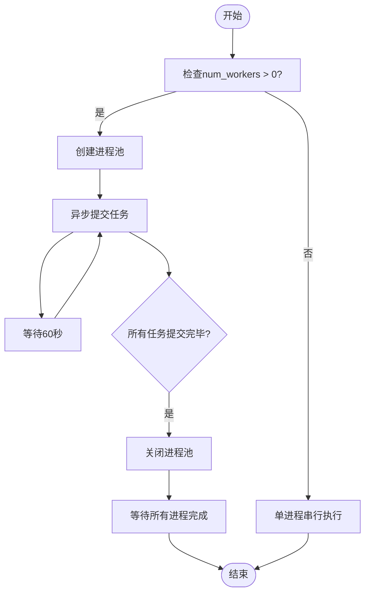

# 实验执行调度

<cite>
**本文档引用的文件**   
- [exp_launcher.py](file://scripts/exp_launcher.py)
- [with_bert.opt](file://scripts/options/with_bert.opt)
- [without_bert.opt](file://scripts/options/without_bert.opt)
- [text_classification.py](file://scripts/text_classification.py)
- [text2text.py](file://scripts/text2text.py)
- [image2text.py](file://scripts/image2text.py)
- [options.py](file://eznlp/training/options.py)
</cite>

## 目录
1. [简介](#简介)
2. [实验调度机制](#实验调度机制)
3. [命令构建过程](#命令构建过程)
4. [多进程管理](#多进程管理)
5. [子进程执行](#子进程执行)
6. [并发度控制](#并发度控制)
7. [日志优化策略](#日志优化策略)

## 简介
本文档详细阐述了批量实验的执行调度机制，包括单进程串行执行与多进程并行执行两种模式的选择逻辑。解析了COMMAND字符串的构建过程，说明了如何根据任务、数据集、随机种子以及是否使用BERT等条件动态组合基础命令，并通过@符号引入外部选项文件（如with_bert.opt）进行配置注入。重点描述了multiprocessing.Pool在多进程管理中的应用，包括进程池的创建、apply_async异步任务提交以及time.sleep(60)用于设备资源协调的必要性。解释了subprocess.check_call如何安全地调用外部Python脚本并捕获执行结果。说明了num_workers参数对并发度的控制作用，以及no_log_terminal选项在多进程环境下的日志优化策略。

## 实验调度机制

该系统实现了灵活的批量实验调度机制，支持单进程串行执行和多进程并行执行两种模式。调度逻辑的核心在于根据`num_workers`参数的值来决定执行策略：当`num_workers`小于等于0时，系统采用单进程串行模式；当`num_workers`大于0时，系统采用多进程并行模式。

在单进程模式下，系统会依次执行每个实验命令，确保资源的有序使用。而在多进程模式下，系统利用Python的multiprocessing模块创建进程池，实现多个实验的并行执行，从而显著提高实验效率。这种设计使得用户可以根据可用计算资源和实验需求灵活选择执行模式。

**Section sources**
- [exp_launcher.py](file://scripts/exp_launcher.py#L254-L267)

## 命令构建过程

实验命令的构建是一个动态组合过程，基于多个关键参数进行配置。基础命令由任务名称、数据集名称和随机种子构成，形成如`python scripts/{task}.py --dataset {dataset} --seed {seed}`的基本结构。

命令构建的关键特性在于条件性配置注入。系统根据`use_bert`参数的值决定是否使用BERT相关配置：当`use_bert`为True时，系统会注入`@scripts/options/with_bert.opt`文件；否则注入`@scripts/options/without_bert.opt`文件。这种通过@符号引入外部选项文件的机制实现了配置的模块化管理。

此外，对于特定任务类型（如text2text、image2text），系统会自动注入相应的架构配置文件（如tf2text.opt、rnn2text.opt），确保不同任务类型使用最适合的模型架构和超参数设置。

**Section sources**
- [exp_launcher.py](file://scripts/exp_launcher.py#L52-L61)
- [exp_launcher.py](file://scripts/exp_launcher.py#L217-L234)

## 多进程管理

系统采用Python的multiprocessing.Pool进行多进程管理，实现了高效的并行执行能力。当`num_workers`参数大于0时，系统会创建一个指定大小的进程池，用于管理并发执行的实验任务。

进程池的创建和管理遵循标准的Python多进程模式：首先创建Pool实例，然后通过apply_async方法异步提交任务，最后调用close和join方法确保所有任务完成。特别值得注意的是，系统在每次提交任务后加入了`time.sleep(60)`的延迟，这是为了协调GPU等设备资源的分配，避免多个进程同时启动导致资源竞争和分配冲突。

这种设计确保了在多GPU环境下，每个进程能够有序地获取和使用计算资源，提高了实验执行的稳定性和可靠性。

**Diagram sources **
- [exp_launcher.py](file://scripts/exp_launcher.py#L259-L266)

**Section sources**
- [exp_launcher.py](file://scripts/exp_launcher.py#L259-L266)

## 子进程执行

系统使用subprocess.check_call来安全地调用外部Python脚本执行实验任务。这一机制确保了每个实验都在独立的Python进程中运行，实现了良好的隔离性。

`call_command`函数是子进程执行的核心，它接收命令字符串作为参数，将其分割成参数列表后传递给subprocess.check_call。该函数还集成了日志记录功能，在任务开始和结束时输出相应的日志信息，便于跟踪实验进度和调试问题。

使用subprocess.check_call而非subprocess.run的主要优势在于其行为特性：check_call会在子进程返回非零退出码时抛出CalledProcessError异常，这使得错误能够被及时捕获和处理，确保了实验执行的健壮性。

**Section sources**
- [exp_launcher.py](file://scripts/exp_launcher.py#L14-L17)

## 并发度控制

系统的并发度由`num_workers`参数精确控制，该参数决定了同时运行的进程数量。这一设计使得用户可以根据硬件资源（特别是GPU数量）和系统负载情况灵活调整并发级别。

当`num_workers`设置为0或负数时，系统进入单进程模式，所有实验按顺序执行，适用于资源有限或需要严格控制执行顺序的场景。当`num_workers`设置为正数时，系统启动相应数量的并行进程，最大化利用可用计算资源。

这种灵活的并发控制机制不仅提高了实验效率，还避免了因过度并发导致的资源耗尽问题，实现了性能和稳定性的平衡。

**Section sources**
- [exp_launcher.py](file://scripts/exp_launcher.py#L39-L40)
- [exp_launcher.py](file://scripts/exp_launcher.py#L254-L255)
- [exp_launcher.py](file://scripts/exp_launcher.py#L259-L260)

## 日志优化策略

在多进程环境下，系统的日志输出采用了特殊的优化策略以避免输出混乱。当`num_workers`大于0时，系统会自动在命令中添加`--no_log_terminal`选项，禁用终端日志输出。

这一策略的必要性在于：在多进程并行执行时，如果多个进程同时向终端输出日志，会导致输出内容交错混杂，难以阅读和分析。通过禁用终端日志，系统将日志统一写入各自的文件中，确保了日志的完整性和可读性。

同时，系统仍然保留了详细的日志记录功能，每个实验的执行信息会被记录到独立的文件中，便于后续的分析和调试。这种设计在保证日志清晰的同时，也不影响调试信息的完整性。

**Section sources**
- [exp_launcher.py](file://scripts/exp_launcher.py#L55-L56)