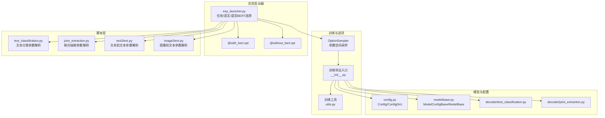
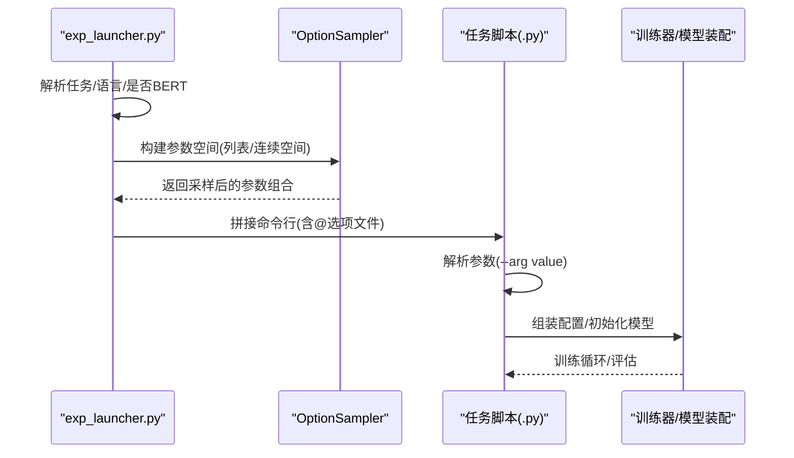
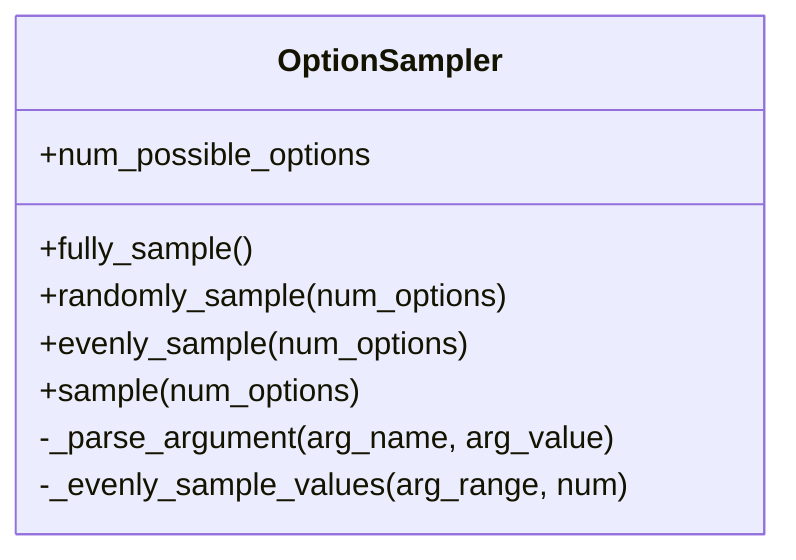
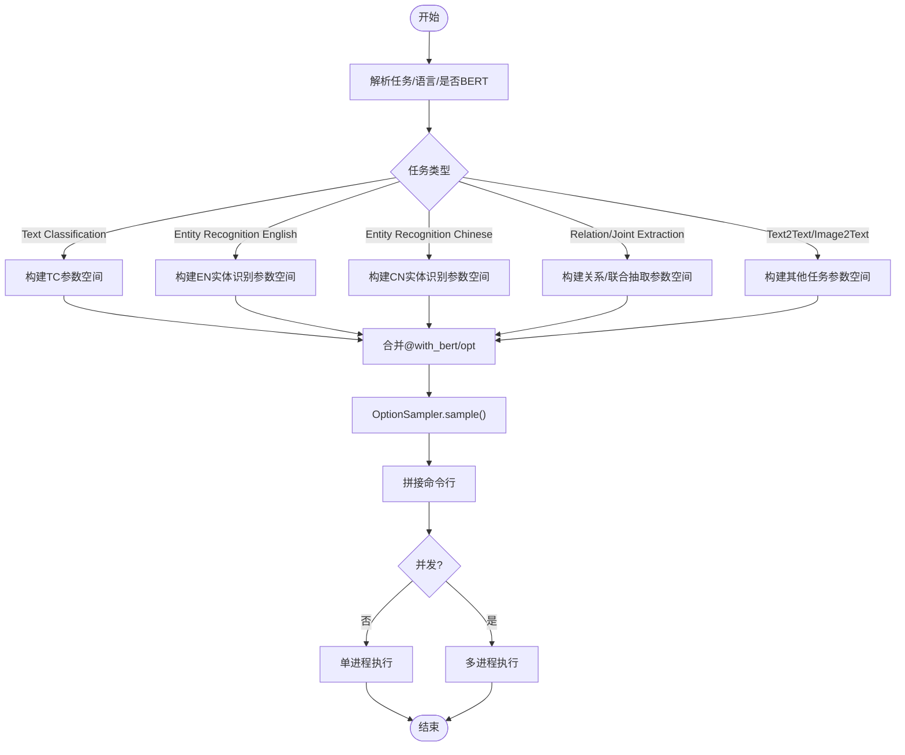
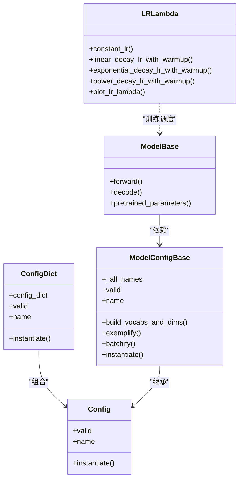
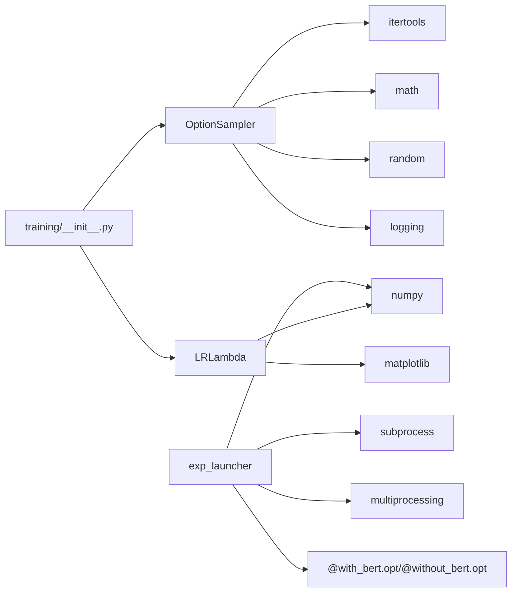

# 实验配置生成

<cite>
**本文引用的文件**
- [eznlp/training/options.py](file://eznlp/training/options.py)
- [scripts/exp_launcher.py](file://scripts/exp_launcher.py)
- [scripts/options/with_bert.opt](file://scripts/options/with_bert.opt)
- [scripts/options/without_bert.opt](file://scripts/options/without_bert.opt)
- [tests/training/test_options.py](file://tests/training/test_options.py)
- [eznlp/training/__init__.py](file://eznlp/training/__init__.py)
- [eznlp/config.py](file://eznlp/config.py)
- [eznlp/model/model/base.py](file://eznlp/model/model/base.py)
- [eznlp/model/decoder/text_classification.py](file://eznlp/model/decoder/text_classification.py)
- [eznlp/model/decoder/joint_extraction.py](file://eznlp/model/decoder/joint_extraction.py)
- [eznlp/training/utils.py](file://eznlp/training/utils.py)
</cite>

## 目录
1. [引言](#引言)
2. [项目结构](#项目结构)
3. [核心组件](#核心组件)
4. [架构总览](#架构总览)
5. [详细组件分析](#详细组件分析)
6. [依赖分析](#依赖分析)
7. [性能考虑](#性能考虑)
8. [故障排查指南](#故障排查指南)
9. [结论](#结论)
10. [附录](#附录)

## 引言
本文件围绕 OptionSampler 如何基于任务类型、数据集与模型需求生成多样化实验配置组合进行系统化解析。重点涵盖：
- 参数空间定义机制：学习率、优化器、批大小、BERT 架构等超参数的配置策略
- 面向不同任务（文本分类、命名实体识别、关系抽取等）的搜索空间差异
- 关键参数如 num_epochs、finetune_lr、ck_decoder 的作用与影响
- 使用列表定义候选值与 numpy.logspace 在连续数值空间采样的实践
- 结合 eznlp/training/options.py 中的配置类，阐明配置生成与模型训练系统的集成方式

## 项目结构
本仓库采用“按功能域分层”的组织方式，训练与选项采样位于 eznlp/training，实验启动器 scripts/exp_launcher.py 负责根据任务与语言动态构建 OptionSampler 并拼接命令行参数；脚本层 scripts/ 下的任务脚本负责解析参数并驱动模型装配与训练。

图表来源
- [eznlp/training/options.py](file://eznlp/training/options.py#L1-L98)
- [eznlp/training/__init__.py](file://eznlp/training/__init__.py#L1-L37)
- [scripts/exp_launcher.py](file://scripts/exp_launcher.py#L1-L267)
- [eznlp/config.py](file://eznlp/config.py#L1-L173)
- [eznlp/model/model/base.py](file://eznlp/model/model/base.py#L1-L99)
- [eznlp/model/decoder/text_classification.py](file://eznlp/model/decoder/text_classification.py#L42-L80)
- [eznlp/model/decoder/joint_extraction.py](file://eznlp/model/decoder/joint_extraction.py#L91-L192)
- [eznlp/training/utils.py](file://eznlp/training/utils.py#L1-L92)

章节来源
- [eznlp/training/options.py](file://eznlp/training/options.py#L1-L98)
- [scripts/exp_launcher.py](file://scripts/exp_launcher.py#L1-L267)

## 核心组件
- OptionSampler：统一的超参数采样器，支持完全穷举、随机采样与均匀采样，自动将参数范围转换为命令行参数字符串。
- exp_launcher：根据任务、数据集、语言与是否使用 BERT 动态构建 OptionSampler，并拼接命令行参数，支持多进程并发执行。
- 配置类体系：Config/ConfigDict 等用于描述模型与装配配置，配合 ModelConfigBase/ModelBase 完成配置校验与实例化。
- 训练工具：包含学习率调度函数族，支撑不同任务的训练策略。

章节来源
- [eznlp/training/options.py](file://eznlp/training/options.py#L1-L98)
- [eznlp/training/__init__.py](file://eznlp/training/__init__.py#L1-L37)
- [eznlp/config.py](file://eznlp/config.py#L1-L173)
- [eznlp/model/model/base.py](file://eznlp/model/model/base.py#L1-L99)
- [eznlp/training/utils.py](file://eznlp/training/utils.py#L1-L92)

## 架构总览
OptionSampler 作为“参数空间采样器”，被 exp_launcher 在不同任务分支下注入不同的参数范围，随后通过字符串拼接形成完整的命令行参数集合，交由训练脚本解析并驱动模型装配与训练。

图表来源
- [scripts/exp_launcher.py](file://scripts/exp_launcher.py#L1-L267)
- [eznlp/training/options.py](file://eznlp/training/options.py#L1-L98)

## 详细组件分析

### OptionSampler：参数空间定义与采样策略
- 参数空间定义
  - 支持单值、None、布尔、整数、浮点、字符串以及列表/元组形式的参数范围
  - 列表/元组中的元素必须为上述标量类型，否则抛出异常
  - 通过属性名映射到参数名，便于后续命令行拼接
- 采样策略
  - fully_sample：完全穷举所有参数组合
  - randomly_sample：从全集随机采样，避免重复组合
  - evenly_sample：在小样本场景下尽量均衡覆盖每个参数维度
  - sample：根据样本数量与参数组合总数的比值自动选择策略
- 命令行参数生成
  - _parse_argument：将参数值转换为 "--arg value" 或 "--arg" 形式
  - 对浮点数采用科学计数法格式化输出

图表来源
- [eznlp/training/options.py](file://eznlp/training/options.py#L1-L98)

章节来源
- [eznlp/training/options.py](file://eznlp/training/options.py#L1-L98)
- [tests/training/test_options.py](file://tests/training/test_options.py#L1-L38)

### 实验启动器：任务/语言/是否BERT驱动的参数空间构建
- 任务与语言分支
  - 文本分类：非BERT时以 SGD 为主，BERT时以 AdamW/线性衰减+预热为主
  - 英文实体识别：非BERT可选 ELMo/Flair，BERT时支持多种 BERT 变体
  - 中文实体识别：非BERT偏向 AdamW/Adamax，BERT时支持 MacBERT/ERNIE 等
  - 关系抽取/联合抽取：非BERT侧重解码器与嵌入维度，BERT侧重微调学习率与 BERT 架构
  - 其他任务：text2text、image2text 提供各自参数空间
- 选项文件集成
  - 通过 @with_bert.opt / @without_bert.opt 将固定参数注入命令行
- 采样与执行
  - sampler.sample(args.num_exps) 产出参数组合
  - 支持单进程或多进程并发执行

图表来源
- [scripts/exp_launcher.py](file://scripts/exp_launcher.py#L1-L267)
- [scripts/options/with_bert.opt](file://scripts/options/with_bert.opt#L1-L11)
- [scripts/options/without_bert.opt](file://scripts/options/without_bert.opt#L1-L2)

章节来源
- [scripts/exp_launcher.py](file://scripts/exp_launcher.py#L1-L267)
- [scripts/options/with_bert.opt](file://scripts/options/with_bert.opt#L1-L11)
- [scripts/options/without_bert.opt](file://scripts/options/without_bert.opt#L1-L2)

### 参数空间定义机制与关键参数说明
- 学习率 lr
  - 非BERT：常用 0.05~0.5（文本分类），或 1e-3（关系抽取）
  - BERT：常用 1e-3~2e-3（主学习率），finetune_lr 常用 1e-5~2e-5
  - 连续空间：通过 numpy.logspace 在对数区间采样，覆盖更广的数值范围
- 优化器 optimizer
  - 非BERT：SGD、AdamW、Adadelta 等
  - BERT：AdamW，结合线性衰减+预热调度
- 批大小 batch_size
  - 非BERT：64、32
  - BERT：32、48、128（视显存与任务而定）
- BERT 架构 bert_arch
  - 非BERT：None
  - BERT：BERT_base、RoBERTa_base、BERT_large、SpanBERT_base 等
- 关键参数作用与影响
  - num_epochs：训练轮数，直接影响收敛与过拟合风险
  - finetune_lr：BERT 微调学习率，通常远小于预训练学习率
  - ck_decoder：序列标注解码器（sequence_tagging、span_classification、boundary_selection 等），决定实体边界与标签序列的处理方式
- 列表与连续空间
  - 列表：直接枚举候选值，适合离散超参（优化器、架构、布尔开关）
  - numpy.logspace：在对数尺度上均匀采样，适合学习率等跨越数量级的连续参数

章节来源
- [scripts/exp_launcher.py](file://scripts/exp_launcher.py#L60-L215)
- [tests/training/test_options.py](file://tests/training/test_options.py#L1-L38)
- [eznlp/training/utils.py](file://eznlp/training/utils.py#L1-L92)

### 不同任务的搜索空间差异
- 文本分类（非BERT）
  - 关注聚合模式、层数、是否使用中间模块等
  - 学习率范围较大，优化器以 SGD 为主
- 英文实体识别（BERT）
  - 支持多种 BERT 变体，强调微调学习率与解码器选择
  - 可能引入 doc_level、neg_sampling_rate、sb_* 等边界/采样相关参数
- 中文实体识别（BERT）
  - 支持 MacBERT/ERNIE 等中文预训练变体
  - 学习率与微调学习率同样重要
- 关系抽取/联合抽取（BERT）
  - 强调 span 分类与微调学习率的联合搜索
  - 解码器选择（span_classification/boundary_selection/specific_span）影响性能与边界质量

章节来源
- [scripts/exp_launcher.py](file://scripts/exp_launcher.py#L60-L215)

### 配置类与模型训练系统的集成
- 配置类
  - Config：通用配置基类，提供 valid/name/instantiate 等约定
  - ConfigDict：有序字典式配置容器，支持多子配置组合
- 模型装配
  - ModelConfigBase：模型配置基类，定义 _all_names 并在实例化时组装各子模块
  - ModelBase：模型基类，封装 forward/decode 流程，与解码器对接
- 训练工具
  - LRLambda：提供常量、线性衰减、指数衰减、幂律衰减等调度函数
- 集成路径
  - OptionSampler 生成的参数组合经 exp_launcher 注入命令行
  - 任务脚本解析参数后，构造 Config/ModelConfigBase 并 instantiate
  - Trainer/训练器读取配置并执行训练

图表来源
- [eznlp/config.py](file://eznlp/config.py#L1-L173)
- [eznlp/model/model/base.py](file://eznlp/model/model/base.py#L1-L99)
- [eznlp/training/utils.py](file://eznlp/training/utils.py#L1-L92)

章节来源
- [eznlp/config.py](file://eznlp/config.py#L1-L173)
- [eznlp/model/model/base.py](file://eznlp/model/model/base.py#L1-L99)
- [eznlp/training/utils.py](file://eznlp/training/utils.py#L1-L92)

### 解码器与关键参数的作用
- 文本分类解码器
  - TextClassificationDecoderConfig：支持聚合模式（如 multiplicative_attention）与损失函数
- 联合抽取解码器
  - JointExtraction：支持 ck/attr/rel 多任务解码器组合，ck_decoder 决定主任务解码器类型
- 关键参数
  - ck_decoder：控制主任务解码器（sequence_tagging/span_classification/boundary_selection 等）
  - num_epochs：控制训练轮数，影响收敛速度与泛化
  - finetune_lr：BERT 微调学习率，通常较小且需谨慎搜索

章节来源
- [eznlp/model/decoder/text_classification.py](file://eznlp/model/decoder/text_classification.py#L42-L80)
- [eznlp/model/decoder/joint_extraction.py](file://eznlp/model/decoder/joint_extraction.py#L91-L192)
- [scripts/exp_launcher.py](file://scripts/exp_launcher.py#L60-L215)

## 依赖分析
- OptionSampler 依赖 itertools、math、random、logging
- exp_launcher 依赖 numpy、subprocess、multiprocessing，并通过 @选项文件注入固定参数
- 训练工具 LRLambda 依赖 numpy、matplotlib（绘图）
- 配置类与模型装配通过 eznlp/training/__init__.py 暴露统一入口

图表来源
- [eznlp/training/options.py](file://eznlp/training/options.py#L1-L98)
- [scripts/exp_launcher.py](file://scripts/exp_launcher.py#L1-L267)
- [eznlp/training/utils.py](file://eznlp/training/utils.py#L1-L92)
- [eznlp/training/__init__.py](file://eznlp/training/__init__.py#L1-L37)

章节来源
- [eznlp/training/options.py](file://eznlp/training/options.py#L1-L98)
- [scripts/exp_launcher.py](file://scripts/exp_launcher.py#L1-L267)
- [eznlp/training/utils.py](file://eznlp/training/utils.py#L1-L92)
- [eznlp/training/__init__.py](file://eznlp/training/__init__.py#L1-L37)

## 性能考虑
- 采样策略选择
  - 当样本数接近组合总数时，优先随机采样以避免重复组合
  - 当样本数远小于组合总数时，采用均匀采样确保各维度覆盖均衡
- 学习率搜索
  - 使用 numpy.logspace 在对数尺度上采样，兼顾大/小学习率的探索
- 并发执行
  - 多进程执行时注意设备分配与资源竞争，建议适当延时避免显存争用

[本节为通用指导，不直接分析具体文件]

## 故障排查指南
- 参数范围类型错误
  - 现象：初始化 OptionSampler 抛出异常
  - 排查：确认参数范围仅包含布尔/整数/浮点/字符串或列表/元组
- 组合数量过大导致内存压力
  - 现象：完全穷举耗时长或内存不足
  - 排查：改用随机采样或均匀采样，并限制 num_options
- BERT 微调学习率过小/过大
  - 现象：收敛慢或不稳定
  - 排查：缩小搜索范围，结合 finetune_lr 的对数采样
- 解码器配置不匹配
  - 现象：联合抽取任务报错或性能异常
  - 排查：核对 ck_decoder 与任务类型匹配，确保解码器链路有效

章节来源
- [eznlp/training/options.py](file://eznlp/training/options.py#L1-L98)
- [scripts/exp_launcher.py](file://scripts/exp_launcher.py#L1-L267)

## 结论
OptionSampler 通过统一的参数空间定义与智能采样策略，为不同任务与模型提供了灵活的超参数搜索能力。结合 exp_launcher 的任务/语言/是否BERT分支，能够快速生成多样化的实验配置组合，并通过命令行参数与配置类体系无缝集成到模型训练流程中。对于连续参数（如学习率），推荐使用 numpy.logspace 在对数尺度上进行高效采样；对于离散参数（如优化器、解码器类型），则通过列表枚举实现全面覆盖。最终，借助 LRLambda 等训练工具，可进一步完善学习率调度与可视化分析。

[本节为总结性内容，不直接分析具体文件]

## 附录
- 快速参考
  - 非BERT搜索空间：optimizer、lr、batch_size、num_layers、use_interm2、bert_arch=None
  - BERT搜索空间：optimizer、lr、finetune_lr、batch_size、bert_arch、use_interm2、ck_decoder
  - 连续参数采样：numpy.logspace(-3.0, -2.5, num=100, base=10) 用于学习率
  - 选项文件：@with_bert.opt、@without_bert.opt

[本节为补充信息，不直接分析具体文件]