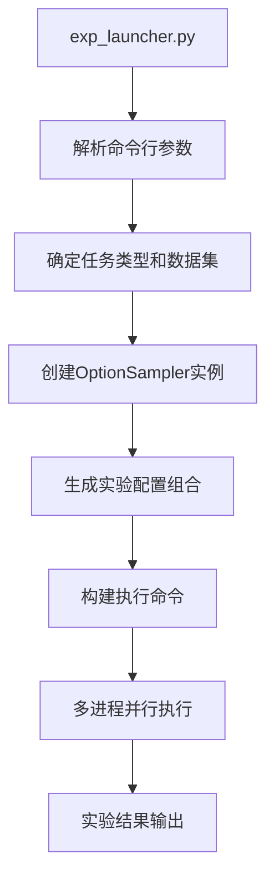
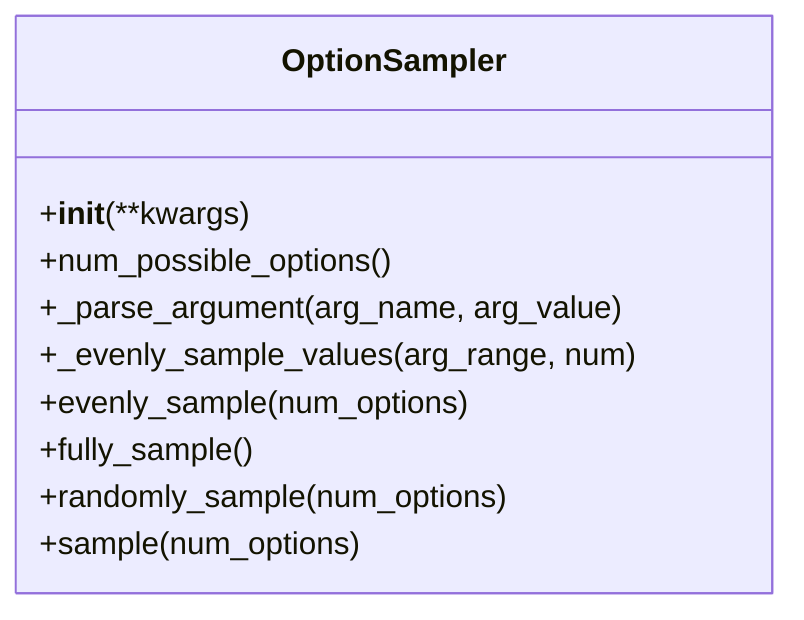
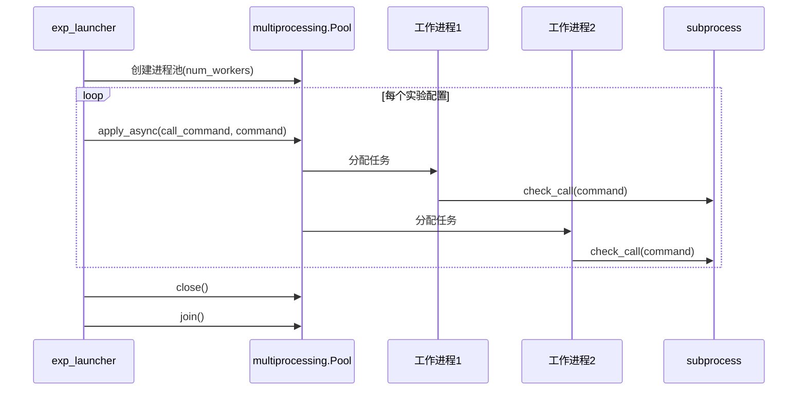
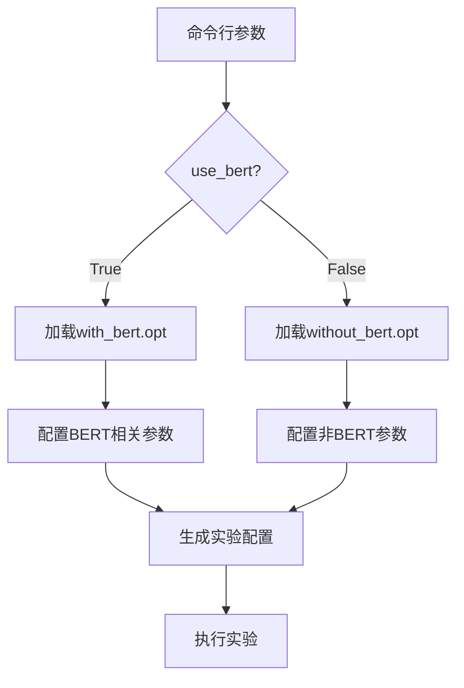
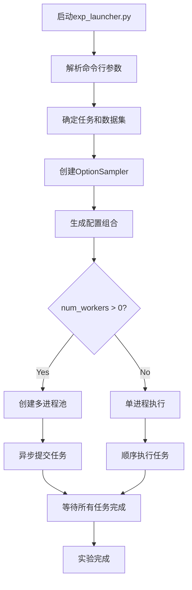

# 批量实验管理

<cite>
**本文档中引用的文件**  
- [exp_launcher.py](file://scripts/exp_launcher.py)
- [options.py](file://eznlp/training/options.py)
- [utils.py](file://scripts/utils.py)
- [with_bert.opt](file://scripts/options/with_bert.opt)
- [without_bert.opt](file://scripts/options/without_bert.opt)
- [README.md](file://README.md)
</cite>

## 目录
1. [简介](#简介)
2. [核心组件分析](#核心组件分析)
3. [OptionSampler工作机制](#optionsampler工作机制)
4. [多进程并行执行机制](#多进程并行执行机制)
5. [实验参数配置方法](#实验参数配置方法)
6. [批量实验工作流程](#批量实验工作流程)
7. [最佳实践](#最佳实践)

## 简介

本项目提供了一套完整的批量实验管理系统，通过`exp_launcher.py`脚本实现超参数搜索和批量实验管理功能。系统支持多种自然语言处理任务，包括文本分类、命名实体识别、关系抽取等。批量实验管理系统能够自动化地生成不同配置组合，通过多进程并行执行多个实验，显著提高实验效率。

**Section sources**
- [README.md](file://README.md#L1-L116)

## 核心组件分析

批量实验管理系统的核心组件包括`exp_launcher.py`主控脚本、`OptionSampler`超参数采样器和相关配置文件。`exp_launcher.py`作为入口点，负责解析命令行参数、生成实验配置、调度实验执行。`OptionSampler`类实现了多种采样策略，能够根据任务类型和数据集特性生成最优的超参数组合。

系统通过命令行参数控制实验配置，主要参数包括任务类型（task）、数据集（dataset）、随机种子（seed）、是否使用BERT模型（use_bert）、实验数量（num_exps）和工作进程数（num_workers）。这些参数共同决定了实验的配置空间和执行方式。

**Diagram sources**
- [exp_launcher.py](file://scripts/exp_launcher.py#L20-L267)

**Section sources**
- [exp_launcher.py](file://scripts/exp_launcher.py#L20-L267)

## OptionSampler工作机制

`OptionSampler`是批量实验管理系统的核心组件，负责从命令行参数生成不同的实验配置组合。该类通过初始化时接收的超参数范围，生成所有可能的配置组合，并根据指定的采样策略进行选择。

`OptionSampler`的初始化过程接收多个关键字参数，每个参数可以是单个值或值的列表。对于列表类型的参数，系统会生成该参数所有可能取值的组合。例如，当`lr=[0.05, 0.1, 0.2, 0.5]`和`optimizer=["SGD", "AdamW"]`时，系统会生成8种不同的学习率和优化器组合。

**Diagram sources**
- [options.py](file://eznlp/training/options.py#L10-L99)

**Section sources**
- [options.py](file://eznlp/training/options.py#L10-L99)

## 多进程并行执行机制

批量实验管理系统采用`multiprocessing.Pool`实现多进程并行执行，通过`subprocess.check_call`调用方式运行各个实验。当`num_workers`参数大于0时，系统会创建指定数量的工作进程，每个进程独立运行一个实验。

并行执行机制的关键在于`call_command`函数，该函数接收命令字符串作为参数，使用`subprocess.check_call`执行命令。系统通过`pool.apply_async`方法将任务异步提交到进程池，确保多个实验可以同时运行。为了确保GPU资源的合理分配，系统在提交每个任务后会暂停60秒，以便前一个任务完成设备分配。

**Diagram sources**
- [exp_launcher.py](file://scripts/exp_launcher.py#L14-L17)
- [exp_launcher.py](file://scripts/exp_launcher.py#L254-L266)

**Section sources**
- [exp_launcher.py](file://scripts/exp_launcher.py#L254-L266)

## 实验参数配置方法

批量实验管理系统的参数配置分为两类：实验控制参数和模型配置参数。实验控制参数包括`task`、`dataset`、`use_bert`、`num_exps`和`num_workers`，这些参数直接通过命令行传递。

`task`参数指定要执行的任务类型，支持`entity_recognition`（实体识别）、`text_classification`（文本分类）、`relation_extraction`（关系抽取）等多种任务。`dataset`参数指定使用的数据集名称，系统会根据数据集自动确定语言类型。`use_bert`是一个布尔参数，用于控制是否使用BERT类预训练模型。

`num_exps`参数控制要运行的实验数量，当设置为-1时，系统会运行所有可能的配置组合。`num_workers`参数指定并行执行的工作进程数，设置为0时系统将以单进程模式顺序执行所有实验。

模型配置参数通过`OptionSampler`的初始化参数定义，不同任务类型和数据集语言会使用不同的参数组合。例如，对于英文实体识别任务且不使用BERT模型时，系统会配置`optimizer`、`lr`、`batch_size`、`num_layers`等参数的取值范围。

**Diagram sources**
- [exp_launcher.py](file://scripts/exp_launcher.py#L52-L61)
- [exp_launcher.py](file://scripts/exp_launcher.py#L85-L127)

**Section sources**
- [exp_launcher.py](file://scripts/exp_launcher.py#L24-L43)
- [with_bert.opt](file://scripts/options/with_bert.opt#L1-L11)
- [without_bert.opt](file://scripts/options/without_bert.opt#L1-L2)

## 批量实验工作流程

批量实验的典型工作流程始于命令行调用`exp_launcher.py`脚本，指定任务类型、数据集和其他控制参数。系统首先解析命令行参数，然后根据任务类型和数据集特性创建相应的`OptionSampler`实例。

接下来，系统根据`num_exps`参数的值决定采样策略：如果`num_exps`为None或大于等于所有可能配置的数量，系统会采用全量采样（fully_sample）；如果`num_exps`大于可能配置数量的25%，系统会采用随机采样（randomly_sample）；否则采用均衡采样（evenly_sample）。

生成配置组合后，系统会为每个配置构建完整的执行命令，包括基础命令和具体的超参数。最后，系统根据`num_workers`参数的值选择单进程或多进程执行模式，依次运行所有实验。

**Diagram sources**
- [exp_launcher.py](file://scripts/exp_launcher.py#L250-L266)

**Section sources**
- [exp_launcher.py](file://scripts/exp_launcher.py#L250-L266)

## 最佳实践

在使用批量实验管理系统时，建议遵循以下最佳实践：首先，根据实验目的合理设置`num_exps`参数，避免生成过多的实验配置导致资源耗尽。对于探索性实验，可以先使用较小的`num_exps`值进行初步测试，然后根据结果调整搜索空间。

其次，合理配置`num_workers`参数以充分利用计算资源。在GPU环境下，`num_workers`的值不应超过可用GPU数量，以避免资源竞争。建议在每个实验开始前留出足够的设备分配时间，系统默认的60秒延迟通常足够。

对于超参数配置，建议根据任务特性和数据集规模选择合适的参数范围。例如，对于小规模数据集，可以使用较大的学习率和较短的训练周期；对于大规模数据集，则需要较小的学习率和较长的训练周期。

最后，建议在实验前仔细检查配置文件，确保所有必要的选项都已正确设置。特别是`with_bert.opt`和`without_bert.opt`文件中的基础配置，这些配置会与`OptionSampler`生成的参数共同决定最终的实验设置。

**Section sources**
- [exp_launcher.py](file://scripts/exp_launcher.py#L52-L61)
- [options.py](file://eznlp/training/options.py#L81-L98)