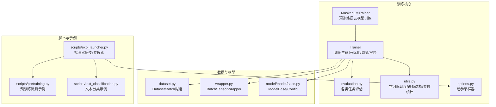
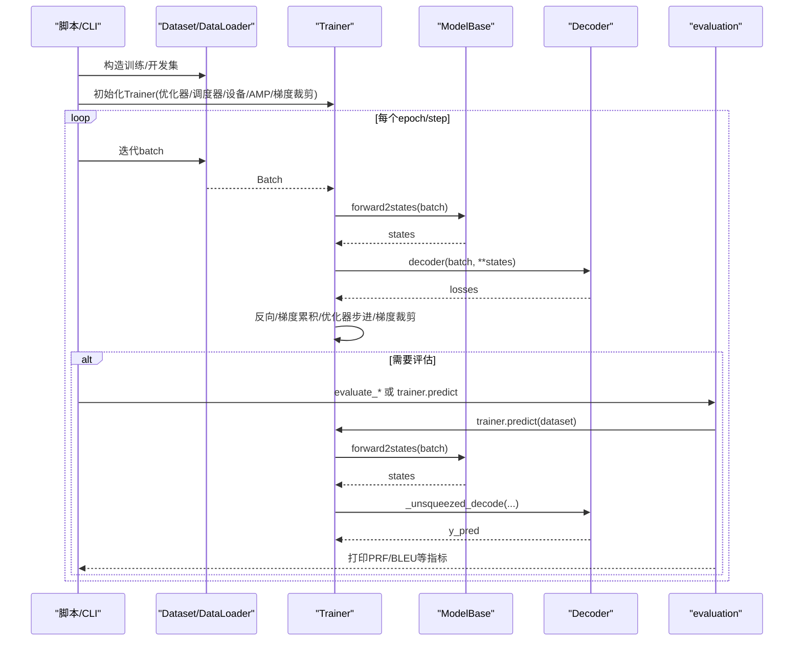
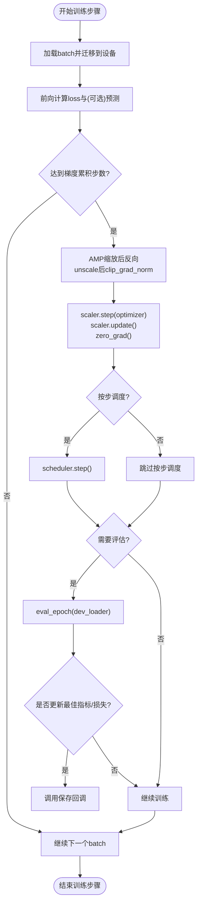
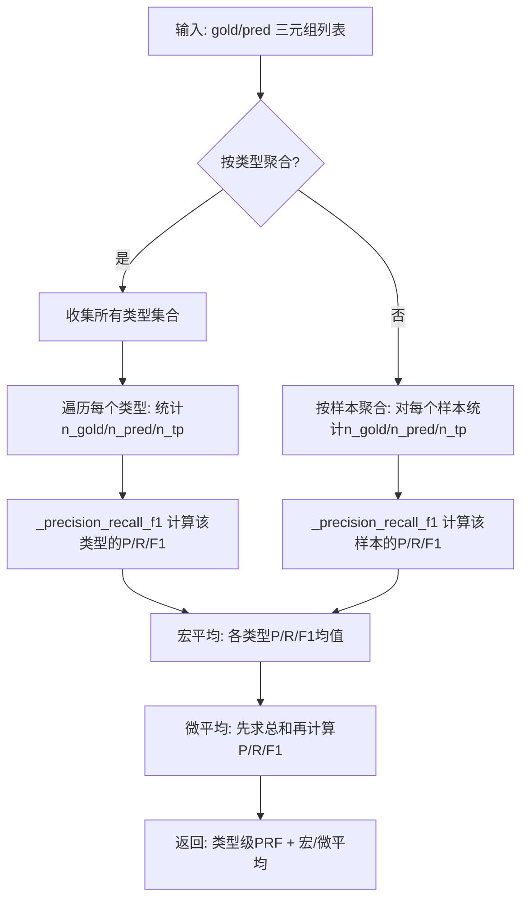
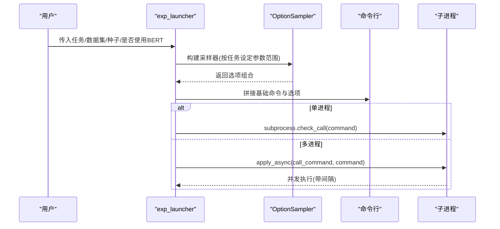
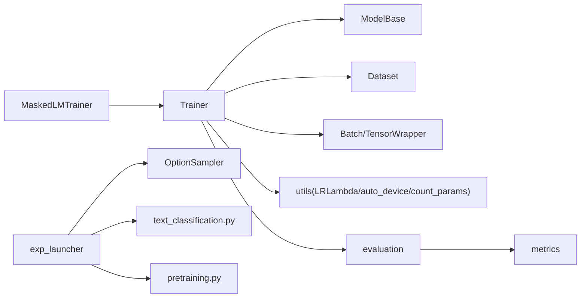

# 训练与评估

<cite>
**本文引用的文件列表**
- [eznlp/training/trainer.py](file://eznlp/training/trainer.py)
- [eznlp/training/plm_trainer.py](file://eznlp/training/plm_trainer.py)
- [eznlp/training/evaluation.py](file://eznlp/training/evaluation.py)
- [eznlp/training/utils.py](file://eznlp/training/utils.py)
- [eznlp/training/options.py](file://eznlp/training/options.py)
- [eznlp/metrics.py](file://eznlp/metrics.py)
- [eznlp/dataset.py](file://eznlp/dataset.py)
- [eznlp/wrapper.py](file://eznlp/wrapper.py)
- [eznlp/model/model/base.py](file://eznlp/model/model/base.py)
- [scripts/exp_launcher.py](file://scripts/exp_launcher.py)
- [scripts/pretraining.py](file://scripts/pretraining.py)
- [scripts/text_classification.py](file://scripts/text_classification.py)
- [tests/training/test_trainer.py](file://tests/training/test_trainer.py)
</cite>

## 目录
1. [引言](#引言)
2. [项目结构](#项目结构)
3. [核心组件](#核心组件)
4. [架构总览](#架构总览)
5. [详细组件分析](#详细组件分析)
6. [依赖关系分析](#依赖关系分析)
7. [性能考量](#性能考量)
8. [故障排查指南](#故障排查指南)
9. [结论](#结论)
10. [附录](#附录)

## 引言
本文件系统性阐述eznlp的训练与评估体系，覆盖Trainer类的生命周期管理、优化器与学习率调度配置、早停策略、预训练语言模型微调流程、评估指标体系、批量实验与超参搜索、以及训练日志分析与性能调优建议。目标是帮助读者在不直接阅读代码的前提下，快速掌握训练流水线的设计思想与实践方法。

## 项目结构
训练与评估相关代码主要集中在eznlp/training目录，配合scripts中的实验启动器、模型封装与数据批处理工具，形成从数据到模型再到评估的完整闭环。

图表来源
- [eznlp/training/trainer.py](file://eznlp/training/trainer.py#L1-L418)
- [eznlp/training/plm_trainer.py](file://eznlp/training/plm_trainer.py#L1-L35)
- [eznlp/training/evaluation.py](file://eznlp/training/evaluation.py#L1-L203)
- [eznlp/training/utils.py](file://eznlp/training/utils.py#L1-L202)
- [eznlp/training/options.py](file://eznlp/training/options.py#L1-L99)
- [eznlp/dataset.py](file://eznlp/dataset.py#L1-L210)
- [eznlp/wrapper.py](file://eznlp/wrapper.py#L1-L122)
- [eznlp/model/model/base.py](file://eznlp/model/model/base.py#L1-L99)
- [scripts/exp_launcher.py](file://scripts/exp_launcher.py#L1-L267)
- [scripts/pretraining.py](file://scripts/pretraining.py#L198-L235)
- [scripts/text_classification.py](file://scripts/text_classification.py#L1-L200)

章节来源
- [eznlp/training/trainer.py](file://eznlp/training/trainer.py#L1-L418)
- [eznlp/training/plm_trainer.py](file://eznlp/training/plm_trainer.py#L1-L35)
- [eznlp/training/evaluation.py](file://eznlp/training/evaluation.py#L1-L203)
- [eznlp/training/utils.py](file://eznlp/training/utils.py#L1-L202)
- [eznlp/training/options.py](file://eznlp/training/options.py#L1-L99)
- [eznlp/dataset.py](file://eznlp/dataset.py#L1-L210)
- [eznlp/wrapper.py](file://eznlp/wrapper.py#L1-L122)
- [eznlp/model/model/base.py](file://eznlp/model/model/base.py#L1-L99)
- [scripts/exp_launcher.py](file://scripts/exp_launcher.py#L1-L267)
- [scripts/pretraining.py](file://scripts/pretraining.py#L198-L235)
- [scripts/text_classification.py](file://scripts/text_classification.py#L1-L200)

## 核心组件
- Trainer：统一训练/验证/预测入口，负责前向、反向、梯度累积、优化器步进、学习率调度、早停保存、AMP混合精度、梯度裁剪等。
- MaskedLMTrainer：面向掩码语言建模的训练器，负责构造输入字典、调用模型并聚合损失，支持多GPU平均损失。
- evaluation模块：针对不同任务（文本分类、实体识别、属性抽取、关系抽取、联合抽取、生成）输出指标与报告。
- metrics模块：提供PRF宏/微平均计算与报告生成，支持按样本或类型聚合。
- utils模块：提供多种学习率调度函数（常量、线性衰减、指数衰减、幂律衰减）、参数计数、自动设备选择。
- options模块：OptionSampler用于超参组合采样（全量/随机/均匀），便于批量实验。
- dataset与wrapper：Dataset负责数据项到示例的转换与批构建；Batch为张量包装器，支持to/pin_memory等。
- model/model/base：ModelBase定义forward/forward2states/decode等接口，训练器通过这些接口与模型交互。

章节来源
- [eznlp/training/trainer.py](file://eznlp/training/trainer.py#L1-L418)
- [eznlp/training/plm_trainer.py](file://eznlp/training/plm_trainer.py#L1-L35)
- [eznlp/training/evaluation.py](file://eznlp/training/evaluation.py#L1-L203)
- [eznlp/metrics.py](file://eznlp/metrics.py#L1-L153)
- [eznlp/training/utils.py](file://eznlp/training/utils.py#L1-L202)
- [eznlp/training/options.py](file://eznlp/training/options.py#L1-L99)
- [eznlp/dataset.py](file://eznlp/dataset.py#L1-L210)
- [eznlp/wrapper.py](file://eznlp/wrapper.py#L1-L122)
- [eznlp/model/model/base.py](file://eznlp/model/model/base.py#L1-L99)

## 架构总览
训练主循环围绕Trainer展开，结合ModelBase的前向与解码接口，完成端到端训练与评估。预训练场景通过MaskedLMTrainer适配MLM/NLI等任务；评估模块根据任务类型调用metrics生成PRF报告或BLEU等指标。

图表来源
- [eznlp/training/trainer.py](file://eznlp/training/trainer.py#L155-L219)
- [eznlp/model/model/base.py](file://eznlp/model/model/base.py#L81-L99)
- [eznlp/training/evaluation.py](file://eznlp/training/evaluation.py#L1-L203)

## 详细组件分析

### Trainer生命周期与训练主循环
- 生命周期管理
  - 初始化：设置优化器、调度器、是否按步调度、梯度累积步数、设备、非阻塞传输、梯度裁剪阈值、AMP开关、GradScaler。
  - 前向：调用ModelBase.forward返回loss，若存在解码器则同时返回预测；支持AMP自动混合精度。
  - 反向：对loss除以梯度累积步数；AMP缩放后反向；每num_grad_acc_steps执行一次优化器步进与zero_grad；可选clip_grad_norm；按步调度或按epoch调度。
  - 训练/验证：train_epoch/eval_epoch分别记录epoch级损失与指标；train_steps支持按步显示、按步评估、早停保存（dev_loss最小或指标最大时保存）。
- 早停机制
  - 当提供dev_loader时，按eval_every_steps评估dev集；若save_by_loss为真且dev_loss更小，或save_by_loss为假且指标均值更大，则触发保存回调；同时可将scheduler.step交给ReduceLROnPlateau。
- 混合精度与梯度裁剪
  - AMP：autocast启用，GradScaler缩放loss并反向；clip_grad_norm在unscale后执行，避免梯度爆炸。
- 预测：predict支持beam search（仅当num_metrics==1且beam_size>1）。

图表来源
- [eznlp/training/trainer.py](file://eznlp/training/trainer.py#L82-L123)
- [eznlp/training/trainer.py](file://eznlp/training/trainer.py#L155-L219)
- [eznlp/training/trainer.py](file://eznlp/training/trainer.py#L221-L376)

章节来源
- [eznlp/training/trainer.py](file://eznlp/training/trainer.py#L1-L418)
- [tests/training/test_trainer.py](file://tests/training/test_trainer.py#L1-L84)

### 优化器配置与学习率调度
- 优化器：由外部传入，Trainer不创建优化器实例，确保灵活性（AdamW、SGD、Adadelta等均可）。
- 学习率调度：
  - utils.LRLambda提供多种调度函数：常量、带warmup的常量、线性衰减、指数衰减、幂律衰减；可绘制曲线辅助调试。
  - Trainer支持两种调度节奏：按步(schedule_by_step=True)或按epoch；ReduceLROnPlateau需按epoch调度。
- 示例：预训练脚本中使用LinearDecayWithWarmup并通过LambdaLR绑定到Trainer。

章节来源
- [eznlp/training/utils.py](file://eznlp/training/utils.py#L1-L202)
- [scripts/pretraining.py](file://scripts/pretraining.py#L198-L235)
- [eznlp/training/trainer.py](file://eznlp/training/trainer.py#L27-L63)

### 早停机制
- Trainer.train_steps在每个eval周期后比较dev_loss或dev_metric均值，更新best_dev_loss/best_dev_metric并在满足条件时调用保存回调。
- 若使用ReduceLROnPlateau，Trainer会根据save_by_loss选择其mode(min或max)，并调用scheduler.step(metric)。

章节来源
- [eznlp/training/trainer.py](file://eznlp/training/trainer.py#L317-L360)

### 预训练语言模型微调（plm_trainer.py）
- MaskedLMTrainer.forward_batch
  - 构造模型输入字典：input_ids、attention_mask、labels；若存在paired_lab_ids则附加token_type_ids与next_sentence_label。
  - 调用model(**inputs)得到loss；多GPU下对loss做mean以消除维度差异。
- 使用建议
  - 在脚本中初始化Trainer(MaskedLMTrainer)并传入优化器、调度器、梯度裁剪、AMP等参数，然后调用train_steps进行训练。

章节来源
- [eznlp/training/plm_trainer.py](file://eznlp/training/plm_trainer.py#L1-L35)
- [scripts/pretraining.py](file://scripts/pretraining.py#L198-L235)

### 评估指标与计算逻辑（metrics.py）
- 支持指标
  - Precision（精确率）、Recall（召回率）、F1（F1分数）
  - 宏平均（macro）与微平均（micro）两类汇总
- 计算逻辑
  - _precision_recall_f1：基于三元组集合的交集数量与各自集合大小计算三者。
  - _prf_scores_over_samples：按样本聚合，计算每个样本的PRF后求均值。
  - _prf_scores_over_types：按类型聚合，先收集所有类型，再逐类型统计，最后计算宏/微平均。
  - precision_recall_f1_report：校验输入长度一致，按macro_over选择聚合方式，返回各类型的PRF与宏/微平均结果。

图表来源
- [eznlp/metrics.py](file://eznlp/metrics.py#L1-L153)

章节来源
- [eznlp/metrics.py](file://eznlp/metrics.py#L1-L153)

### 评估流程（evaluation.py）
- 文本分类：evaluate_text_classification调用trainer.predict，若保存预测则写回dataset；否则计算Accuracy并打印。
- 实体识别：evaluate_entity_recognition支持内部/外部实体细分评估（detect_nested），并可对预测结果进行后处理回调。
- 属性抽取/关系抽取：分别计算AE+/AE与RE+/RE两类指标，对属性抽取将属性类型剥离后再次评估。
- 联合抽取：分别评估实体、属性、关系子任务指标。
- 生成：evaluate_generation使用BLEU-4评估生成质量。

章节来源
- [eznlp/training/evaluation.py](file://eznlp/training/evaluation.py#L1-L203)

### 批量实验与超参数搜索（exp_launcher.py + options.py）
- OptionSampler
  - 支持全量枚举、随机采样、均匀采样三种策略；解析参数为命令行字符串形式。
  - sample根据选项数量与可能组合数自动选择策略，避免重复采样与不平衡采样。
- exp_launcher
  - 解析任务、数据集、种子、是否使用BERT等基础参数。
  - 针对不同任务（文本分类、实体识别、属性/关系抽取、联合抽取、文本到文本、图像到文本）构建OptionSampler并采样。
  - 将采样得到的选项拼接为命令行，单进程顺序执行或多进程异步执行（带进程间间隔以避免显存争用）。

图表来源
- [scripts/exp_launcher.py](file://scripts/exp_launcher.py#L1-L267)
- [eznlp/training/options.py](file://eznlp/training/options.py#L1-L99)

章节来源
- [scripts/exp_launcher.py](file://scripts/exp_launcher.py#L1-L267)
- [eznlp/training/options.py](file://eznlp/training/options.py#L1-L99)

### 数据与批处理（dataset.py + wrapper.py）
- Dataset
  - 提供__getitem__/collate，将原始条目转换为示例并打包为Batch。
  - 支持摘要信息（序列长度、类别数、实体/关系统计等）。
- Batch/TensorWrapper
  - 递归地对张量属性应用to/pin_memory等操作，便于跨设备传输与加速。

章节来源
- [eznlp/dataset.py](file://eznlp/dataset.py#L1-L210)
- [eznlp/wrapper.py](file://eznlp/wrapper.py#L1-L122)

### 模型接口（model/model/base.py）
- ModelBase.forward：先forward2states得到中间状态，再由decoder计算losses并可返回states供后续decode使用。
- Trainer通过forward/forward2states/decode与模型解耦，便于扩展不同任务与解码器。

章节来源
- [eznlp/model/model/base.py](file://eznlp/model/model/base.py#L64-L99)

## 依赖关系分析
- Trainer依赖ModelBase接口（forward/forward2states/decode）、Dataset/DataLoader、Batch、utils（设备/参数统计/LR调度）、evaluation（评估）。
- MaskedLMTrainer继承Trainer，重写forward_batch以适配预训练输入格式。
- evaluation依赖metrics与模型解码器接口。
- exp_launcher依赖OptionSampler与具体任务脚本（如text_classification.py、pretraining.py）。

图表来源
- [eznlp/training/trainer.py](file://eznlp/training/trainer.py#L1-L418)
- [eznlp/training/plm_trainer.py](file://eznlp/training/plm_trainer.py#L1-L35)
- [eznlp/training/evaluation.py](file://eznlp/training/evaluation.py#L1-L203)
- [eznlp/metrics.py](file://eznlp/metrics.py#L1-L153)
- [eznlp/training/utils.py](file://eznlp/training/utils.py#L1-L202)
- [eznlp/training/options.py](file://eznlp/training/options.py#L1-L99)
- [scripts/exp_launcher.py](file://scripts/exp_launcher.py#L1-L267)
- [scripts/text_classification.py](file://scripts/text_classification.py#L1-L200)
- [scripts/pretraining.py](file://scripts/pretraining.py#L198-L235)

## 性能考量
- 混合精度训练（AMP）
  - Trainer在前向与反向中使用autocast与GradScaler，显著降低显存占用并提升吞吐。
  - 建议在CUDA可用时开启use_amp，同时确保梯度裁剪在unscale后执行。
- 梯度裁剪
  - 使用clip_grad_norm控制梯度范数，避免爆炸；在num_grad_acc_steps步后再统一更新权重。
- 设备选择与数据传输
  - utils.auto_device自动选择空闲显存最大的GPU；Batch支持pin_memory与non_blocking传输，减少CPU/GPU同步开销。
- 参数统计与分组
  - count_params统计可训练/冻结参数数量；collect_params辅助检查参数分组完整性。
- 学习率调度
  - LRLambda提供多种warmup+decay策略；预训练常用LinearDecayWithWarmup并按步调度。
- 批量实验与超参搜索
  - OptionSampler支持均匀/随机/全量采样，exp_launcher支持单进程/多进程执行，避免显存争用。

章节来源
- [eznlp/training/trainer.py](file://eznlp/training/trainer.py#L60-L123)
- [eznlp/training/utils.py](file://eznlp/training/utils.py#L1-L202)
- [scripts/pretraining.py](file://scripts/pretraining.py#L198-L235)
- [scripts/exp_launcher.py](file://scripts/exp_launcher.py#L1-L267)

## 故障排查指南
- 训练不收敛或不稳定
  - 检查学习率是否过大（建议先用较小LR验证流程），确认schedule_by_step与scheduler类型匹配。
  - 开启AMP并确保clip_grad_norm正确使用；逐步增大num_grad_acc_steps观察效果。
- 显存不足
  - 减小batch_size或num_grad_acc_steps；使用utils.auto_device自动选择GPU；开启pin_memory与non_blocking传输。
- 评估指标异常
  - 确认evaluation中任务分支与后处理回调逻辑；检查metrics输入格式（三元组列表）与macro_over参数。
- 多进程实验卡顿
  - exp_launcher中为避免显存争用设置了进程间隔，适当增加间隔或减少并发数。

章节来源
- [eznlp/training/trainer.py](file://eznlp/training/trainer.py#L221-L376)
- [eznlp/training/evaluation.py](file://eznlp/training/evaluation.py#L1-L203)
- [eznlp/training/utils.py](file://eznlp/training/utils.py#L158-L202)
- [scripts/exp_launcher.py](file://scripts/exp_launcher.py#L250-L267)

## 结论
eznlp的训练与评估系统以Trainer为核心，通过ModelBase接口与解码器解耦，实现了对多任务、多模型的统一训练框架。配合utils的AMP、梯度裁剪、学习率调度与exp_launcher的批量实验能力，能够高效完成从预训练到下游任务的全流程训练与评估。metrics模块提供了严谨的PRF计算与报告生成，evaluation模块覆盖主流NLP任务的评估流程。建议在实际工程中结合任务特性合理配置优化器、调度器与早停策略，并利用批量实验探索最优超参组合。

## 附录
- 使用示例参考
  - 文本分类：scripts/text_classification.py展示了如何构建配置、加载数据与运行训练/评估。
  - 预训练微调：scripts/pretraining.py展示了优化器、学习率调度、Trainer初始化与训练主循环。
- 测试用例参考
  - tests/training/test_trainer.py验证了AMP与梯度累积的一致性与基本训练流程。

章节来源
- [scripts/text_classification.py](file://scripts/text_classification.py#L1-L200)
- [scripts/pretraining.py](file://scripts/pretraining.py#L198-L235)
- [tests/training/test_trainer.py](file://tests/training/test_trainer.py#L1-L84)