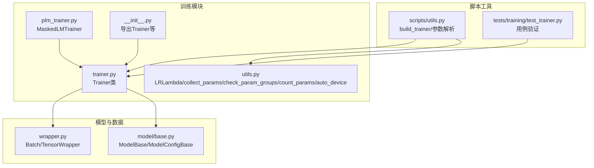
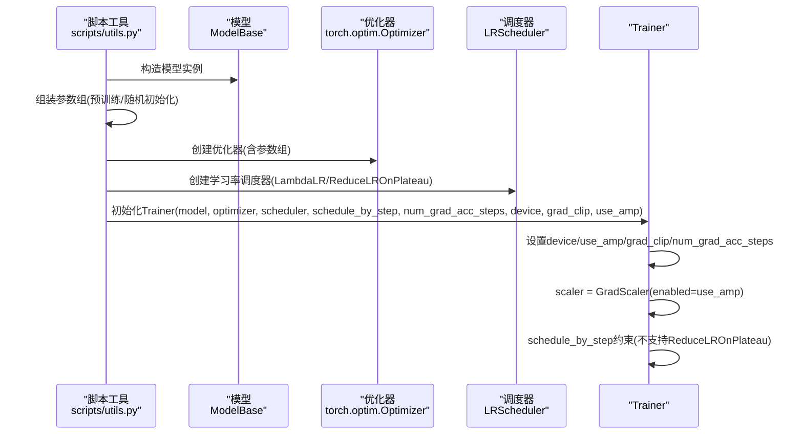
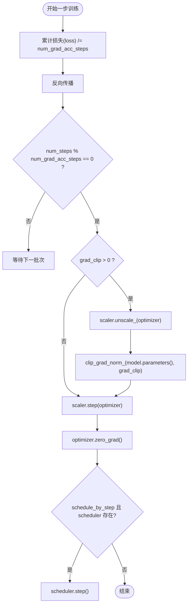
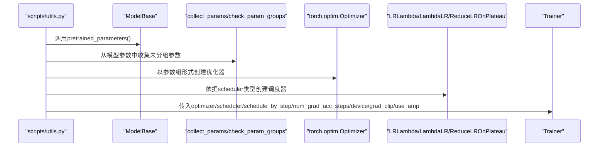
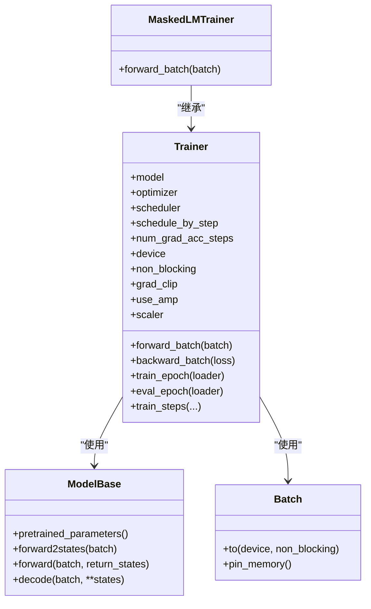

# Trainer初始化

<cite>
**本文引用的文件列表**
- [trainer.py](file://eznlp/training/trainer.py)
- [utils.py](file://eznlp/training/utils.py)
- [plm_trainer.py](file://eznlp/training/plm_trainer.py)
- [__init__.py](file://eznlp/training/__init__.py)
- [base.py](file://eznlp/model/model/base.py)
- [wrapper.py](file://eznlp/wrapper.py)
- [test_trainer.py](file://tests/training/test_trainer.py)
- [utils.py](file://scripts/utils.py)
</cite>

## 目录
1. [引言](#引言)
2. [项目结构](#项目结构)
3. [核心组件](#核心组件)
4. [架构总览](#架构总览)
5. [详细组件分析](#详细组件分析)
6. [依赖关系分析](#依赖关系分析)
7. [性能考量](#性能考量)
8. [故障排查指南](#故障排查指南)
9. [结论](#结论)

## 引言
本文件围绕eznlp中Trainer类的初始化过程展开，系统性说明以下关键点：
- 模型、优化器、学习率调度器、设备配置等参数的设置与约束
- num_grad_acc_steps如何影响“实际批量大小”，以及use_amp如何启用混合精度训练
- grad_clip在梯度裁剪中的作用机制
- schedule_by_step对学习率调度器行为的影响
- 结合scripts/utils.py中的build_trainer函数，展示如何按任务需求配置优化器参数组（如预训练模型微调学习率与随机初始化层学习率的分离）

## 项目结构
Trainer位于训练子模块中，配合模型基类、批包装器、工具函数共同构成训练流水线；脚本工具提供统一的训练入口与参数装配逻辑。

图示来源
- [trainer.py](file://eznlp/training/trainer.py#L1-L120)
- [utils.py](file://eznlp/training/utils.py#L1-L120)
- [plm_trainer.py](file://eznlp/training/plm_trainer.py#L1-L35)
- [__init__.py](file://eznlp/training/__init__.py#L1-L37)
- [base.py](file://eznlp/model/model/base.py#L64-L99)
- [wrapper.py](file://eznlp/wrapper.py#L55-L122)
- [utils.py](file://scripts/utils.py#L1301-L1338)
- [test_trainer.py](file://tests/training/test_trainer.py#L1-L84)

章节来源
- [trainer.py](file://eznlp/training/trainer.py#L1-L120)
- [utils.py](file://eznlp/training/utils.py#L1-L120)
- [plm_trainer.py](file://eznlp/training/plm_trainer.py#L1-L35)
- [__init__.py](file://eznlp/training/__init__.py#L1-L37)
- [base.py](file://eznlp/model/model/base.py#L64-L99)
- [wrapper.py](file://eznlp/wrapper.py#L55-L122)
- [utils.py](file://scripts/utils.py#L1301-L1338)
- [test_trainer.py](file://tests/training/test_trainer.py#L1-L84)

## 核心组件
- Trainer：封装训练循环、反向传播、梯度累积、混合精度、学习率调度、评估与保存回调等
- LRLambda：提供多种warmup+衰减的学习率策略工厂方法
- collect_params/check_param_groups/count_params：参数分组与完整性校验工具
- auto_device：自动选择GPU或回退CPU
- MaskedLMTrainer：基于Trainer的掩码语言建模特化
- ModelBase：模型抽象，提供pretrained_parameters接口用于参数分组
- Batch：批包装器，提供to(device, non_blocking=...)等设备迁移能力

章节来源
- [trainer.py](file://eznlp/training/trainer.py#L1-L120)
- [utils.py](file://eznlp/training/utils.py#L1-L120)
- [plm_trainer.py](file://eznlp/training/plm_trainer.py#L1-L35)
- [base.py](file://eznlp/model/model/base.py#L64-L99)
- [wrapper.py](file://eznlp/wrapper.py#L55-L122)

## 架构总览
Trainer初始化时接收模型、优化器、调度器、设备、非阻塞传输、梯度裁剪阈值、混合精度开关等参数；内部维护num_grad_acc_steps以实现梯度累积，use_amp控制autocast与GradScaler；backward_batch中按步数触发优化器更新与可选的梯度裁剪；train_steps/eval_epoch中按epoch或step进行训练与评估。

图示来源
- [utils.py](file://scripts/utils.py#L1301-L1338)
- [trainer.py](file://eznlp/training/trainer.py#L27-L63)
- [utils.py](file://eznlp/training/utils.py#L1-L120)

## 详细组件分析

### Trainer初始化参数与行为
- 关键参数
  - model: 模型实例，要求为ModelBase派生对象
  - optimizer: 优化器实例
  - scheduler: 学习率调度器实例
  - schedule_by_step: 布尔标志，决定调度器按step还是按epoch推进
  - num_grad_acc_steps: 梯度累积步数，默认1；“实际批量大小”=“名义batch_size”×num_grad_acc_steps
  - device: 训练设备
  - non_blocking: 数据传输是否非阻塞
  - grad_clip: 梯度裁剪范数阈值
  - use_amp: 是否启用混合精度训练
- 设备与自动分配
  - 若未显式传入device，将断言失败；建议通过auto_device自动选择GPU或回退CPU
- 混合精度
  - use_amp为True时，构造GradScaler并开启autocast
- 调度器约束
  - 当schedule_by_step为True时，禁止使用ReduceLROnPlateau
- 梯度累积
  - backward_batch中，loss先除以num_grad_acc_steps，再反向传播
  - 每num_grad_acc_steps整数倍步执行一次优化器更新与可选的梯度裁剪

章节来源
- [trainer.py](file://eznlp/training/trainer.py#L27-L63)
- [trainer.py](file://eznlp/training/trainer.py#L82-L123)
- [trainer.py](file://eznlp/training/trainer.py#L155-L190)
- [trainer.py](file://eznlp/training/trainer.py#L221-L376)
- [utils.py](file://eznlp/training/utils.py#L158-L202)

### num_grad_acc_steps与“实际批量大小”
- 定义与效果
  - “名义batch_size”指DataLoader每次返回的样本数量
  - “实际批量大小”=“名义batch_size”×num_grad_acc_steps
  - 通过在backward_batch中对loss做均分，使累积多步梯度后等价于更大批次
- 行为验证
  - 测试用例对比了相同参数初始化的两个模型，在不同nominal batch_size与num_grad_acc_steps下，最终参数变化一致，验证了“名义batch×步数”的等价性

图示来源
- [trainer.py](file://eznlp/training/trainer.py#L82-L123)

章节来源
- [trainer.py](file://eznlp/training/trainer.py#L82-L123)
- [test_trainer.py](file://tests/training/test_trainer.py#L36-L84)

### use_amp与混合精度训练
- 启用条件
  - use_amp为True时，构造GradScaler并开启torch.amp.autocast
- 训练阶段
  - forward_batch与train_steps/eval_epoch中均使用autocast包裹前向计算
  - 反向传播前对loss进行scaler.scale，随后在优化器更新前scaler.unscale_(optimizer)，再执行clip与step
- 注意事项
  - autocast仅在CUDA设备上有效；若设备为CPU且use_amp为True，测试用例会跳过该分支

章节来源
- [trainer.py](file://eznlp/training/trainer.py#L60-L63)
- [trainer.py](file://eznlp/training/trainer.py#L168-L170)
- [trainer.py](file://eznlp/training/trainer.py#L280-L282)
- [test_trainer.py](file://tests/training/test_trainer.py#L12-L16)

### grad_clip与梯度裁剪
- 作用机制
  - 在每轮num_grad_acc_steps整数倍步时，若grad_clip>0，则先scaler.unscale_(optimizer)，再对模型参数执行梯度范数裁剪
- 适用场景
  - 防止梯度爆炸，提升训练稳定性；常与较大的nominal batch或较大学习率搭配使用

章节来源
- [trainer.py](file://eznlp/training/trainer.py#L105-L113)

### schedule_by_step与学习率调度器行为
- schedule_by_step为True
  - 调度器按“名义步数”推进，即每处理一个batch就调用scheduler.step()
  - 禁止使用ReduceLROnPlateau（因为其按指标变化而非固定步数）
- schedule_by_step为False
  - 调度器按“epoch”推进，需在train_steps外部显式调用scheduler.step()
  - 对ReduceLROnPlateau，按验证集指标调用step()

章节来源
- [trainer.py](file://eznlp/training/trainer.py#L46-L49)
- [trainer.py](file://eznlp/training/trainer.py#L115-L123)
- [trainer.py](file://eznlp/training/trainer.py#L345-L357)

### 参数组分离与build_trainer
- 目标
  - 将预训练模型参数与随机初始化层参数分别赋予不同的学习率，实现微调与新层训练的差异化
- 实现步骤
  - 使用ModelBase.pretrained_parameters获取预训练参数集合
  - 使用collect_params从模型参数中剔除已分组参数，得到剩余参数集合
  - 构造两个参数组：一组lr=finetune_lr（预训练），另一组lr=lr（随机初始化）
  - 通过check_param_groups校验参数完整性
  - 依据args.scheduler选择LambdaLR或ReduceLROnPlateau，并设置schedule_by_step
  - 最终创建Trainer实例并传入上述组件

图示来源
- [utils.py](file://scripts/utils.py#L1301-L1338)
- [utils.py](file://eznlp/training/utils.py#L86-L120)
- [base.py](file://eznlp/model/model/base.py#L78-L80)

章节来源
- [utils.py](file://scripts/utils.py#L1301-L1338)
- [utils.py](file://eznlp/training/utils.py#L86-L120)
- [base.py](file://eznlp/model/model/base.py#L78-L80)

## 依赖关系分析
- Trainer依赖
  - 模型：ModelBase.forward/forward2states/decoder
  - 批包装：Batch.to(device, non_blocking=...)
  - 工具：LRLambda、collect_params、check_param_groups、count_params、auto_device
  - 优化与调度：torch.optim.Optimizer、torch.optim.lr_scheduler
- 继承关系
  - MaskedLMTrainer继承Trainer，重写forward_batch以适配掩码语言建模任务

图示来源
- [base.py](file://eznlp/model/model/base.py#L64-L99)
- [wrapper.py](file://eznlp/wrapper.py#L55-L122)
- [trainer.py](file://eznlp/training/trainer.py#L1-L120)
- [plm_trainer.py](file://eznlp/training/plm_trainer.py#L1-L35)

章节来源
- [base.py](file://eznlp/model/model/base.py#L64-L99)
- [wrapper.py](file://eznlp/wrapper.py#L55-L122)
- [trainer.py](file://eznlp/training/trainer.py#L1-L120)
- [plm_trainer.py](file://eznlp/training/plm_trainer.py#L1-L35)

## 性能考量
- 混合精度
  - use_amp可显著降低显存占用并加速训练；需确保GPU驱动与CUDA版本兼容
- 梯度累积
  - 通过增大num_grad_acc_steps可在有限显存下模拟更大batch；注意nominal batch_size与num_grad_acc_steps的平衡
- 非阻塞传输
  - non_blocking=True可减少CPU-GPU同步开销，但需确保内存足够或使用pin_memory
- 学习率调度
  - warmup+衰减策略有助于稳定前期训练；schedule_by_step与ReduceLROnPlateau的选择应与任务目标一致

[本节为通用指导，无需列出具体文件来源]

## 故障排查指南
- 设备选择问题
  - 若未指定device，初始化将断言失败；可通过auto_device自动选择空闲GPU或回退CPU
- 混合精度异常
  - 在CPU上启用use_amp不会报错，但也不会生效；测试用例中对CPU跳过AMP测试
- 调度器冲突
  - schedule_by_step为True时不能使用ReduceLROnPlateau；否则会断言失败
- 参数组不完整
  - 使用check_param_groups核对参数分组是否覆盖全部可训练参数，避免遗漏导致训练异常

章节来源
- [utils.py](file://eznlp/training/utils.py#L158-L202)
- [test_trainer.py](file://tests/training/test_trainer.py#L12-L16)
- [trainer.py](file://eznlp/training/trainer.py#L46-L49)
- [utils.py](file://eznlp/training/utils.py#L103-L120)

## 结论
Trainer提供了灵活而稳健的训练框架：通过num_grad_acc_steps实现“名义batch×步数”的等效大batch训练，通过use_amp实现混合精度加速，通过grad_clip保障梯度稳定性，通过schedule_by_step与多种调度器策略满足不同训练节奏需求。结合scripts/utils.py中的build_trainer，能够便捷地将预训练参数与随机初始化层分离到不同学习率组，从而在微调任务中实现更精细的参数更新策略。