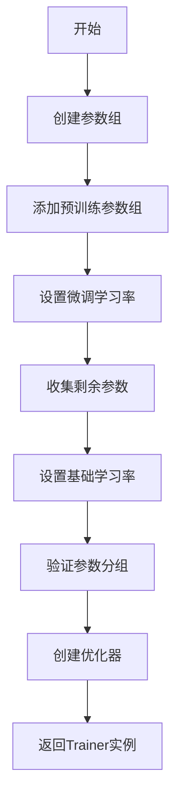
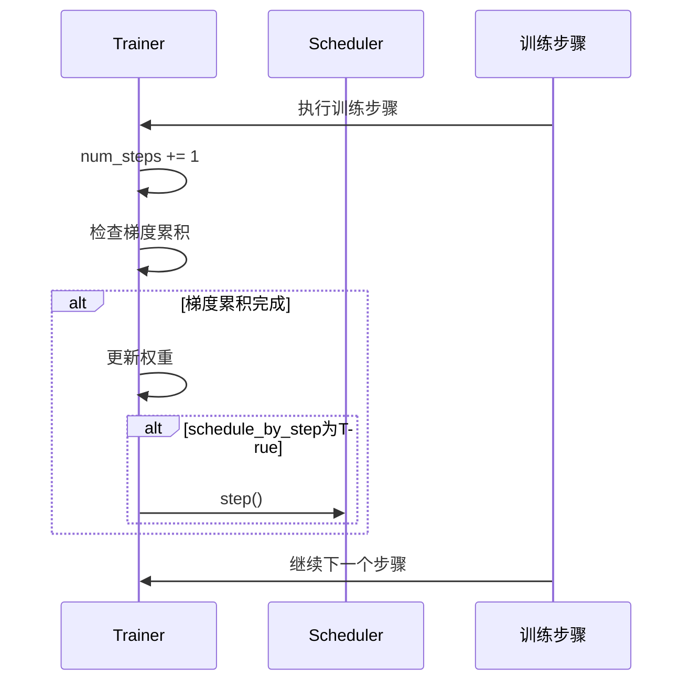
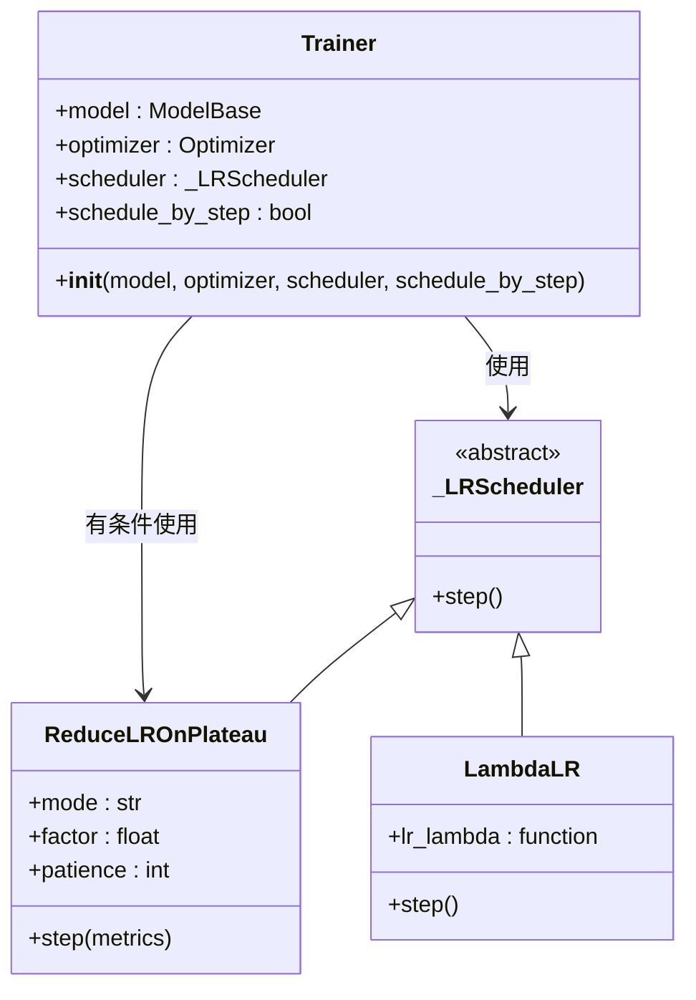

# 优化器与学习率调度器配置

<cite>
**本文档引用的文件**   
- [trainer.py](file://eznlp/training/trainer.py#L27-L500)
- [utils.py](file://eznlp/training/utils.py#L13-L84)
- [scripts/utils.py](file://scripts/utils.py#L1301-L1337)
- [plm_trainer.py](file://eznlp/training/plm_trainer.py#L7-L35)
</cite>

## 目录
1. [优化器配置](#优化器配置)
2. [学习率调度器配置](#学习率调度器配置)
3. [参数组学习率设置](#参数组学习率设置)
4. [调度器更新策略](#调度器更新策略)
5. [ReduceLROnPlateau调度器限制](#reducelronplateau调度器限制)

## 优化器配置

在Trainer初始化过程中，`optimizer`参数接收一个`torch.optim.Optimizer`实例，用于执行模型参数的梯度更新。优化器的配置通过`build_trainer`函数完成，该函数根据模型结构和训练需求创建合适的优化器实例。

**Section sources**
- [trainer.py](file://eznlp/training/trainer.py#L27-L500)
- [scripts/utils.py](file://scripts/utils.py#L1301-L1337)

## 学习率调度器配置

`scheduler`参数要求接收一个`torch.optim.lr_scheduler._LRScheduler`类型的实例，用于在训练过程中动态调整学习率。调度器的类型和行为通过命令行参数进行配置，支持多种调度策略，包括线性衰减、指数衰减等。

**Section sources**
- [trainer.py](file://eznlp/training/trainer.py#L27-L500)
- [utils.py](file://eznlp/training/utils.py#L13-L84)

## 参数组学习率设置

`build_trainer`函数通过`collect_params`和`check_param_groups`工具函数实现对不同参数组的差异化学习率设置。该机制特别适用于BERT微调场景，能够为预训练模型部分和随机初始化层设置不同的学习率。

**Diagram sources **
- [scripts/utils.py](file://scripts/utils.py#L1301-L1337)
- [utils.py](file://eznlp/training/utils.py#L86-L120)

## 调度器更新策略

`schedule_by_step`参数控制学习率调度器的更新频率。当该参数为`True`时，调度器在每一步训练后更新学习率；当为`False`时，在每个epoch结束后更新。这一机制通过`train_steps`方法中的条件判断实现，确保调度器在正确的时间点被调用。

**Diagram sources **
- [trainer.py](file://eznlp/training/trainer.py#L117-L123)
- [trainer.py](file://eznlp/training/trainer.py#L345-L356)

## ReduceLROnPlateau调度器限制

`ReduceLROnPlateau`调度器存在特定的使用限制，特别是在与`schedule_by_step`参数的兼容性方面。根据代码实现，当`schedule_by_step`为`True`时，系统会断言`ReduceLROnPlateau`调度器不能被使用，以避免不一致的调度行为。

**Diagram sources **
- [trainer.py](file://eznlp/training/trainer.py#L47-L48)
- [trainer.py](file://eznlp/training/trainer.py#L347-L354)

**Section sources**
- [trainer.py](file://eznlp/training/trainer.py#L47-L48)
- [trainer.py](file://eznlp/training/trainer.py#L347-L354)