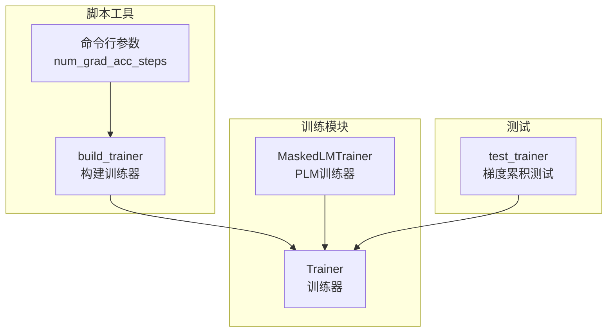
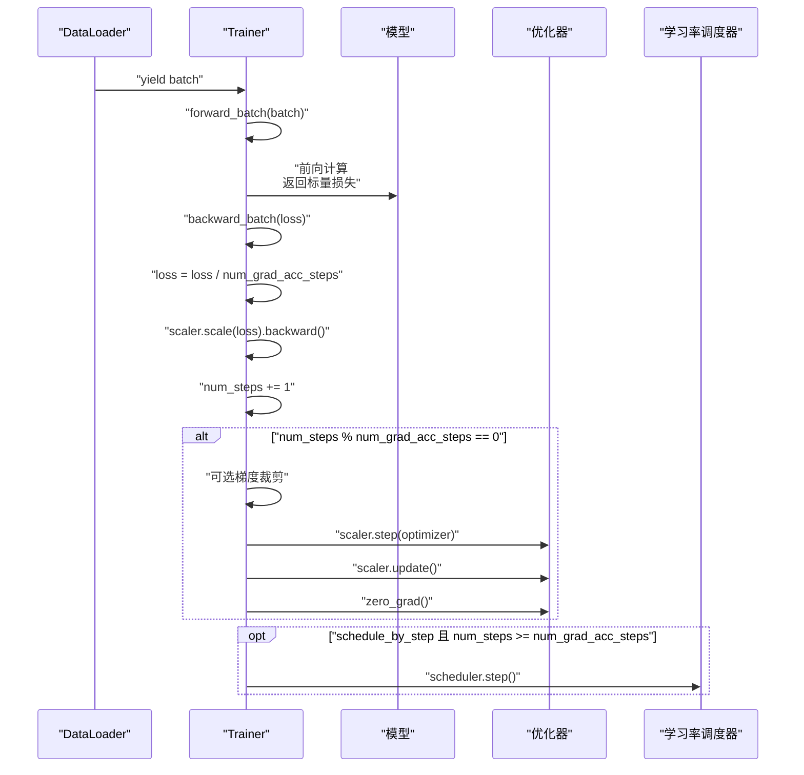
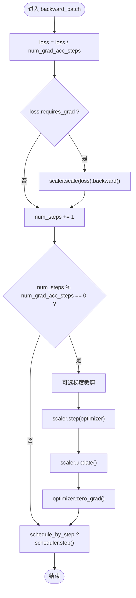
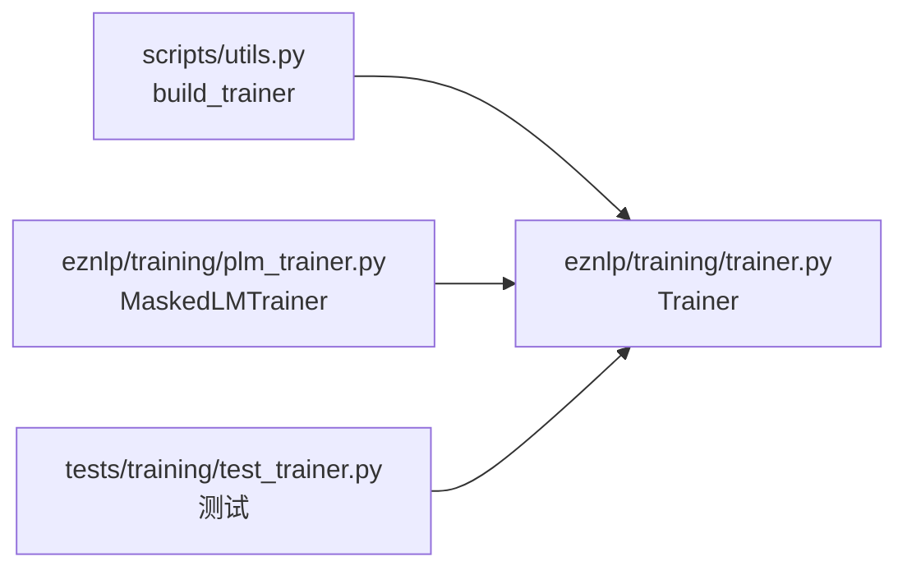

# 梯度累积机制

<cite>
**本文引用的文件列表**
- [eznlp/training/trainer.py](file://eznlp/training/trainer.py)
- [eznlp/training/plm_trainer.py](file://eznlp/training/plm_trainer.py)
- [scripts/utils.py](file://scripts/utils.py)
- [tests/training/test_trainer.py](file://tests/training/test_trainer.py)
</cite>

## 目录
1. [引言](#引言)
2. [项目结构](#项目结构)
3. [核心组件](#核心组件)
4. [架构总览](#架构总览)
5. [详细组件分析](#详细组件分析)
6. [依赖关系分析](#依赖关系分析)
7. [性能考量](#性能考量)
8. [故障排查指南](#故障排查指南)
9. [结论](#结论)
10. [附录：典型配置示例](#附录典型配置示例)

## 引言
本文围绕 num_grad_acc_steps 参数在 Trainer 初始化中的作用机制展开，系统阐述其如何将“名义批量大小”（nominal batch size）扩展为“实际批量大小”（real batch size = nominal batch size × num_grad_acc_steps），从而在显存受限时模拟更大批次的训练；并结合 Trainer.backward_batch 的实现，说明损失值如何按 num_grad_acc_steps 进行缩放以实现正确梯度累积，以及在梯度累积周期内 optimizer.zero_grad() 和 scheduler.step() 的调用时机。最后通过实际训练脚本示例展示该参数的典型配置场景。

## 项目结构
与梯度累积直接相关的核心文件如下：
- eznlp/training/trainer.py：定义 Trainer 类，包含 num_grad_acc_steps 的处理、forward_batch、backward_batch、train_steps 等关键逻辑
- eznlp/training/plm_trainer.py：继承 Trainer 并覆盖 forward_batch，用于掩码语言建模等场景
- scripts/utils.py：提供 build_trainer 工具函数，从命令行参数解析 num_grad_acc_steps 并构建 Trainer 实例
- tests/training/test_trainer.py：包含对梯度累积行为的单元测试，验证不同 batch_size 与 num_grad_acc_steps 组合下的等价性

图表来源
- [eznlp/training/trainer.py](file://eznlp/training/trainer.py#L1-L120)
- [eznlp/training/plm_trainer.py](file://eznlp/training/plm_trainer.py#L1-L35)
- [scripts/utils.py](file://scripts/utils.py#L95-L100)
- [scripts/utils.py](file://scripts/utils.py#L1301-L1338)
- [tests/training/test_trainer.py](file://tests/training/test_trainer.py#L36-L84)

章节来源
- [eznlp/training/trainer.py](file://eznlp/training/trainer.py#L1-L120)
- [eznlp/training/plm_trainer.py](file://eznlp/training/plm_trainer.py#L1-L35)
- [scripts/utils.py](file://scripts/utils.py#L95-L100)
- [scripts/utils.py](file://scripts/utils.py#L1301-L1338)
- [tests/training/test_trainer.py](file://tests/training/test_trainer.py#L36-L84)

## 核心组件
- Trainer.num_grad_acc_steps：控制梯度累积步数，决定“名义批次”到“实际批次”的放大倍率
- Trainer.backward_batch：负责损失缩放、反向传播、权重更新、优化器清零、学习率调度器步进
- build_trainer：从命令行参数读取 num_grad_acc_steps 并创建 Trainer 实例
- MaskedLMTrainer.forward_batch：覆盖 Trainer.forward_batch，适配掩码语言建模任务

章节来源
- [eznlp/training/trainer.py](file://eznlp/training/trainer.py#L15-L123)
- [eznlp/training/trainer.py](file://eznlp/training/trainer.py#L155-L220)
- [eznlp/training/trainer.py](file://eznlp/training/trainer.py#L221-L376)
- [eznlp/training/plm_trainer.py](file://eznlp/training/plm_trainer.py#L1-L35)
- [scripts/utils.py](file://scripts/utils.py#L95-L100)
- [scripts/utils.py](file://scripts/utils.py#L1301-L1338)

## 架构总览
下图展示了 Trainer 在一次训练循环中的关键调用序列，重点标注了 num_grad_acc_steps 如何影响“名义步数”与“真实权重更新步数”的对应关系。

图表来源
- [eznlp/training/trainer.py](file://eznlp/training/trainer.py#L64-L123)
- [eznlp/training/trainer.py](file://eznlp/training/trainer.py#L155-L220)
- [eznlp/training/trainer.py](file://eznlp/training/trainer.py#L221-L376)

## 详细组件分析

### Trainer.backward_batch 的梯度累积与缩放
- 损失缩放：在反向传播前，将损失除以 num_grad_acc_steps，确保累积多步损失后得到与“名义批次”一致的平均梯度
- 反向传播：使用 GradScaler 进行自动混合精度缩放后再执行 backward
- 权重更新：每累积 num_grad_acc_steps 步后进行一次 optimizer.step()，随后 zero_grad() 清空梯度
- 学习率调度：当 schedule_by_step 为真且累计步数达到阈值时，scheduler.step() 调度学习率

图表来源
- [eznlp/training/trainer.py](file://eznlp/training/trainer.py#L82-L123)

章节来源
- [eznlp/training/trainer.py](file://eznlp/training/trainer.py#L82-L123)

### Trainer.train_steps 与 eval_epoch 中的调用链
- 训练循环：每个 batch 调用 forward_batch 获取损失，再调用 backward_batch 完成累积与更新
- 评估循环：eval_epoch 同样调用 forward_batch，但不进行反向传播与权重更新

章节来源
- [eznlp/training/trainer.py](file://eznlp/training/trainer.py#L155-L220)
- [eznlp/training/trainer.py](file://eznlp/training/trainer.py#L221-L376)

### MaskedLMTrainer.forward_batch 的覆盖
- 针对掩码语言建模任务，构造输入字典并调用模型输出，最终取 loss 并做均值化（若存在维度）
- 该覆盖不影响 Trainer 的 backward_batch 行为，仅改变损失来源

章节来源
- [eznlp/training/plm_trainer.py](file://eznlp/training/plm_trainer.py#L1-L35)

### num_grad_acc_steps 的初始化与默认值
- Trainer.__init__ 将 num_grad_acc_steps 校验为正整数，否则回退为 1
- 该参数决定了“名义步数”与“真实权重更新步数”的比例关系

章节来源
- [eznlp/training/trainer.py](file://eznlp/training/trainer.py#L27-L63)

### build_trainer 与命令行参数
- 命令行参数 --num_grad_acc_steps 默认为 1
- build_trainer 将该参数传入 Trainer 构造函数，完成训练器装配

章节来源
- [scripts/utils.py](file://scripts/utils.py#L95-L100)
- [scripts/utils.py](file://scripts/utils.py#L1301-L1338)

### 测试用例验证等价性
- 使用相同随机种子初始化两个模型，分别以不同 batch_size 与 num_grad_acc_steps 组合训练一个 epoch
- 断言两者的“步数/累积步数”相等，且参数有显著变化，验证了梯度累积的正确性

章节来源
- [tests/training/test_trainer.py](file://tests/training/test_trainer.py#L36-L84)

## 依赖关系分析
- Trainer 依赖 torch.optim、torch.cuda.amp、torch.utils.data 等标准库
- MaskedLMTrainer 继承 Trainer，复用其 backward_batch 逻辑
- build_trainer 依赖 argparse 解析命令行参数，并根据数据加载器批次数设置学习率调度器的总步数

图表来源
- [scripts/utils.py](file://scripts/utils.py#L1301-L1338)
- [eznlp/training/trainer.py](file://eznlp/training/trainer.py#L1-L120)
- [eznlp/training/plm_trainer.py](file://eznlp/training/plm_trainer.py#L1-L35)
- [tests/training/test_trainer.py](file://tests/training/test_trainer.py#L36-L84)

章节来源
- [scripts/utils.py](file://scripts/utils.py#L1301-L1338)
- [eznlp/training/trainer.py](file://eznlp/training/trainer.py#L1-L120)
- [eznlp/training/plm_trainer.py](file://eznlp/training/plm_trainer.py#L1-L35)
- [tests/training/test_trainer.py](file://tests/training/test_trainer.py#L36-L84)

## 性能考量
- 显存占用：通过增大 num_grad_acc_steps，可以在较小 batch_size 下模拟更大批次，缓解显存压力
- 训练速度：累积步数越多，单次 optimizer.step() 的频率越低，可能减少优化器开销，但总步数增加
- 混合精度：Trainer 内置 GradScaler，配合 use_amp 可进一步降低显存并提升吞吐
- 梯度裁剪：在累积步末尾进行梯度裁剪，有助于稳定训练过程

[本节为通用建议，无需特定文件引用]

## 故障排查指南
- 学习率调度异常：若 schedule_by_step 为真，scheduler.step() 会在 num_steps 达到 num_grad_acc_steps 后才生效；若为假，则需在训练结束后手动调用
- 梯度未清零：确认 backward_batch 是否满足“num_steps % num_grad_acc_steps == 0”，否则不会执行 optimizer.zero_grad()
- 损失不收敛或不稳定：检查 num_grad_acc_steps 与 batch_size 的组合是否导致有效学习率过小；必要时调整学习率或启用 warmup
- 混合精度问题：确保 use_amp 与设备类型匹配；在 CPU 上使用 AMP 可能导致行为差异

章节来源
- [eznlp/training/trainer.py](file://eznlp/training/trainer.py#L115-L123)
- [eznlp/training/trainer.py](file://eznlp/training/trainer.py#L155-L220)

## 结论
num_grad_acc_steps 是实现“名义小批量、实际大批量”训练的关键参数。Trainer 通过在 backward_batch 中对损失进行缩放并在累积周期末执行 optimizer.step() 与 zero_grad()，保证了梯度累积的正确性；同时，学习率调度器的步进策略与 schedule_by_step 配合，使调度节奏与“名义步数”保持一致。借助 build_trainer 与命令行参数，用户可以灵活配置该机制，以适应不同硬件条件下的训练需求。

[本节为总结，无需特定文件引用]

## 附录：典型配置示例
以下示例展示如何在训练脚本中配置 num_grad_acc_steps，以实现“名义小批量、实际大批量”的训练目标。

- 命令行参数
  - 在命令行添加 --num_grad_acc_steps 参数，默认值为 1
  - 示例：python scripts/entity_recognition.py --dataset conll2003 --batch_size 16 --num_grad_acc_steps 2

- 脚本侧装配
  - build_trainer 会读取命令行参数并将其传递给 Trainer
  - 示例路径：[scripts/utils.py](file://scripts/utils.py#L1301-L1338)

- 测试对比
  - 单独训练：batch_size=4，num_grad_acc_steps=1
  - 梯度累积训练：batch_size=2，num_grad_acc_steps=2
  - 两者在“步数/累积步数”上应等价，且参数应发生明显变化
  - 示例路径：[tests/training/test_trainer.py](file://tests/training/test_trainer.py#L36-L84)

章节来源
- [scripts/utils.py](file://scripts/utils.py#L95-L100)
- [scripts/utils.py](file://scripts/utils.py#L1301-L1338)
- [tests/training/test_trainer.py](file://tests/training/test_trainer.py#L36-L84)