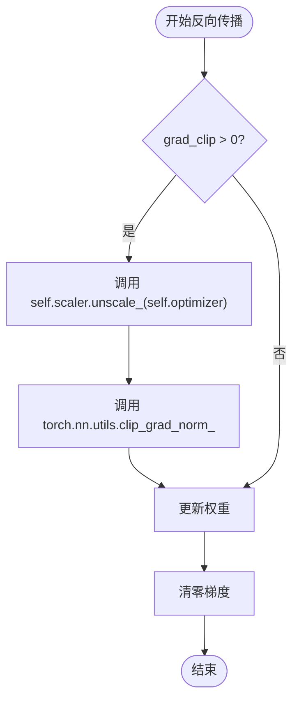

# 梯度裁剪配置

<cite>
**本文档引用的文件**
- [trainer.py](file://eznlp/training/trainer.py#L36-L60)
- [train_msra_ner_baseline_vs_expert_dict.py](file://scripts/train_msra_ner_baseline_vs_expert_dict.py#L339)
- [train_hz_ner_baseline_vs_expert_dict.py](file://scripts/train_hz_ner_baseline_vs_expert_dict.py#L360)
- [pt_bert.opt](file://scripts/options/pt_bert.opt#L13-L14)
- [utils.py](file://scripts/utils.py#L213-L214)
</cite>

## 目录
1. [梯度裁剪参数配置](#梯度裁剪参数配置)
2. [训练过程中的梯度裁剪机制](#训练过程中的梯度裁剪机制)
3. [clip_grad_norm_与clip_grad_value_的对比](#clip_grad_norm_与clip_grad_value_的对比)

## 梯度裁剪参数配置

`grad_clip` 参数在 `Trainer` 类的初始化中被配置，用于设置梯度裁剪的阈值，防止梯度爆炸问题。该参数在 `Trainer` 类的构造函数中定义为可选的浮点数类型，默认值为 `None`。当 `grad_clip` 被设置为一个正数时，系统将在更新权重前对模型参数的梯度进行裁剪。

在训练脚本中，`grad_clip` 参数通常通过命令行参数传入，并在解析参数时进行处理。例如，在 `train_msra_ner_baseline_vs_expert_dict.py` 和 `train_hz_ner_baseline_vs_expert_dict.py` 脚本中，`grad_clip` 参数的默认值被设置为 5.0。此外，在 `pt_bert.opt` 配置文件中，`grad_clip` 参数被设置为 -1，表示不启用梯度裁剪。

**Section sources**
- [trainer.py](file://eznlp/training/trainer.py#L36-L60)
- [train_msra_ner_baseline_vs_expert_dict.py](file://scripts/train_msra_ner_baseline_vs_expert_dict.py#L339)
- [train_hz_ner_baseline_vs_expert_dict.py](file://scripts/train_hz_ner_baseline_vs_expert_dict.py#L360)
- [pt_bert.opt](file://scripts/options/pt_bert.opt#L13-L14)

## 训练过程中的梯度裁剪机制

在训练过程中，当 `grad_clip` 参数不为 `None` 且大于 0 时，系统会在更新权重前调用 `self.scaler.unscale_(self.optimizer)` 解除梯度缩放，然后使用 `torch.nn.utils.clip_grad_norm_` 对模型参数的梯度进行裁剪。具体实现位于 `Trainer` 类的 `backward_batch` 方法中。

**Diagram sources**
- [trainer.py](file://eznlp/training/trainer.py#L104-L113)

**Section sources**
- [trainer.py](file://eznlp/training/trainer.py#L104-L113)

## clip_grad_norm_与clip_grad_value_的对比

`clip_grad_norm_` 和 `clip_grad_value_` 是两种不同的梯度裁剪方法。`clip_grad_norm_` 根据梯度的范数进行裁剪，而 `clip_grad_value_` 则根据梯度的绝对值进行裁剪。项目中选择 `clip_grad_norm_` 作为默认裁剪方式，因为这种方法能够更好地保持梯度的方向信息，同时有效防止梯度爆炸问题。

在 `Trainer` 类的 `backward_batch` 方法中，`clip_grad_norm_` 被用于对模型参数的梯度进行裁剪，而 `clip_grad_value_` 的调用被注释掉，表明项目中优先使用 `clip_grad_norm_`。

**Section sources**
- [trainer.py](file://eznlp/training/trainer.py#L107-L108)