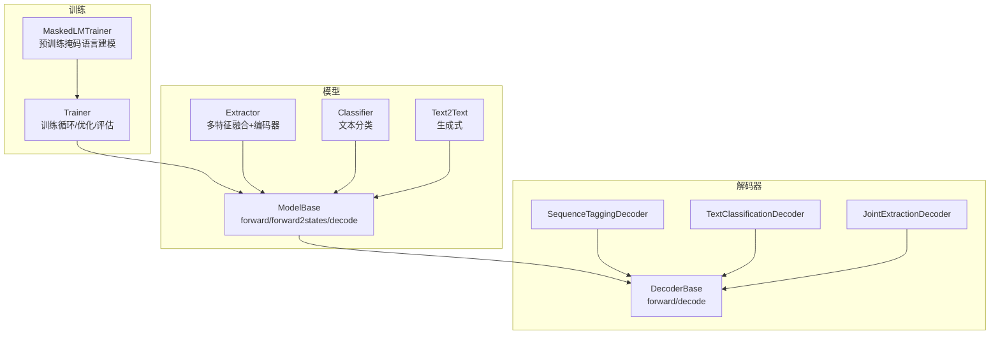
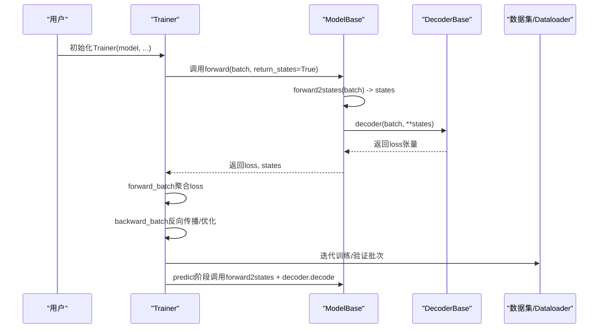
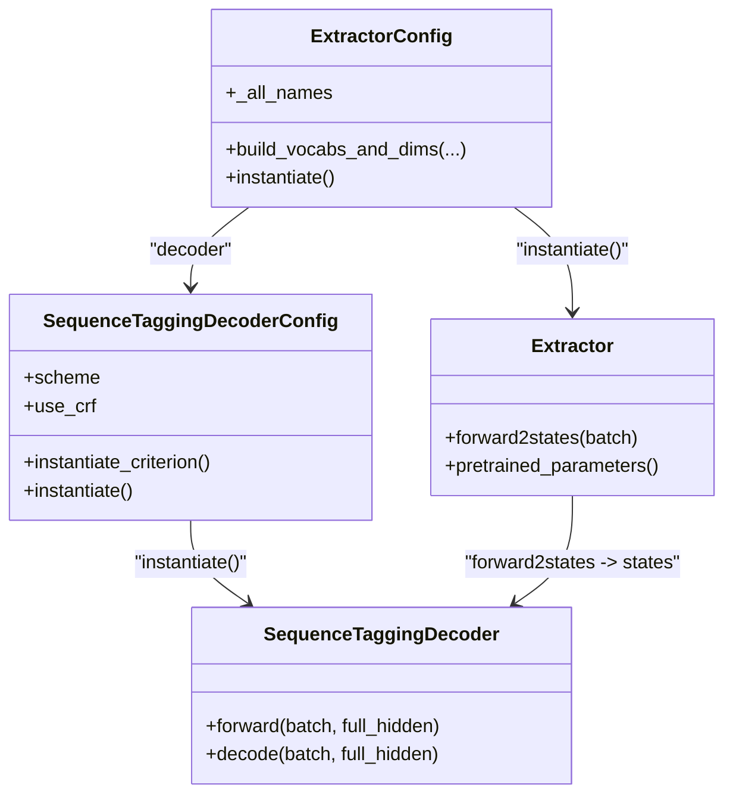
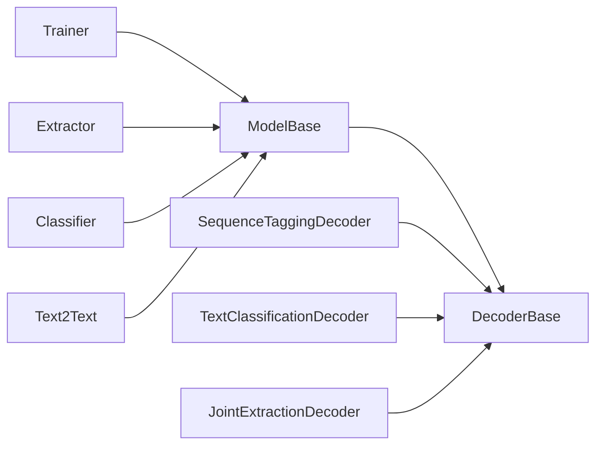

# 模型配置

<cite>
**本文引用的文件列表**
- [eznlp/training/trainer.py](file://eznlp/training/trainer.py)
- [eznlp/training/plm_trainer.py](file://eznlp/training/plm_trainer.py)
- [eznlp/model/model/base.py](file://eznlp/model/model/base.py)
- [eznlp/model/decoder/base.py](file://eznlp/model/decoder/base.py)
- [eznlp/model/decoder/sequence_tagging.py](file://eznlp/model/decoder/sequence_tagging.py)
- [eznlp/model/decoder/text_classification.py](file://eznlp/model/decoder/text_classification.py)
- [eznlp/model/decoder/joint_extraction.py](file://eznlp/model/decoder/joint_extraction.py)
- [eznlp/model/model/extractor.py](file://eznlp/model/model/extractor.py)
- [eznlp/model/model/classifier.py](file://eznlp/model/model/classifier.py)
- [eznlp/model/model/text2text.py](file://eznlp/model/model/text2text.py)
- [tests/model/test_sequence_tagging.py](file://tests/model/test_sequence_tagging.py)
- [tests/model/test_span_classification.py](file://tests/model/test_span_classification.py)
- [tests/training/test_trainer.py](file://tests/training/test_trainer.py)
</cite>

## 目录
1. [简介](#简介)
2. [项目结构](#项目结构)
3. [核心组件](#核心组件)
4. [架构总览](#架构总览)
5. [详细组件分析](#详细组件分析)
6. [依赖关系分析](#依赖关系分析)
7. [性能考量](#性能考量)
8. [故障排查指南](#故障排查指南)
9. [结论](#结论)
10. [附录](#附录)

## 简介
本节聚焦于Trainer初始化过程中“模型参数”的配置方式，阐明以下关键点：
- 如何将ModelBase实例传入Trainer构造函数
- 模型与Trainer之间的交互机制（forward_batch、backward_batch、predict）
- 模型组件（尤其是decoder）如何影响训练流程（损失计算、指标评估、解码）
- 模型必须实现的接口（如forward2states、_unsqueezed_decode等）
- 不同模型架构（序列标注模型与Span分类模型）在初始化时的差异处理

## 项目结构
围绕“模型配置”主题，涉及的关键模块如下：
- 训练器：Trainer、MaskedLMTrainer
- 模型基类：ModelBase及其子类（Extractor、Classifier、Text2Text）
- 解码器：DecoderBase及多种具体解码器（序列标注、文本分类、联合抽取等）
- 测试用例：覆盖序列标注与Span分类的训练与预测流程

图表来源
- [eznlp/training/trainer.py](file://eznlp/training/trainer.py#L1-L120)
- [eznlp/training/plm_trainer.py](file://eznlp/training/plm_trainer.py#L1-L35)
- [eznlp/model/model/base.py](file://eznlp/model/model/base.py#L64-L99)
- [eznlp/model/decoder/base.py](file://eznlp/model/decoder/base.py#L90-L114)
- [eznlp/model/decoder/sequence_tagging.py](file://eznlp/model/decoder/sequence_tagging.py#L143-L198)
- [eznlp/model/decoder/text_classification.py](file://eznlp/model/decoder/text_classification.py#L79-L117)
- [eznlp/model/decoder/joint_extraction.py](file://eznlp/model/decoder/joint_extraction.py#L154-L193)
- [eznlp/model/model/extractor.py](file://eznlp/model/model/extractor.py#L211-L274)
- [eznlp/model/model/classifier.py](file://eznlp/model/model/classifier.py#L186-L249)
- [eznlp/model/model/text2text.py](file://eznlp/model/model/text2text.py#L64-L94)

章节来源
- [eznlp/training/trainer.py](file://eznlp/training/trainer.py#L1-L120)
- [eznlp/model/model/base.py](file://eznlp/model/model/base.py#L64-L99)

## 核心组件
- Trainer
  - 接收ModelBase实例作为参数，并从模型的decoder中推断指标数量（num_metrics）
  - 在forward_batch中调用模型的forward(return_states=True)，得到loss与states
  - 在backward_batch中进行梯度缩放、裁剪与权重更新
  - 提供predict方法用于推理阶段的解码
- ModelBase
  - 将ModelConfig中的嵌套组件（如embedder、encoder、decoder）实例化为Module或ModuleDict
  - 定义forward2states抽象接口；forward统一调用forward2states并交由decoder计算损失
  - 提供decode接口，委托decoder进行解码
- DecoderBase/DecoderMixinBase
  - 定义forward与decode抽象接口
  - 提供_num_metrics、_unsqueezed_decode/_unsqueezed_evaluate/_unsqueezed_retrieve等工具方法
  - 具体解码器（如SequenceTaggingDecoder、TextClassificationDecoder、JointExtractionDecoder）实现各自前向与解码逻辑

章节来源
- [eznlp/training/trainer.py](file://eznlp/training/trainer.py#L15-L120)
- [eznlp/model/model/base.py](file://eznlp/model/model/base.py#L64-L99)
- [eznlp/model/decoder/base.py](file://eznlp/model/decoder/base.py#L1-L114)

## 架构总览
下图展示了Trainer与ModelBase/Decoder之间的交互流程，以及不同模型架构（Extractor/Classifier/Text2Text）如何通过各自的forward2states提供状态给decoder。

图表来源
- [eznlp/training/trainer.py](file://eznlp/training/trainer.py#L64-L120)
- [eznlp/model/model/base.py](file://eznlp/model/model/base.py#L81-L99)
- [eznlp/model/decoder/base.py](file://eznlp/model/decoder/base.py#L90-L114)

## 详细组件分析

### Trainer初始化与参数配置
- 参数接收
  - model: 必须是ModelBase实例（继承自torch.nn.Module）
  - optimizer/scheduler/schedule_by_step: 优化器与学习率调度器
  - num_grad_acc_steps: 梯度累积步数
  - device: 训练设备
  - non_blocking、grad_clip、use_amp: 性能与数值稳定性相关选项
- 关键行为
  - 从model.decoder推断指标数量num_metrics，用于训练/评估时的指标收集
  - forward_batch中调用model(batch, return_states=True)以获得loss与states
  - backward_batch中对loss进行缩放、裁剪与权重更新
  - predict支持beam_search（当模型具备该方法且beam_size<=1时）

章节来源
- [eznlp/training/trainer.py](file://eznlp/training/trainer.py#L27-L120)

### 模型与Trainer的交互机制
- forward_batch
  - 调用model(batch, return_states=True)
  - 若num_metrics>0，则调用decoder._unsqueezed_decode返回预测结果
- backward_batch
  - 对loss按num_grad_acc_steps进行归一化
  - 使用GradScaler进行混合精度缩放
  - 可选梯度裁剪与优化器step
  - 学习率调度器按step或epoch推进
- predict
  - 支持两种路径：直接调用model.forward2states + decoder._unsqueezed_decode，或调用模型的beam_search

章节来源
- [eznlp/training/trainer.py](file://eznlp/training/trainer.py#L64-L154)

### 模型组件（Decoder）对训练流程的影响
- 指标数量num_metrics
  - Trainer根据model.decoder.num_metrics决定是否返回预测值与进行指标评估
- 解码与评估
  - Trainer在训练/评估时调用decoder._unsqueezed_retrieve获取gold标签，调用decoder._unsqueezed_decode获取pred标签，再调用decoder._unsqueezed_evaluate计算指标
- 多任务解码器（JointExtractionDecoder）
  - 可同时包含实体识别、属性分类、关系分类等子解码器，num_metrics为子解码器数量之和
  - forward会加权聚合各子解码器的loss

章节来源
- [eznlp/training/trainer.py](file://eznlp/training/trainer.py#L155-L220)
- [eznlp/model/decoder/joint_extraction.py](file://eznlp/model/decoder/joint_extraction.py#L19-L66)
- [eznlp/model/decoder/joint_extraction.py](file://eznlp/model/decoder/joint_extraction.py#L154-L193)

### 模型必须实现的接口
- ModelBase
  - forward2states(batch): 抽象方法，返回字典形式的状态（如full_hidden、src_hidden等）
  - forward(batch, return_states=False): 统一入口，内部调用forward2states并交由decoder计算损失
  - decode(batch, **states): 委托decoder.decode
- DecoderBase/DecoderMixinBase
  - forward(batch, **states): 计算损失
  - decode(batch, **states): 生成预测结果
  - _unsqueezed_decode/_unsqueezed_evaluate/_unsqueezed_retrieve：用于兼容单/多指标场景
  - num_metrics：指示指标数量（0表示无指标）

章节来源
- [eznlp/model/model/base.py](file://eznlp/model/model/base.py#L81-L99)
- [eznlp/model/decoder/base.py](file://eznlp/model/decoder/base.py#L90-L114)

### 不同模型架构在初始化时的差异处理

#### 序列标注模型（Extractor + SequenceTaggingDecoder）
- 配置要点
  - ExtractorConfig可选择多种嵌入器（ohots/mhots/nested_ohots）、预训练编码器（ELMo/BERT-like/Flair）与中间层编码器
  - decoder默认为SequenceTaggingDecoderConfig，支持CRF或交叉熵损失
- 初始化差异
  - Extractor.forward2states返回full_hidden，供SequenceTaggingDecoder前向计算logits并基于CRF或交叉熵计算损失
  - 测试用例覆盖了多种嵌入器组合、预训练模型接入、不同标注方案（BIOES/BIO1/BIO2）等

图表来源
- [eznlp/model/model/extractor.py](file://eznlp/model/model/extractor.py#L23-L110)
- [eznlp/model/model/extractor.py](file://eznlp/model/model/extractor.py#L211-L274)
- [eznlp/model/decoder/sequence_tagging.py](file://eznlp/model/decoder/sequence_tagging.py#L93-L141)
- [eznlp/model/decoder/sequence_tagging.py](file://eznlp/model/decoder/sequence_tagging.py#L143-L198)

章节来源
- [eznlp/model/model/extractor.py](file://eznlp/model/model/extractor.py#L23-L110)
- [eznlp/model/model/extractor.py](file://eznlp/model/model/extractor.py#L211-L274)
- [eznlp/model/decoder/sequence_tagging.py](file://eznlp/model/decoder/sequence_tagging.py#L93-L141)
- [eznlp/model/decoder/sequence_tagging.py](file://eznlp/model/decoder/sequence_tagging.py#L143-L198)
- [tests/model/test_sequence_tagging.py](file://tests/model/test_sequence_tagging.py#L1-L213)

#### Span分类模型（Extractor + SpanClassificationDecoder）
- 配置要点
  - ExtractorConfig的decoder可设置为SpanClassificationDecoderConfig，支持最大池化/注意力聚合、多标签、焦点损失等
  - 支持BERT-like子词切分场景，必要时需预处理数据（如BertLikePreProcessor）
- 初始化差异
  - Extractor.forward2states返回full_hidden，SpanClassificationDecoder基于聚合后的隐藏态计算类别logits并计算损失
  - 测试用例覆盖了不同聚合模式、多标签、焦点损失、子词切分等场景

图表来源
- [eznlp/model/model/extractor.py](file://eznlp/model/model/extractor.py#L23-L110)
- [eznlp/model/model/extractor.py](file://eznlp/model/model/extractor.py#L211-L274)
- [eznlp/model/decoder/text_classification.py](file://eznlp/model/decoder/text_classification.py#L48-L77)
- [eznlp/model/decoder/text_classification.py](file://eznlp/model/decoder/text_classification.py#L79-L117)

章节来源
- [eznlp/model/model/extractor.py](file://eznlp/model/model/extractor.py#L23-L110)
- [eznlp/model/model/extractor.py](file://eznlp/model/model/extractor.py#L211-L274)
- [eznlp/model/decoder/text_classification.py](file://eznlp/model/decoder/text_classification.py#L48-L77)
- [eznlp/model/decoder/text_classification.py](file://eznlp/model/decoder/text_classification.py#L79-L117)
- [tests/model/test_span_classification.py](file://tests/model/test_span_classification.py#L1-L114)

#### 文本分类模型（Classifier + TextClassificationDecoder）
- 配置要点
  - ClassifierConfig与Extractor类似，但decoder固定为TextClassificationDecoderConfig
  - 支持多种聚合模式（max_pooling、multiplicative_attention等）
- 初始化差异
  - Classifier.forward2states返回full_hidden，TextClassificationDecoder基于聚合隐藏态计算类别logits并计算损失

章节来源
- [eznlp/model/model/classifier.py](file://eznlp/model/model/classifier.py#L16-L79)
- [eznlp/model/model/classifier.py](file://eznlp/model/model/classifier.py#L186-L249)
- [eznlp/model/decoder/text_classification.py](file://eznlp/model/decoder/text_classification.py#L48-L77)
- [eznlp/model/decoder/text_classification.py](file://eznlp/model/decoder/text_classification.py#L79-L117)

#### 生成式模型（Text2Text + Generator）
- 配置要点
  - Text2TextConfig包含embedder、encoder、decoder(generator)三部分
  - forward2states返回src_hidden/src_mask/logits，供decoder生成式前向
- 初始化差异
  - Text2Text.forward2states返回src_hidden/src_mask/logits，供Generator解码器使用

章节来源
- [eznlp/model/model/text2text.py](file://eznlp/model/model/text2text.py#L11-L63)
- [eznlp/model/model/text2text.py](file://eznlp/model/model/text2text.py#L64-L94)

### 预训练语言模型训练（MaskedLMTrainer）
- 特点
  - 继承Trainer，重写forward_batch，直接从batch中提取输入ID、注意力掩码、标签等
  - 支持paired_lab_ids（如NSP任务）并自动拼接至模型输入
  - 对多GPU场景下的loss维度进行mean处理

章节来源
- [eznlp/training/plm_trainer.py](file://eznlp/training/plm_trainer.py#L1-L35)

## 依赖关系分析
- Trainer依赖ModelBase（通过forward2states与decoder交互）
- ModelBase依赖其配置（ModelConfigBase）构建嵌套组件
- DecoderBase定义通用接口，具体解码器实现各自前向与解码逻辑
- 不同模型架构（Extractor/Classifier/Text2Text）通过各自的forward2states提供状态给decoder

图表来源
- [eznlp/training/trainer.py](file://eznlp/training/trainer.py#L15-L120)
- [eznlp/model/model/base.py](file://eznlp/model/model/base.py#L64-L99)
- [eznlp/model/decoder/base.py](file://eznlp/model/decoder/base.py#L90-L114)
- [eznlp/model/model/extractor.py](file://eznlp/model/model/extractor.py#L211-L274)
- [eznlp/model/model/classifier.py](file://eznlp/model/model/classifier.py#L186-L249)
- [eznlp/model/model/text2text.py](file://eznlp/model/model/text2text.py#L64-L94)
- [eznlp/model/decoder/sequence_tagging.py](file://eznlp/model/decoder/sequence_tagging.py#L143-L198)
- [eznlp/model/decoder/text_classification.py](file://eznlp/model/decoder/text_classification.py#L79-L117)
- [eznlp/model/decoder/joint_extraction.py](file://eznlp/model/decoder/joint_extraction.py#L154-L193)

## 性能考量
- 混合精度训练
  - Trainer使用GradScaler进行缩放，可在GPU上显著降低显存占用并提升吞吐
- 梯度累积
  - 通过num_grad_acc_steps实现有效批大小扩展，便于在有限显存下增大batch
- 梯度裁剪
  - 可选clip_grad_norm，避免梯度爆炸
- 自动设备迁移
  - Trainer在forward_batch/eval_epoch/predict中将Batch移动到指定device

章节来源
- [eznlp/training/trainer.py](file://eznlp/training/trainer.py#L39-L120)

## 故障排查指南
- 指标数量为0
  - 当model.decoder.num_metrics为0时，Trainer不会返回预测值，也不会进行指标评估
  - 检查模型是否正确实现了decoder或decoder.num_metrics是否被错误设置
- 损失维度异常
  - 多GPU场景下，Trainer会对loss进行mean处理；若自定义Trainer，请确保损失维度一致性
- 梯度不更新
  - 若loss.requires_grad为False，backward将跳过反向传播；检查decoder是否返回标量或是否被正确求导
- Beam搜索限制
  - predict阶段beam_search仅在num_metrics==1且beam_size<=1时可用

章节来源
- [eznlp/training/trainer.py](file://eznlp/training/trainer.py#L64-L154)
- [eznlp/training/trainer.py](file://eznlp/training/trainer.py#L124-L154)

## 结论
- Trainer通过接收ModelBase实例，统一管理模型的前向、损失、解码与优化流程
- ModelBase将配置转换为可执行的模块树，forward2states负责产出状态，decoder负责损失与解码
- 不同模型架构（序列标注、Span分类、文本分类、生成式）在初始化时通过各自的Config/forward2states适配，decoder则承担统一的损失与评估职责
- 通过测试用例可见，序列标注与Span分类在配置灵活性、预训练接入、损失策略等方面存在差异，但均遵循上述统一交互范式

## 附录
- 训练流程示例（序列标注）
  - 使用ExtractorConfig + SequenceTaggingDecoderConfig，构建Dataset并训练
  - 参考路径：tests/model/test_sequence_tagging.py
- 训练流程示例（Span分类）
  - 使用ExtractorConfig + SpanClassificationDecoderConfig，支持多标签与焦点损失
  - 参考路径：tests/model/test_span_classification.py
- Trainer训练步骤对比（梯度累积）
  - 对比相同随机种子下，常规与梯度累积两次训练结果参数一致
  - 参考路径：tests/training/test_trainer.py

章节来源
- [tests/model/test_sequence_tagging.py](file://tests/model/test_sequence_tagging.py#L1-L213)
- [tests/model/test_span_classification.py](file://tests/model/test_span_classification.py#L1-L114)
- [tests/training/test_trainer.py](file://tests/training/test_trainer.py#L1-L84)