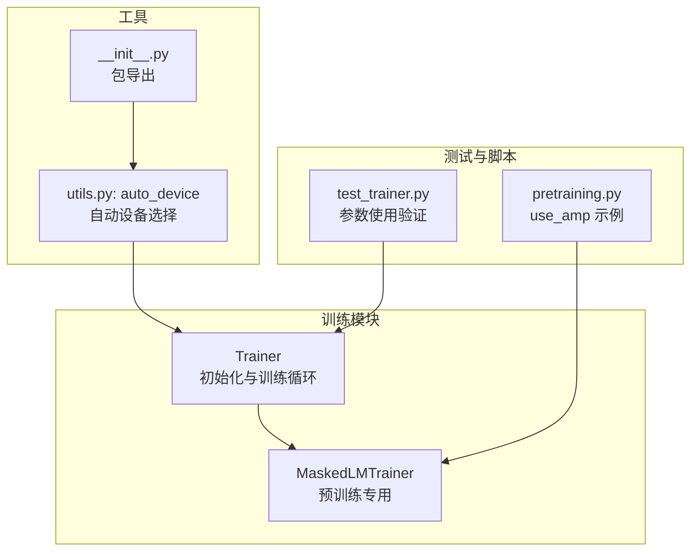
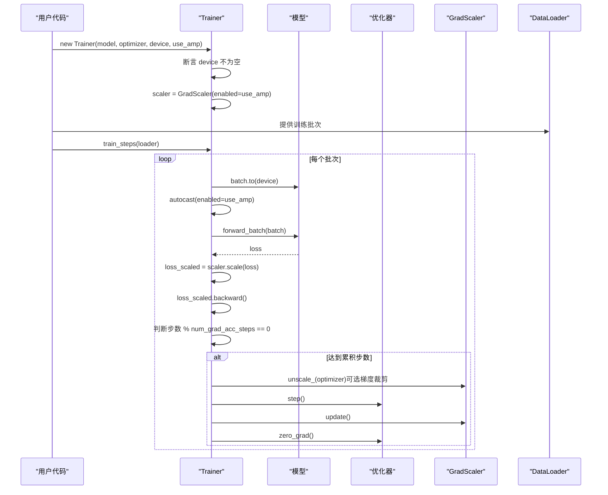
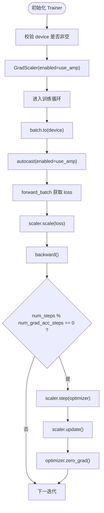
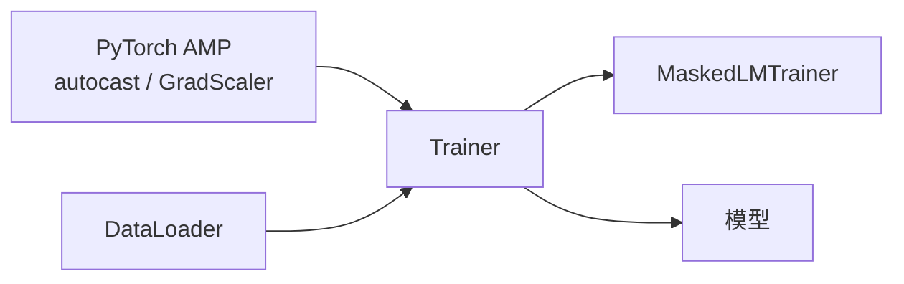

# 设备配置与混合精度训练

<cite>
**本文引用的文件**
- [trainer.py](file://eznlp/training/trainer.py)
- [plm_trainer.py](file://eznlp/training/plm_trainer.py)
- [test_trainer.py](file://tests/training/test_trainer.py)
- [pretraining.py](file://scripts/pretraining.py)
- [utils.py](file://eznlp/training/utils.py)
- [__init__.py](file://eznlp/__init__.py)
</cite>

## 目录
1. [引言](#引言)
2. [项目结构](#项目结构)
3. [核心组件](#核心组件)
4. [架构总览](#架构总览)
5. [详细组件分析](#详细组件分析)
6. [依赖分析](#依赖分析)
7. [性能考虑](#性能考虑)
8. [故障排查指南](#故障排查指南)
9. [结论](#结论)

## 引言
本文件围绕训练器 Trainer 的两个关键配置项：device 与 use_amp，系统阐述它们在初始化时的作用、用法与最佳实践。重点说明：
- device 参数如何指定模型与数据的运行设备（CPU 或 CUDA），并强调其为必填项；
- use_amp 参数如何启用 PyTorch 自动混合精度（AMP）训练，包括 GradScaler 的初始化与在反向传播中的应用；
- 混合精度训练对计算效率与显存占用的优化效果，并讨论其在现代 GPU 上的适用性。

## 项目结构
与 Trainer 初始化及 AMP 使用直接相关的核心文件如下：
- 训练器实现：eznlp/training/trainer.py
- 预训练专用训练器：eznlp/training/plm_trainer.py
- 测试用例：tests/training/test_trainer.py
- 脚本示例（预训练脚本展示 use_amp 的使用）：scripts/pretraining.py
- 设备选择工具：eznlp/training/utils.py 中的 auto_device 函数
- 包导出入口：eznlp/__init__.py

图表来源
- [trainer.py](file://eznlp/training/trainer.py#L1-L120)
- [plm_trainer.py](file://eznlp/training/plm_trainer.py#L1-L35)
- [test_trainer.py](file://tests/training/test_trainer.py#L1-L35)
- [pretraining.py](file://scripts/pretraining.py#L198-L235)
- [utils.py](file://eznlp/training/utils.py#L158-L202)
- [__init__.py](file://eznlp/__init__.py#L1-L7)

章节来源
- [trainer.py](file://eznlp/training/trainer.py#L1-L120)
- [plm_trainer.py](file://eznlp/training/plm_trainer.py#L1-L35)
- [test_trainer.py](file://tests/training/test_trainer.py#L1-L35)
- [pretraining.py](file://scripts/pretraining.py#L198-L235)
- [utils.py](file://eznlp/training/utils.py#L158-L202)
- [__init__.py](file://eznlp/__init__.py#L1-L7)

## 核心组件
- Trainer 类负责训练生命周期管理，包含设备与混合精度的关键配置与使用点：
  - device 必填参数，用于将模型与批数据移动到目标设备；
  - use_amp 布尔开关，控制是否启用 AMP；
  - GradScaler 在 Trainer.__init__ 中按 use_amp 初始化；
  - 反向传播阶段通过 scaler.scale(loss).backward()、scaler.step(optimizer)、scaler.update() 完成权重更新；
  - 训练/评估前向阶段使用 torch.amp.autocast(device_type="cuda", enabled=self.use_amp) 包裹。

章节来源
- [trainer.py](file://eznlp/training/trainer.py#L27-L63)
- [trainer.py](file://eznlp/training/trainer.py#L82-L114)
- [trainer.py](file://eznlp/training/trainer.py#L155-L189)
- [trainer.py](file://eznlp/training/trainer.py#L221-L376)

## 架构总览
下图展示了 Trainer 初始化与训练循环中设备与混合精度的关键交互路径。

图表来源
- [trainer.py](file://eznlp/training/trainer.py#L27-L63)
- [trainer.py](file://eznlp/training/trainer.py#L82-L114)
- [trainer.py](file://eznlp/training/trainer.py#L155-L189)
- [trainer.py](file://eznlp/training/trainer.py#L221-L376)

## 详细组件分析

### Trainer 初始化：device 与 use_amp 的配置
- device 参数必须提供，否则初始化即断言失败。该参数决定模型与批数据的运行设备，贯穿训练与评估阶段的数据搬运。
- use_amp 控制是否启用 AMP；Trainer 将据此创建 GradScaler 实例，且在前向阶段使用 autocast 包裹张量计算。
- 反向传播中，loss 先经 scaler.scale 缩放后参与反向，随后根据累积步数条件执行 optimizer.step 与 scaler.update。

图表来源
- [trainer.py](file://eznlp/training/trainer.py#L27-L63)
- [trainer.py](file://eznlp/training/trainer.py#L82-L114)
- [trainer.py](file://eznlp/training/trainer.py#L155-L189)

章节来源
- [trainer.py](file://eznlp/training/trainer.py#L27-L63)
- [trainer.py](file://eznlp/training/trainer.py#L82-L114)

### 设备选择工具：auto_device
- 当需要自动选择设备时，可调用 utils.auto_device 返回最合适的 torch.device（优先 CUDA，若内存不足或不可用则回退 CPU）。
- 该工具常用于脚本入口处，便于在多 GPU 环境中选择合适设备并设置当前设备。

章节来源
- [utils.py](file://eznlp/training/utils.py#L158-L202)
- [__init__.py](file://eznlp/__init__.py#L1-L7)

### 预训练专用训练器：MaskedLMTrainer
- 继承自 Trainer，复用其设备与 AMP 能力；在 forward_batch 中构造模型输入并返回损失，支持多 GPU 场景下的均值化处理。

章节来源
- [plm_trainer.py](file://eznlp/training/plm_trainer.py#L1-L35)

### 使用示例与测试验证
- 测试用例展示了 Trainer 的 use_amp 参数在不同设备类型下的行为：当设备为 CPU 时跳过 AMP 测试，确保仅在 CUDA 上进行 AMP 训练。
- 预训练脚本示例明确传入 use_amp 参数，体现其在实际工程中的使用方式。

章节来源
- [test_trainer.py](file://tests/training/test_trainer.py#L1-L35)
- [pretraining.py](file://scripts/pretraining.py#L198-L235)

## 依赖分析
- Trainer 对 torch.amp.autocast 与 torch.amp.GradScaler 的直接依赖，决定了 AMP 的开启与缩放策略；
- Trainer 对 DataLoader 的依赖体现在每步将 batch 移动到指定设备；
- MaskedLMTrainer 依赖 Trainer 的通用训练流程，同时在前向阶段适配预训练任务的输入格式。

图表来源
- [trainer.py](file://eznlp/training/trainer.py#L155-L189)
- [trainer.py](file://eznlp/training/trainer.py#L221-L376)
- [plm_trainer.py](file://eznlp/training/plm_trainer.py#L1-L35)

章节来源
- [trainer.py](file://eznlp/training/trainer.py#L155-L189)
- [trainer.py](file://eznlp/training/trainer.py#L221-L376)
- [plm_trainer.py](file://eznlp/training/plm_trainer.py#L1-L35)

## 性能考虑
- 计算效率提升：AMP 在 CUDA 上以半精度（或混合精度）进行前向与反向计算，通常可显著降低显存占用并提高吞吐，尤其在大模型与大批量场景下收益明显。
- 显存占用优化：AMP 通过动态缩放避免梯度下溢，减少全精度存储需求；结合合理的 batch size 与梯度累积，可在有限显存内扩大有效批量。
- 现代 GPU 适用性：AMP 在较新一代 NVIDIA GPU（如 Ampere、Ada 系列）上表现更佳，建议在支持 FP16 的设备上启用 use_amp；在 CPU 上启用 AMP 将被测试用例跳过，避免无效开销。

[本节为通用性能讨论，不直接分析具体文件]

## 故障排查指南
- device 未提供导致初始化失败：确认 Trainer 初始化时传入有效的 torch.device（CPU 或 CUDA）。
- AMP 在 CPU 上无效：若设备为 CPU，use_amp 将不会生效，测试用例会跳过相关步骤；请切换至 CUDA 设备。
- 梯度裁剪与 AMP 协同：当启用梯度裁剪时，需先 unscale_ 再 clip，再 step 与 update，确保数值稳定性。
- 多 GPU 训练注意：在多 GPU 场景下，loss 可能为标量张量，需使用 mean() 进行平均后再参与反向。

章节来源
- [trainer.py](file://eznlp/training/trainer.py#L57-L63)
- [trainer.py](file://eznlp/training/trainer.py#L82-L114)
- [trainer.py](file://eznlp/training/trainer.py#L155-L189)
- [test_trainer.py](file://tests/training/test_trainer.py#L1-L35)

## 结论
- device 是 Trainer 初始化的必填参数，决定模型与数据的运行设备，贯穿训练与评估阶段；
- use_amp 通过 GradScaler 与 autocast 实现 AMP 训练，显著优化显存占用与吞吐，建议在现代 CUDA 设备上启用；
- 在工程实践中，可通过 utils.auto_device 自动选择最优设备，并在脚本中传递 use_amp 参数以启用 AMP。