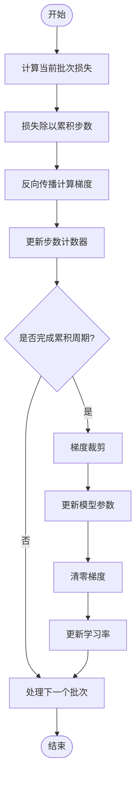

# 梯度累积

<cite>
**本文档中引用的文件**  
- [trainer.py](file://eznlp/training/trainer.py)
- [utils.py](file://eznlp/training/utils.py)
- [test_trainer.py](file://tests/training/test_trainer.py)
- [text_classification.py](file://scripts/text_classification.py)
- [utils.py](file://scripts/utils.py)
</cite>

## 目录
1. [引言](#引言)
2. [梯度累积原理](#梯度累积原理)
3. [核心参数分析](#核心参数分析)
4. [训练流程控制](#训练流程控制)
5. [代码实现示例](#代码实现示例)
6. [性能影响分析](#性能影响分析)
7. [结论](#结论)

## 引言
梯度累积是一种在显存受限情况下训练大规模深度学习模型的重要技术。通过将名义批量大小扩展为实际批量大小，该技术能够在有限硬件资源下模拟更大批量的训练效果，从而提升模型训练的稳定性和最终性能。本文档详细解析eznlp框架中梯度累积的实现机制及其应用场景。

## 梯度累积原理

梯度累积的核心思想是将多个小批量的梯度计算结果累加，然后进行一次参数更新，从而模拟大批次训练的效果。在eznlp中，这一机制通过`Trainer`类中的`num_grad_acc_steps`参数实现。

当使用梯度累积时，实际批量大小等于名义批量大小乘以梯度累积步数。例如，若名义批量大小为4，梯度累积步数为2，则实际批量大小为8。这种方法允许在显存有限的情况下训练需要大批次才能收敛的复杂模型。

在反向传播过程中，损失值会被除以累积步数，确保梯度的尺度与直接使用大批次训练时一致。这种处理方式保证了梯度更新的数学等价性，使得小批次累积更新与大批次单次更新具有相同的期望效果。

**Section sources**
- [trainer.py](file://eznlp/training/trainer.py#L15-L25)

## 核心参数分析

`num_grad_acc_steps`参数是控制梯度累积行为的关键配置。该参数在`Trainer`类初始化时被设置，默认值为1（即不使用梯度累积）。当该值大于1时，系统将启用梯度累积机制。

在`backward_batch`方法中，损失值首先被除以`num_grad_acc_steps`，这一操作确保了梯度的平均化。随后，梯度被累积到参数中，但不会立即更新参数。只有当累积的步数达到`num_grad_acc_steps`指定的值时，才会执行优化器更新和梯度清零操作。

该参数的设置需要权衡训练稳定性和内存消耗。较大的累积步数可以提高训练稳定性，但也会增加训练时间；较小的步数则可能导致训练过程不稳定。

**Section sources**
- [trainer.py](file://eznlp/training/trainer.py#L33-L54)
- [trainer.py](file://eznlp/training/trainer.py#L91-L93)

## 训练流程控制

梯度累积的训练流程控制主要体现在`backward_batch`方法中。该方法首先将当前批次的损失除以累积步数，然后执行反向传播计算梯度。梯度被累积到参数的梯度缓冲区中，但不会立即更新参数。

系统通过`num_steps`计数器跟踪已经处理的批次数量。当`num_steps`能被`num_grad_acc_steps`整除时，表示完成了一个完整的累积周期，此时执行以下操作：
1. 如果设置了梯度裁剪，则对累积的梯度进行裁剪
2. 执行优化器的step操作，更新模型参数
3. 调用优化器的zero_grad方法清零梯度
4. 如果使用了按步调度的学习率策略，则更新学习率

这种机制确保了参数更新的频率与实际批量大小相匹配，同时保持了学习率调度的正确性。

**Diagram sources**
- [trainer.py](file://eznlp/training/trainer.py#L82-L123)

**Section sources**
- [trainer.py](file://eznlp/training/trainer.py#L82-L123)

## 代码实现示例

在eznlp的实际应用中，梯度累积的配置通常通过`build_trainer`函数完成。该函数从命令行参数中读取`num_grad_acc_steps`值，并将其传递给`Trainer`构造函数。

在训练脚本中，数据加载器的批量大小会相应调整。例如，如果目标实际批量大小为32，而`num_grad_acc_steps`设置为4，则数据加载器的批量大小应设置为8。这种配置方式使得开发者可以灵活地在不同硬件条件下调整训练策略。

测试代码中包含了一个典型的验证场景：通过比较直接使用大批次训练和使用梯度累积的小批次训练的结果，验证两种方法的等效性。测试结果表明，在相同实际批量大小下，两种方法产生的模型参数更新完全一致。

**Section sources**
- [utils.py](file://scripts/utils.py#L1300-L1337)
- [text_classification.py](file://scripts/text_classification.py#L269-L270)
- [test_trainer.py](file://tests/training/test_trainer.py#L56-L83)

## 性能影响分析

梯度累积在显存受限情况下具有显著优势。通过将大批次训练分解为多个小批次的累积更新，可以有效降低单次前向和反向传播的显存需求。这对于训练大型预训练模型尤其重要，因为这些模型本身就需要大量显存。

在训练稳定性方面，梯度累积能够提供更平滑的梯度估计，减少训练过程中的波动。较大的实际批量大小有助于获得更准确的梯度方向，从而提高收敛速度和最终模型性能。

然而，梯度累积也会带来一定的性能开销。由于需要多次前向和反向传播才能完成一次参数更新，训练时间会相应增加。此外，累积过程中需要保存中间激活值，这可能会增加内存占用。

**Section sources**
- [trainer.py](file://eznlp/training/trainer.py#L100-L113)
- [trainer.py](file://eznlp/training/trainer.py#L277-L375)

## 结论
梯度累积是eznlp框架中一个关键的训练技术，它通过`num_grad_acc_steps`参数实现了名义批量大小到实际批量大小的扩展。在`backward_batch`方法中，通过将损失除以累积步数来实现梯度的正确缩放。当累积周期完成时，系统执行优化器更新、梯度清零和学习率调度。这种机制使得在显存受限的情况下训练大批量模型成为可能，同时保持了训练的稳定性和模型性能。通过合理配置梯度累积参数，可以在不同硬件条件下实现高效的模型训练。