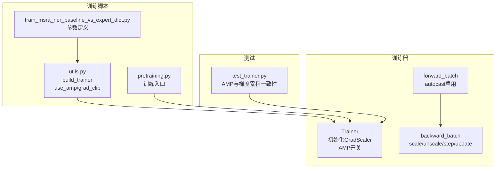
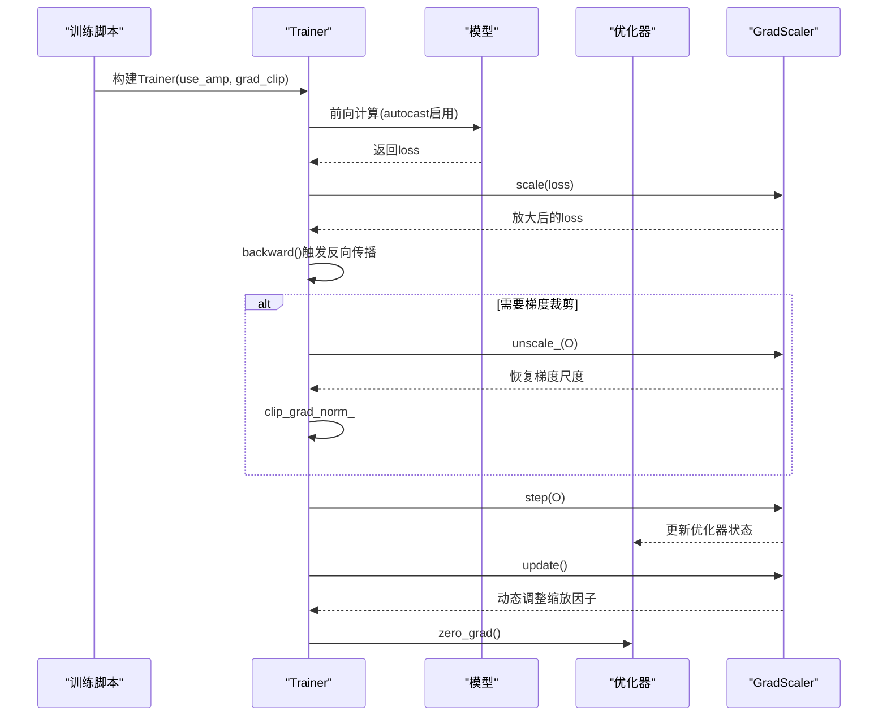
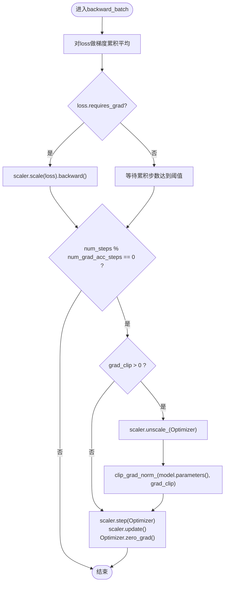
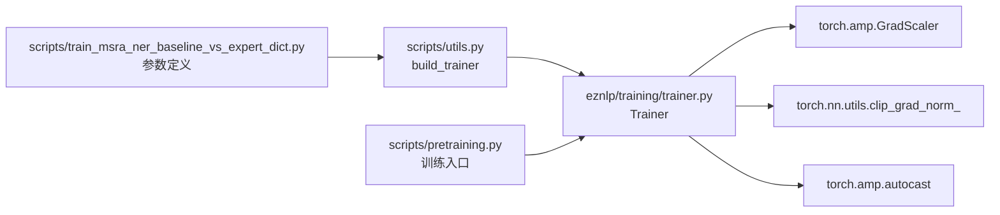

# 梯度缩放机制

<cite>
**本文引用的文件**
- [trainer.py](file://eznlp/training/trainer.py)
- [utils.py](file://scripts/utils.py)
- [test_trainer.py](file://tests/training/test_trainer.py)
- [pretraining.py](file://scripts/pretraining.py)
- [train_msra_ner_baseline_vs_expert_dict.py](file://scripts/train_msra_ner_baseline_vs_expert_dict.py)
</cite>

## 目录
1. [引言](#引言)
2. [项目结构](#项目结构)
3. [核心组件](#核心组件)
4. [架构总览](#架构总览)
5. [详细组件分析](#详细组件分析)
6. [依赖分析](#依赖分析)
7. [性能考量](#性能考量)
8. [故障排查指南](#故障排查指南)
9. [结论](#结论)

## 引言
本文件聚焦于Trainer类中GradScaler对象的初始化与核心工作流程，系统阐述在backward_batch方法中：
- scaler.scale()如何放大损失值以防止FP16梯度下溢；
- scaler.step()如何安全地更新优化器状态；
- scaler.update()如何动态调整缩放因子；
- 在梯度裁剪前调用scaler.unscale_()的必要性：将梯度从缩放状态恢复到原始尺度，使裁剪阈值有效；
并结合代码流程分析，说明这些操作如何协同工作，确保混合精度训练的稳定性与收敛性。

## 项目结构
围绕GradScaler与混合精度训练的关键位置如下：
- 训练器Trainer：负责前向、反向传播、优化器步进、学习率调度、梯度裁剪与AMP开关。
- 训练脚本：构建Trainer时传入use_amp与grad_clip等参数，驱动AMP与梯度裁剪逻辑。
- 测试：验证AMP与梯度累积在相同设置下的等价性与收敛变化。

图表来源
- [trainer.py](file://eznlp/training/trainer.py#L61-L63)
- [trainer.py](file://eznlp/training/trainer.py#L167-L170)
- [trainer.py](file://eznlp/training/trainer.py#L100-L113)
- [utils.py](file://scripts/utils.py#L1300-L1337)
- [pretraining.py](file://scripts/pretraining.py#L220-L239)
- [train_msra_ner_baseline_vs_expert_dict.py](file://scripts/train_msra_ner_baseline_vs_expert_dict.py#L338-L341)
- [test_trainer.py](file://tests/training/test_trainer.py#L12-L33)

章节来源
- [trainer.py](file://eznlp/training/trainer.py#L61-L63)
- [trainer.py](file://eznlp/training/trainer.py#L167-L170)
- [trainer.py](file://eznlp/training/trainer.py#L100-L113)
- [utils.py](file://scripts/utils.py#L1300-L1337)
- [pretraining.py](file://scripts/pretraining.py#L220-L239)
- [train_msra_ner_baseline_vs_expert_dict.py](file://scripts/train_msra_ner_baseline_vs_expert_dict.py#L338-L341)
- [test_trainer.py](file://tests/training/test_trainer.py#L12-L33)

## 核心组件
- GradScaler初始化与AMP开关
  - Trainer构造函数中根据use_amp创建GradScaler，并在前向计算中通过torch.amp.autocast启用AMP。
- backward_batch中的三段式流程
  - scale放大损失，unscale恢复梯度尺度后进行裁剪，step更新优化器，update动态调整缩放因子。
- 训练脚本与参数传递
  - 脚本通过命令行参数控制use_amp与grad_clip，并在build_trainer中传入Trainer。

章节来源
- [trainer.py](file://eznlp/training/trainer.py#L61-L63)
- [trainer.py](file://eznlp/training/trainer.py#L167-L170)
- [trainer.py](file://eznlp/training/trainer.py#L100-L113)
- [utils.py](file://scripts/utils.py#L1300-L1337)
- [pretraining.py](file://scripts/pretraining.py#L220-L239)
- [train_msra_ner_baseline_vs_expert_dict.py](file://scripts/train_msra_ner_baseline_vs_expert_dict.py#L338-L341)

## 架构总览
下图展示了AMP与GradScaler在训练循环中的关键交互点，包括前向autocast、反向scale/unscale/step/update以及梯度裁剪的位置。

图表来源
- [trainer.py](file://eznlp/training/trainer.py#L61-L63)
- [trainer.py](file://eznlp/training/trainer.py#L167-L170)
- [trainer.py](file://eznlp/training/trainer.py#L100-L113)
- [utils.py](file://scripts/utils.py#L1300-L1337)
- [pretraining.py](file://scripts/pretraining.py#L220-L239)

## 详细组件分析

### GradScaler初始化与AMP开关
- 初始化位置
  - Trainer.__init__中根据use_amp创建GradScaler实例，用于后续scale/unscale/step/update。
- AMP启用位置
  - forward_batch与train_steps/eval_epoch中均使用torch.amp.autocast(device_type="cuda", enabled=self.use_amp)包裹前向计算，确保在GPU上使用混合精度。

章节来源
- [trainer.py](file://eznlp/training/trainer.py#L61-L63)
- [trainer.py](file://eznlp/training/trainer.py#L167-L170)
- [trainer.py](file://eznlp/training/trainer.py#L279-L281)

### backward_batch中的scale/unscale/step/update序列
- 损失缩放与反向传播
  - 将平均后的loss传入scaler.scale(loss)，随后执行backward()，以放大损失，缓解FP16梯度下溢风险。
- 梯度裁剪前的unscale
  - 当开启梯度裁剪时，在裁剪前调用scaler.unscale_(self.optimizer)，将优化器内部的梯度从缩放尺度还原为原始尺度，使clip_grad_norm_的阈值生效。
- 优化器步进与缩放因子更新
  - 调用scaler.step(self.optimizer)安全地更新优化器状态；随后scaler.update()动态调整缩放因子；最后清零梯度。
- 学习率调度
  - schedule_by_step为True时，按“名义步数”更新scheduler；否则按“真实步数”由外部调用者控制。

图表来源
- [trainer.py](file://eznlp/training/trainer.py#L91-L113)

章节来源
- [trainer.py](file://eznlp/training/trainer.py#L91-L113)

### AMP与梯度裁剪参数的来源与传递
- 参数来源
  - 训练脚本通过命令行参数定义use_amp与grad_clip，并在build_trainer中传入Trainer。
- 入口脚本示例
  - 预训练脚本与MSRA NER脚本均在构建Trainer时传入use_amp与grad_clip，从而影响AMP与梯度裁剪行为。

章节来源
- [utils.py](file://scripts/utils.py#L1300-L1337)
- [pretraining.py](file://scripts/pretraining.py#L220-L239)
- [train_msra_ner_baseline_vs_expert_dict.py](file://scripts/train_msra_ner_baseline_vs_expert_dict.py#L338-L341)

### 测试验证：AMP与梯度累积的一致性
- 测试要点
  - 同一数据与随机种子下，单批次与双步梯度累积（num_grad_acc_steps=2）应得到等价的参数更新节奏与收敛差异。
  - 测试覆盖use_amp=True/False两种情况，验证训练流程在AMP下的正确性。

章节来源
- [test_trainer.py](file://tests/training/test_trainer.py#L12-L33)
- [test_trainer.py](file://tests/training/test_trainer.py#L36-L83)

## 依赖分析
- 组件耦合
  - Trainer对torch.amp.GradScaler与torch.amp.autocast存在直接依赖；对torch.nn.utils.clip_grad_norm_存在直接依赖。
- 外部参数依赖
  - use_amp与grad_clip来自训练脚本参数，经build_trainer传入Trainer，决定AMP与梯度裁剪策略。
- 潜在循环依赖
  - 未发现直接循环导入；GradScaler仅在Trainer内部使用，不反向依赖模型或优化器。

图表来源
- [trainer.py](file://eznlp/training/trainer.py#L61-L63)
- [trainer.py](file://eznlp/training/trainer.py#L167-L170)
- [trainer.py](file://eznlp/training/trainer.py#L100-L113)
- [utils.py](file://scripts/utils.py#L1300-L1337)
- [pretraining.py](file://scripts/pretraining.py#L220-L239)
- [train_msra_ner_baseline_vs_expert_dict.py](file://scripts/train_msra_ner_baseline_vs_expert_dict.py#L338-L341)

章节来源
- [trainer.py](file://eznlp/training/trainer.py#L61-L63)
- [trainer.py](file://eznlp/training/trainer.py#L167-L170)
- [trainer.py](file://eznlp/training/trainer.py#L100-L113)
- [utils.py](file://scripts/utils.py#L1300-L1337)
- [pretraining.py](file://scripts/pretraining.py#L220-L239)
- [train_msra_ner_baseline_vs_expert_dict.py](file://scripts/train_msra_ner_baseline_vs_expert_dict.py#L338-L341)

## 性能考量
- AMP与GradScaler的收益
  - 使用autocast与GradScaler可显著降低显存占用并提升吞吐，尤其在大模型与长序列任务中。
- 缩放因子动态调整
  - scaler.update()会在检测到梯度溢出时自动降低缩放因子，避免NaN；在连续若干步未溢出时逐步增大，提高数值稳定性与效率。
- 梯度裁剪与unscale
  - 在unscale后再裁剪，确保阈值基于原始尺度，避免因缩放导致的裁剪阈值失效或过度裁剪。

[本节为通用指导，无需列出具体文件来源]

## 故障排查指南
- 症状：训练不稳定、loss爆炸或NaN
  - 排查要点：确认use_amp为True且设备为CUDA；检查scaler.update()是否被调用；关注grad_clip是否过大或过小。
- 症状：梯度裁剪无效或裁剪后性能异常
  - 排查要点：确保在裁剪前调用scaler.unscale_(self.optimizer)，使阈值基于原始尺度生效。
- 症状：梯度累积步数与期望不一致
  - 排查要点：核对num_grad_acc_steps与训练步数的关系；参考测试用例验证等价性。

章节来源
- [trainer.py](file://eznlp/training/trainer.py#L100-L113)
- [test_trainer.py](file://tests/training/test_trainer.py#L36-L83)

## 结论
Trainer中的GradScaler通过“scale-unscale-step-update”的闭环，与AMP的autocast配合，实现了混合精度训练的稳定性与高效性。其中：
- scaler.scale()放大损失，缓解FP16梯度下溢；
- scaler.unscale_()在裁剪前将梯度还原至原始尺度，保证裁剪阈值有效；
- scaler.step()与update()协同更新优化器状态并动态调整缩放因子。
上述设计在预训练与下游任务脚本中均可通过use_amp与grad_clip参数灵活启用，既保障了数值稳定性，也兼顾了收敛速度与资源利用效率。