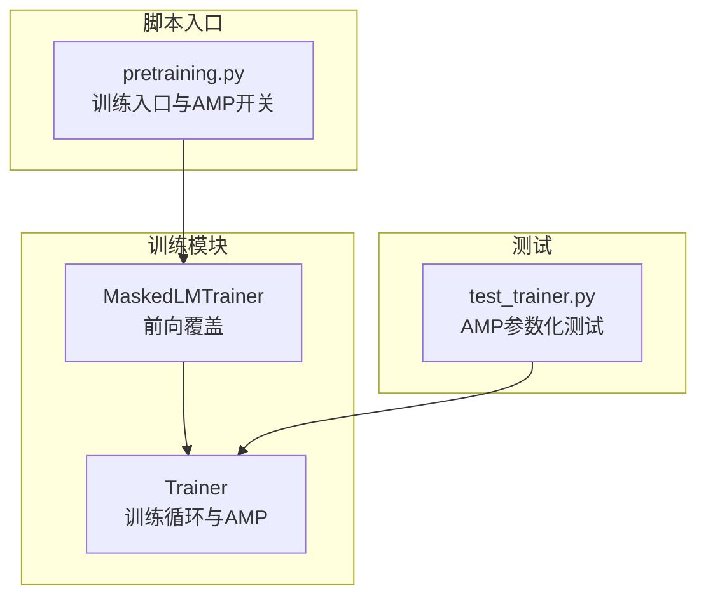
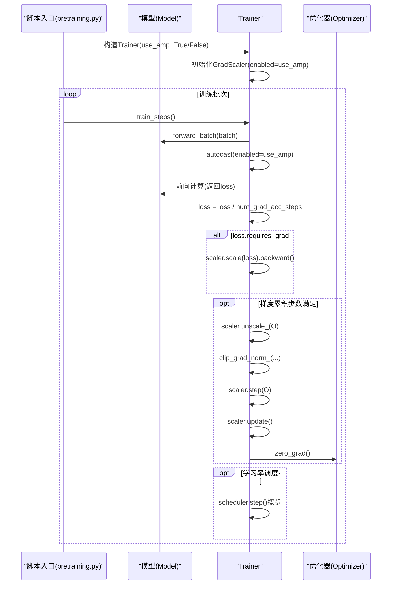
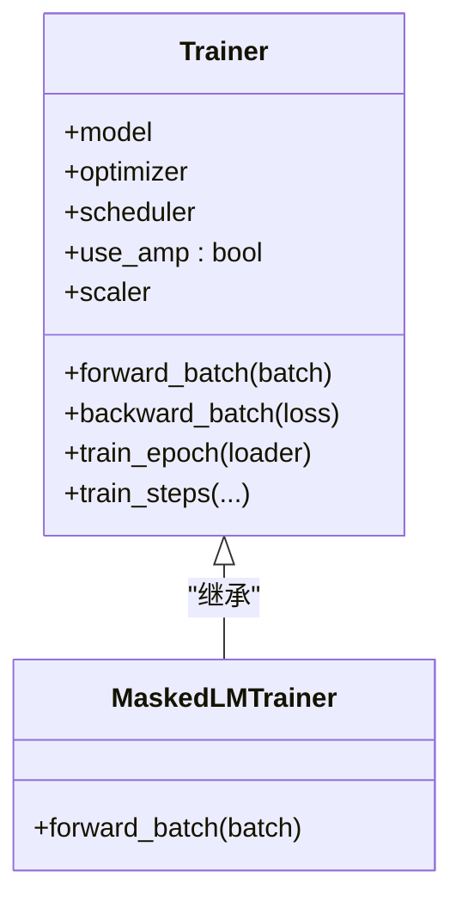

# 混合精度训练

<cite>
**本文引用的文件列表**
- [trainer.py](file://eznlp/training/trainer.py)
- [plm_trainer.py](file://eznlp/training/plm_trainer.py)
- [test_trainer.py](file://tests/training/test_trainer.py)
- [pretraining.py](file://scripts/pretraining.py)
</cite>

## 目录
1. [引言](#引言)
2. [项目结构与定位](#项目结构与定位)
3. [核心组件：Trainer 类与 AMP 集成](#核心组件trainer-类与-amp-集成)
4. [架构总览](#架构总览)
5. [关键流程详解](#关键流程详解)
6. [依赖关系分析](#依赖关系分析)
7. [性能与内存优化](#性能与内存优化)
8. [故障排查与常见问题](#故障排查与常见问题)
9. [结论](#结论)

## 引言
本文件系统性阐述 eznlp 中混合精度训练（Automatic Mixed Precision, AMP）的实现机制，重点围绕以下目标展开：
- 解释 Trainer 类中 scaler 对象的初始化与使用方式；
- 说明 forward_batch 方法中 torch.amp.autocast 上下文管理器如何自动处理浮点精度转换；
- 分析 backward_batch 方法中 scaler.scale()、scaler.step()、scaler.update() 的调用序列，并解释在梯度裁剪前调用 scaler.unscale_() 的必要性；
- 总结混合精度训练对内存占用与计算速度的优化效果，以及可能遇到的梯度下溢问题及其解决方案。

## 项目结构与定位
eznlp 的训练框架位于 eznlp/training 目录，其中 Trainer 提供通用训练循环，MaskedLMTrainer 继承自 Trainer 并覆盖前向逻辑以适配掩码语言建模任务。AMP 能力通过 torch.amp.GradScaler 与 torch.amp.autocast 在 Trainer 内部完成集成；脚本层通过命令行参数启用 AMP。

图表来源
- [trainer.py](file://eznlp/training/trainer.py#L1-L120)
- [plm_trainer.py](file://eznlp/training/plm_trainer.py#L1-L35)
- [pretraining.py](file://scripts/pretraining.py#L198-L235)
- [test_trainer.py](file://tests/training/test_trainer.py#L1-L34)

章节来源
- [trainer.py](file://eznlp/training/trainer.py#L1-L120)
- [plm_trainer.py](file://eznlp/training/plm_trainer.py#L1-L35)
- [pretraining.py](file://scripts/pretraining.py#L198-L235)
- [test_trainer.py](file://tests/training/test_trainer.py#L1-L34)

## 核心组件：Trainer 类与 AMP 集成
Trainer 是训练主循环的承载者，负责：
- 初始化 GradScaler（仅当 use_amp 为真时启用）；
- 使用 autocast 包裹前向计算；
- 在反向传播阶段使用 scaler.scale(loss) 缩放损失；
- 在累积步数满足条件时执行梯度裁剪（需先 unscale_），随后 scaler.step(optimizer) 与 scaler.update() 更新权重并更新缩放因子；
- 合理调度学习率（按步或按轮次）。

章节来源
- [trainer.py](file://eznlp/training/trainer.py#L27-L63)
- [trainer.py](file://eznlp/training/trainer.py#L163-L189)
- [trainer.py](file://eznlp/training/trainer.py#L191-L219)
- [trainer.py](file://eznlp/training/trainer.py#L82-L114)

## 架构总览
AMP 在 eznlp 中的落地路径如下：
- 训练入口脚本通过参数控制是否启用 AMP；
- Trainer 构造时根据 use_amp 决定是否创建 GradScaler；
- 前向阶段使用 autocast 自动选择半精度算子路径；
- 反向阶段对损失进行缩放，累积步数满足后进行 unscale_、裁剪、step 和 update。

图表来源
- [pretraining.py](file://scripts/pretraining.py#L198-L235)
- [trainer.py](file://eznlp/training/trainer.py#L27-L63)
- [trainer.py](file://eznlp/training/trainer.py#L163-L189)
- [trainer.py](file://eznlp/training/trainer.py#L82-L114)

## 关键流程详解

### 1) scaler 对象的初始化与生命周期
- 初始化位置：Trainer.__init__ 中根据 use_amp 参数创建 GradScaler。
- 生命周期：贯穿整个训练过程，用于缩放损失、更新缩放因子、在裁剪前对优化器状态进行 unscale_。

章节来源
- [trainer.py](file://eznlp/training/trainer.py#L27-L63)

### 2) forward_batch 中的 autocast 使用
- 在 train_epoch 与 train_steps 的内部循环中，使用 torch.amp.autocast(device_type="cuda", enabled=self.use_amp) 包裹前向计算。
- 这样可让部分算子在半精度下运行，减少显存占用并提升吞吐。

章节来源
- [trainer.py](file://eznlp/training/trainer.py#L163-L189)
- [trainer.py](file://eznlp/training/trainer.py#L277-L315)

### 3) backward_batch 中的 scaler 调用序列
- 损失缩放：使用 scaler.scale(loss) 将损失放大，避免小数值在半精度下产生下溢。
- 反向传播：对缩放后的损失执行 backward()。
- 累积步数满足时：
  - 先 scaler.unscale_(self.optimizer)，将优化器中的梯度从缩放状态还原；
  - 执行梯度裁剪（clip_grad_norm_）；
  - 调用 scaler.step(self.optimizer) 更新参数；
  - 调用 scaler.update() 更新缩放因子；
  - 清零梯度。
- 学习率调度：按步调度时，在满足条件后调用 scheduler.step()。

章节来源
- [trainer.py](file://eznlp/training/trainer.py#L82-L114)

### 4) 梯度裁剪前调用 scaler.unscale_() 的必要性
- 由于优化器内部保存的是缩放后的梯度值，若直接对未 unscale_ 的梯度进行裁剪，会导致裁剪阈值与实际梯度不一致，进而影响训练稳定性。
- 因此必须先 scaler.unscale_(self.optimizer)，再执行 clip_grad_norm_，最后再 scaler.step() 完成参数更新。

章节来源
- [trainer.py](file://eznlp/training/trainer.py#L104-L112)

### 5) 与 MaskedLMTrainer 的配合
- MaskedLMTrainer 重写 forward_batch，将 batch 数据映射到模型输入字典，并聚合多 GPU 场景下的 loss。
- 该前向逻辑同样受益于 Trainer 的 autocast 与 scaler 管控。

章节来源
- [plm_trainer.py](file://eznlp/training/plm_trainer.py#L11-L35)

### 6) AMP 开关与测试验证
- 脚本入口通过参数 use_amp 控制 Trainer.use_amp，从而决定是否启用 GradScaler 与 autocast。
- 测试用例对 use_amp=True/False 进行参数化测试，确保两种模式均可正常训练。

章节来源
- [pretraining.py](file://scripts/pretraining.py#L198-L235)
- [test_trainer.py](file://tests/training/test_trainer.py#L12-L34)

## 依赖关系分析
- Trainer 依赖 torch.amp.GradScaler 与 torch.amp.autocast 实现 AMP；
- Trainer 依赖优化器接口（支持 step、zero_grad、clip_grad_norm_）；
- MaskedLMTrainer 依赖 Trainer 的 AMP 机制，同时提供特定任务的前向封装；
- 测试与脚本分别从“行为验证”和“配置入口”的角度驱动 AMP 的启用与验证。

图表来源
- [trainer.py](file://eznlp/training/trainer.py#L15-L120)
- [plm_trainer.py](file://eznlp/training/plm_trainer.py#L7-L35)

章节来源
- [trainer.py](file://eznlp/training/trainer.py#L15-L120)
- [plm_trainer.py](file://eznlp/training/plm_trainer.py#L7-L35)

## 性能与内存优化
- 显存占用降低：autocast 将部分算子置于半精度执行，显著降低中间张量的内存占用。
- 计算吞吐提升：在支持 FP16 的硬件上，半精度运算通常更快，整体训练吞吐更高。
- 稳定性保障：通过 GradScaler 动态调整缩放因子，缓解小梯度在半精度下的下溢风险；在裁剪前执行 unscale_，确保裁剪阈值与真实梯度一致。

[本节为通用性能讨论，无需列出具体文件来源]

## 故障排查与常见问题
- 症状：启用 AMP 后出现 NaN 或梯度爆炸
  - 排查要点：确认 scaler.unscale_ 是否在裁剪前调用；检查学习率与梯度裁剪阈值设置是否合理；关注 loss 是否为标量且 requires_grad 为真。
  - 参考位置：backward_batch 中的 unscale_、clip_grad_norm_、step 与 update 的顺序。
- 症状：CPU 环境下 AMP 无法生效
  - 排查要点：autocast 的 device_type 为 "cuda"，在 CPU 上不会切换到半精度；测试用例已跳过 CPU 环境下的 AMP 测试。
- 症状：显存仍较高
  - 排查要点：确认 autocast 是否包裹了主要前向路径；检查是否仍有大量大张量常驻显存；核对 batch_size 与 num_grad_acc_steps 的组合。

章节来源
- [trainer.py](file://eznlp/training/trainer.py#L163-L189)
- [trainer.py](file://eznlp/training/trainer.py#L82-L114)
- [test_trainer.py](file://tests/training/test_trainer.py#L12-L20)

## 结论
eznlp 的 AMP 实现以 Trainer 为核心，通过 GradScaler 与 autocast 的协同工作，实现了在保证训练稳定性的前提下显著降低显存占用并提升吞吐的目标。关键在于：
- 正确初始化 scaler；
- 在前向阶段使用 autocast；
- 在反向阶段先 unscale_ 再裁剪，随后 step 与 update；
- 在脚本入口处通过参数控制 AMP 的启用。

上述机制已在脚本与测试中得到验证，适用于多种下游任务（如掩码语言建模）。