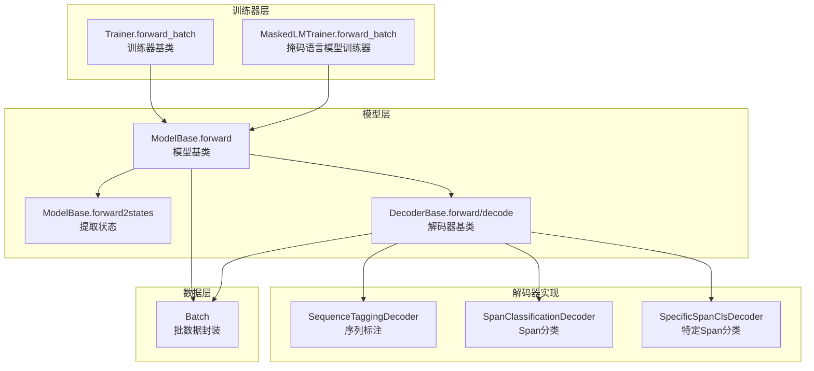
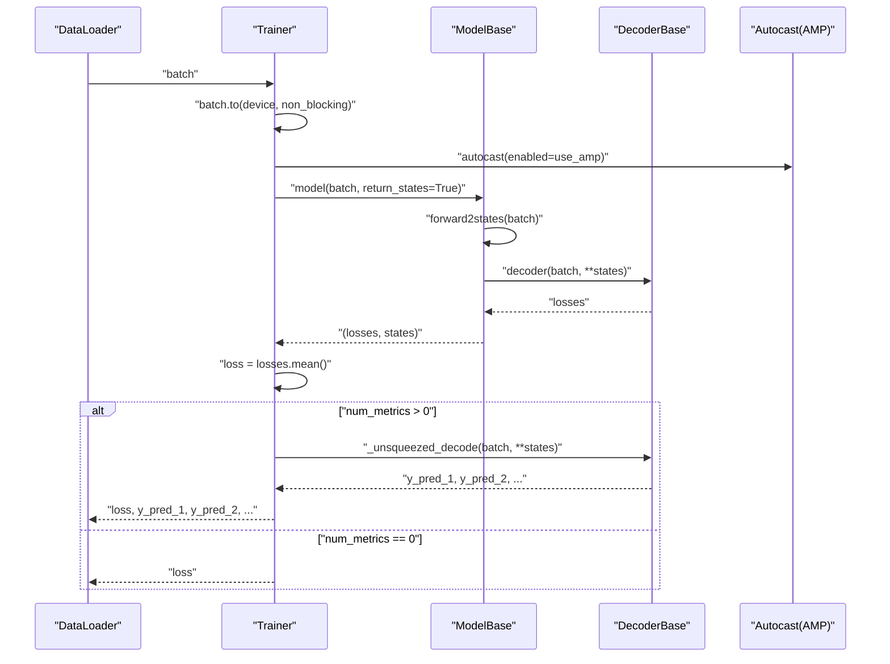
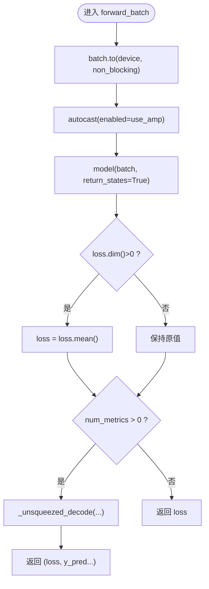
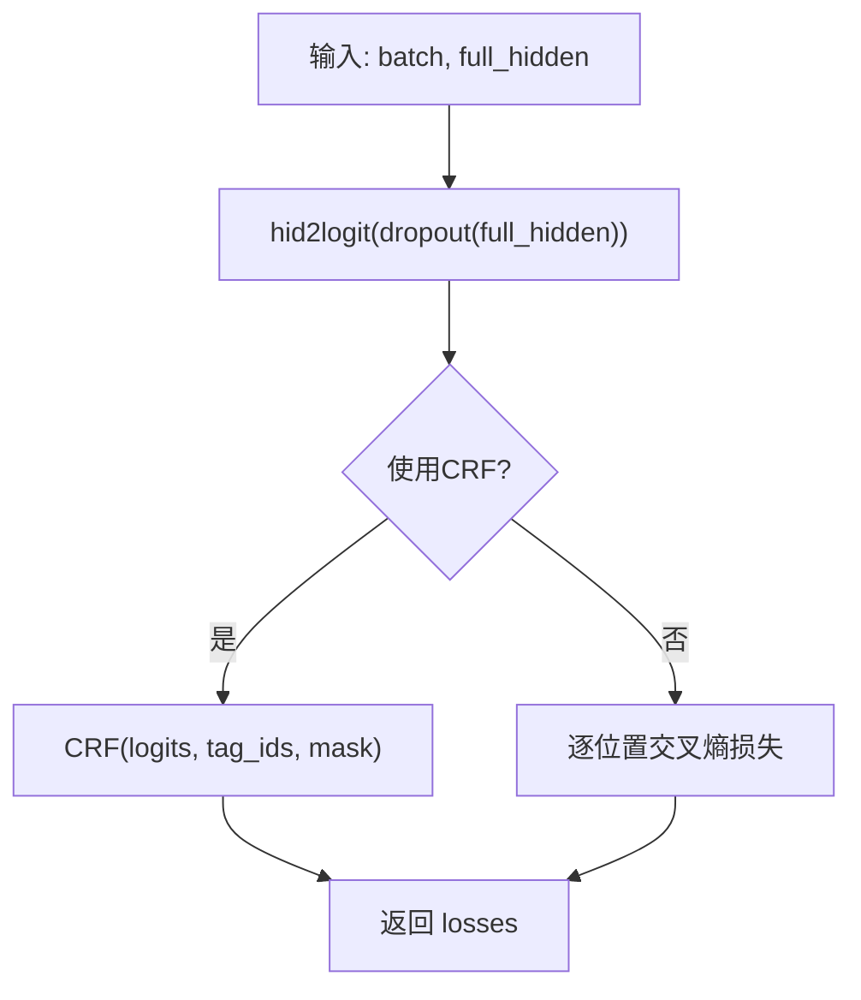
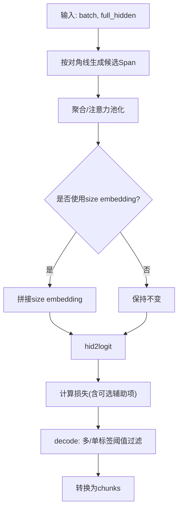
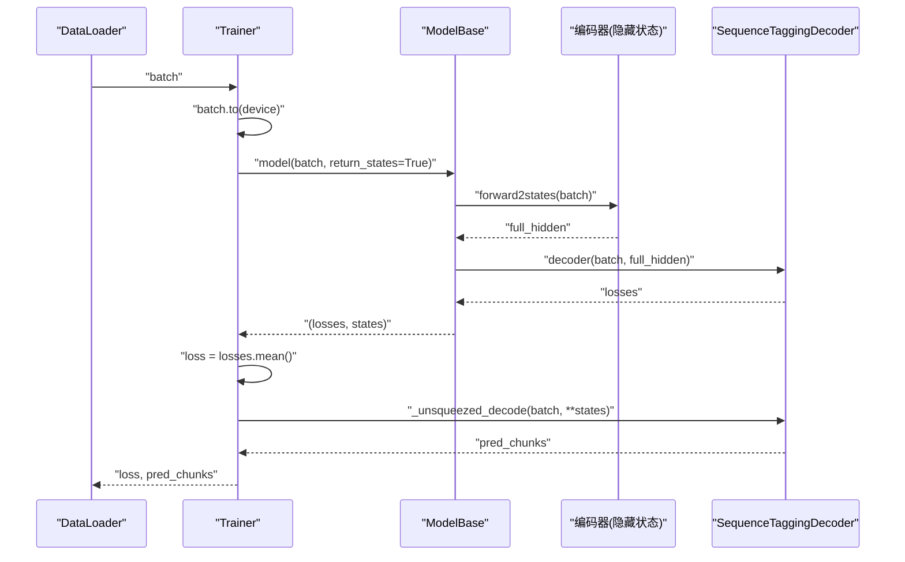
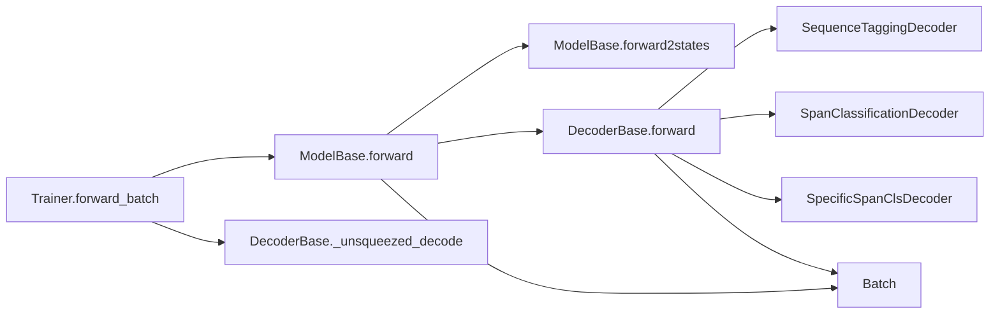

# 前向传播机制

<cite>
**本文引用的文件**
- [训练器基类 Trainer](file://eznlp/training/trainer.py)
- [掩码语言模型训练器 MaskedLMTrainer](file://eznlp/training/plm_trainer.py)
- [模型基类 ModelBase](file://eznlp/model/model/base.py)
- [解码器基类 DecoderBase](file://eznlp/model/decoder/base.py)
- [序列标注解码器 SequenceTaggingDecoder](file://eznlp/model/decoder/sequence_tagging.py)
- [Span分类解码器 SpanClassificationDecoder](file://eznlp/model/decoder/span_classification.py)
- [特定Span分类解码器 SpecificSpanClsDecoder](file://eznlp/model/decoder/specific_span_classification.py)
- [数据包装 Batch](file://eznlp/wrapper.py)
- [训练器单元测试 test_trainer.py](file://tests/training/test_trainer.py)
- [调试脚本 debug_training.py](file://scripts/debug_training.py)
</cite>

## 目录
1. [引言](#引言)
2. [项目结构](#项目结构)
3. [核心组件](#核心组件)
4. [架构总览](#架构总览)
5. [详细组件分析](#详细组件分析)
6. [依赖关系分析](#依赖关系分析)
7. [性能考量](#性能考量)
8. [故障排查指南](#故障排查指南)
9. [结论](#结论)

## 引言
本文围绕 Trainer 类中的 forward_batch 方法展开，系统解析其在前向传播中的职责与流程，重点说明：
- 如何将 Batch 对象输入模型并计算损失；
- 模型返回状态（return_states=True）的作用与收益；
- 在序列标注与 Span 分类任务中，解码器如何将隐藏状态转换为预测标签；
- 结合解码器的 _unsqueezed_decode 方法，阐述前向传播中模型输出的结构与用途；
- 提供 NER 任务中前向传播的数据流示例；
- 解释 AMP（自动混合精度）在前向传播中的集成方式。

## 项目结构
本节聚焦与前向传播直接相关的核心模块及其职责划分：
- 训练器层：Trainer 统一调度前向、反向与评估；MaskedLMTrainer 面向预训练场景。
- 模型层：ModelBase 定义统一的前向接口，负责调用 forward2states 与 decoder。
- 解码器层：DecoderBase 及其实现（如 SequenceTaggingDecoder、SpanClassificationDecoder 等）负责从隐藏状态到损失或预测标签的映射。
- 数据层：Batch 包装了模型所需的张量与元信息（如 seq_lens、mask 等）。

图表来源
- [训练器基类 Trainer](file://eznlp/training/trainer.py#L63-L80)
- [掩码语言模型训练器 MaskedLMTrainer](file://eznlp/training/plm_trainer.py#L11-L34)
- [模型基类 ModelBase](file://eznlp/model/model/base.py#L84-L98)
- [解码器基类 DecoderBase](file://eznlp/model/decoder/base.py#L90-L114)
- [序列标注解码器 SequenceTaggingDecoder](file://eznlp/model/decoder/sequence_tagging.py#L143-L198)
- [Span分类解码器 SpanClassificationDecoder](file://eznlp/model/decoder/span_classification.py#L264-L344)
- [特定Span分类解码器 SpecificSpanClsDecoder](file://eznlp/model/decoder/specific_span_classification.py#L248-L338)
- [数据包装 Batch](file://eznlp/wrapper.py#L97-L121)

章节来源
- [训练器基类 Trainer](file://eznlp/training/trainer.py#L63-L80)
- [模型基类 ModelBase](file://eznlp/model/model/base.py#L84-L98)
- [解码器基类 DecoderBase](file://eznlp/model/decoder/base.py#L90-L114)

## 核心组件
- Trainer.forward_batch
  - 调用 ModelBase(batch, return_states=True) 获取损失与中间状态；
  - 若存在解码器指标（num_metrics > 0），则返回损失与解码器的预测标签（通过 _unsqueezed_decode）。
- ModelBase.forward
  - 先执行 forward2states 提取隐藏状态；
  - 再调用 decoder(batch, **states) 计算损失；
  - 当 return_states=True 时，同时返回状态以避免重复计算。
- 解码器的 _unsqueezed_decode
  - 将 decode 的结果按指标数量“解压”为元组，便于 Trainer.forward_batch 返回统一格式。

章节来源
- [训练器基类 Trainer](file://eznlp/training/trainer.py#L63-L80)
- [模型基类 ModelBase](file://eznlp/model/model/base.py#L84-L98)
- [解码器基类 DecoderBase](file://eznlp/model/decoder/base.py#L105-L114)

## 架构总览
下图展示了 Trainer.forward_batch 在一次训练步中的关键调用链路，以及 AMP 自动混合精度的集成点。

图表来源
- [训练器基类 Trainer](file://eznlp/training/trainer.py#L160-L188)
- [模型基类 ModelBase](file://eznlp/model/model/base.py#L84-L98)
- [解码器基类 DecoderBase](file://eznlp/model/decoder/base.py#L105-L114)

## 详细组件分析

### Trainer.forward_batch 的实现机制
- 输入：Batch 对象；
- 步骤：
  1) 将 Batch 移至指定设备；
  2) 在 autocast 上下文中调用 ModelBase.forward(batch, return_states=True)，得到损失与状态；
  3) 对多 GPU 场景，若损失张量维数大于 0，则取均值；
  4) 若存在指标（num_metrics > 0），则调用解码器的 _unsqueezed_decode，将预测标签按指标数量打包返回。
- 输出：单个标量损失，或 (loss, y_pred_1, ...) 的元组。

图表来源
- [训练器基类 Trainer](file://eznlp/training/trainer.py#L63-L80)
- [训练器基类 Trainer](file://eznlp/training/trainer.py#L160-L188)

章节来源
- [训练器基类 Trainer](file://eznlp/training/trainer.py#L63-L80)
- [训练器基类 Trainer](file://eznlp/training/trainer.py#L160-L188)

### return_states=True 的作用与收益
- ModelBase.forward 在 return_states=True 时，会同时返回损失与中间状态；
- Trainer.forward_batch 利用这些状态，无需再次计算隐藏状态，即可调用解码器生成预测标签；
- 这种设计避免了重复计算，提升训练效率，尤其在解码器复杂（如 CRF、Span 分类）时收益明显。

章节来源
- [模型基类 ModelBase](file://eznlp/model/model/base.py#L84-L98)
- [训练器基类 Trainer](file://eznlp/training/trainer.py#L63-L80)

### 序列标注任务中的预测标签处理
- SequenceTaggingDecoder.forward
  - 从隐藏状态经线性层与激活得到 logits；
  - 若使用 CRF，则基于标签序列计算条件随机场损失；
  - 否则对每个样本逐位置计算交叉熵损失。
- SequenceTaggingDecoder.decode_tags
  - 若 CRF：通过 CRF.decode 解码最优标签序列；
  - 否则：取 argmax 并去填充，得到标签序列；
- SequenceTaggingDecoder.decode
  - 将标签序列转换为实体块（chunks）。

图表来源
- [序列标注解码器 SequenceTaggingDecoder](file://eznlp/model/decoder/sequence_tagging.py#L157-L179)
- [序列标注解码器 SequenceTaggingDecoder](file://eznlp/model/decoder/sequence_tagging.py#L181-L198)

章节来源
- [序列标注解码器 SequenceTaggingDecoder](file://eznlp/model/decoder/sequence_tagging.py#L157-L198)

### Span 分类任务中的预测标签处理
- SpanClassificationDecoder.get_logits
  - 从 full_hidden 中按对角线生成候选 Span 的表示（聚合/注意力）；
  - 可选加入 size embedding；
  - 通过线性层得到每个 Span 的 logits。
- SpanClassificationDecoder.forward
  - 对每个样本，依据边界对象的标签与掩码计算损失；
  - 可选加入辅助损失（如 MKMMD）。
- SpanClassificationDecoder.decode
  - 多标签：置信度超过阈值即保留；
  - 单标签：取 softmax 后最大类别并过滤 none 标签；
  - 将 Span 转换为实体块（chunks）。

图表来源
- [Span分类解码器 SpanClassificationDecoder](file://eznlp/model/decoder/span_classification.py#L223-L263)
- [Span分类解码器 SpanClassificationDecoder](file://eznlp/model/decoder/span_classification.py#L264-L296)
- [Span分类解码器 SpanClassificationDecoder](file://eznlp/model/decoder/span_classification.py#L297-L344)

章节来源
- [Span分类解码器 SpanClassificationDecoder](file://eznlp/model/decoder/span_classification.py#L223-L344)

### 特定Span分类任务中的预测标签处理
- SpecificSpanClsDecoder.get_logits
  - 支持最小 Span 大小（min_span_size=1 或 2），按不同查询层级拼接隐藏表示；
  - 可选 size embedding；
  - 线性层得到 logits。
- SpecificSpanClsDecoder.forward/decode
  - 与 SpanClassificationDecoder 类似，但候选 Span 来源于特定层级的查询隐藏。

章节来源
- [特定Span分类解码器 SpecificSpanClsDecoder](file://eznlp/model/decoder/specific_span_classification.py#L206-L247)
- [特定Span分类解码器 SpecificSpanClsDecoder](file://eznlp/model/decoder/specific_span_classification.py#L248-L338)

### 解码器 _unsqueezed_decode 的用途
- 当 num_metrics=1 时，_unsqueezed_decode 返回单元素元组，便于 Trainer.forward_batch 统一处理；
- 当 num_metrics>1 时，返回多指标对应的多个预测集合；
- 当 num_metrics=0 时，抛出异常提示该方法不适用。

章节来源
- [解码器基类 DecoderBase](file://eznlp/model/decoder/base.py#L105-L114)

### NER 任务中前向传播的数据流动示例
以下示例展示在序列标注（如 BIOES+CRF）场景下的数据流，对应于训练器与模型/解码器的交互：

图表来源
- [训练器基类 Trainer](file://eznlp/training/trainer.py#L63-L80)
- [模型基类 ModelBase](file://eznlp/model/model/base.py#L84-L98)
- [序列标注解码器 SequenceTaggingDecoder](file://eznlp/model/decoder/sequence_tagging.py#L157-L198)

章节来源
- [训练器基类 Trainer](file://eznlp/training/trainer.py#L63-L80)
- [模型基类 ModelBase](file://eznlp/model/model/base.py#L84-L98)
- [序列标注解码器 SequenceTaggingDecoder](file://eznlp/model/decoder/sequence_tagging.py#L157-L198)

### AMP（自动混合精度）在前向传播中的集成
- Trainer.__init__
  - 初始化 GradScaler，用于 AMP 的缩放与更新；
- Trainer.train_epoch/eval_epoch
  - 在前向传播阶段使用 torch.amp.autocast(device_type="cuda", enabled=self.use_amp) 包裹；
  - backward_batch 中对 loss 进行 scaler.scale(loss) 后反传；
  - 更新权重前进行 scaler.unscale_(optimizer) 与梯度裁剪；
  - 更新后 scaler.update()。
- MaskedLMTrainer.forward_batch
  - 直接调用 self.model(...) 获取输出字典中的 "loss"，并在多 GPU 场景下对 loss 取均值。

章节来源
- [训练器基类 Trainer](file://eznlp/training/trainer.py#L26-L62)
- [训练器基类 Trainer](file://eznlp/training/trainer.py#L160-L188)
- [训练器基类 Trainer](file://eznlp/training/trainer.py#L189-L218)
- [训练器基类 Trainer](file://eznlp/training/trainer.py#L220-L373)
- [掩码语言模型训练器 MaskedLMTrainer](file://eznlp/training/plm_trainer.py#L11-L34)

## 依赖关系分析
- Trainer.forward_batch 依赖：
  - ModelBase.forward(return_states=True) 提供损失与状态；
  - DecoderBase._unsqueezed_decode 提供预测标签；
  - Batch 提供模型输入张量与元信息。
- ModelBase.forward 依赖：
  - forward2states 产出隐藏状态；
  - decoder(batch, **states) 产出损失。
- 解码器实现依赖：
  - SequenceTaggingDecoder：CRF 或交叉熵损失；
  - SpanClassificationDecoder/SpecificSpanClsDecoder：对角线候选 Span 生成、聚合/注意力、size embedding、多标签阈值过滤。

图表来源
- [训练器基类 Trainer](file://eznlp/training/trainer.py#L63-L80)
- [模型基类 ModelBase](file://eznlp/model/model/base.py#L84-L98)
- [解码器基类 DecoderBase](file://eznlp/model/decoder/base.py#L90-L114)
- [序列标注解码器 SequenceTaggingDecoder](file://eznlp/model/decoder/sequence_tagging.py#L143-L198)
- [Span分类解码器 SpanClassificationDecoder](file://eznlp/model/decoder/span_classification.py#L264-L344)
- [特定Span分类解码器 SpecificSpanClsDecoder](file://eznlp/model/decoder/specific_span_classification.py#L248-L338)
- [数据包装 Batch](file://eznlp/wrapper.py#L97-L121)

## 性能考量
- return_states=True 的重复计算避免：通过复用状态，减少 forward2states 的重复调用，显著降低解码器复杂任务（如 CRF、Span 分类）的开销。
- AMP 的使用：在 CUDA 设备上启用 autocast，可降低显存占用并加速前向传播；配合 GradScaler 在反向传播中进行数值稳定控制。
- 梯度累积：Trainer 将损失按累积步数平均后再反传，确保有效批量大小的一致性。

[本节为通用指导，不直接分析具体文件]

## 故障排查指南
- 前向传播失败
  - 检查 Batch 字段是否完整（如 tokens、mask、seq_lens 等）；
  - 确认模型 forward2states 是否正确实现；
  - 参考调试脚本中的断言与打印，定位问题。
- 指标相关错误
  - 若 num_metrics=0，调用 _unsqueezed_* 方法会抛出异常，需检查解码器配置；
  - 多指标场景需保证 _unsqueezed_* 返回的列表长度与指标数一致。
- AMP 相关问题
  - 确保 use_amp 与设备类型匹配（CUDA）；
  - 梯度裁剪前需先 scaler.unscale_(optimizer)。

章节来源
- [训练器基类 Trainer](file://eznlp/training/trainer.py#L160-L188)
- [训练器基类 Trainer](file://eznlp/training/trainer.py#L189-L218)
- [训练器基类 Trainer](file://eznlp/training/trainer.py#L220-L373)
- [调试脚本 debug_training.py](file://scripts/debug_training.py#L126-L156)
- [训练器单元测试 test_trainer.py](file://tests/training/test_trainer.py#L1-L84)

## 结论
Trainer.forward_batch 将 Batch 输入模型并计算损失，同时利用 return_states=True 的状态复用机制，避免重复计算，提高训练效率。在序列标注与 Span 分类任务中，解码器通过 _unsqueezed_decode 将隐藏状态转换为预测标签，统一了 Trainer 的返回格式。AMP 在前向传播中通过 autocast 与 GradScaler 的组合实现高效稳定的混合精度训练。整体架构清晰、职责明确，便于扩展新的模型与解码策略。