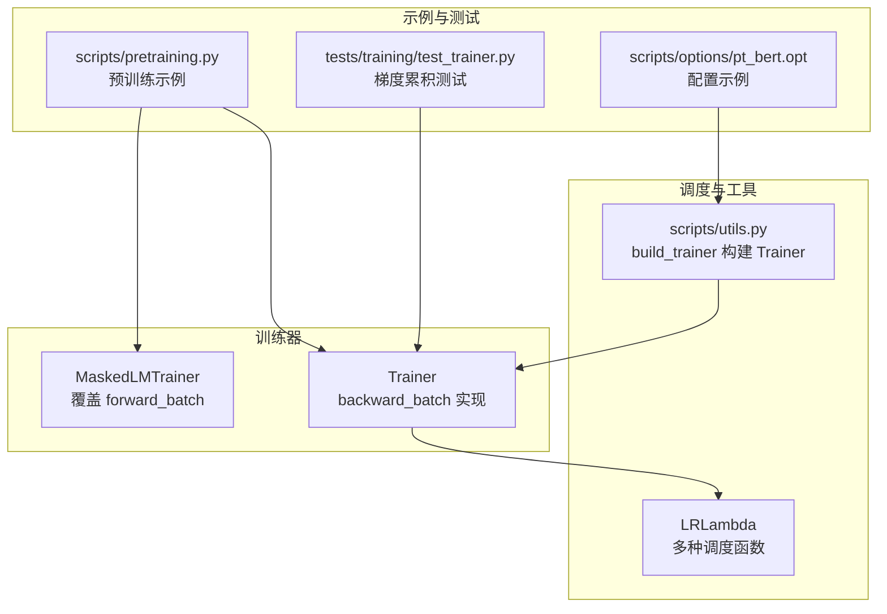
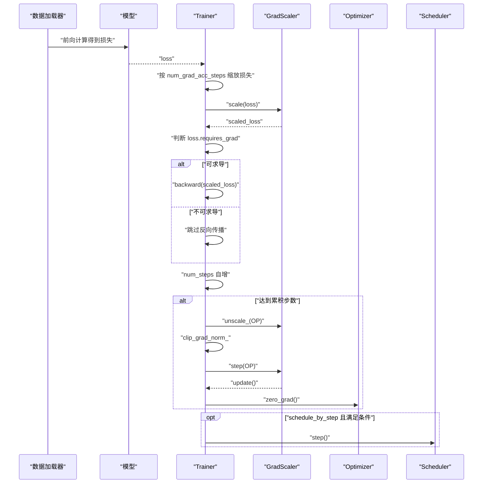
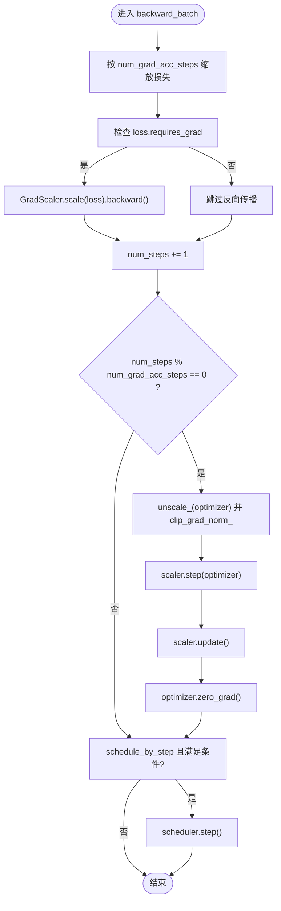
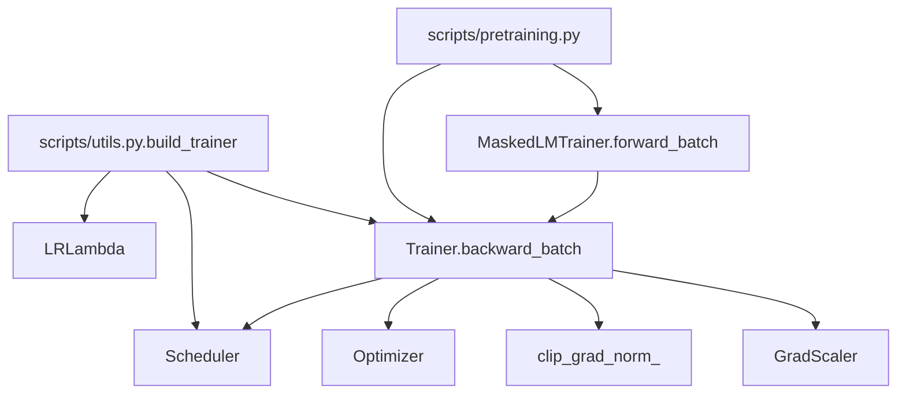

# 反向传播与参数更新

<cite>
**本文引用的文件列表**
- [trainer.py](file://eznlp/training/trainer.py)
- [plm_trainer.py](file://eznlp/training/plm_trainer.py)
- [utils.py](file://eznlp/training/utils.py)
- [utils.py](file://scripts/utils.py)
- [test_trainer.py](file://tests/training/test_trainer.py)
- [pretraining.py](file://scripts/pretraining.py)
- [pt_bert.opt](file://scripts/options/pt_bert.opt)
</cite>

## 目录
1. [引言](#引言)
2. [项目结构](#项目结构)
3. [核心组件](#核心组件)
4. [架构总览](#架构总览)
5. [详细组件分析](#详细组件分析)
6. [依赖关系分析](#依赖关系分析)
7. [性能考量](#性能考量)
8. [故障排查指南](#故障排查指南)
9. [结论](#结论)
10. [附录](#附录)

## 引言
本文件围绕训练器中的 backward_batch 方法进行深入解析，重点说明以下内容：
- 梯度累积机制（num_grad_acc_steps）如何影响损失缩放与参数更新频率
- GradScaler 在混合精度训练中的作用
- 梯度裁剪（grad_clip）的实现方式
- optimizer.step() 与 scheduler.step() 的调用时机差异，特别是 schedule_by_step 参数对学习率调度的影响
- 实际训练场景中“批次损失无梯度”时的异常处理逻辑
- 结合上述机制给出提升训练稳定性的最佳实践建议

## 项目结构
本次分析聚焦于训练相关模块与脚本：
- 训练器基类与扩展：Trainer、MaskedLMTrainer
- 学习率调度工具：LRLambda
- 训练入口与构建：scripts/utils.py 中的 build_trainer
- 预训练脚本示例：scripts/pretraining.py
- 测试用例：tests/training/test_trainer.py
- 示例配置：scripts/options/pt_bert.opt

图表来源
- [trainer.py](file://eznlp/training/trainer.py#L1-L123)
- [plm_trainer.py](file://eznlp/training/plm_trainer.py#L1-L35)
- [utils.py](file://eznlp/training/utils.py#L1-L84)
- [utils.py](file://scripts/utils.py#L1300-L1337)
- [pretraining.py](file://scripts/pretraining.py#L198-L235)
- [test_trainer.py](file://tests/training/test_trainer.py#L36-L83)
- [pt_bert.opt](file://scripts/options/pt_bert.opt#L1-L18)

章节来源
- [trainer.py](file://eznlp/training/trainer.py#L1-L123)
- [plm_trainer.py](file://eznlp/training/plm_trainer.py#L1-L35)
- [utils.py](file://eznlp/training/utils.py#L1-L84)
- [utils.py](file://scripts/utils.py#L1300-L1337)
- [pretraining.py](file://scripts/pretraining.py#L198-L235)
- [test_trainer.py](file://tests/training/test_trainer.py#L36-L83)
- [pt_bert.opt](file://scripts/options/pt_bert.opt#L1-L18)

## 核心组件
- Trainer.backward_batch：负责单步反向传播、损失缩放、梯度累积、权重更新、梯度裁剪与学习率调度
- MaskedLMTrainer.forward_batch：覆盖掩码语言模型的前向计算，确保多GPU下损失维度一致性
- LRLambda：提供常数、线性衰减、指数衰减、幂律衰减等带热身的学习率函数
- scripts/utils.py.build_trainer：根据命令行参数构建 Trainer，支持 schedule_by_step、num_grad_acc_steps、grad_clip、use_amp 等

章节来源
- [trainer.py](file://eznlp/training/trainer.py#L82-L123)
- [plm_trainer.py](file://eznlp/training/plm_trainer.py#L11-L35)
- [utils.py](file://eznlp/training/utils.py#L13-L84)
- [utils.py](file://scripts/utils.py#L1300-L1337)

## 架构总览
下图展示了训练循环中 backward_batch 的关键路径，包括损失缩放、梯度累积、权重更新、梯度裁剪与学习率调度的时序关系。

图表来源
- [trainer.py](file://eznlp/training/trainer.py#L82-L123)

## 详细组件分析

### backward_batch 方法详解
- 损失缩放与梯度累积
  - 按 num_grad_acc_steps 对损失进行平均缩放，使“真实批量大小”等于名义批量大小乘以累积步数
  - 使用 GradScaler.scale(loss) 进行混合精度缩放
- 反向传播触发条件
  - 仅当 loss.requires_grad 为真时才执行 backward，避免“批次损失无梯度”的无效计算
- 权重更新与零梯度
  - 当 num_steps 对 num_grad_acc_steps 取模为 0 时，执行梯度裁剪、优化器 step、scaler update、optimizer zero_grad
- 学习率调度
  - schedule_by_step 为真时，在满足最小步数后按“名义步数”调用 scheduler.step()
  - 若 schedule_by_step 为假，则在 eval_epoch 后按评估指标调用 scheduler.step()

图表来源
- [trainer.py](file://eznlp/training/trainer.py#L82-L123)

章节来源
- [trainer.py](file://eznlp/training/trainer.py#L82-L123)

### GradScaler 在混合精度训练中的作用
- 初始化：Trainer 构造时创建 GradScaler，enabled 由 use_amp 决定
- 前向阶段：训练循环中使用 torch.amp.autocast 包裹前向计算
- 反向阶段：backward_batch 中对损失进行 scaler.scale(loss)，再执行 backward
- 更新阶段：累积步数到达时，先 scaler.unscale_(optimizer)，再执行梯度裁剪，随后 scaler.step(optimizer) 与 scaler.update()

章节来源
- [trainer.py](file://eznlp/training/trainer.py#L61-L62)
- [trainer.py](file://eznlp/training/trainer.py#L167-L169)
- [trainer.py](file://eznlp/training/trainer.py#L98-L113)

### 梯度裁剪（grad_clip）的实现方式
- 触发条件：当 num_steps 能被 num_grad_acc_steps 整除时执行
- 实现步骤：
  - scaler.unscale_(optimizer) 解除缩放
  - 使用 torch.nn.utils.clip_grad_norm_ 对模型参数梯度进行范数裁剪
- 注意：注释中也提供了 clip_grad_value_ 的替代方案，当前采用范数裁剪

章节来源
- [trainer.py](file://eznlp/training/trainer.py#L104-L109)

### optimizer.step() 与 scheduler.step() 的调用时机差异
- optimizer.step() 与 scaler.update() 发生在“真实步数”上，即每累积 num_grad_acc_steps 步才执行一次
- scheduler.step() 的调用取决于 schedule_by_step：
  - schedule_by_step 为真：在满足最小步数后按“名义步数”调用
  - schedule_by_step 为假：在 eval_epoch 后按评估指标调用
- 注释明确指出“scheduler.step() 在 optimizer.step() 之前会触发警告”，因此应遵循先 optimizer 后 scheduler 的顺序

章节来源
- [trainer.py](file://eznlp/training/trainer.py#L114-L123)
- [trainer.py](file://eznlp/training/trainer.py#L345-L356)

### schedule_by_step 参数对学习率调度的影响
- 当 schedule_by_step 为真时，学习率调度器按“名义步数”推进，适合需要频繁调整的学习率策略（如带热身的线性/幂律衰减）
- 当 schedule_by_step 为假时，学习率调度器通常在每个 epoch 或评估周期结束后调用，适用于 ReduceLROnPlateau 等基于指标的调度

章节来源
- [utils.py](file://eznlp/training/utils.py#L13-L84)
- [utils.py](file://scripts/utils.py#L1307-L1326)
- [trainer.py](file://eznlp/training/trainer.py#L155-L160)

### “批次损失无梯度”时的异常处理逻辑
- 当 batch 的 loss 不可导（例如某些任务中无负样本导致无法枚举负例），loss.requires_grad 将为假
- 此时 backward_batch 会跳过反向传播，不进行任何权重更新或学习率调度
- 这种设计避免了无效计算与潜在数值问题，保证训练稳定性

章节来源
- [trainer.py](file://eznlp/training/trainer.py#L95-L101)

### 与掩码语言模型训练的集成
- MaskedLMTrainer 覆盖 forward_batch，确保多GPU下损失维度一致性（mean）
- 在预训练脚本中，通过 build_trainer 统一注入 num_grad_acc_steps、grad_clip、use_amp、schedule_by_step 等参数

章节来源
- [plm_trainer.py](file://eznlp/training/plm_trainer.py#L11-L35)
- [utils.py](file://scripts/utils.py#L1300-L1337)
- [pretraining.py](file://scripts/pretraining.py#L198-L235)

## 依赖关系分析
- Trainer 依赖 torch.amp.GradScaler、torch.amp.autocast、torch.nn.utils.clip_grad_norm_
- LRLambda 提供多种学习率函数，供 build_trainer 构建 LambdaLR
- scripts/utils.py.build_trainer 将命令行参数映射到 Trainer 构造，贯穿 schedule_by_step、num_grad_acc_steps、grad_clip、use_amp
- 预训练脚本 pretraining.py 展示了完整的训练流程与参数设置

图表来源
- [trainer.py](file://eznlp/training/trainer.py#L61-L123)
- [utils.py](file://eznlp/training/utils.py#L13-L84)
- [utils.py](file://scripts/utils.py#L1300-L1337)
- [plm_trainer.py](file://eznlp/training/plm_trainer.py#L11-L35)
- [pretraining.py](file://scripts/pretraining.py#L198-L235)

章节来源
- [trainer.py](file://eznlp/training/trainer.py#L61-L123)
- [utils.py](file://eznlp/training/utils.py#L13-L84)
- [utils.py](file://scripts/utils.py#L1300-L1337)
- [plm_trainer.py](file://eznlp/training/plm_trainer.py#L11-L35)
- [pretraining.py](file://scripts/pretraining.py#L198-L235)

## 性能考量
- 梯度累积与有效批量：通过 num_grad_acc_steps 放大有效批量，有助于稳定训练与提升吞吐，但需注意显存占用与收敛速度权衡
- 混合精度：use_amp 与 GradScaler 可显著降低显存占用并加速训练；需配合 autocast 包裹前向计算
- 梯度裁剪：clip_grad_norm_ 有助于缓解梯度爆炸，提高训练稳定性；建议根据任务与模型规模选择合适的阈值
- 学习率调度：schedule_by_step 适合频繁调整的学习率策略；若使用 ReduceLROnPlateau，应关闭 schedule_by_step 并在评估后调用 step

[本节为通用指导，无需列出具体文件来源]

## 故障排查指南
- 症状：训练不更新参数
  - 排查点：确认 loss.requires_grad 是否为真；检查 num_grad_acc_steps 是否过大导致累积步数未达
  - 参考：backward_batch 中对 loss.requires_grad 的判断与累积步数触发
- 症状：学习率未按预期变化
  - 排查点：确认 schedule_by_step 设置；若使用 ReduceLROnPlateau，应在 eval_epoch 后调用 step
  - 参考：Trainer.train_steps 中 schedule_by_step 分支与非 schedule_by_step 分支
- 症状：显存溢出或训练不稳定
  - 排查点：尝试减小 num_grad_acc_steps、启用 use_amp、合理设置 grad_clip
  - 参考：GradScaler 的使用与 clip_grad_norm_ 的调用时机
- 症状：批次损失无梯度
  - 处理：该行为受控，不会触发异常；可在日志中观察是否频繁出现，必要时检查数据与任务设计

章节来源
- [trainer.py](file://eznlp/training/trainer.py#L95-L123)
- [trainer.py](file://eznlp/training/trainer.py#L345-L356)

## 结论
- backward_batch 通过“损失缩放 + 梯度累积 + GradScaler + 梯度裁剪 + 学习率调度”的组合，实现了高效稳定的训练流程
- schedule_by_step 决定了学习率调度的推进节奏，应与具体调度策略匹配
- 在“批次损失无梯度”的情况下，系统会安全跳过反向传播，避免无效计算
- 实践中建议结合任务特性与硬件资源，合理设置 num_grad_acc_steps、use_amp、grad_clip 与学习率策略

[本节为总结性内容，无需列出具体文件来源]

## 附录

### 关键参数与配置参考
- num_grad_acc_steps：控制梯度累积步数，影响“真实批量大小”与参数更新频率
- grad_clip：控制梯度裁剪阈值，建议在累积步数触发时执行
- use_amp：启用混合精度训练，需配合 autocast 与 GradScaler
- schedule_by_step：控制学习率调度按“名义步数”还是“评估周期”推进

章节来源
- [trainer.py](file://eznlp/training/trainer.py#L18-L25)
- [trainer.py](file://eznlp/training/trainer.py#L45-L54)
- [trainer.py](file://eznlp/training/trainer.py#L61-L62)
- [utils.py](file://scripts/utils.py#L1307-L1326)
- [pt_bert.opt](file://scripts/options/pt_bert.opt#L1-L18)