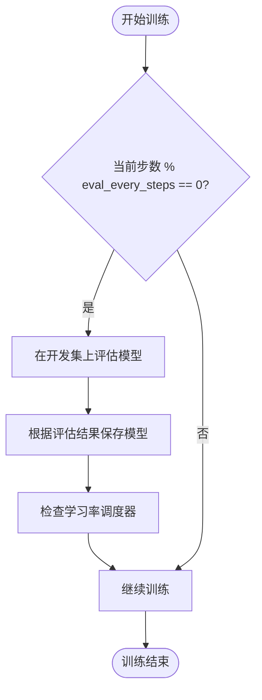
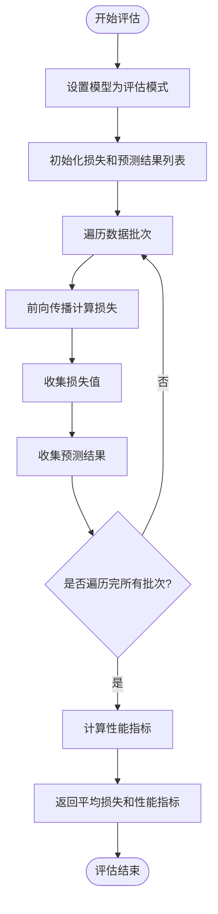
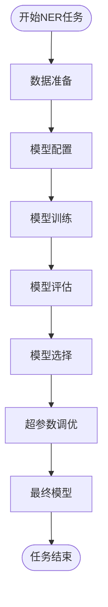

# 模型评估与保存策略

<cite>
**本文档中引用的文件**   
- [trainer.py](file://eznlp/training/trainer.py)
- [evaluation.py](file://eznlp/training/evaluation.py)
- [metrics.py](file://eznlp/metrics.py)
- [sequence_tagging.py](file://eznlp/model/decoder/sequence_tagging.py)
- [entity_recognition.py](file://scripts/entity_recognition.py)
- [NER任务完整流程.md](file://docs/NER任务完整流程.md)
</cite>

## 目录
1. [引言](#引言)
2. [模型评估流程](#模型评估流程)
3. [模型保存策略](#模型保存策略)
4. [学习率调度与早停机制](#学习率调度与早停机制)
5. [NER任务完整流程中的评估应用](#ner任务完整流程中的评估应用)
6. [结论](#结论)

## 引言
在自然语言处理任务中，特别是命名实体识别（NER）任务中，模型的评估与保存策略是确保模型性能优化和选择的关键环节。本文档详细解析了`eval_every_steps`参数控制的模型评估流程，说明了`eval_epoch`方法如何在开发集上计算损失和性能指标。同时，阐述了基于损失和基于性能指标的两种模型保存机制，解释了`ReduceLROnPlateau`调度器在非step模式下的特殊处理逻辑，以及早停机制的实现基础。最后，结合NER任务的完整流程，说明如何通过评估结果指导模型选择和超参数调优。

## 模型评估流程

### eval_every_steps参数的作用
`eval_every_steps`参数用于控制模型在训练过程中进行评估的频率。在`train_steps`方法中，当训练步数达到`eval_every_steps`的倍数时，模型会在开发集上进行一次评估。这一机制允许在训练过程中定期监控模型在未见数据上的表现，从而及时调整训练策略。



**Diagram sources**
- [trainer.py](file://eznlp/training/trainer.py#L221-L375)

### eval_epoch方法的实现
`eval_epoch`方法是模型评估的核心，它在给定的数据加载器（如开发集）上计算模型的损失和性能指标。该方法首先将模型设置为评估模式，然后遍历数据加载器中的每个批次，计算损失并收集预测结果。最后，根据收集到的预测结果和真实标签，计算性能指标。



**Diagram sources**
- [trainer.py](file://eznlp/training/trainer.py#L191-L220)

**Section sources**
- [trainer.py](file://eznlp/training/trainer.py#L191-L220)

## 模型保存策略

### 基于损失的保存机制
当`save_by_loss`参数设置为`True`时，模型保存策略基于开发集上的损失值。在每次评估后，如果当前的开发集损失低于历史最佳损失，则保存当前模型。这种策略适用于损失值能够良好反映模型性能的场景。

```python
if dev_loss < best_dev_loss:
    best_dev_loss = dev_loss
    if (save_callback is not None) and save_by_loss:
        save_callback(self.model)
```

### 基于性能指标的保存机制
当`save_by_loss`参数设置为`False`时，模型保存策略基于性能指标（如F1分数）。在每次评估后，如果当前的性能指标高于历史最佳指标，则保存当前模型。这种策略更直接地关注模型的最终性能，适用于性能指标比损失值更能反映模型质量的场景。

```python
if numpy.mean(dev_metric) > best_dev_metric:
    best_dev_metric = numpy.mean(dev_metric)
    if (save_callback is not None) and (not save_by_loss):
        save_callback(self.model)
```

**Section sources**
- [trainer.py](file://eznlp/training/trainer.py#L332-L343)

## 学习率调度与早停机制

### ReduceLROnPlateau调度器的特殊处理
`ReduceLROnPlateau`调度器在非step模式下，根据开发集上的性能指标调整学习率。当`save_by_loss`为`True`时，调度器以最小化损失为目标；当`save_by_loss`为`False`时，调度器以最大化性能指标为目标。这种特殊处理确保了学习率的调整与模型保存策略保持一致。

```python
if isinstance(self.scheduler, torch.optim.lr_scheduler.ReduceLROnPlateau):
    if save_by_loss:
        assert self.scheduler.mode == "min"
        self.scheduler.step(dev_loss)
    else:
        assert self.scheduler.mode == "max"
        self.scheduler.step(numpy.mean(dev_metric))
```

### 早停机制的实现基础
早停机制的实现基础在于定期评估模型在开发集上的表现，并根据评估结果决定是否继续训练。通过`eval_every_steps`参数控制评估频率，结合`save_callback`函数保存最佳模型，可以在模型性能不再提升时提前终止训练，避免过拟合。

**Section sources**
- [trainer.py](file://eznlp/training/trainer.py#L345-L356)

## NER任务完整流程中的评估应用

### 评估在NER任务中的角色
在NER任务中，评估不仅用于监控模型性能，还用于指导模型选择和超参数调优。通过在开发集上定期评估模型，可以及时发现模型的过拟合或欠拟合问题，并据此调整训练策略。

### 结合评估结果的模型选择
结合评估结果，可以选择在开发集上表现最佳的模型作为最终模型。此外，通过分析不同超参数组合下的评估结果，可以进行超参数调优，进一步提升模型性能。



**Diagram sources**
- [NER任务完整流程.md](file://docs/NER任务完整流程.md#L1-L367)

**Section sources**
- [NER任务完整流程.md](file://docs/NER任务完整流程.md#L1-L367)

## 结论
本文档详细解析了`eval_every_steps`参数控制的模型评估流程，说明了`eval_epoch`方法如何在开发集上计算损失和性能指标。阐述了基于损失和基于性能指标的两种模型保存机制，解释了`ReduceLROnPlateau`调度器在非step模式下的特殊处理逻辑，以及早停机制的实现基础。结合NER任务的完整流程，说明了如何通过评估结果指导模型选择和超参数调优。这些机制共同构成了一个完整的模型评估与保存策略，为NER任务的性能优化提供了坚实的基础。