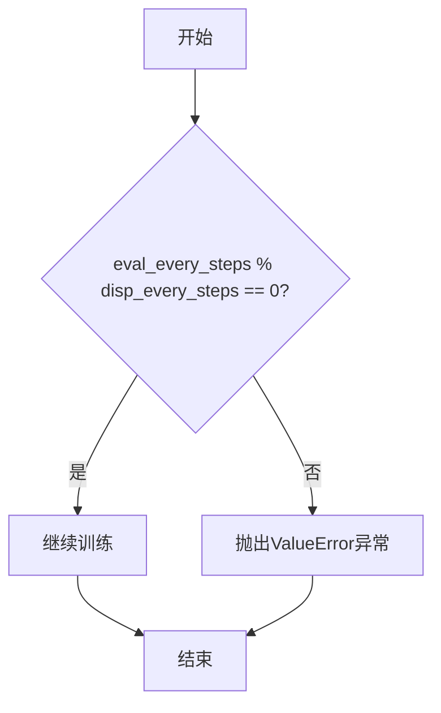
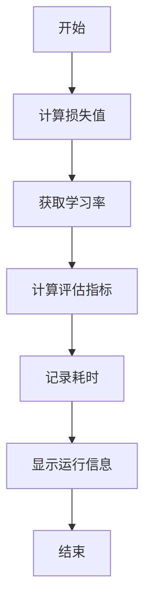
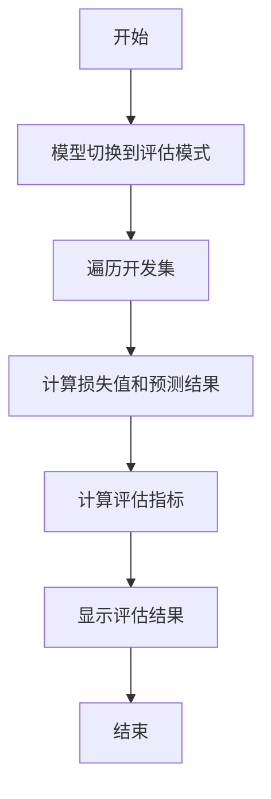
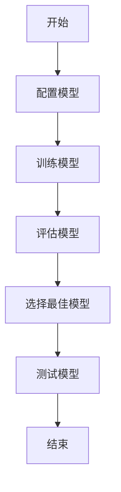

# 训练循环机制

<cite>
**本文档引用的文件**   
- [trainer.py](file://eznlp/training/trainer.py)
- [evaluation.py](file://eznlp/training/evaluation.py)
- [entity_recognition.py](file://scripts/entity_recognition.py)
- [NER任务完整流程.md](file://docs/NER任务完整流程.md)
</cite>

## 目录
1. [引言](#引言)
2. [训练循环核心实现](#训练循环核心实现)
3. [日志与评估频率控制](#日志与评估频率控制)
4. [运行指标计算与显示](#运行指标计算与显示)
5. [评估流程](#评估流程)
6. [性能监控与模型选择](#性能监控与模型选择)

## 引言

在eznlp框架中，训练循环是模型训练过程的核心，负责协调训练、评估和模型保存等关键操作。本文档将深入解析`train_steps`方法的实现机制，详细说明`disp_every_steps`和`eval_every_steps`参数如何控制日志输出频率和评估频率，以及它们之间的倍数关系约束。同时，本文档将阐述训练循环中如何计算和显示运行指标（如损失、学习率、耗时等），并解释在训练集和开发集上的评估流程。结合NER任务完整流程文档，说明训练过程中如何进行性能监控和模型选择。

## 训练循环核心实现

`train_steps`方法是eznlp框架中训练循环的核心实现，负责协调训练、评估和模型保存等关键操作。该方法通过`Trainer`类实现，`Trainer`类是训练过程的控制器，负责管理模型的训练、评估和保存。

`train_steps`方法的主要功能包括：
- **训练**：在训练集上进行训练，更新模型参数。
- **评估**：在开发集上进行评估，计算评估指标。
- **模型保存**：根据评估结果保存最佳模型。

`train_steps`方法的实现逻辑如下：
1. 初始化训练参数，包括最大训练步数、日志显示频率、评估频率等。
2. 进入训练循环，遍历训练数据。
3. 对每个批次的数据进行前向传播，计算损失。
4. 进行反向传播，更新模型参数。
5. 根据`disp_every_steps`参数控制日志输出频率。
6. 根据`eval_every_steps`参数控制评估频率。
7. 保存最佳模型。

**Section sources**
- [trainer.py](file://eznlp/training/trainer.py#L221-L376)

## 日志与评估频率控制

`disp_every_steps`和`eval_every_steps`参数是控制训练过程中日志输出频率和评估频率的关键参数。这两个参数的设置直接影响训练过程的监控和模型性能的评估。

### `disp_every_steps`参数

`disp_every_steps`参数控制日志输出的频率。在训练过程中，每经过`disp_every_steps`步，就会输出一次运行信息。这些信息包括当前的训练轮数、步数、学习率、损失值、评估指标和耗时等。

如果`disp_every_steps`未设置，则默认为一个训练轮次的步数。这意味着在每个训练轮次结束时，都会输出一次运行信息。

### `eval_every_steps`参数

`eval_every_steps`参数控制评估的频率。在训练过程中，每经过`eval_every_steps`步，就会在开发集上进行一次评估。评估结果包括损失值和评估指标（如精确率、召回率、F1分数等）。

如果`eval_every_steps`未设置，则默认为`disp_every_steps`的值。这意味着评估频率与日志输出频率相同。

### 倍数关系约束

`eval_every_steps`和`disp_every_steps`之间存在倍数关系约束。具体来说，`eval_every_steps`必须是`disp_every_steps`的整数倍。这一约束确保了评估操作总是在日志输出时进行，从而保证了评估结果的及时性和一致性。

如果`eval_every_steps`不是`disp_every_steps`的整数倍，`train_steps`方法会抛出`ValueError`异常，提示用户修正参数设置。

**Diagram sources**
- [trainer.py](file://eznlp/training/trainer.py#L254-L263)

## 运行指标计算与显示

在训练过程中，`train_steps`方法会计算和显示一系列运行指标，帮助用户监控训练过程。这些指标包括损失值、学习率、评估指标和耗时等。

### 损失值

损失值是衡量模型预测结果与真实标签之间差异的指标。在训练过程中，损失值会随着模型参数的更新而逐渐减小。`train_steps`方法会计算每个批次的损失值，并在日志中显示平均损失值。

### 学习率

学习率是控制模型参数更新步长的超参数。在训练过程中，学习率可能会根据学习率调度器（scheduler）的设置进行调整。`train_steps`方法会获取当前的学习率，并在日志中显示。

### 评估指标

评估指标是衡量模型性能的指标，包括精确率、召回率、F1分数等。在评估过程中，`train_steps`方法会调用相应的评估函数（如`evaluate_entity_recognition`）计算评估指标，并在日志中显示。

### 耗时

耗时是衡量训练过程效率的指标。`train_steps`方法会记录从上一次日志输出到当前时间的耗时，并在日志中显示。

**Diagram sources**
- [trainer.py](file://eznlp/training/trainer.py#L296-L315)

## 评估流程

在训练过程中，`train_steps`方法会在开发集上进行评估，以监控模型性能。评估流程包括以下几个步骤：

1. **模型切换到评估模式**：将模型切换到评估模式，关闭dropout等训练时的特殊操作。
2. **遍历开发集**：遍历开发集中的所有数据，进行前向传播，计算损失值和预测结果。
3. **计算评估指标**：调用相应的评估函数（如`evaluate_entity_recognition`）计算评估指标。
4. **显示评估结果**：在日志中显示评估结果，包括损失值和评估指标。

评估流程的实现逻辑如下：
- 调用`eval_epoch`方法在开发集上进行评估。
- `eval_epoch`方法会遍历开发集中的所有数据，计算损失值和预测结果。
- 调用`evaluate_entity_recognition`函数计算评估指标。
- 在日志中显示评估结果。

**Diagram sources**
- [trainer.py](file://eznlp/training/trainer.py#L317-L330)
- [evaluation.py](file://eznlp/training/evaluation.py#L64-L95)

## 性能监控与模型选择

在训练过程中，性能监控和模型选择是确保模型性能的关键环节。通过监控开发集上的评估结果，可以及时发现模型的过拟合或欠拟合问题，并选择最佳模型。

### 性能监控

性能监控主要通过在开发集上进行评估来实现。每次评估后，`train_steps`方法会比较当前的评估结果与历史最佳结果。如果当前结果优于历史最佳结果，则更新历史最佳结果，并保存当前模型。

### 模型选择

模型选择主要基于评估结果。`train_steps`方法提供了两种模型选择策略：
- **基于损失值**：选择损失值最小的模型。
- **基于评估指标**：选择评估指标（如F1分数）最高的模型。

用户可以通过`save_by_loss`参数选择模型选择策略。如果`save_by_loss`为`True`，则基于损失值选择模型；否则，基于评估指标选择模型。

结合NER任务完整流程文档，训练过程中通过以下步骤进行性能监控和模型选择：
1. **配置模型**：根据任务需求配置模型架构和参数。
2. **训练模型**：使用`train_steps`方法训练模型，监控训练过程。
3. **评估模型**：在开发集上进行评估，计算评估指标。
4. **选择最佳模型**：根据评估结果选择最佳模型。
5. **测试模型**：在测试集上进行最终评估，验证模型性能。

**Diagram sources**
- [entity_recognition.py](file://scripts/entity_recognition.py#L864-L870)
- [NER任务完整流程.md](file://docs/NER任务完整流程.md#L222-L223)