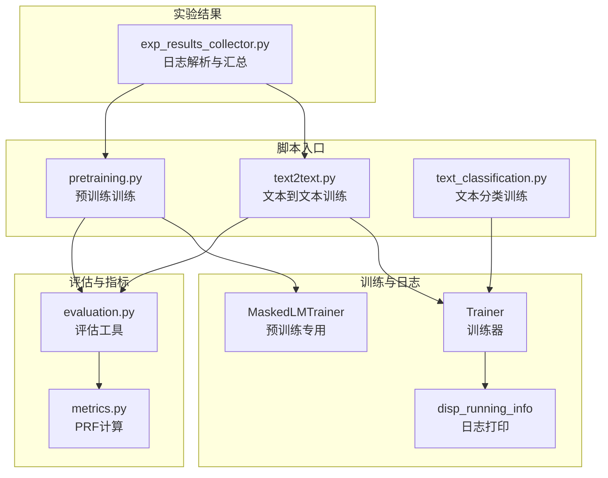
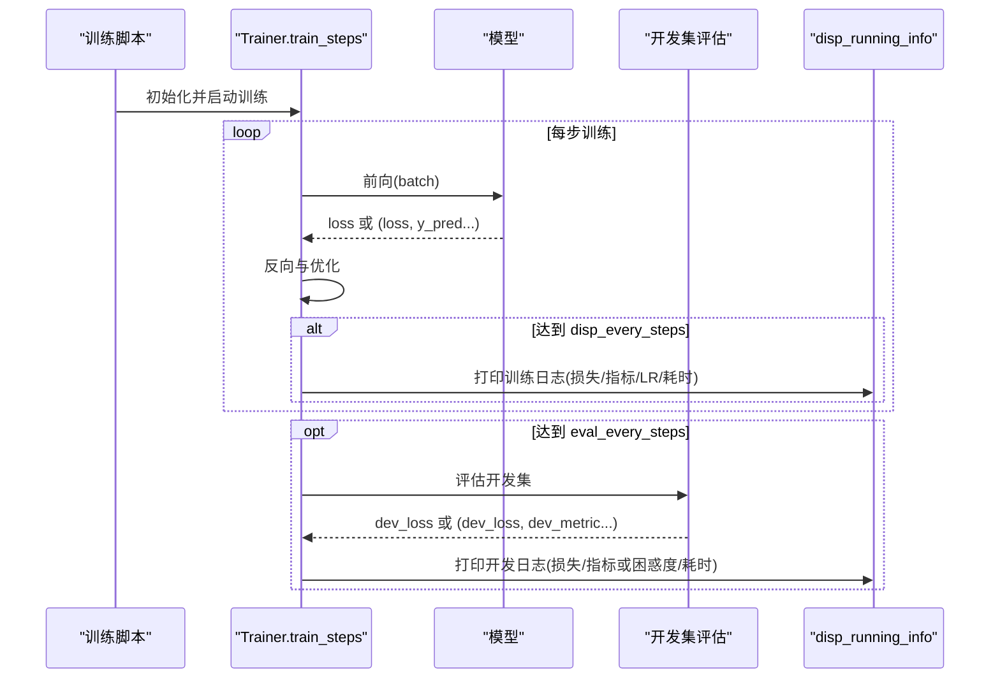
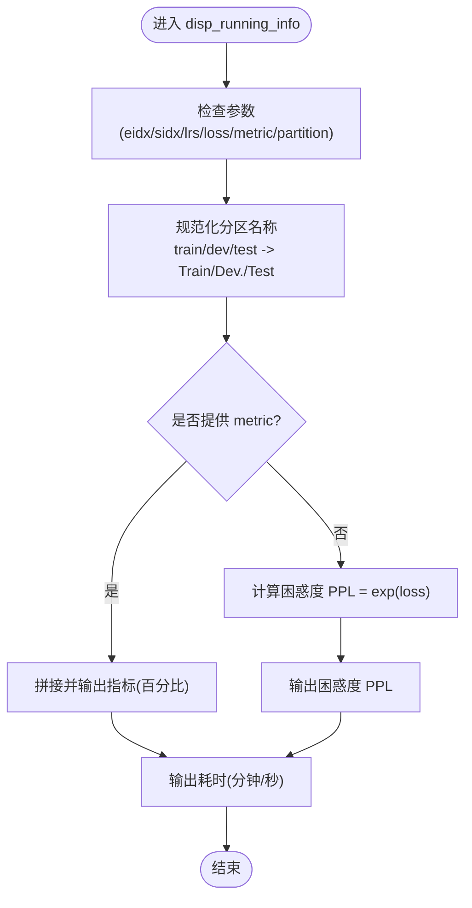
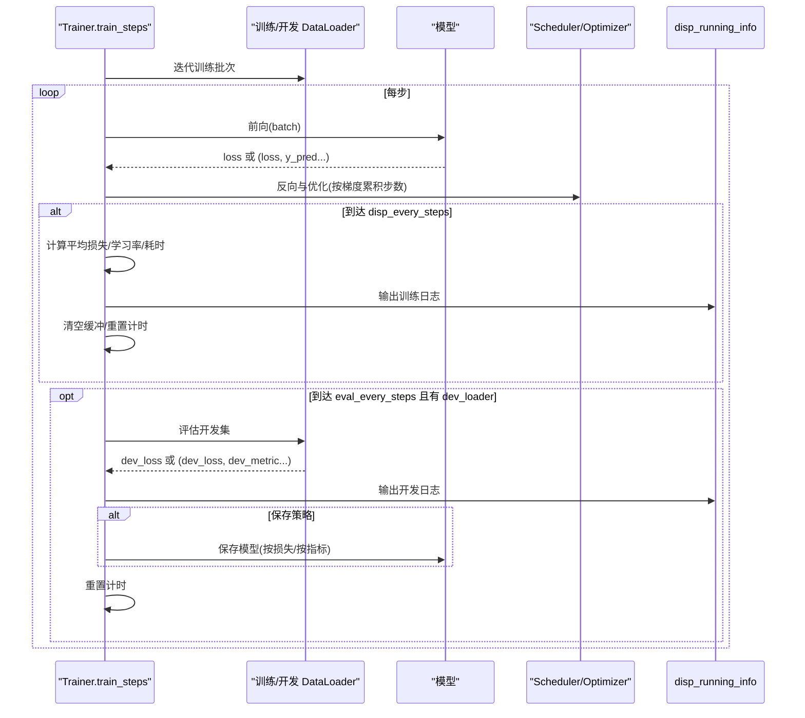
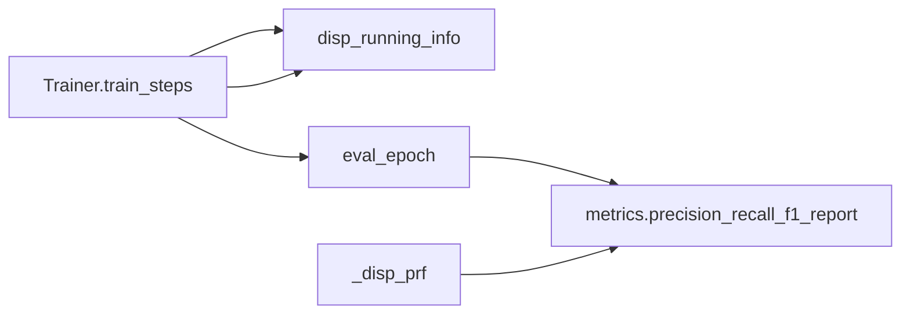

# 训练监控与日志输出

<cite>
**本文引用的文件列表**
- [eznlp/training/trainer.py](file://eznlp/training/trainer.py)
- [eznlp/training/plm_trainer.py](file://eznlp/training/plm_trainer.py)
- [eznlp/training/evaluation.py](file://eznlp/training/evaluation.py)
- [eznlp/metrics.py](file://eznlp/metrics.py)
- [scripts/text2text.py](file://scripts/text2text.py)
- [scripts/pretraining.py](file://scripts/pretraining.py)
- [scripts/exp_results_collector.py](file://scripts/exp_results_collector.py)
- [scripts/text_classification.py](file://scripts/text_classification.py)
</cite>

## 目录
1. [简介](#简介)
2. [项目结构](#项目结构)
3. [核心组件](#核心组件)
4. [架构总览](#架构总览)
5. [详细组件分析](#详细组件分析)
6. [依赖关系分析](#依赖关系分析)
7. [性能考量](#性能考量)
8. [故障排查指南](#故障排查指南)
9. [结论](#结论)
10. [附录](#附录)

## 简介
本文围绕训练过程中的监控与日志输出展开，重点解析以下内容：
- disp_running_info 函数的实现机制与调用链路
- 训练过程中损失、学习率、耗时等指标的计算与显示方式
- disp_every_steps 参数如何控制日志输出频率
- 运行指标（如困惑度 PPL）的计算逻辑
- 训练集与开发集性能指标的展示格式（损失、精确率、召回率、F1 分数以百分比形式呈现）
- 结合 NER 任务的实际输出，说明日志信息对训练过程监控的重要性，并提供日志分析的实用技巧

## 项目结构
与训练监控直接相关的核心模块与脚本如下：
- 训练器与日志：eznlp/training/trainer.py、eznlp/training/plm_trainer.py
- 评估与指标：eznlp/training/evaluation.py、eznlp/metrics.py
- 脚本入口：scripts/text2text.py、scripts/pretraining.py、scripts/text_classification.py
- 实验结果收集：scripts/exp_results_collector.py

图表来源
- [eznlp/training/trainer.py](file://eznlp/training/trainer.py#L221-L418)
- [eznlp/training/plm_trainer.py](file://eznlp/training/plm_trainer.py#L1-L35)
- [eznlp/training/evaluation.py](file://eznlp/training/evaluation.py#L1-L108)
- [eznlp/metrics.py](file://eznlp/metrics.py#L1-L153)
- [scripts/text2text.py](file://scripts/text2text.py#L194-L245)
- [scripts/pretraining.py](file://scripts/pretraining.py#L198-L248)
- [scripts/text_classification.py](file://scripts/text_classification.py#L278-L304)
- [scripts/exp_results_collector.py](file://scripts/exp_results_collector.py#L1-L138)

章节来源
- [eznlp/training/trainer.py](file://eznlp/training/trainer.py#L221-L418)
- [eznlp/training/evaluation.py](file://eznlp/training/evaluation.py#L1-L108)
- [eznlp/metrics.py](file://eznlp/metrics.py#L1-L153)
- [scripts/text2text.py](file://scripts/text2text.py#L194-L245)
- [scripts/pretraining.py](file://scripts/pretraining.py#L198-L248)
- [scripts/text_classification.py](file://scripts/text_classification.py#L278-L304)
- [scripts/exp_results_collector.py](file://scripts/exp_results_collector.py#L1-L138)

## 核心组件
- Trainer.train_steps：训练主循环，负责按步训练、周期性日志打印、周期性开发集评估与早停/保存策略
- disp_running_info：统一的日志打印接口，支持训练/开发阶段的损失、指标、学习率、耗时等信息输出
- MaskedLMTrainer：预训练专用训练器，封装掩码语言建模的前向与损失计算
- evaluation.py 与 metrics.py：提供实体识别等任务的 PRF 指标计算与日志输出格式

章节来源
- [eznlp/training/trainer.py](file://eznlp/training/trainer.py#L221-L418)
- [eznlp/training/plm_trainer.py](file://eznlp/training/plm_trainer.py#L1-L35)
- [eznlp/training/evaluation.py](file://eznlp/training/evaluation.py#L1-L108)
- [eznlp/metrics.py](file://eznlp/metrics.py#L1-L153)

## 架构总览
训练流程概览（以 NER/文本生成为例）：
- 训练脚本构建数据加载器与训练器
- Trainer.train_steps 每步执行前向、反向与优化，并按 disp_every_steps 打印日志
- 开发集评估由 eval_every_steps 控制，评估后同样通过 disp_running_info 输出
- 评估工具根据任务类型计算 PRF 指标并以百分比格式输出

图表来源
- [eznlp/training/trainer.py](file://eznlp/training/trainer.py#L221-L418)
- [eznlp/training/evaluation.py](file://eznlp/training/evaluation.py#L1-L108)

## 详细组件分析

### 组件一：disp_running_info 日志打印机制
- 功能定位：统一输出训练/开发阶段的关键指标，包括 Epoch/Step、学习率、损失、指标或困惑度、耗时等
- 输出格式要点：
  - 训练阶段：显示“Train”分区；若存在指标则以“/”分隔列出各指标百分比；否则以困惑度 PPL 展示
  - 开发/测试阶段：显示“Dev.”或“Test”分区；同上
  - 学习率：以括号内斜杠分隔的形式列出各参数组的学习率
  - 耗时：以“分钟m 秒s”的形式展示
- 调用时机：
  - 训练阶段：每 disp_every_steps 步调用一次，清空缓冲并重置计时
  - 开发阶段：每 eval_every_steps 步调用一次，评估后立即打印

图表来源
- [eznlp/training/trainer.py](file://eznlp/training/trainer.py#L377-L418)

章节来源
- [eznlp/training/trainer.py](file://eznlp/training/trainer.py#L377-L418)

### 组件二：训练主循环 train_steps 的日志与评估调度
- disp_every_steps 与 eval_every_steps：
  - 若未显式设置，disp_every_steps 默认等于一个 epoch 的步数（即每个 epoch 打印一次）
  - eval_every_steps 默认为 disp_every_steps 的整数倍（通常为 100 倍），且必须能被 disp_every_steps 整除
- 训练阶段日志：
  - 每 disp_every_steps 步，计算平均损失，获取当前学习率，累计耗时，调用 disp_running_info 输出
  - 同时清空训练缓冲（损失与预测/标签列表），重置计时器
- 开发阶段日志：
  - 每 eval_every_steps 步，执行 eval_epoch 并根据是否存在指标选择输出“指标百分比”或“困惑度 PPL”
  - 根据 save_by_loss 决定保存策略：最小化损失或最大化指标均值
  - 非按损失保存时，若指标均值优于历史最佳，则保存模型

图表来源
- [eznlp/training/trainer.py](file://eznlp/training/trainer.py#L221-L376)

章节来源
- [eznlp/training/trainer.py](file://eznlp/training/trainer.py#L221-L376)

### 组件三：困惑度 PPL 的计算逻辑
- 当任务不提供指标（如语言建模）时，disp_running_info 会将损失转换为困惑度 PPL，并以数值形式输出
- 公式：PPL = exp(loss)
- 该逻辑确保在没有可解释的指标（如 F1）时，仍能以统一的“困惑度”衡量模型拟合程度

章节来源
- [eznlp/training/trainer.py](file://eznlp/training/trainer.py#L377-L418)

### 组件四：训练集与开发集性能指标的展示格式
- 指标来源：
  - 训练阶段：当模型解码器具备指标能力时，disp_running_info 会输出各指标的百分比
  - 开发阶段：同样输出指标百分比；若无指标则输出困惑度
- 指标类型（以实体识别为例）：
  - 精确率 Precision、召回率 Recall、F1 分数
  - 提供“宏平均(Macro)”与“微平均(Micro)”两种聚合方式
- 输出格式：
  - 以百分比形式展示，例如“Precision: XX.XX%”，“Recall: XX.XX%”，“F1-score: XX.XX%”
  - 多个指标以“/”分隔在同一行输出

章节来源
- [eznlp/training/evaluation.py](file://eznlp/training/evaluation.py#L28-L62)
- [eznlp/metrics.py](file://eznlp/metrics.py#L98-L153)
- [eznlp/training/trainer.py](file://eznlp/training/trainer.py#L377-L418)

### 组件五：disp_every_steps 参数对日志输出频率的影响
- 默认行为：
  - 若未指定 disp_every_steps，默认按“每 epoch 一次”的频率输出
  - eval_every_steps 默认为 disp_every_steps 的 100 倍，且需满足整除约束
- 自定义行为：
  - 可通过命令行参数传入 disp_every_steps，从而调整日志输出频率
  - eval_every_steps 未显式传入时，将自动按上述规则推导

章节来源
- [eznlp/training/trainer.py](file://eznlp/training/trainer.py#L253-L264)
- [scripts/pretraining.py](file://scripts/pretraining.py#L234-L239)
- [scripts/text2text.py](file://scripts/text2text.py#L218-L224)

### 组件六：NER 任务日志输出与分析要点
- 实体识别评估流程：
  - 使用 Trainer.predict 获取预测结果
  - 调用 precision_recall_f1_report 计算宏/微平均的 Precision、Recall、F1
  - 通过 evaluation.py 中的 _disp_prf 将结果以百分比格式输出
- 日志分析技巧：
  - 关注“Train”与“Dev.”分区的损失变化趋势，判断过拟合/欠拟合
  - 对比“Macro”与“Micro”指标差异，识别类别不平衡问题
  - 结合困惑度 PPL（若无指标）观察语言建模效果
  - 利用实验结果收集脚本从 training.log 中提取指标，进行批量对比与可视化

章节来源
- [eznlp/training/evaluation.py](file://eznlp/training/evaluation.py#L28-L62)
- [eznlp/metrics.py](file://eznlp/metrics.py#L98-L153)
- [scripts/exp_results_collector.py](file://scripts/exp_results_collector.py#L1-L138)

## 依赖关系分析
- Trainer 依赖：
  - 模型解码器的指标数量（num_metrics），用于决定是否输出指标或转而输出困惑度
  - 优化器与调度器，用于学习率与权重更新
  - 数据加载器，用于迭代训练/开发批次
- disp_running_info 依赖：
  - Trainer.train_steps 的调用上下文，传递 eidx、sidx、lrs、loss、metric、partition 等
- 评估工具依赖：
  - metrics.precision_recall_f1_report 提供 PRF 计算
  - evaluation._disp_prf 将结果格式化为百分比输出

图表来源
- [eznlp/training/trainer.py](file://eznlp/training/trainer.py#L221-L418)
- [eznlp/training/evaluation.py](file://eznlp/training/evaluation.py#L28-L62)
- [eznlp/metrics.py](file://eznlp/metrics.py#L98-L153)

章节来源
- [eznlp/training/trainer.py](file://eznlp/training/trainer.py#L221-L418)
- [eznlp/training/evaluation.py](file://eznlp/training/evaluation.py#L28-L62)
- [eznlp/metrics.py](file://eznlp/metrics.py#L98-L153)

## 性能考量
- 日志输出频率与 I/O 成本：
  - disp_every_steps 越小，日志越频繁，I/O 成本越高；建议在调试期使用较小值，在生产训练中适当增大
- 梯度累积与学习率调度：
  - 梯度累积步数影响优化器步频与调度器步频；需确保 schedule_by_step 与 num_grad_acc_steps 的配合
- 自动混合精度：
  - Trainer 支持 autocast 与 GradScaler，有助于提升吞吐量并降低显存占用

[本节为通用指导，无需特定文件来源]

## 故障排查指南
- 日志未输出或输出异常：
  - 确认 logging.basicConfig 已正确初始化，且 handler 包含文件与/或终端输出
  - 检查 disp_every_steps 与 eval_every_steps 的设置是否合理（需整除关系）
- 指标缺失导致仅输出困惑度：
  - 若模型解码器未提供指标（num_metrics=0），disp_running_info 将自动输出困惑度 PPL
  - 可通过增加解码器指标能力或在评估阶段单独输出指标
- 指标百分比显示异常：
  - 确认评估工具传入的 gold/pred 格式符合 precision_recall_f1_report 的要求
  - 检查宏/微平均聚合模式是否符合预期

章节来源
- [eznlp/training/trainer.py](file://eznlp/training/trainer.py#L253-L264)
- [eznlp/training/evaluation.py](file://eznlp/training/evaluation.py#L28-L62)
- [eznlp/metrics.py](file://eznlp/metrics.py#L98-L153)

## 结论
- disp_running_info 是训练监控的核心输出点，统一了训练/开发阶段的指标展示格式
- disp_every_steps 与 eval_every_steps 协同控制日志频率与评估节奏，建议结合任务规模与资源进行权衡
- 在无指标任务中，困惑度 PPL 提供了统一的性能度量；在 NER 等任务中，PRF 百分比直观反映模型效果
- 通过实验结果收集脚本可自动化提取日志中的指标，便于批量对比与可视化

[本节为总结性内容，无需特定文件来源]

## 附录
- 实际脚本中的训练入口与日志配置：
  - 文本到文本训练脚本：设置 logging.handlers 并调用 Trainer.train_steps
  - 预训练训练脚本：设置 LambdaLR 学习率调度并调用 Trainer.train_steps
  - 文本分类训练脚本：设置 logging.handlers 并调用 Trainer.train_steps
- 实验结果收集脚本：从 training.log 中提取指标并导出为 Excel 或压缩包

章节来源
- [scripts/text2text.py](file://scripts/text2text.py#L162-L245)
- [scripts/pretraining.py](file://scripts/pretraining.py#L198-L248)
- [scripts/text_classification.py](file://scripts/text_classification.py#L278-L304)
- [scripts/exp_results_collector.py](file://scripts/exp_results_collector.py#L1-L138)