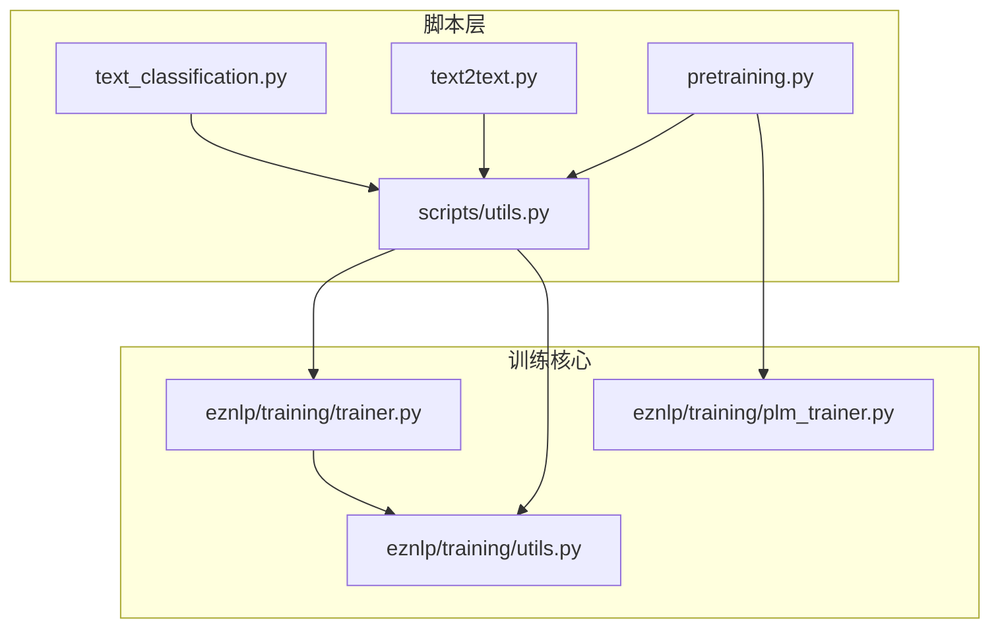
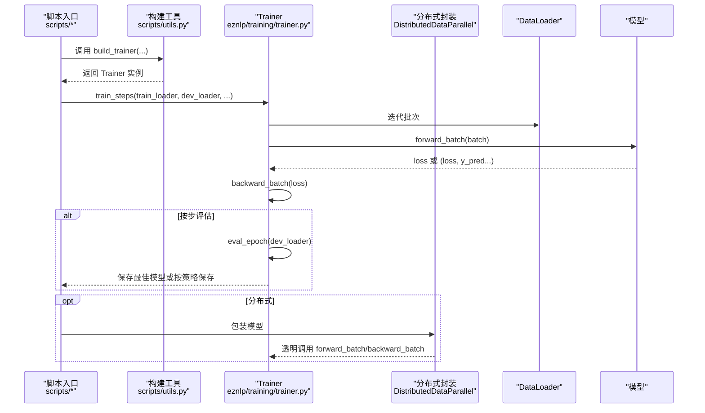
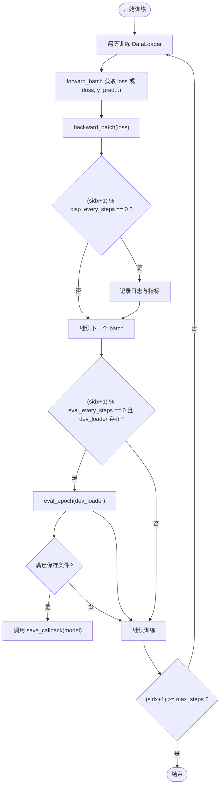
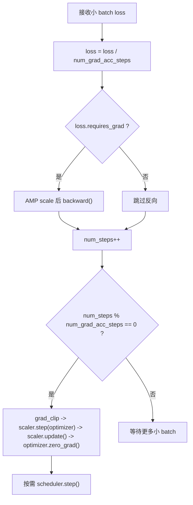
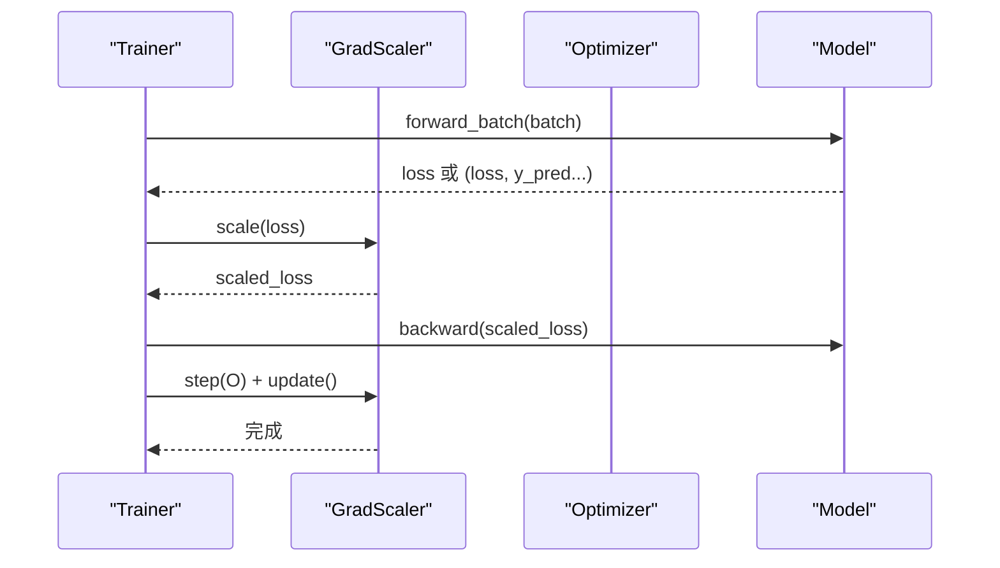
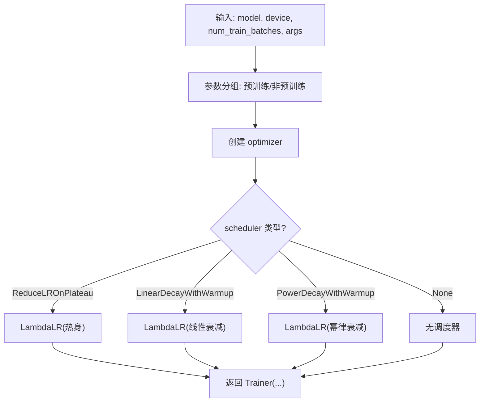
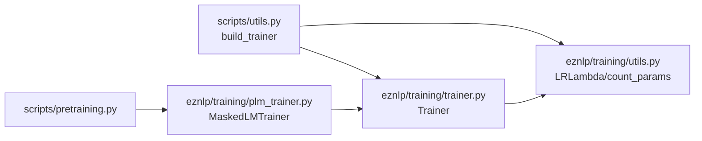

# 训练流程

<cite>
**本文引用的文件列表**
- [trainer.py](file://eznlp/training/trainer.py)
- [plm_trainer.py](file://eznlp/training/plm_trainer.py)
- [utils.py](file://eznlp/training/utils.py)
- [utils.py](file://scripts/utils.py)
- [text_classification.py](file://scripts/text_classification.py)
- [text2text.py](file://scripts/text2text.py)
- [pretraining.py](file://scripts/pretraining.py)
- [test_trainer.py](file://tests/training/test_trainer.py)
</cite>

## 目录
1. [引言](#引言)
2. [项目结构与入口](#项目结构与入口)
3. [核心组件：Trainer 类](#核心组件trainer-类)
4. [架构总览](#架构总览)
5. [详细组件解析](#详细组件解析)
6. [依赖关系分析](#依赖关系分析)
7. [性能与资源特性](#性能与资源特性)
8. [故障排查指南](#故障排查指南)
9. [结论](#结论)

## 引言
本文件系统性梳理 eznlp 的训练流程，重点覆盖以下方面：
- Trainer 类的初始化、训练循环与生命周期管理
- train_steps 方法如何协调训练、评估与模型保存，并通过 disp_every_steps 和 eval_every_steps 控制日志输出与评估频率
- 梯度累积（gradient accumulation）的实现原理及 num_grad_acc_steps 的作用
- 混合精度训练（AMP）在 forward_batch 与 backward_batch 中的具体实现
- 结合 scripts/utils.py 中的 build_trainer 函数，说明优化器与学习率调度器的配置方式

## 项目结构与入口
eznlp 的训练相关代码主要位于 eznlp/training 目录，训练脚本集中在 scripts 目录。训练流程通常遵循如下路径：
- 数据准备与配置构建（scripts/utils.py）
- 构建模型与数据加载器（scripts/* 脚本）
- 使用 build_trainer 创建 Trainer 实例并调用 train_steps 开始训练
- 训练过程中按步频进行日志打印、评估与模型保存

图表来源
- [text_classification.py](file://scripts/text_classification.py#L204-L304)
- [text2text.py](file://scripts/text2text.py#L148-L246)
- [pretraining.py](file://scripts/pretraining.py#L93-L249)
- [utils.py](file://scripts/utils.py#L1301-L1338)
- [trainer.py](file://eznlp/training/trainer.py#L15-L124)
- [plm_trainer.py](file://eznlp/training/plm_trainer.py#L1-L35)
- [utils.py](file://eznlp/training/utils.py#L1-L202)

章节来源
- [text_classification.py](file://scripts/text_classification.py#L204-L304)
- [text2text.py](file://scripts/text2text.py#L148-L246)
- [pretraining.py](file://scripts/pretraining.py#L93-L249)
- [utils.py](file://scripts/utils.py#L1301-L1338)

## 核心组件：Trainer 类
Trainer 是训练流程的核心控制器，负责：
- 初始化优化器、学习率调度器、设备、梯度裁剪、AMP 等超参
- 封装单步前向与反向传播逻辑
- 提供 train_epoch、eval_epoch、train_steps 等训练接口
- 生命周期管理：维护 num_steps、best_dev_loss、best_dev_metric 等状态

关键点：
- 初始化参数
  - optimizer、scheduler、schedule_by_step 决定是否按 step 调度
  - num_grad_acc_steps 控制梯度累积步数
  - device、non_blocking、grad_clip、use_amp 控制设备、异步传输、梯度裁剪与 AMP
  - scaler 为 GradScaler，用于 AMP
- 前向与反向
  - forward_batch 返回损失（可选附带预测），支持多指标场景
  - backward_batch 对损失做归一化后反传，按 num_grad_acc_steps 执行一次优化器步进与梯度清零；按 schedule_by_step 或 scheduler 类型决定何时 step
- 训练循环
  - train_steps 支持按步频打印日志、按步频评估 dev 并保存最佳模型；支持最大步数限制与早停风格的 dev 评估触发

章节来源
- [trainer.py](file://eznlp/training/trainer.py#L15-L124)
- [trainer.py](file://eznlp/training/trainer.py#L125-L220)
- [trainer.py](file://eznlp/training/trainer.py#L221-L418)

## 架构总览
下图展示了训练主流程中各模块的交互关系与职责划分。

图表来源
- [text_classification.py](file://scripts/text_classification.py#L264-L298)
- [text2text.py](file://scripts/text2text.py#L204-L242)
- [pretraining.py](file://scripts/pretraining.py#L204-L240)
- [utils.py](file://scripts/utils.py#L1301-L1338)
- [trainer.py](file://eznlp/training/trainer.py#L155-L220)
- [trainer.py](file://eznlp/training/trainer.py#L221-L418)

## 详细组件解析

### Trainer 初始化与生命周期
- 初始化要点
  - 参数校验与默认值：num_grad_acc_steps 非正则置为 1；device 必须提供；use_amp 时启用 GradScaler
  - num_steps 统计“真实”优化步数，用于梯度累积与调度
  - scheduler 与 schedule_by_step 的配合：ReduceLROnPlateau 不允许按 step 调度
- 生命周期管理
  - 训练开始前设置 model.train()，评估前设置 model.eval()
  - 维护 best_dev_loss 与 best_dev_metric，按 save_by_loss 判定保存策略
  - 训练结束时 reset 状态，保证多次调用的正确性

章节来源
- [trainer.py](file://eznlp/training/trainer.py#L15-L124)
- [trainer.py](file://eznlp/training/trainer.py#L221-L418)

### 训练循环与 train_steps 协调机制
- 步频控制
  - disp_every_steps：每 N 步打印一次运行信息（包含 epoch、step、学习率、loss、metric、耗时）
  - eval_every_steps：每 M 步评估一次 dev，并根据 save_by_loss 选择保存策略；要求 eval_every_steps 是 disp_every_steps 的倍数
- 评估与保存
  - 若 dev_loader 存在：评估 dev，更新 best_dev_loss 或 best_dev_metric，并在满足条件时调用 save_callback
  - 若 dev_loader 不存在：按 save_callback 默认保存（便于自定义保存策略）
  - scheduler 在不同模式下的 step 触发：ReduceLROnPlateau 按 dev 指标 step；否则按 epoch 或 step（取决于 schedule_by_step）
- 最大步数与早停
  - max_steps 可限制总步数；达到上限即停止训练

图表来源
- [trainer.py](file://eznlp/training/trainer.py#L221-L418)

章节来源
- [trainer.py](file://eznlp/training/trainer.py#L221-L418)

### 梯度累积（Gradient Accumulation）
- 原理
  - 将“名义 batch size”乘以 num_grad_acc_steps 得到“真实 batch size”，在不增加显存占用的前提下提升有效 batch size
  - 在 backward_batch 中对 loss 除以 num_grad_acc_steps，使累计多个小 batch 的梯度等价于一个大 batch 的梯度
  - 仅当 num_steps 能被 num_grad_acc_steps 整除时才执行一次 optimizer.step 与 scheduler.step
- 关键实现位置
  - loss 归一化：在 backward_batch 中对 loss 做除法
  - 优化器步进与清零：按 num_grad_acc_steps 的倍数触发
  - 调度器步进：由 schedule_by_step 与 scheduler 类型共同决定

图表来源
- [trainer.py](file://eznlp/training/trainer.py#L82-L124)

章节来源
- [trainer.py](file://eznlp/training/trainer.py#L82-L124)
- [test_trainer.py](file://tests/training/test_trainer.py#L36-L84)

### 混合精度训练（AMP）在 forward_batch 与 backward_batch 中的应用
- forward_batch
  - 使用 autocast 包裹前向计算，自动切换至半精度以降低显存与加速
- backward_batch
  - 先 scaler.scale(loss)，再 backward()，最后 scaler.step(optimizer) 与 scaler.update()
  - 在执行 optimizer.step 前，若启用 grad_clip，则先 unscale_ 再 clip
- 初始化
  - Trainer 构造时创建 GradScaler，use_amp 为 True 时启用

图表来源
- [trainer.py](file://eznlp/training/trainer.py#L161-L189)
- [trainer.py](file://eznlp/training/trainer.py#L82-L124)

章节来源
- [trainer.py](file://eznlp/training/trainer.py#L161-L189)
- [trainer.py](file://eznlp/training/trainer.py#L82-L124)

### 优化器与学习率调度器配置（build_trainer）
- 参数分组
  - 预训练参数与非预训练参数分别设置不同的学习率，确保微调与冻结策略一致
- 优化器
  - 通过 args.optimizer 选择 AdamW/SGD/Adadelta/Adamax
- 学习率调度器
  - ReduceLROnPlateau：按 dev 指标下降触发
  - LinearDecayWithWarmup：按总步数与热身步数生成 LambdaLR
  - PowerDecayWithWarmup：指数/幂律衰减
  - schedule_by_step：当使用 warmup 时按 step 调度
- Trainer 构造
  - 将上述对象注入 Trainer，同时传递 device、grad_clip、use_amp、num_grad_acc_steps 等

图表来源
- [utils.py](file://scripts/utils.py#L1301-L1338)
- [utils.py](file://eznlp/training/utils.py#L1-L202)

章节来源
- [utils.py](file://scripts/utils.py#L1301-L1338)
- [utils.py](file://eznlp/training/utils.py#L1-L202)

### 评估与日志输出
- 日志格式
  - disp_running_info 输出 epoch、step、学习率、loss、metric、耗时等
- 评估
  - eval_epoch 在 eval 模式下运行，收集 y_gold 与 y_pred，计算指标
- 保存策略
  - save_by_loss=True 时以 dev_loss 更低为保存条件；否则以 dev 指标更高为条件

章节来源
- [trainer.py](file://eznlp/training/trainer.py#L191-L220)
- [trainer.py](file://eznlp/training/trainer.py#L377-L418)

### 预训练专用 Trainer：MaskedLMTrainer
- 作用
  - 专门处理掩码语言建模任务的前向逻辑，构造模型输入字典并聚合损失
- 特点
  - 处理 paired_lab_ids（如 NSP/SOP）等可选输入
  - 对多 GPU 场景下 loss 的维度进行 mean 聚合
- 与通用 Trainer 的关系
  - 继承 Trainer，重写 forward_batch，其余训练流程复用

章节来源
- [plm_trainer.py](file://eznlp/training/plm_trainer.py#L1-L35)

## 依赖关系分析
- 组件耦合
  - Trainer 依赖模型接口（forward/loss）、解码器接口（_unsqueezed_decode/_unsqueezed_evaluate）、数据加载器
  - build_trainer 依赖 torch.optim 与 torch.optim.lr_scheduler，以及 LRLambda
- 外部依赖
  - AMP 使用 torch.amp.autocast 与 GradScaler
  - 分布式训练通过 DistributedDataParallel 包装模型，Trainer 保持透明调用
- 可能的循环依赖
  - 未发现直接循环导入；训练脚本通过 utils 构建 Trainer，避免了循环引用

图表来源
- [utils.py](file://scripts/utils.py#L1301-L1338)
- [trainer.py](file://eznlp/training/trainer.py#L15-L124)
- [utils.py](file://eznlp/training/utils.py#L1-L202)
- [plm_trainer.py](file://eznlp/training/plm_trainer.py#L1-L35)
- [pretraining.py](file://scripts/pretraining.py#L204-L240)

章节来源
- [utils.py](file://scripts/utils.py#L1301-L1338)
- [trainer.py](file://eznlp/training/trainer.py#L15-L124)
- [utils.py](file://eznlp/training/utils.py#L1-L202)
- [plm_trainer.py](file://eznlp/training/plm_trainer.py#L1-L35)
- [pretraining.py](file://scripts/pretraining.py#L204-L240)

## 性能与资源特性
- 显存与吞吐
  - 梯度累积通过增大“真实 batch size”提升稳定性与泛化，但会增加训练时间
  - AMP 在 CUDA 上显著降低显存占用并提升吞吐，建议在 GPU 上开启 use_amp
- 调度与收敛
  - warmup + decay 的学习率策略有助于稳定前期训练
  - ReduceLROnPlateau 适合指标震荡较大的场景
- 设备选择
  - auto_device 自动选择空闲显存最大的 GPU，若不足则回退 CPU

章节来源
- [trainer.py](file://eznlp/training/trainer.py#L15-L124)
- [utils.py](file://eznlp/training/utils.py#L158-L202)
- [utils.py](file://scripts/utils.py#L1301-L1338)

## 故障排查指南
- AMP 相关
  - 若使用 CPU，AMP 无法生效；测试中对 CPU 跳过 AMP 测试
- 梯度累积一致性
  - 通过单元测试验证相同随机种子下，累积步数与 nominal batch size 的组合应得到相近参数更新
- 调度器冲突
  - ReduceLROnPlateau 与按 step 调度不可同时启用；schedule_by_step 仅适用于含 warmup 的 LambdaLR
- 评估与保存
  - 若 eval_every_steps 不是 disp_every_steps 的整数倍，将抛出异常
  - 无 dev_loader 时，按 save_callback 默认保存，注意自定义保存策略

章节来源
- [test_trainer.py](file://tests/training/test_trainer.py#L1-L35)
- [test_trainer.py](file://tests/training/test_trainer.py#L36-L84)
- [trainer.py](file://eznlp/training/trainer.py#L253-L264)
- [trainer.py](file://eznlp/training/trainer.py#L345-L357)

## 结论
eznlp 的训练体系以 Trainer 为核心，通过清晰的初始化、稳定的训练循环与灵活的评估保存策略，实现了从文本分类到序列标注、再到预训练的通用训练框架。梯度累积与 AMP 的结合提升了大 batch 训练的可行性与效率；build_trainer 将优化器与调度器配置抽象为统一入口，便于扩展与复用。实际使用中，建议根据任务规模与显存情况合理设置 num_grad_acc_steps 与 use_amp，并依据数据集特性选择合适的 scheduler 与保存策略。