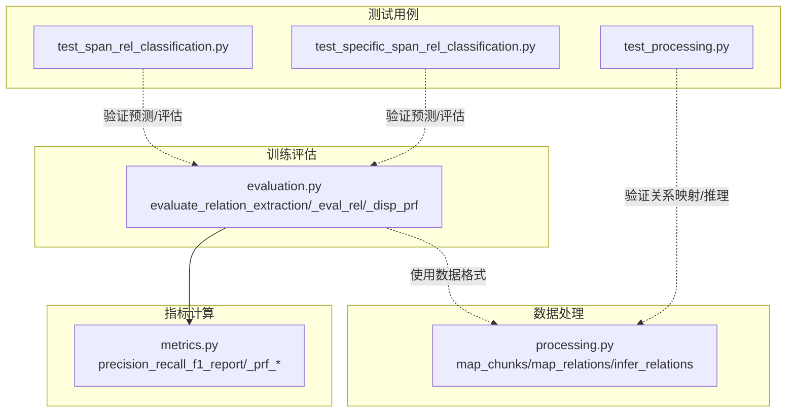
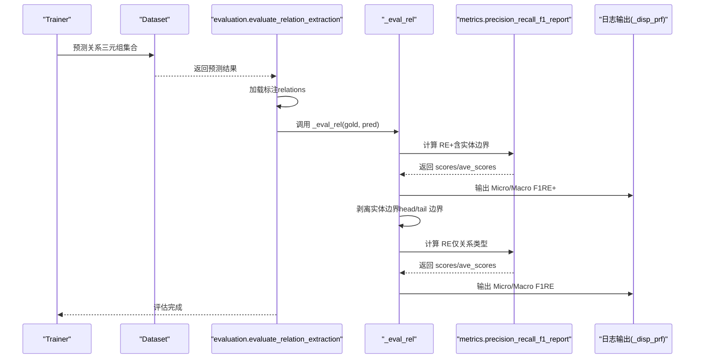
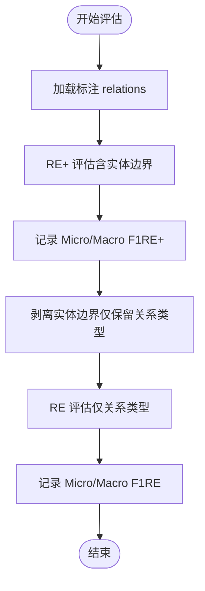
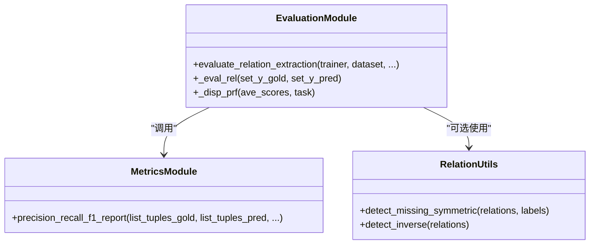
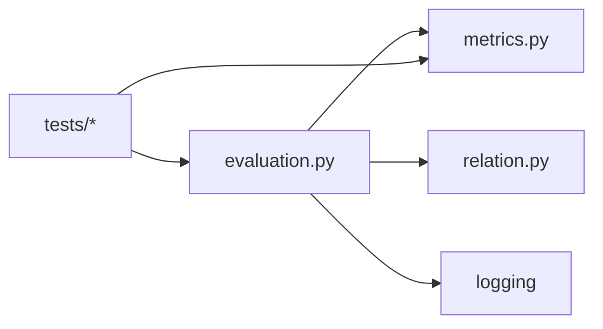

# 关系抽取评估

<cite>
**本文引用的文件**
- [evaluation.py](file://eznlp/training/evaluation.py)
- [metrics.py](file://eznlp/metrics.py)
- [relation.py](file://eznlp/utils/relation.py)
- [processing.py](file://eznlp/io/processing.py)
- [test_span_rel_classification.py](file://tests/model/test_span_rel_classification.py)
- [test_specific_span_rel_classification.py](file://tests/model/test_specific_span_rel_classification.py)
- [test_processing.py](file://tests/io/test_processing.py)
</cite>

## 目录
1. [引言](#引言)
2. [项目结构](#项目结构)
3. [核心组件](#核心组件)
4. [架构总览](#架构总览)
5. [详细组件分析](#详细组件分析)
6. [依赖分析](#依赖分析)
7. [性能考量](#性能考量)
8. [故障排查指南](#故障排查指南)
9. [结论](#结论)

## 引言
本文件系统性阐述关系抽取任务的评估方法，聚焦于 evaluate_relation_extraction 函数的实现细节与内部机制。文档解释如何将关系三元组（关系类型、头实体、尾实体）进行标准化处理，并基于标准格式计算 Micro/Macro F1 分数；进一步剖析 _eval_rel 内部函数对“关系类型”和“实体边界”的分离评估策略；最后说明评估结果在日志中的分级展示方式，包括 RE+（含实体边界）与 RE（仅关系类型）两种模式的差异与用途。

## 项目结构
关系抽取评估相关的核心代码分布在训练评估模块、指标计算模块以及数据预处理/后处理模块中：
- 训练评估模块：提供 evaluate_relation_extraction 及其内部 _eval_rel、_disp_prf 等评估入口与展示逻辑
- 指标计算模块：提供 precision_recall_f1_report 与底层 PRF 计算函数，支持按类型或样本聚合
- 数据处理模块：提供关系映射、吸收属性等工具，确保输入数据格式一致
- 测试用例：覆盖模型预测、无标注预测、关系推理等场景，验证评估流程正确性

图表来源
- [evaluation.py](file://eznlp/training/evaluation.py#L1-L203)
- [metrics.py](file://eznlp/metrics.py#L1-L153)
- [processing.py](file://eznlp/io/processing.py#L42-L248)
- [test_span_rel_classification.py](file://tests/model/test_span_rel_classification.py#L1-L118)
- [test_specific_span_rel_classification.py](file://tests/model/test_specific_span_rel_classification.py#L1-L170)
- [test_processing.py](file://tests/io/test_processing.py#L40-L87)

章节来源
- [evaluation.py](file://eznlp/training/evaluation.py#L1-L203)
- [metrics.py](file://eznlp/metrics.py#L1-L153)
- [processing.py](file://eznlp/io/processing.py#L42-L248)
- [test_span_rel_classification.py](file://tests/model/test_span_rel_classification.py#L1-L118)
- [test_specific_span_rel_classification.py](file://tests/model/test_specific_span_rel_classification.py#L1-L170)
- [test_processing.py](file://tests/io/test_processing.py#L40-L87)

## 核心组件
- evaluate_relation_extraction：关系抽取评估入口，负责调用模型预测、加载标注、执行 _eval_rel 并输出日志
- _eval_rel：关系评估的核心逻辑，先以“含实体边界”的三元组计算一次 F1（RE+），再将实体边界剥离为“仅关系类型”再次计算 F1（RE）
- precision_recall_f1_report：通用 PRF 报告生成器，支持按类型（macro）与按样本（samples）两种聚合方式，返回 micro 与 macro 统计
- _disp_prf：统一的日志打印接口，分别输出 Micro 与 Macro 的 Precision/Recall/F1 百分比
- relation 工具：提供对称缺失检测、逆关系检测等辅助能力（用于数据质量与规则推断）

章节来源
- [evaluation.py](file://eznlp/training/evaluation.py#L113-L127)
- [metrics.py](file://eznlp/metrics.py#L98-L153)
- [relation.py](file://eznlp/utils/relation.py#L1-L31)

## 架构总览
下图展示了从模型到评估的整体调用链路与数据流。

图表来源
- [evaluation.py](file://eznlp/training/evaluation.py#L142-L153)
- [evaluation.py](file://eznlp/training/evaluation.py#L113-L127)
- [metrics.py](file://eznlp/metrics.py#L98-L153)

## 详细组件分析

### evaluate_relation_extraction 与 _eval_rel 实现细节
- 输入输出
  - 输入：Trainer、Dataset、batch_size、save_preds
  - 输出：无直接返回值，通过日志打印评估结果
- 关键步骤
  - 调用 trainer.predict 获取预测的关系三元组集合
  - 若 save_preds 为真，则将预测结果写回 dataset.data；否则加载标注 relations 并进入评估
  - 调用 _eval_rel 对 gold/pred 执行两次评估：RE+（含实体边界）与 RE（仅关系类型）
- 日志输出
  - 使用 _disp_prf 分别打印 Micro 与 Macro 的 Precision/Recall/F1 百分比，任务标识分别为 RE+ 与 RE

章节来源
- [evaluation.py](file://eznlp/training/evaluation.py#L142-L153)
- [evaluation.py](file://eznlp/training/evaluation.py#L113-L127)
- [evaluation.py](file://eznlp/training/evaluation.py#L28-L37)

### _eval_rel 的内部机制：关系类型与实体边界的分离评估
- 第一次评估（RE+）
  - 直接使用原始三元组（关系类型 + 头实体边界 + 尾实体边界）调用 precision_recall_f1_report
  - 输出 Micro/Macro F1，任务标识为 RE+
- 实体边界剥离
  - 将每个三元组的头尾实体边界从元组中剔除，仅保留关系类型
  - 例如：(rel_type, head, tail) -> (rel_type, head[1:], tail[1:])
- 第二次评估（RE）
  - 在剥离边界后的三元组上再次调用 precision_recall_f1_report
  - 输出 Micro/Macro F1，任务标识为 RE

该机制的意义在于：
- RE+ 更严格，要求关系类型与实体边界均正确
- RE 更宽松，仅要求关系类型正确，不考虑实体边界是否完全匹配

章节来源
- [evaluation.py](file://eznlp/training/evaluation.py#L113-L127)

### precision_recall_f1_report 的聚合策略与复杂度
- 聚合方式
  - macro_over="types"：按关系类型聚合，先统计每类的 TP、FP、FN，再对 Precision/Recall/F1 取平均得到 Macro；同时汇总所有样本的 TP、FP、FN 得到 Micro
  - macro_over="samples"：按样本聚合，逐样本计算 PRF，再对样本级 PRF 取平均得到 Macro
- 时间复杂度
  - 对于每个样本，将预测与标注转换为集合，求交集得到 TP，复杂度近似 O(N)，其中 N 为样本中三元组数量
  - 整体复杂度约为 O(S*N)，S 为样本数
- 空集处理
  - 当某类或样本没有预测/标注时，采用零除保护策略，避免异常

章节来源
- [metrics.py](file://eznlp/metrics.py#L98-L153)
- [metrics.py](file://eznlp/metrics.py#L32-L95)

### 日志分级展示：RE+ 与 RE 的差异
- RE+（含实体边界）
  - 评估粒度包含实体边界，更贴近“结构化关系抽取”的严格定义
  - 适合关注实体边界识别精度的场景
- RE（仅关系类型）
  - 评估粒度仅包含关系类型，忽略实体边界差异
  - 适合关注关系分类能力的场景

两者均输出 Micro 与 Macro 的 Precision/Recall/F1 百分比，便于横向对比。

章节来源
- [evaluation.py](file://eznlp/training/evaluation.py#L28-L37)
- [evaluation.py](file://eznlp/training/evaluation.py#L113-L127)

### 数据标准化与格式约定
- 关系三元组的标准格式
  - 关系：(rel_type, head, tail)
  - 实体：(chunk_type, start, end)
- 数据预处理与映射
  - map_chunks/map_relations 支持对实体与关系进行类型映射与过滤，保证输入格式一致性
  - 吸收属性/排除属性可将属性信息合并至实体标签或还原为独立属性，避免影响关系评估
- 关系推理
  - infer_relations 可根据给定关系类型将二元关系扩展为多对多关系，便于下游评估

章节来源
- [processing.py](file://eznlp/io/processing.py#L42-L81)
- [processing.py](file://eznlp/io/processing.py#L100-L115)
- [processing.py](file://eznlp/io/processing.py#L133-L185)
- [processing.py](file://eznlp/io/processing.py#L187-L248)

### 评估流程可视化（含实体边界与剥离边界）

图表来源
- [evaluation.py](file://eznlp/training/evaluation.py#L113-L127)

### 类关系图（评估相关）

图表来源
- [evaluation.py](file://eznlp/training/evaluation.py#L113-L127)
- [metrics.py](file://eznlp/metrics.py#L98-L153)
- [relation.py](file://eznlp/utils/relation.py#L1-L31)

## 依赖分析
- 模块耦合
  - evaluation.py 依赖 metrics.py 进行 PRF 计算与聚合
  - evaluation.py 通过日志接口输出结果，不直接依赖外部存储
  - relation.py 提供关系规则辅助，可在数据预处理阶段使用
- 外部依赖
  - logging：用于统一日志输出
  - 测试用例依赖 eznlp 的 Trainer、Dataset、模型配置等，验证预测与评估流程

图表来源
- [evaluation.py](file://eznlp/training/evaluation.py#L1-L203)
- [metrics.py](file://eznlp/metrics.py#L1-L153)
- [relation.py](file://eznlp/utils/relation.py#L1-L31)

章节来源
- [evaluation.py](file://eznlp/training/evaluation.py#L1-L203)
- [metrics.py](file://eznlp/metrics.py#L1-L153)
- [relation.py](file://eznlp/utils/relation.py#L1-L31)

## 性能考量
- 复杂度控制
  - PRF 计算按样本与类型聚合，整体复杂度与样本数和三元组规模线性相关
- 批量评估
  - evaluate_relation_extraction 支持批量大小参数，便于在大规模数据上高效评估
- 日志开销
  - 日志输出为 O(1) 次操作，对总体性能影响可忽略

[本节为一般性指导，无需特定文件来源]

## 故障排查指南
- 格式不一致导致评估异常
  - 确认数据中 relations 的三元组格式为 (rel_type, head, tail)，且 head/tail 为 (chunk_type, start, end)
  - 使用 processing.py 的 map_chunks/map_relations 对齐实体与关系类型
- 评估结果偏低
  - 先检查 RE+ 是否显著低于 RE，若差异较大，可能实体边界识别存在偏差
  - 使用 relation.py 的 detect_inverse 或 detect_missing_symmetric 检查是否存在缺失或方向性问题
- 无标注预测场景
  - 使用测试用例中的无标注预测流程验证模型 predict 行为，确认评估入口正常

章节来源
- [processing.py](file://eznlp/io/processing.py#L42-L81)
- [processing.py](file://eznlp/io/processing.py#L100-L115)
- [relation.py](file://eznlp/utils/relation.py#L1-L31)
- [test_span_rel_classification.py](file://tests/model/test_span_rel_classification.py#L105-L118)
- [test_specific_span_rel_classification.py](file://tests/model/test_specific_span_rel_classification.py#L138-L170)

## 结论
本文件围绕关系抽取评估的实现与实践进行了系统梳理。evaluate_relation_extraction 通过 _eval_rel 完成“含实体边界”与“仅关系类型”两阶段评估，结合 precision_recall_f1_report 的宏/微统计，形成完整的评估报告。配合 processing.py 的数据映射与 relation.py 的规则辅助，可有效提升评估的准确性与可解释性。建议在实际应用中优先关注 RE+ 的表现以衡量结构化抽取质量，并结合 RE 评估关系分类能力，双轨并行以获得更全面的诊断信息。