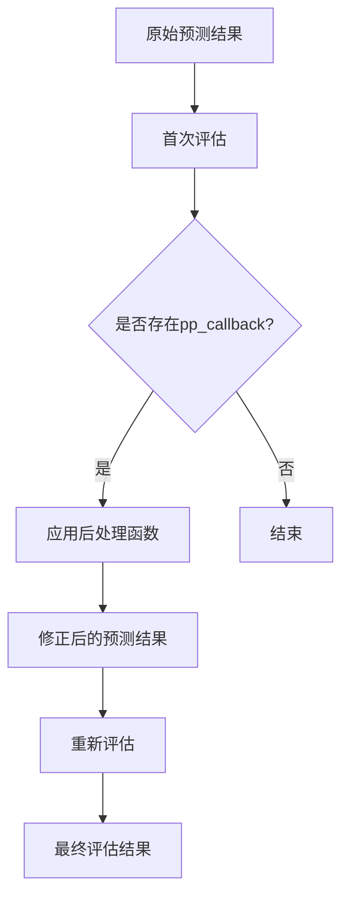
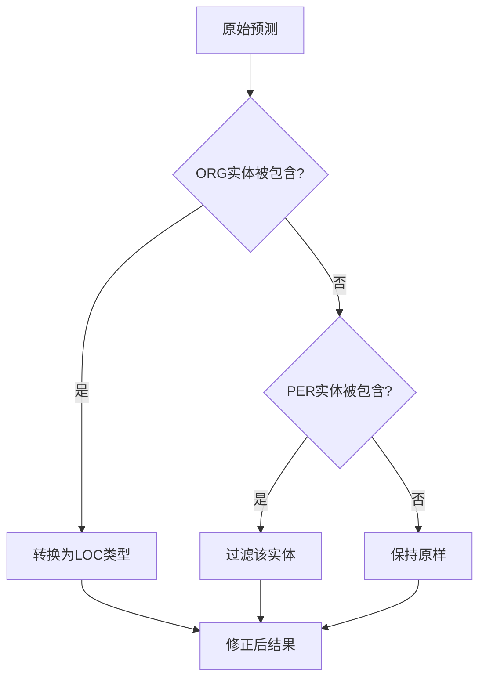

# 后处理机制

<cite>
**本文档引用的文件**   
- [evaluation.py](file://eznlp/training/evaluation.py#L74-L108)
- [entity_recognition.py](file://scripts/entity_recognition.py#L724-L725)
- [boundary_selection.py](file://eznlp/model/decoder/boundary_selection.py#L63-L89)
- [chunk.py](file://eznlp/utils/chunk.py#L40-L47)
</cite>

## 目录
1. [引言](#引言)
2. [pp_callback设计目的](#pp_callback设计目的)
3. [执行流程分析](#执行流程分析)
4. [典型应用场景](#典型应用场景)
5. [自定义后处理实现](#自定义后处理实现)
6. [示例分析](#示例分析)
7. [结论](#结论)

## 引言
在命名实体识别（NER）系统中，后处理机制是提升模型实际部署效果的关键环节。本文档详细说明pp_callback后处理机制的设计目的与执行流程，解释该回调函数在评估流程中的调用时机，描述其典型应用场景，并结合代码结构说明如何实现自定义后处理逻辑。

## pp_callback设计目的
pp_callback后处理机制的设计目的是在原始预测结果评估完成后进行二次处理并重新评估。该机制允许在模型预测后对结果进行修正和优化，从而提升最终的评估指标。通过后处理，可以修正非法实体边界、过滤低置信度预测或应用领域规则过滤，使模型输出更符合实际应用需求。

**Section sources**
- [evaluation.py](file://eznlp/training/evaluation.py#L74-L108)

## 执行流程分析
pp_callback的执行流程遵循严格的顺序：首先进行原始预测结果的评估，然后应用后处理函数对预测结果进行修正，最后重新进行评估。这一流程确保了后处理的效果能够被准确衡量。在代码实现中，evaluate_entity_recognition函数首先计算原始预测结果的评估指标，然后检查是否存在可调用的pp_callback函数，如果存在则应用该函数对预测结果进行处理，并再次进行评估。

**Diagram sources **
- [evaluation.py](file://eznlp/training/evaluation.py#L74-L108)

**Section sources**
- [evaluation.py](file://eznlp/training/evaluation.py#L74-L108)

## 典型应用场景
pp_callback机制在多种场景下发挥重要作用。典型应用场景包括修正非法实体边界，如将跨越句子边界的实体调整到合法范围内；过滤低置信度预测，通过设置置信度阈值去除不可靠的预测结果；应用领域规则过滤，根据特定领域的知识规则对预测结果进行修正。例如，在处理嵌套实体时，可以使用后处理函数来确保内部实体和外部实体的关系符合预定义的规则。

**Section sources**
- [boundary_selection.py](file://eznlp/model/decoder/boundary_selection.py#L63-L89)
- [chunk.py](file://eznlp/utils/chunk.py#L40-L47)

## 自定义后处理实现
实现自定义后处理逻辑需要定义一个符合特定签名的回调函数。该函数接收原始预测结果作为输入，并返回修正后的预测结果。在代码结构中，可以通过继承和重写相关类的方法来实现自定义逻辑。例如，可以创建一个后处理类，实现filter_clashed_by_priority方法来处理冲突的实体预测，或者实现detect_nested方法来识别嵌套实体关系。通过这种方式，用户可以根据具体需求灵活定制后处理策略。

**Section sources**
- [boundary_selection.py](file://eznlp/model/decoder/boundary_selection.py#L63-L89)
- [chunk.py](file://eznlp/utils/chunk.py#L40-L47)

## 示例分析
以conll2003nff数据集为例，系统实现了特定的后处理函数conll2003nff_post_process。该函数通过分析实体间的嵌套关系，对ORG和PER类型的实体进行特殊处理。当ORG实体被其他实体包含时，将其转换为LOC类型；当PER实体被其他PER实体包含时，则将其过滤掉。这种基于领域知识的后处理策略显著提升了模型在该数据集上的表现，体现了pp_callback机制在实际应用中的价值。

**Diagram sources **
- [entity_recognition.py](file://scripts/entity_recognition.py#L724-L725)

**Section sources**
- [entity_recognition.py](file://scripts/entity_recognition.py#L724-L725)

## 结论
pp_callback后处理机制为命名实体识别系统提供了强大的灵活性和可扩展性。通过在评估流程中引入二次处理环节，系统能够有效修正模型预测中的各种问题，显著提升实际部署效果。该机制不仅支持标准的后处理操作，还允许用户根据具体需求实现自定义逻辑，为不同应用场景提供了定制化的解决方案。