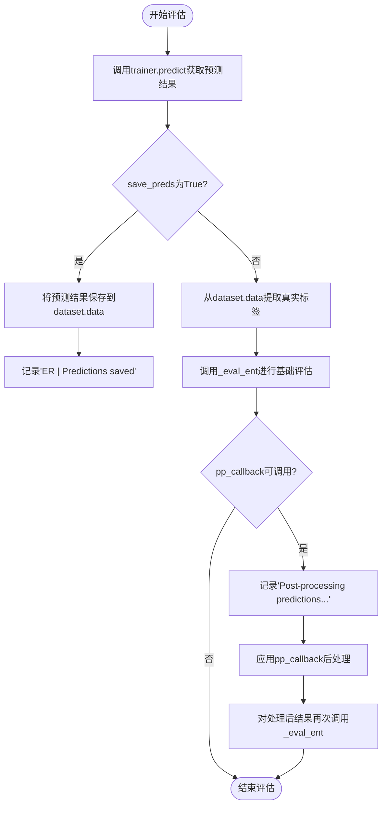
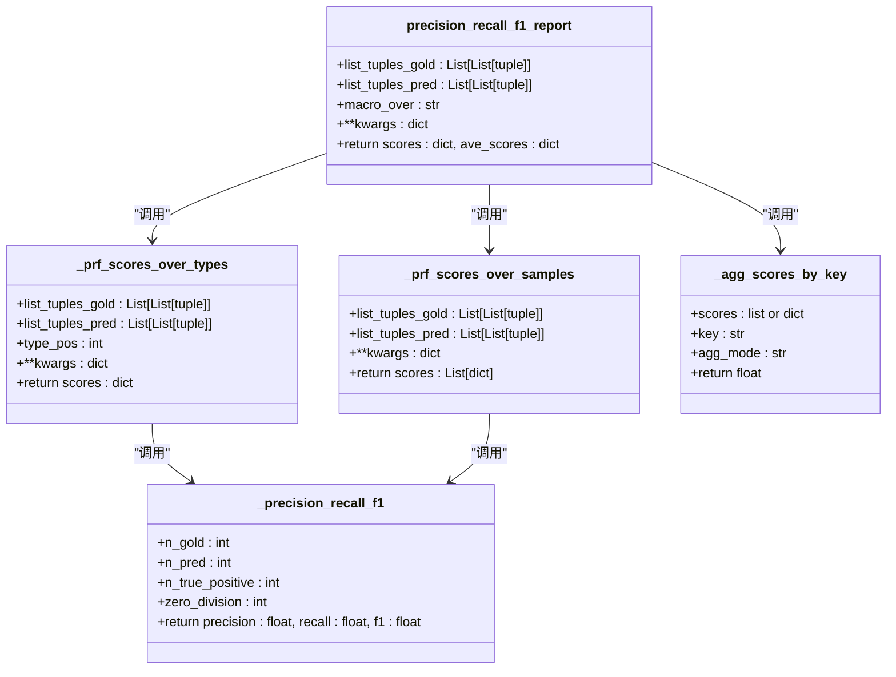
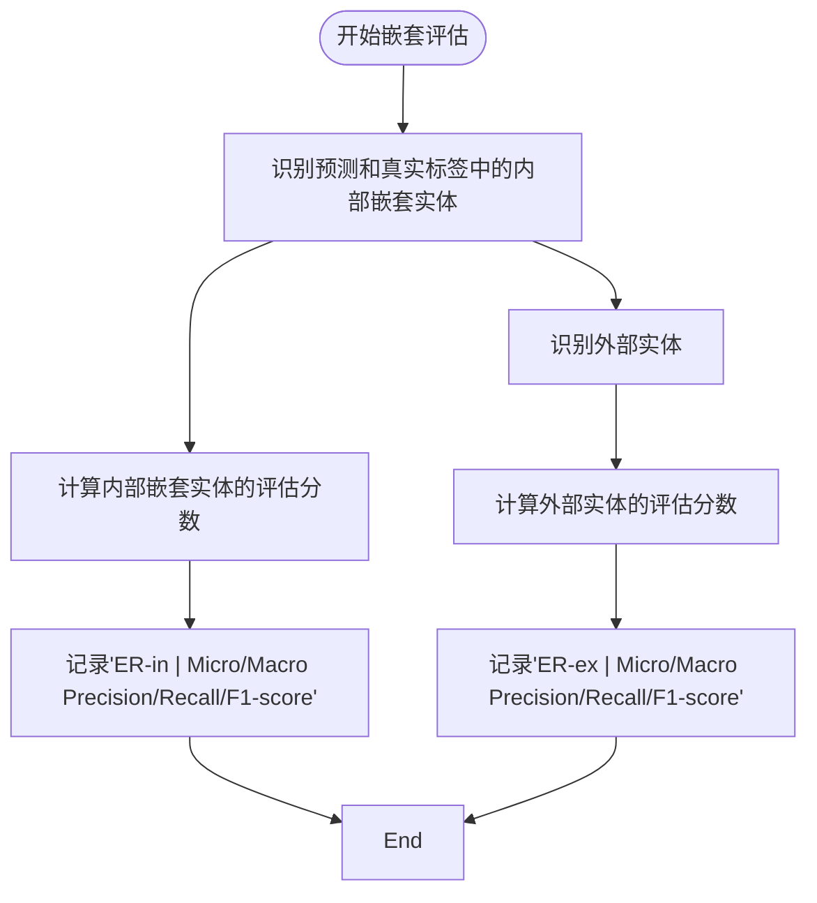

# 命名实体识别评估

<cite>
**本文档引用的文件**
- [evaluation.py](file://eznlp/training/evaluation.py)
- [metrics.py](file://eznlp/metrics.py)
- [chunk.py](file://eznlp/utils/chunk.py)
- [entity_recognition.py](file://scripts/entity_recognition.py)
- [dataset.py](file://eznlp/dataset.py)
</cite>

## 目录
1. [命名实体识别评估系统概述](#命名实体识别评估系统概述)
2. [evaluate_entity_recognition函数工作流程](#evaluate_entity_recognition函数工作流程)
3. [_micro_和_macro_ F1分数计算](#_micro_和_macro_ F1分数计算)
4. [precision_recall_f1_report函数核心作用](#precision_recall_f1_report函数核心作用)
5. [eval_inex参数实现嵌套实体评估](#eval_inex参数实现嵌套实体评估)
6. [pp_callback后处理机制](#pp_callback后处理机制)
7. [评估结果日志输出与预测保存](#评估结果日志输出与预测保存)

## 命名实体识别评估系统概述

命名实体识别（NER）评估系统是该框架中的核心组件，负责对实体识别模型的性能进行全面评估。系统通过`evaluate_entity_recognition`函数实现主要评估功能，该函数集成了一系列评估指标计算、嵌套实体处理和后处理机制。评估系统不仅计算标准的精确率、召回率和F1分数，还支持对嵌套实体进行内外部评估，以及通过回调函数实现预测结果的后处理。

评估系统的设计考虑了多种实体识别场景，包括扁平实体、嵌套实体和任意重叠实体。通过`detect_nested`函数识别嵌套关系，系统能够区分内部嵌套实体和外部实体，从而提供更细致的评估结果。此外，系统支持将预测结果保存到数据集中，便于后续分析和可视化。

**Section sources**
- [evaluation.py](file://eznlp/training/evaluation.py#L1-L203)
- [metrics.py](file://eznlp/metrics.py#L1-L153)

## evaluate_entity_recognition函数工作流程

`evaluate_entity_recognition`函数是命名实体识别评估的核心入口，其工作流程遵循严格的评估步骤。函数首先通过`trainer.predict`方法获取模型在给定数据集上的预测结果，然后根据`save_preds`参数决定是否将预测结果保存到数据集中。

当`save_preds`为False时，函数进入标准评估流程：首先从数据集中提取真实标签（ground truth）作为`set_y_gold`，然后调用`_eval_ent`函数进行基础评估。如果提供了`pp_callback`回调函数，系统会在基础评估后执行后处理，并对处理后的预测结果再次进行评估，以比较后处理前后的性能差异。

函数的参数设计体现了评估的灵活性：`batch_size`控制评估时的批处理大小，`eval_inex`启用嵌套实体的内外部评估，`pp_callback`允许自定义后处理逻辑，`save_preds`则控制是否保存预测结果。这种设计使得评估系统既能满足标准评估需求，又能支持复杂的评估场景。

**Diagram sources**
- [evaluation.py](file://eznlp/training/evaluation.py#L64-L95)

**Section sources**
- [evaluation.py](file://eznlp/training/evaluation.py#L64-L95)

## _micro_和_macro_ F1分数计算

_micro_和_macro_ F1分数是评估系统中的两个核心指标，它们从不同角度衡量模型的性能。_micro_ F1分数通过全局汇总的方式计算，将所有样本的预测结果和真实标签合并后计算精确率、召回率和F1分数。这种计算方式给予每个预测实例相同的权重，适合评估模型在整体数据上的表现。

_macro_ F1分数则采用平均的方式计算，首先为每个类别单独计算F1分数，然后对所有类别的F1分数求算术平均。这种计算方式给予每个类别相同的权重，即使某些类别样本数量较少，也能在评估中得到充分体现。这对于类别不平衡的数据集尤为重要，可以避免多数类别的性能主导整体评估结果。

在实现上，_micro_ F1分数的计算首先汇总所有样本的真阳性、假阳性和假阴性数量，然后基于这些汇总值计算精确率和召回率，最后计算F1分数。_macro_ F1分数的计算则先为每个样本或每个类别计算独立的精确率、召回率和F1分数，然后对这些分数求平均值。两种计算方式各有优势，_micro_ F1更适合关注整体性能的场景，而_macro_ F1更适合关注各类别均衡性能的场景。

**Section sources**
- [metrics.py](file://eznlp/metrics.py#L132-L152)

## precision_recall_f1_report函数核心作用

`precision_recall_f1_report`函数是评估系统的核心计算引擎，负责生成完整的精确率、召回率和F1分数报告。该函数接受真实标签和预测结果作为输入，输出详细的评估分数和平均分数。函数的设计体现了模块化和可扩展性，支持多种评估模式和聚合方式。

函数首先根据`macro_over`参数决定评估的聚合维度，可以是按类型（types）聚合或按样本（samples）聚合。按类型聚合时，函数为每个实体类型单独计算评估分数，然后计算平均值；按样本聚合时，函数为每个样本单独计算评估分数，然后计算平均值。这种灵活性使得评估系统能够适应不同的评估需求。

在计算过程中，函数调用`_prf_scores_over_types`或`_prf_scores_over_samples`生成详细的分数报告，然后通过`_agg_scores_by_key`函数计算平均分数。对于_micro_ F1分数，函数首先汇总所有样本的真阳性、假阳性和假阴性数量，然后基于这些汇总值计算精确率、召回率和F1分数。函数还处理了边界情况，如分母为零的情况，确保评估结果的稳定性和可靠性。

**Diagram sources**
- [metrics.py](file://eznlp/metrics.py#L97-L152)

**Section sources**
- [metrics.py](file://eznlp/metrics.py#L97-L152)

## eval_inex参数实现嵌套实体评估

`eval_inex`参数是评估系统中用于处理嵌套实体的关键配置，它启用了对嵌套实体的内外部评估功能。当`eval_inex`设置为True时，评估系统不仅计算整体的实体识别性能，还分别评估内部嵌套实体和外部实体的识别性能，从而提供更细致的评估视角。

评估过程首先调用`detect_nested`函数识别预测结果和真实标签中的嵌套实体。对于每个样本，系统将实体分为内部嵌套实体和外部实体两类。内部嵌套实体是指完全包含在其他实体内部的实体，而外部实体则是不被任何其他实体包含的实体。通过这种分类，系统能够分析模型在不同层次实体识别上的表现差异。

在实现上，系统首先计算所有实体的整体评估分数，然后分别计算内部嵌套实体和外部实体的评估分数。这种分层评估有助于识别模型在处理复杂嵌套结构时的弱点，例如模型可能在识别外部大范围实体时表现良好，但在识别内部细粒度实体时表现较差。评估结果以"ER"、"ER-in"和"ER-ex"前缀分别标识整体、内部和外部评估结果，便于用户比较和分析。

**Diagram sources**
- [evaluation.py](file://eznlp/training/evaluation.py#L39-L62)
- [chunk.py](file://eznlp/utils/chunk.py#L63-L79)

**Section sources**
- [evaluation.py](file://eznlp/training/evaluation.py#L39-L62)

## pp_callback后处理机制

`pp_callback`后处理机制为评估系统提供了灵活的预测结果修正能力，允许在评估过程中应用自定义的后处理逻辑。该机制在基础评估完成后被调用，对原始预测结果进行处理，然后对处理后的结果进行重新评估，从而比较后处理前后的性能变化。

后处理机制的应用场景包括：修正明显的预测错误、应用领域特定的规则、合并或拆分预测实体、调整实体边界等。通过回调函数的方式，系统保持了高度的灵活性，用户可以根据具体需求实现各种后处理策略，而无需修改评估系统的核心代码。

在执行逻辑上，当检测到`pp_callback`为可调用对象时，系统首先记录"Post-processing predictions..."日志，然后对每个样本的预测结果应用回调函数。处理后的预测结果被用于第二次评估，评估结果与基础评估结果并列输出，便于直接比较。这种设计使得用户能够量化后处理策略对模型性能的影响，为模型优化提供指导。

**Section sources**
- [evaluation.py](file://eznlp/training/evaluation.py#L91-L94)

## 评估结果日志输出与预测保存

评估系统的日志输出格式设计清晰，便于用户快速理解评估结果。系统使用标准的logging模块输出评估信息，每条日志以任务标识（如"ER"、"ER-in"、"ER-ex"）开头，后跟评估指标名称和具体数值。数值以百分比形式显示，保留三位小数，确保结果的精确性和可读性。

日志输出包括_micro_和_macro_两种评估模式下的精确率、召回率和F1分数，为用户提供全面的性能视图。当启用`eval_inex`时，系统会输出三组评估结果：整体实体、内部嵌套实体和外部实体的评估分数，便于分析模型在不同实体类型上的表现差异。

预测结果保存功能通过`save_preds`参数控制。当该参数为True时，系统将预测结果以"chunks_pred"键保存到数据集的每个样本中。这种设计使得预测结果与原始数据保持关联，便于后续的错误分析、可视化和进一步处理。保存的预测结果可以用于生成预测报告、进行人工审核或作为下游任务的输入。

**Section sources**
- [evaluation.py](file://eznlp/training/evaluation.py#L84-L87)
- [evaluation.py](file://eznlp/training/evaluation.py#L32-L36)