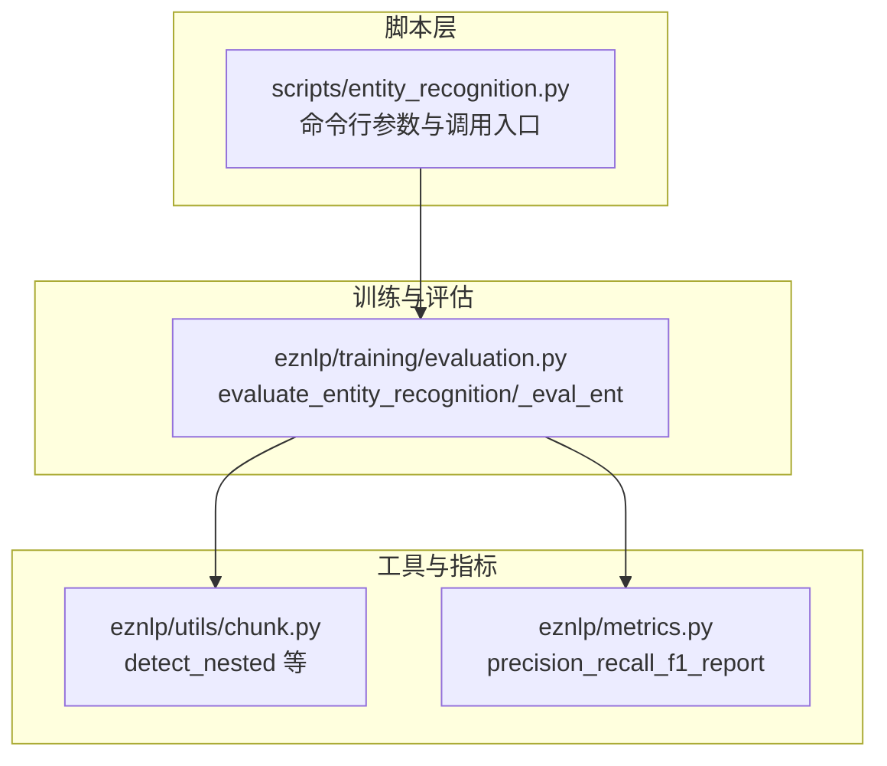
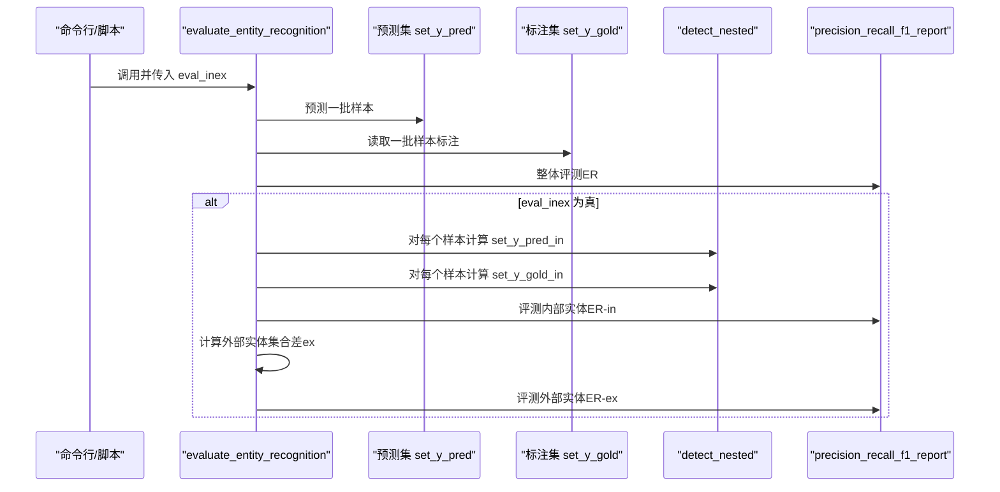
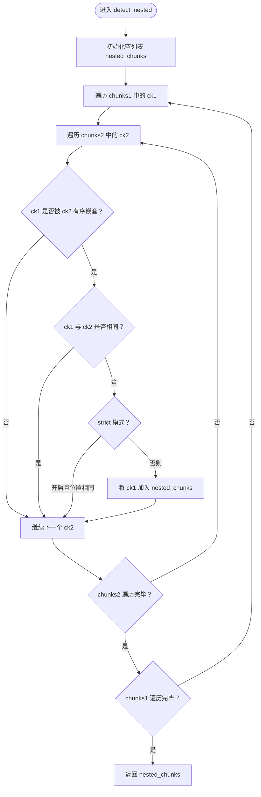
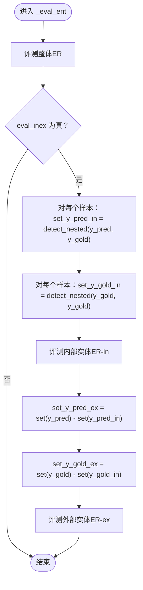
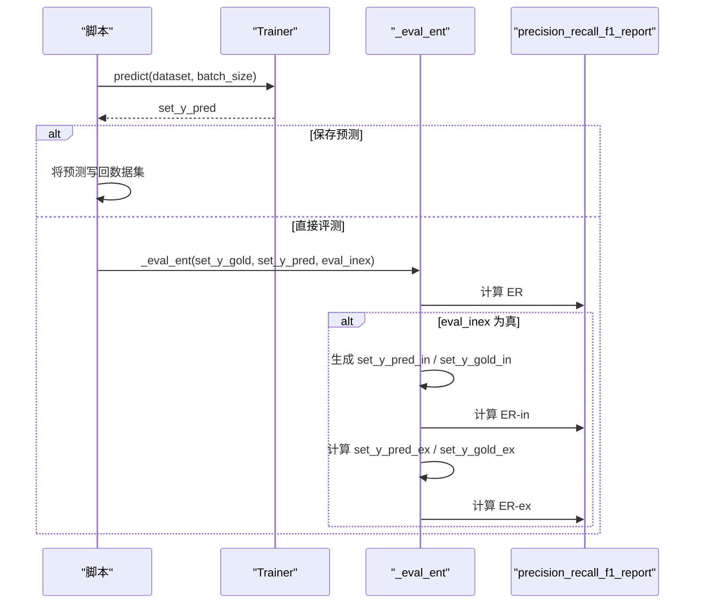
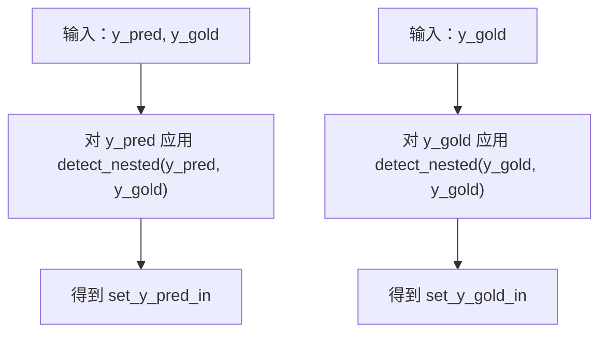
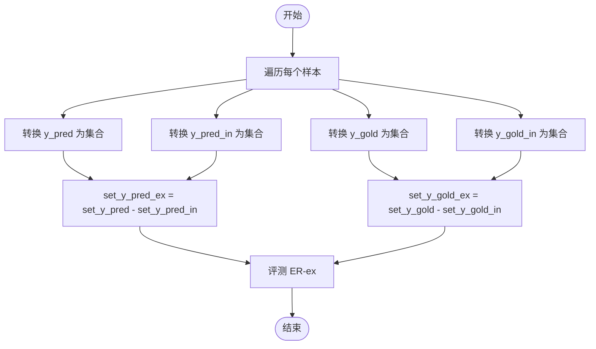
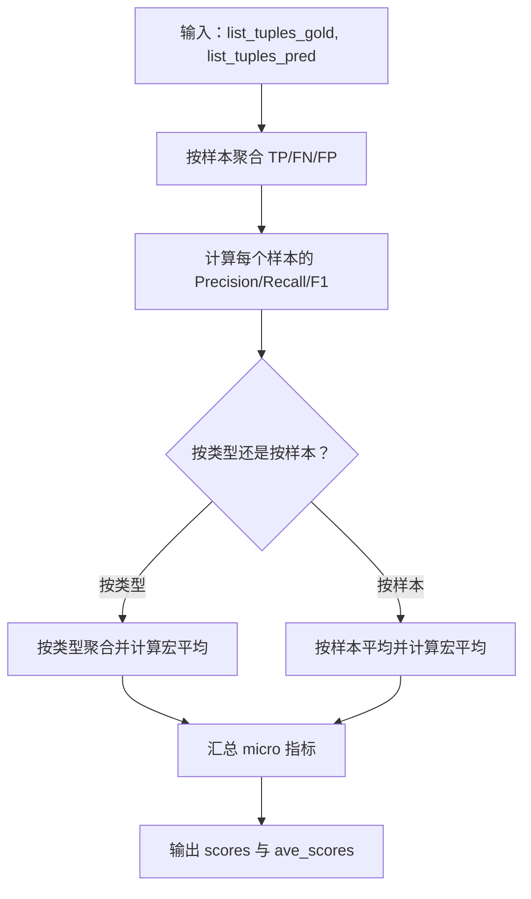
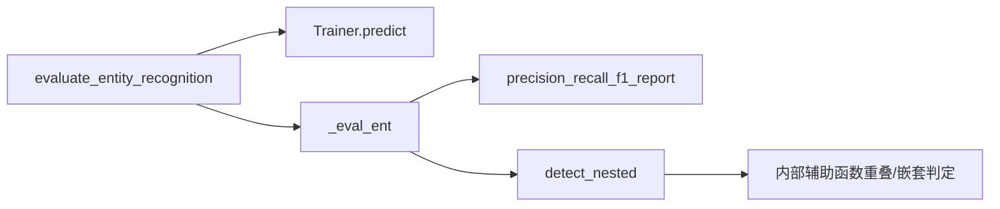

# 嵌套实体评估

<cite>
**本文引用的文件列表**
- [evaluation.py](file://eznlp/training/evaluation.py)
- [chunk.py](file://eznlp/utils/chunk.py)
- [metrics.py](file://eznlp/metrics.py)
- [entity_recognition.py](file://scripts/entity_recognition.py)
</cite>

## 目录
1. [简介](#简介)
2. [项目结构](#项目结构)
3. [核心组件](#核心组件)
4. [架构总览](#架构总览)
5. [详细组件分析](#详细组件分析)
6. [依赖关系分析](#依赖关系分析)
7. [性能考量](#性能考量)
8. [故障排查指南](#故障排查指南)
9. [结论](#结论)
10. [附录](#附录)

## 简介
本节聚焦于嵌套实体评估中 eval_inex 参数的实现机制，系统阐述以下内容：
- detect_nested 函数如何识别“内部（in）”与“外部（ex）”嵌套实体；
- evaluate_entity_recognition 如何在开启 eval_inex 时，对两类实体进行独立评估；
- set_y_pred_in 与 set_y_gold_in 的生成过程；
- 内部实体与外部实体的集合运算逻辑；
- 该评估方式对嵌套 NER 模型性能分析的重要性及典型应用场景。

## 项目结构
与嵌套实体评估直接相关的核心文件如下：
- 训练与评估入口：scripts/entity_recognition.py
- 实体识别评估逻辑：eznlp/training/evaluation.py
- 嵌套实体检测工具：eznlp/utils/chunk.py
- 评测指标计算：eznlp/metrics.py

图表来源
- [entity_recognition.py](file://scripts/entity_recognition.py#L90-L120)
- [evaluation.py](file://eznlp/training/evaluation.py#L64-L95)
- [chunk.py](file://eznlp/utils/chunk.py#L63-L86)
- [metrics.py](file://eznlp/metrics.py#L98-L153)

章节来源
- [entity_recognition.py](file://scripts/entity_recognition.py#L90-L120)
- [evaluation.py](file://eznlp/training/evaluation.py#L64-L95)

## 核心组件
- eval_inex 参数：控制是否启用内部/外部嵌套实体的独立评估。
- detect_nested：从一组候选实体中筛选出“被其他实体包含”的内部实体；支持严格模式与非严格模式。
- _eval_ent：统一的实体识别评测流程，当 eval_inex 为真时，额外输出 ER-in 与 ER-ex 的评测结果。
- precision_recall_f1_report：基于样本集合的微平均与宏平均评测指标计算。

章节来源
- [evaluation.py](file://eznlp/training/evaluation.py#L39-L62)
- [chunk.py](file://eznlp/utils/chunk.py#L63-L86)
- [metrics.py](file://eznlp/metrics.py#L98-L153)

## 架构总览
下图展示了从脚本入口到评估输出的整体流程，包括内部/外部实体的拆分与独立评测。

图表来源
- [entity_recognition.py](file://scripts/entity_recognition.py#L896-L906)
- [evaluation.py](file://eznlp/training/evaluation.py#L64-L95)
- [chunk.py](file://eznlp/utils/chunk.py#L63-L86)
- [metrics.py](file://eznlp/metrics.py#L98-L153)

## 详细组件分析

### detect_nested：内部实体识别机制
- 输入：chunks1 为候选实体集合；chunks2 为参照实体集合（默认等于 chunks1）。
- 判定规则：
  - 使用 _is_ordered_nested 判断“是否为有序嵌套”（即一个实体的边界完全包裹另一个实体）；
  - 排除自身（不与自身比较）；
  - 支持严格模式（strict）：若严格模式开启且两个实体的起止位置相同，则不计为内部实体。
- 输出：返回所有满足条件的内部实体集合。

图表来源
- [chunk.py](file://eznlp/utils/chunk.py#L63-L86)

章节来源
- [chunk.py](file://eznlp/utils/chunk.py#L63-L86)

### _eval_ent：整体评测与内部/外部实体拆分
- 整体评测：先对原始预测与标注进行一次评测（ER）。
- 当 eval_inex 为真时：
  - 生成 set_y_pred_in：对每个样本，从其预测实体集合中筛选内部实体（以标注实体作为参照）。
  - 生成 set_y_gold_in：对每个样本，从其标注实体集合中筛选内部实体（以自身标注作为参照）。
  - 对内部实体集合进行评测（ER-in）。
  - 计算外部实体集合差：
    - set_y_pred_ex = set_y_pred - set_y_pred_in
    - set_y_gold_ex = set_y_gold - set_y_gold_in
  - 对外部实体集合进行评测（ER-ex）。

图表来源
- [evaluation.py](file://eznlp/training/evaluation.py#L39-L62)

章节来源
- [evaluation.py](file://eznlp/training/evaluation.py#L39-L62)

### evaluate_entity_recognition：端到端调用链
- 从 Trainer.predict 获取预测实体集合；
- 若未选择保存预测，直接调用 _eval_ent 进行评测；
- 若提供了后处理回调（pp_callback），则对预测集合进行后处理后再评测一次；
- 命令行参数 --eval_inex 控制是否启用内部/外部评测。

图表来源
- [evaluation.py](file://eznlp/training/evaluation.py#L64-L95)
- [metrics.py](file://eznlp/metrics.py#L98-L153)

章节来源
- [evaluation.py](file://eznlp/training/evaluation.py#L64-L95)
- [entity_recognition.py](file://scripts/entity_recognition.py#L896-L906)

### set_y_pred_in 与 set_y_gold_in 的生成过程
- set_y_pred_in：对每个样本，从其预测实体集合中筛选内部实体，参照实体来自该样本的标注实体集合。
- set_y_gold_in：对每个样本，从其标注实体集合中筛选内部实体，参照实体来自该样本的标注实体集合（自参照）。

图表来源
- [evaluation.py](file://eznlp/training/evaluation.py#L44-L49)
- [chunk.py](file://eznlp/utils/chunk.py#L63-L86)

章节来源
- [evaluation.py](file://eznlp/training/evaluation.py#L44-L49)
- [chunk.py](file://eznlp/utils/chunk.py#L63-L86)

### 内部实体与外部实体的集合运算逻辑
- 外部实体定义为：在预测或标注实体集合中，不属于内部实体的部分。
- 运算步骤：
  - 对每个样本，计算 set_y_pred_ex = set(y_pred) - set(y_pred_in)
  - 对每个样本，计算 set_y_gold_ex = set(y_gold) - set(y_gold_in)
- 评测阶段：
  - 先评测内部实体（ER-in），再评测外部实体（ER-ex），最后输出整体评测（ER）。

图表来源
- [evaluation.py](file://eznlp/training/evaluation.py#L52-L61)

章节来源
- [evaluation.py](file://eznlp/training/evaluation.py#L52-L61)

### 评测指标计算与聚合
- precision_recall_f1_report：
  - 对每个样本，将预测与标注均转为集合，计算 TP、FP、FN；
  - 支持按类型（macro_over='types'）或按样本（macro_over='samples'）进行宏平均；
  - 输出 micro 与 macro 平均指标。

图表来源
- [metrics.py](file://eznlp/metrics.py#L98-L153)

章节来源
- [metrics.py](file://eznlp/metrics.py#L98-L153)

## 依赖关系分析
- evaluate_entity_recognition 依赖 Trainer.predict 获取预测结果；
- _eval_ent 依赖 precision_recall_f1_report 进行评测；
- _eval_ent 依赖 detect_nested 进行内部实体识别；
- detect_nested 依赖内部辅助函数判断重叠与嵌套关系。

图表来源
- [evaluation.py](file://eznlp/training/evaluation.py#L64-L95)
- [chunk.py](file://eznlp/utils/chunk.py#L63-L86)
- [metrics.py](file://eznlp/metrics.py#L98-L153)

章节来源
- [evaluation.py](file://eznlp/training/evaluation.py#L64-L95)
- [chunk.py](file://eznlp/utils/chunk.py#L63-L86)
- [metrics.py](file://eznlp/metrics.py#L98-L153)

## 性能考量
- 时间复杂度：
  - detect_nested 对每个样本的两组实体集合执行双重循环，复杂度约为 O(N×M)，其中 N、M 分别为两组实体数量；
  - _eval_ent 在 eval_inex 为真时，对每个样本重复两次 detect_nested，并进行集合差运算，整体复杂度约为 O(N×M) + O(|S|)（S 为样本数）。
- 空间复杂度：
  - 需要存储中间集合（pred_in、gold_in、pred_ex、gold_ex），空间开销与实体总数成正比。
- 优化建议：
  - 对于大规模数据，可考虑对实体集合按起始位置排序后进行双指针扫描，降低嵌套判定的常数因子；
  - 合理缓存 detect_nested 的结果，避免重复计算；
  - 在严格模式下，位置比较可利用哈希快速判断，减少不必要的全等比较。

## 故障排查指南
- 评测指标异常偏低：
  - 检查是否启用了 eval_inex，导致仅评测内部实体或外部实体，整体指标可能被稀释；
  - 确认 detect_nested 的 strict 模式设置是否符合预期。
- 预测保存与评测冲突：
  - 若选择保存预测（save_preds），不会进行评测；请确认是否正确配置 save_preds 与评测分支。
- 后处理影响：
  - 若提供了 pp_callback，评测会进行两次（原始与后处理后），注意区分 ER 与 ER-in/ER-ex 的变化趋势。

章节来源
- [evaluation.py](file://eznlp/training/evaluation.py#L83-L95)
- [entity_recognition.py](file://scripts/entity_recognition.py#L896-L906)

## 结论
eval_inex 参数为嵌套 NER 提供了“内部/外部实体”的细粒度评测能力。通过 detect_nested 识别内部实体，并基于集合差运算分离外部实体，能够更准确地定位模型在嵌套结构上的优势与不足。ER-in 与 ER-ex 的联合输出，有助于指导模型在复杂嵌套场景下的优化方向。

## 附录
- 命令行参数：--eval_inex 控制是否启用内部/外部评测。
- 典型应用场景：
  - 医疗文本中的嵌套命名实体（如疾病名称包含症状描述）；
  - 法律文档中的条款与条文嵌套；
  - 科研文献中的作者机构信息与期刊信息的层级结构。

章节来源
- [entity_recognition.py](file://scripts/entity_recognition.py#L90-L120)