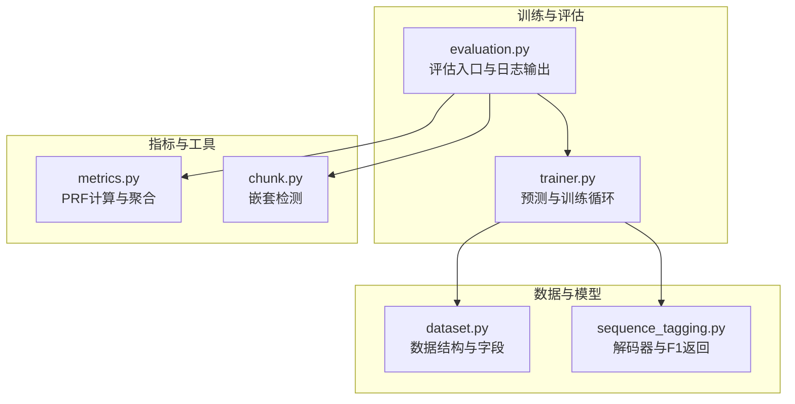
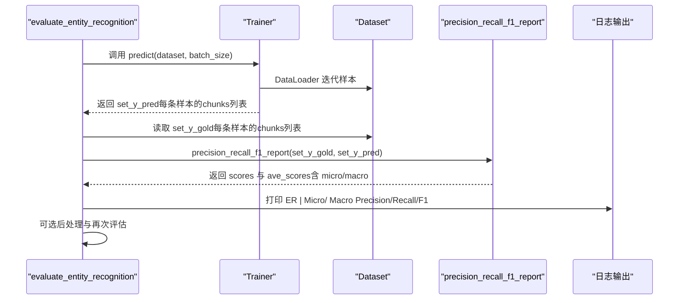
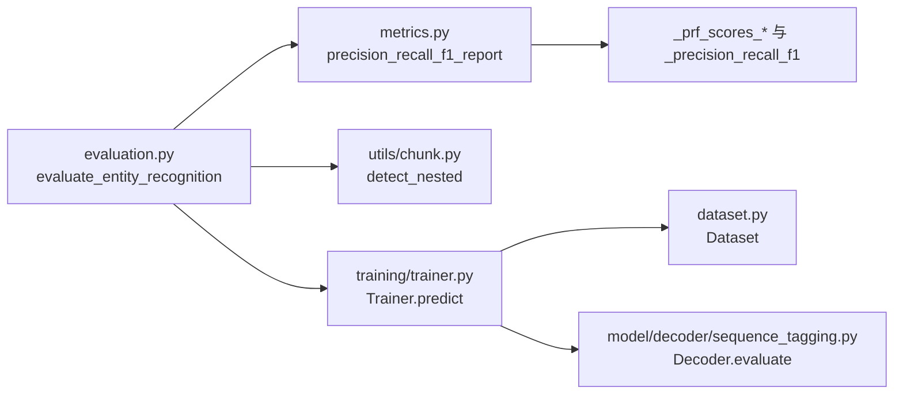

# 标准评估机制

<cite>
**本文引用的文件**
- [evaluation.py](file://eznlp/training/evaluation.py)
- [metrics.py](file://eznlp/metrics.py)
- [trainer.py](file://eznlp/training/trainer.py)
- [dataset.py](file://eznlp/dataset.py)
- [sequence_tagging.py](file://eznlp/model/decoder/sequence_tagging.py)
- [chunk.py](file://eznlp/utils/chunk.py)
- [test_metrics.py](file://tests/test_metrics.py)
- [evaluate_msra.py](file://_8TOOL/evaluate_msra.py)
- [exp_results_collector.py](file://scripts/exp_results_collector.py)
</cite>

## 目录
1. [引言](#引言)
2. [项目结构](#项目结构)
3. [核心组件](#核心组件)
4. [架构总览](#架构总览)
5. [详细组件分析](#详细组件分析)
6. [依赖关系分析](#依赖关系分析)
7. [性能考量](#性能考量)
8. [故障排查指南](#故障排查指南)
9. [结论](#结论)
10. [附录](#附录)

## 引言
本文件系统性解析命名实体识别（NER）的标准评估流程，重点围绕以下目标展开：
- 阐述 evaluate_entity_recognition 函数如何调用 precision_recall_f1_report 计算 micro 与 macro F1 分数；
- 解释评估过程中 set_y_gold 与 set_y_pred 的数据结构定义及匹配逻辑；
- 对比 precision_recall_f1_report 中基于样本（samples）与类型（types）两种聚合模式的差异；
- 结合测试用例与示例展示评估输出结果；
- 规范评估日志格式及其在训练过程中的反馈作用。

## 项目结构
与评估相关的核心模块分布如下：
- 训练与评估入口：evaluation.py
- 指标计算：metrics.py
- 训练器：trainer.py
- 数据集封装：dataset.py
- 解码器（序列标注）：sequence_tagging.py
- 实体嵌套检测工具：chunk.py
- 测试用例：test_metrics.py
- 工具脚本（示例评估）：evaluate_msra.py
- 日志采集与解析：exp_results_collector.py

图表来源
- [evaluation.py](file://eznlp/training/evaluation.py#L1-L108)
- [metrics.py](file://eznlp/metrics.py#L1-L152)
- [trainer.py](file://eznlp/training/trainer.py#L120-L154)
- [dataset.py](file://eznlp/dataset.py#L13-L32)
- [sequence_tagging.py](file://eznlp/model/decoder/sequence_tagging.py#L54-L63)
- [chunk.py](file://eznlp/utils/chunk.py#L63-L80)

章节来源
- [evaluation.py](file://eznlp/training/evaluation.py#L1-L108)
- [metrics.py](file://eznlp/metrics.py#L1-L152)
- [trainer.py](file://eznlp/training/trainer.py#L120-L154)
- [dataset.py](file://eznlp/dataset.py#L13-L32)
- [sequence_tagging.py](file://eznlp/model/decoder/sequence_tagging.py#L54-L63)
- [chunk.py](file://eznlp/utils/chunk.py#L63-L80)

## 核心组件
- evaluate_entity_recognition：NER 评估主流程，负责从数据集中提取 gold 标注、调用评估函数、可选地进行后处理并二次评估。
- precision_recall_f1_report：通用 PRF 报告生成器，支持按类型或按样本聚合，并产出 micro 与 macro 平均值。
- _eval_ent：内部评估辅助函数，打印 micro/macro 的 Precision/Recall/F1。
- Trainer.predict：批量推理，返回每条样本的预测实体集合（chunks）。
- Dataset：提供数据项字段约定，其中 chunks 字段承载实体边界元组。
- SequenceTaggingDecoder.evaluate：返回 micro-F1，作为训练阶段的指标之一。

章节来源
- [evaluation.py](file://eznlp/training/evaluation.py#L64-L95)
- [metrics.py](file://eznlp/metrics.py#L98-L152)
- [trainer.py](file://eznlp/training/trainer.py#L124-L154)
- [dataset.py](file://eznlp/dataset.py#L13-L32)
- [sequence_tagging.py](file://eznlp/model/decoder/sequence_tagging.py#L54-L63)

## 架构总览
下图展示了从数据到评估指标的关键调用链路与数据流。

图表来源
- [evaluation.py](file://eznlp/training/evaluation.py#L64-L95)
- [trainer.py](file://eznlp/training/trainer.py#L124-L154)
- [metrics.py](file://eznlp/metrics.py#L98-L152)

## 详细组件分析

### 评估入口：evaluate_entity_recognition
- 输入：Trainer、Dataset、batch_size、是否评估内外实体、后处理回调、是否保存预测。
- 关键步骤：
  - 调用 Trainer.predict 获取 set_y_pred；
  - 若 save_preds=True，则将预测写回 dataset.data；
  - 否则，从 dataset.data 提取 set_y_gold（每个样本的 chunks 列表），调用 _eval_ent；
  - 若提供 pp_callback，则对预测进行后处理，再次调用 _eval_ent。

章节来源
- [evaluation.py](file://eznlp/training/evaluation.py#L64-L95)

### 内部评估：_eval_ent 与 _disp_prf
- _eval_ent：调用 precision_recall_f1_report 计算 scores 与 ave_scores，并通过 _disp_prf 输出 micro 与 macro 的 Precision/Recall/F1。
- _disp_prf：统一格式化输出，便于日志解析与实验对比。

章节来源
- [evaluation.py](file://eznlp/training/evaluation.py#L28-L63)

### 指标计算：precision_recall_f1_report
- 输入：list_tuples_gold、list_tuples_pred，均为“每样本实体集合”的列表，元素为三元组（类型、起始位置、结束位置）。
- 聚合模式：
  - macro_over="types"：按实体类型聚合，先统计每类型的 TP、FP、FN，再对 Precision/Recall/F1 取平均（算术均值）。
  - macro_over="samples"：按样本聚合，先将样本内实体集合转为集合，再计算该样本的 TP、FP、FN，最后对各指标取平均。
- 输出：
  - scores：按类型或按样本的详细指标字典；
  - ave_scores：包含 micro 与 macro 两部分，其中 micro 基于全局 TP、FP、FN 汇总后再计算，macro 基于各子类别的指标取平均。

章节来源
- [metrics.py](file://eznlp/metrics.py#L98-L152)

### 数据结构定义与匹配逻辑
- set_y_gold 与 set_y_pred：
  - 类型：List[List[tuple]]，即每条样本对应一个实体集合（列表），实体以三元组表示（类型、起始、结束）。
  - 匹配逻辑：
    - 当 macro_over="samples" 时，对每个样本，将 gold 与 pred 的实体集合转换为集合，计算交集得到 TP，差集得到 FP/ FN，从而得到该样本的 TP、FP、FN；
    - 当 macro_over="types" 时，先收集所有实体类型，再按类型过滤样本内的实体集合，分别累加 TP、FP、FN，最后按类型平均。
  - 二者均要求输入长度一致，且每个样本的实体集合为可哈希的元组集合。

章节来源
- [metrics.py](file://eznlp/metrics.py#L32-L95)
- [dataset.py](file://eznlp/dataset.py#L13-L32)

### 嵌套实体评估扩展：ER-in 与 ER-ex
- _eval_ent 支持可选的嵌套实体评估：
  - 使用 detect_nested 将预测实体按是否嵌套于 gold 实体分为内部（ER-in）与外部（ER-ex）两类；
  - 对内部与外部实体分别调用 precision_recall_f1_report，并输出对应的 micro/macro 指标。

章节来源
- [evaluation.py](file://eznlp/training/evaluation.py#L39-L62)
- [chunk.py](file://eznlp/utils/chunk.py#L63-L80)

### 训练器与解码器的衔接
- Trainer.predict：通过 DataLoader 与模型解码器，返回每条样本的预测实体集合（chunks）。
- SequenceTaggingDecoder.evaluate：直接返回 micro-F1，用于训练阶段的指标监控。

章节来源
- [trainer.py](file://eznlp/training/trainer.py#L124-L154)
- [sequence_tagging.py](file://eznlp/model/decoder/sequence_tagging.py#L54-L63)

### 示例与输出结果
- 测试用例 test_metrics.py 展示了不同宏聚合模式下的期望输出，验证了 macro 与 micro 的一致性与差异。
- 示例路径参考：
  - [precision_recall_f1_report 调用示例](file://tests/test_metrics.py#L69-L78)
  - [宏聚合模式差异示例](file://tests/test_metrics.py#L21-L41)

章节来源
- [test_metrics.py](file://tests/test_metrics.py#L1-L78)

### 评估日志格式规范与训练反馈
- 日志格式：
  - 统一采用“任务标识 | 指标类别 指标名称: 数值%”的格式，例如“ER | Micro Precision: XX.XXX%”。
  - 由 _disp_prf 控制输出，便于后续解析与自动化汇总。
- 训练过程中的反馈：
  - 训练器在运行信息显示中会输出当前 partition 的损失与指标，便于实时监控；
  - 评估脚本 evaluate_msra.py 展示了在测试集上的评估调用方式，便于离线评估与结果复现。

章节来源
- [evaluation.py](file://eznlp/training/evaluation.py#L28-L37)
- [trainer.py](file://eznlp/training/trainer.py#L377-L418)
- [evaluate_msra.py](file://_8TOOL/evaluate_msra.py#L62-L82)

## 依赖关系分析
- evaluate_entity_recognition 依赖 Trainer.predict、Dataset、precision_recall_f1_report 与 detect_nested；
- precision_recall_f1_report 依赖 _prf_scores_over_types/_prf_scores_over_samples 与 _precision_recall_f1；
- Trainer.predict 依赖 Dataset 的 collate 与模型解码器；
- SequenceTaggingDecoder.evaluate 依赖 precision_recall_f1_report。

图表来源
- [evaluation.py](file://eznlp/training/evaluation.py#L64-L95)
- [metrics.py](file://eznlp/metrics.py#L98-L152)
- [trainer.py](file://eznlp/training/trainer.py#L124-L154)
- [dataset.py](file://eznlp/dataset.py#L13-L32)
- [sequence_tagging.py](file://eznlp/model/decoder/sequence_tagging.py#L54-L63)
- [chunk.py](file://eznlp/utils/chunk.py#L63-L80)

章节来源
- [evaluation.py](file://eznlp/training/evaluation.py#L64-L95)
- [metrics.py](file://eznlp/metrics.py#L98-L152)
- [trainer.py](file://eznlp/training/trainer.py#L124-L154)
- [dataset.py](file://eznlp/dataset.py#L13-L32)
- [sequence_tagging.py](file://eznlp/model/decoder/sequence_tagging.py#L54-L63)
- [chunk.py](file://eznlp/utils/chunk.py#L63-L80)

## 性能考量
- 批量推理：Trainer.predict 使用 DataLoader 与非梯度前向，避免重复计算损失，提高评估效率；
- 集合操作：按样本聚合时将实体集合转为集合，交并运算在大多数场景下高效；
- 宏聚合选择：当实体类型较多且分布不均衡时，macro（按类型平均）更关注少数类表现；micro（全局汇总）对整体召回敏感度更高；
- 后处理成本：若启用 pp_callback，需注意额外的实体过滤/合并/映射开销。

[本节为通用建议，无需列出具体文件来源]

## 故障排查指南
- 输入长度不一致：precision_recall_f1_report 断言要求 gold 与 pred 的样本数量一致，否则抛出异常；
- 空实体集合：当 macro_over="types" 且未发现任何实体时，返回空 scores；
- 零除保护：_precision_recall_f1_report 在分母为零时使用零除策略，避免崩溃；
- 日志解析失败：exp_results_collector.py 依赖固定格式的日志关键字进行正则抽取，若日志格式变更需同步调整正则表达式。

章节来源
- [metrics.py](file://eznlp/metrics.py#L123-L131)
- [metrics.py](file://eznlp/metrics.py#L25-L30)
- [exp_results_collector.py](file://scripts/exp_results_collector.py#L1-L20)

## 结论
- evaluate_entity_recognition 通过 Trainer.predict 获取预测实体集合，并以 precision_recall_f1_report 计算 micro 与 macro F1，形成标准化的评估流程；
- set_y_gold 与 set_y_pred 的数据结构统一为“每样本实体集合”，匹配逻辑基于集合交集与类型过滤；
- macro 与 micro 两种聚合模式各有侧重，应根据任务目标与数据分布选择合适模式；
- 评估日志格式统一，便于自动化采集与训练过程反馈。

[本节为总结性内容，无需列出具体文件来源]

## 附录

### 两种聚合模式的差异与适用场景
- 按样本（samples）：
  - 优点：对每个样本独立计算，适合样本规模较小或样本间实体分布差异较大的情况；
  - 缺点：可能放大个别样本噪声。
- 按类型（types）：
  - 优点：对各类别平均，更关注类别平衡；
  - 缺点：当某些类型样本极少时，可能被平均稀释。

章节来源
- [metrics.py](file://eznlp/metrics.py#L32-L95)
- [metrics.py](file://eznlp/metrics.py#L98-L152)

### 示例调用与输出路径
- 在测试用例中，precision_recall_f1_report 的调用与期望输出结果可参考：
  - [示例调用与断言](file://tests/test_metrics.py#L69-L78)
  - [宏聚合差异示例](file://tests/test_metrics.py#L21-L41)

章节来源
- [test_metrics.py](file://tests/test_metrics.py#L1-L78)