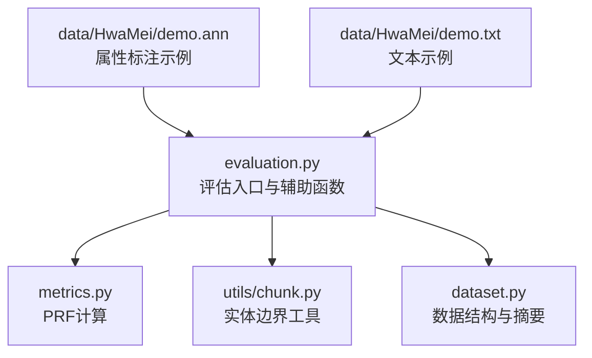
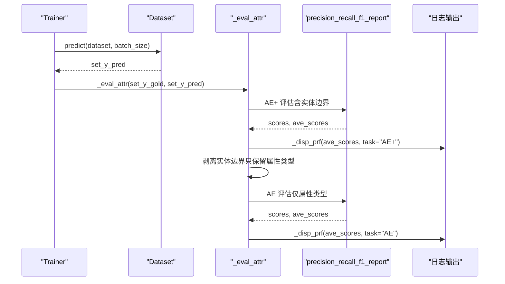
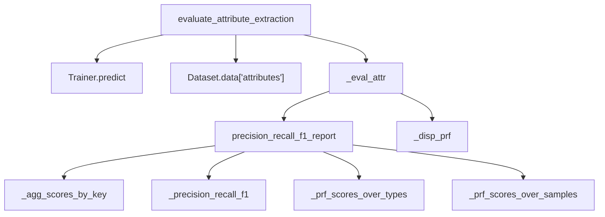

# 属性抽取评估

<cite>
**本文引用的文件列表**
- [evaluation.py](file://eznlp/training/evaluation.py)
- [metrics.py](file://eznlp/metrics.py)
- [chunk.py](file://eznlp/utils/chunk.py)
- [test_span_attr_classification.py](file://tests/model/test_span_attr_classification.py)
- [test_processing.py](file://tests/io/test_processing.py)
- [dataset.py](file://eznlp/dataset.py)
- [demo.ann](file://data/HwaMei/demo.ann)
- [demo.txt](file://data/HwaMei/demo.txt)
</cite>

## 目录
1. [引言](#引言)
2. [项目结构与定位](#项目结构与定位)
3. [核心组件](#核心组件)
4. [架构总览](#架构总览)
5. [详细组件分析](#详细组件分析)
6. [依赖关系分析](#依赖关系分析)
7. [性能与复杂度](#性能与复杂度)
8. [故障排查指南](#故障排查指南)
9. [结论](#结论)
10. [附录](#附录)

## 引言
本文件聚焦于属性抽取任务的评估流程，系统性解析 evaluate_attribute_extraction 的执行逻辑，阐明如何对“属性-实体对”进行评估，并区分 AE+（含实体边界）与 AE（仅属性类型）两种评估模式。同时，深入解释 _evaluation_attr 函数通过修改元组结构实现不同粒度评估的机制，给出评估指标的计算过程与日志输出规范，并说明该流程与其他抽取任务评估的一致性设计。

## 项目结构与定位
- 评估入口与核心逻辑位于训练模块的 evaluation.py，其中包含 evaluate_attribute_extraction 与内部辅助函数 _eval_attr。
- 指标计算由 metrics.py 提供 precision_recall_f1_report，支持宏平均与微平均两类统计。
- 实体边界一致性工具在 utils/chunk.py 中提供 detect_nested 等方法，用于内部/外部实体划分（在实体识别评估中使用）。
- 数据集层面的 attributes 字段与属性计数在 dataset.py 中体现。
- 示例数据来自 HwaMei 医疗数据集，展示属性标注样例（demo.ann、demo.txt）。

图表来源
- [evaluation.py](file://eznlp/training/evaluation.py#L97-L140)
- [metrics.py](file://eznlp/metrics.py#L98-L152)
- [chunk.py](file://eznlp/utils/chunk.py#L63-L79)
- [dataset.py](file://eznlp/dataset.py#L67-L87)
- [demo.ann](file://data/HwaMei/demo.ann#L1-L35)
- [demo.txt](file://data/HwaMei/demo.txt#L1-L6)

章节来源
- [evaluation.py](file://eznlp/training/evaluation.py#L97-L140)
- [metrics.py](file://eznlp/metrics.py#L98-L152)
- [chunk.py](file://eznlp/utils/chunk.py#L63-L79)
- [dataset.py](file://eznlp/dataset.py#L67-L87)
- [demo.ann](file://data/HwaMei/demo.ann#L1-L35)
- [demo.txt](file://data/HwaMei/demo.txt#L1-L6)

## 核心组件
- evaluate_attribute_extraction：属性抽取评估入口，负责预测、保存或直接评估。
- _eval_attr：属性评估的核心逻辑，先按“含实体边界”的 AE+ 模式评估，再将实体边界剥离为 AE 模式评估。
- precision_recall_f1_report：通用 PRF 报告生成器，支持宏平均与微平均。
- 日志输出：统一通过 _disp_prf 输出 Precision/Recall/F1 的 micro 与 macro 统计。
- 数据结构：属性以“属性类型 + 实体边界”的二元组形式存储，如 (attr_type, chunk_start, chunk_end)。

章节来源
- [evaluation.py](file://eznlp/training/evaluation.py#L97-L140)
- [metrics.py](file://eznlp/metrics.py#L98-L152)

## 架构总览
下图展示了属性抽取评估的整体调用链与数据流。

图表来源
- [evaluation.py](file://eznlp/training/evaluation.py#L97-L140)
- [metrics.py](file://eznlp/metrics.py#L98-L152)

## 详细组件分析

### evaluate_attribute_extraction 执行流程
- 输入：Trainer、Dataset、batch_size、save_preds。
- 行为：
  - 若 save_preds 为真：将预测结果写回 dataset.data 的 attributes_pred 字段并记录日志。
  - 若 save_preds 为假：从 dataset.data 读取真实标签 attributes，调用 _eval_attr 进行评估。
- 输出：在控制台打印 AE+ 与 AE 两轮评估的 micro 与 macro 指标。

章节来源
- [evaluation.py](file://eznlp/training/evaluation.py#L129-L140)

### _eval_attr 评估逻辑与粒度切换
- AE+（含实体边界）评估：
  - 直接使用原始属性元组集合（属性类型 + 实体边界）进行 PRF 计算。
  - 输出 micro 与 macro 指标。
- AE（仅属性类型）评估：
  - 对每个属性元组执行“剥离实体边界”的变换，仅保留属性类型部分，形成新的元组集合。
  - 再次调用 PRF 计算，输出 micro 与 macro 指标。
- 元组结构变化：
  - 原始：(attr_type, chunk_start, chunk_end)
  - 变换后：(attr_type, chunk_start, chunk_end) → (attr_type, chunk_start, chunk_end)（仍为三元组），但比较时仅比较属性类型，从而实现“不考虑实体边界”的粒度。

注意：上述元组结构在代码中保持三元组形式，但 AE 模式通过“剥离实体边界”这一语义操作实现仅比较属性类型的评估目标。AE+ 与 AE 的差异在于比较集合时是否包含实体边界信息。

章节来源
- [evaluation.py](file://eznlp/training/evaluation.py#L97-L111)

### precision_recall_f1_report 指标计算
- 输入：两个列表的列表，分别表示样本级的真实与预测属性元组集合。
- 关键步骤：
  - 对每个样本，将元组转换为集合，计算 n_gold、n_pred、n_true_positive。
  - 基于三者计算每个样本的 precision、recall、f1。
  - 宏平均：按类别（type_pos 指定位置）聚合，再求均值。
  - 微平均：先聚合总数，再计算整体 precision、recall、f1。
- 返回：每个样本的详细分数与平均分数字典。

章节来源
- [metrics.py](file://eznlp/metrics.py#L98-L152)

### 日志输出规范
- 统一通过 _disp_prf 输出，包含：
  - 任务标识（AE+ 或 AE）。
  - Micro Precision/Recall/F1。
  - Macro Precision/Recall/F1。
- 该规范与实体识别、关系抽取等任务一致，便于横向对比。

章节来源
- [evaluation.py](file://eznlp/training/evaluation.py#L28-L37)

### 与其他抽取任务评估的一致性设计
- 评估接口风格一致：
  - 实体识别：evaluate_entity_recognition → _eval_ent → precision_recall_f1_report → _disp_prf。
  - 关系抽取：evaluate_relation_extraction → _eval_rel → precision_recall_f1_report → _disp_prf。
  - 属性抽取：evaluate_attribute_extraction → _eval_attr → precision_recall_f1_report → _disp_prf。
- 保存预测与日志输出风格一致，便于统一实验管理与报告生成。

章节来源
- [evaluation.py](file://eznlp/training/evaluation.py#L39-L140)

### 属性-实体对评估要点
- 属性-实体对的粒度由元组结构决定：
  - AE+：比较 (attr_type, chunk_start, chunk_end) 的集合，既考虑属性类型也考虑实体边界。
  - AE：比较剥离实体边界的集合，仅考虑属性类型。
- 该设计确保同一套评估流程可覆盖“属性类型正确性优先”和“属性边界正确性优先”两种需求。

章节来源
- [evaluation.py](file://eznlp/training/evaluation.py#L97-L111)
- [metrics.py](file://eznlp/metrics.py#L98-L152)

## 依赖关系分析
- evaluate_attribute_extraction 依赖：
  - Trainer.predict：获取预测结果。
  - Dataset.data：读取 attributes 真实标签或写入 attributes_pred。
  - _eval_attr：执行 AE+ 与 AE 两阶段评估。
  - _disp_prf：统一日志输出。
- _eval_attr 依赖：
  - precision_recall_f1_report：通用 PRF 计算。
- precision_recall_f1_report 依赖：
  - _precision_recall_f1、_prf_scores_over_types、_prf_scores_over_samples、_agg_scores_by_key。

图表来源
- [evaluation.py](file://eznlp/training/evaluation.py#L97-L140)
- [metrics.py](file://eznlp/metrics.py#L98-L152)

章节来源
- [evaluation.py](file://eznlp/training/evaluation.py#L97-L140)
- [metrics.py](file://eznlp/metrics.py#L98-L152)

## 性能与复杂度
- 时间复杂度：
  - 对每个样本，将属性元组集合转换为集合，时间复杂度 O(n)，n 为样本中的属性数量。
  - 样本间比较为集合交集，整体复杂度 O(N)，N 为所有样本的属性总数。
- 空间复杂度：
  - 需要维护样本级集合与中间统计变量，空间复杂度 O(N)。
- 优化建议：
  - 在大规模数据上，可考虑批处理与缓存集合以减少重复计算。
  - 若属性元组规模较大，可预先去重或按属性类型分桶以降低比较成本。

章节来源
- [metrics.py](file://eznlp/metrics.py#L98-L152)

## 故障排查指南
- 未找到 attributes 字段：
  - 确认 Dataset.data 中存在 attributes 键，否则 evaluate_attribute_extraction 将无法读取真实标签。
- 预测结果为空：
  - 检查 Trainer.predict 是否返回空列表，或模型解码器是否正确配置。
- 日志缺失：
  - 确认日志级别设置允许 INFO 级别输出，且 _disp_prf 已被调用。
- 评估结果异常：
  - 检查属性元组结构是否符合 (attr_type, chunk_start, chunk_end) 规范。
  - 确保 AE+ 与 AE 两阶段评估均被执行，避免遗漏剥离实体边界的步骤。

章节来源
- [evaluation.py](file://eznlp/training/evaluation.py#L129-L140)
- [metrics.py](file://eznlp/metrics.py#L98-L152)

## 结论
本文系统梳理了属性抽取评估流程，明确了 evaluate_attribute_extraction 的执行路径与 _eval_attr 的粒度切换机制。通过 AE+ 与 AE 的双阶段评估，既能衡量属性类型正确性，也能衡量属性边界正确性，满足不同场景下的评估需求。评估指标计算与日志输出遵循统一规范，与实体识别、关系抽取等任务保持一致，便于实验复用与结果对比。

## 附录

### 示例数据与属性格式
- HwaMei 示例文本与标注展示了属性标注样例，可用于理解属性-实体对的标注方式与评估输入格式。
- 属性标注文件中包含实体与属性条目，属性条目通常以“属性类型 + 实体引用”的形式出现。

章节来源
- [demo.ann](file://data/HwaMei/demo.ann#L1-L35)
- [demo.txt](file://data/HwaMei/demo.txt#L1-L6)

### 测试用例参考
- 测试用例验证了属性抽取模型的预测能力与评估流程的可用性，可作为集成测试的参考。

章节来源
- [test_span_attr_classification.py](file://tests/model/test_span_attr_classification.py#L88-L100)
- [test_processing.py](file://tests/io/test_processing.py#L1-L44)