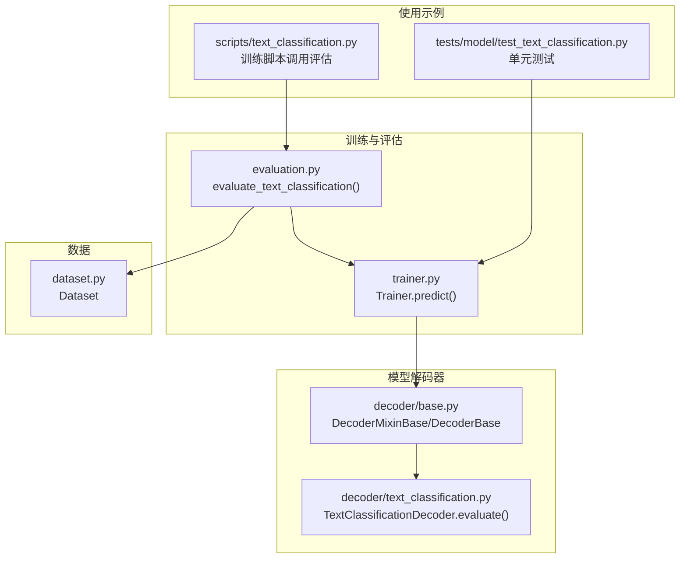
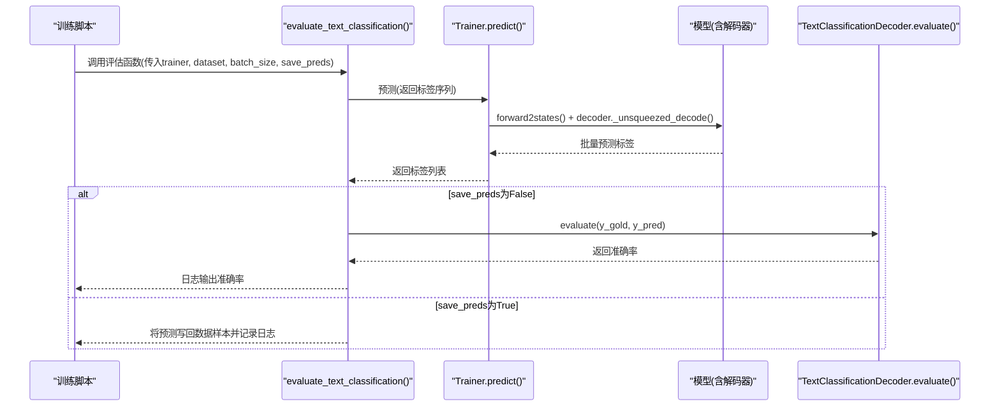
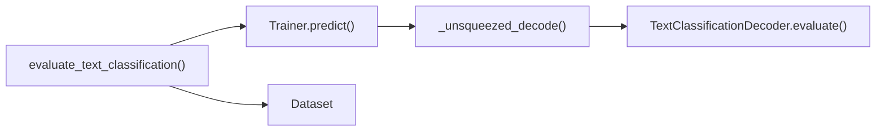

# 文本分类评估

<cite>
**本文引用的文件列表**
- [evaluation.py](file://eznlp/training/evaluation.py)
- [trainer.py](file://eznlp/training/trainer.py)
- [text_classification.py](file://eznlp/model/decoder/text_classification.py)
- [base.py](file://eznlp/model/decoder/base.py)
- [text_classification.py](file://scripts/text_classification.py)
- [test_text_classification.py](file://tests/model/test_text_classification.py)
- [dataset.py](file://eznlp/dataset.py)
</cite>

## 目录
1. [引言](#引言)
2. [项目结构](#项目结构)
3. [核心组件](#核心组件)
4. [架构总览](#架构总览)
5. [详细组件分析](#详细组件分析)
6. [依赖关系分析](#依赖关系分析)
7. [性能考量](#性能考量)
8. [故障排查指南](#故障排查指南)
9. [结论](#结论)

## 引言
本文件围绕文本分类任务的评估流程展开，重点解析 evaluate_text_classification 函数的实现机制，说明如何通过 Trainer.predict 获取预测结果并计算准确率指标；同时阐述准确率的计算逻辑、日志输出格式，以及 save_preds 参数对结果保存的影响。最后分析该评估方法与解码器 evaluate 方法之间的交互关系，并给出在实际训练中调用该评估函数的参考路径。

## 项目结构
与文本分类评估直接相关的模块分布如下：
- 训练与评估：eznlp/training/evaluation.py（评估入口）、eznlp/training/trainer.py（训练器与预测）
- 解码器：eznlp/model/decoder/text_classification.py（文本分类解码器及 evaluate 实现）、eznlp/model/decoder/base.py（解码器基类与接口）
- 数据集：eznlp/dataset.py（Dataset 结构与字段约定）
- 使用示例：scripts/text_classification.py（训练脚本中调用评估）
- 单元测试：tests/model/test_text_classification.py（验证预测与评估行为）

图表来源
- [evaluation.py](file://eznlp/training/evaluation.py#L14-L26)
- [trainer.py](file://eznlp/training/trainer.py#L124-L153)
- [text_classification.py](file://eznlp/model/decoder/text_classification.py#L40-L46)
- [base.py](file://eznlp/model/decoder/base.py#L29-L50)
- [dataset.py](file://eznlp/dataset.py#L13-L35)
- [text_classification.py](file://scripts/text_classification.py#L286-L300)
- [test_text_classification.py](file://tests/model/test_text_classification.py#L96-L106)

章节来源
- [evaluation.py](file://eznlp/training/evaluation.py#L14-L26)
- [trainer.py](file://eznlp/training/trainer.py#L124-L153)
- [text_classification.py](file://eznlp/model/decoder/text_classification.py#L40-L46)
- [base.py](file://eznlp/model/decoder/base.py#L29-L50)
- [dataset.py](file://eznlp/dataset.py#L13-L35)
- [text_classification.py](file://scripts/text_classification.py#L286-L300)
- [test_text_classification.py](file://tests/model/test_text_classification.py#L96-L106)

## 核心组件
- evaluate_text_classification：评估入口，负责调用 Trainer.predict 获取预测标签序列，按 save_preds 决定是直接计算准确率并打印，还是将预测写回数据样本以便后续保存。
- Trainer.predict：在推理模式下遍历数据集，调用模型解码器生成预测标签；当 num_metrics==1 时返回一维标签列表。
- TextClassificationDecoder.evaluate：文本分类专用的准确率计算，逐样本比较预测与真实标签后求平均。
- Dataset：提供数据样本的统一结构，其中文本分类样本通常包含 tokens 与 label 字段。

章节来源
- [evaluation.py](file://eznlp/training/evaluation.py#L14-L26)
- [trainer.py](file://eznlp/training/trainer.py#L124-L153)
- [text_classification.py](file://eznlp/model/decoder/text_classification.py#L40-L46)
- [dataset.py](file://eznlp/dataset.py#L13-L35)

## 架构总览
下面以序列图展示从训练脚本到评估函数、再到解码器 evaluate 的完整调用链路。

图表来源
- [evaluation.py](file://eznlp/training/evaluation.py#L14-L26)
- [trainer.py](file://eznlp/training/trainer.py#L124-L153)
- [text_classification.py](file://eznlp/model/decoder/text_classification.py#L40-L46)
- [text_classification.py](file://scripts/text_classification.py#L286-L300)

## 详细组件分析

### evaluate_text_classification 函数机制
- 输入参数
  - trainer: 训练器实例，用于执行预测
  - dataset: Dataset 实例，包含样本数据
  - batch_size: 推理批大小，默认 32
  - save_preds: 是否将预测结果写回数据样本
- 关键步骤
  - 调用 trainer.predict 获取预测标签序列
  - 若 save_preds 为真：将每个样本的预测标签写入 ex["label_pred"]，并记录“Predictions saved”
  - 若 save_preds 为假：从 dataset.data 中提取真实标签集合，调用解码器 evaluate 计算准确率，并以固定格式的日志输出
- 日志输出格式
  - 输出形如 “TC | Accuracy: xx.xxx%” 的字符串，其中百分比保留三位小数

章节来源
- [evaluation.py](file://eznlp/training/evaluation.py#L14-L26)

### Trainer.predict 的预测流程
- DataLoader 构建：基于 Dataset 和 batch_size 创建迭代器
- 模型状态：设置模型为 eval 模式，禁用梯度
- 解码阶段：对每个 batch 调用模型 forward2states 获取隐藏状态，再由 decoder._unsqueezed_decode 解码得到预测标签
- 返回值：当 num_metrics==1 时返回一维标签列表；否则返回多指标列表
- 注意：该函数不计算损失，避免不必要的开销

章节来源
- [trainer.py](file://eznlp/training/trainer.py#L124-L153)

### 解码器 evaluate 的准确率计算
- 准确率定义：逐样本比较预测标签与真实标签，统计一致的数量并除以样本总数
- 适用场景：文本分类任务的标准指标
- 与 Trainer 的集成：evaluate_text_classification 在未开启 save_preds 时调用该方法进行评估

章节来源
- [text_classification.py](file://eznlp/model/decoder/text_classification.py#L40-L46)
- [base.py](file://eznlp/model/decoder/base.py#L29-L50)

### save_preds 参数对结果保存的影响
- save_preds=False（默认）：评估时不保存预测，而是直接计算准确率并输出日志
- save_preds=True：评估时将预测标签写回每个样本的 ex["label_pred"] 字段，便于离线导出或进一步处理；随后记录“Predictions saved”

章节来源
- [evaluation.py](file://eznlp/training/evaluation.py#L14-L26)

### 在实际训练中调用评估函数
- 训练脚本中，训练完成后会加载最优模型并创建新的 Trainer 实例，分别对开发集与测试集调用 evaluate_text_classification
- 测试集评估可启用 save_preds，以便将预测结果保存至本地文件
- 参考路径：scripts/text_classification.py 中的评估调用与保存逻辑

章节来源
- [text_classification.py](file://scripts/text_classification.py#L286-L300)

### 评估方法与解码器 evaluate 的交互关系
- evaluate_text_classification 仅在 save_preds=False 时调用解码器 evaluate 进行准确率计算
- 当 save_preds=True 时，评估仅写回预测而不计算指标
- 解码器 evaluate 依赖于标签空间的一致性（idx2label），确保预测标签与真实标签在同一字典映射下比较

章节来源
- [evaluation.py](file://eznlp/training/evaluation.py#L14-L26)
- [text_classification.py](file://eznlp/model/decoder/text_classification.py#L40-L46)

### 准确率计算逻辑与日志输出格式
- 计算逻辑：逐样本比较 y_pred[i] 与 y_gold[i]，计数一致的数量，再除以样本总数
- 日志格式：以 “TC | Accuracy: xx.xxx%” 形式输出，百分比保留三位小数

章节来源
- [text_classification.py](file://eznlp/model/decoder/text_classification.py#L40-L46)
- [evaluation.py](file://eznlp/training/evaluation.py#L22-L26)

### 预测无真实标签时的行为
- 当数据集中不含 label 字段时，仍可通过 Trainer.predict 获取预测标签，用于离线导出
- 单元测试覆盖了这种情形，验证 predict 返回长度等于样本数量的标签列表

章节来源
- [test_text_classification.py](file://tests/model/test_text_classification.py#L96-L106)

## 依赖关系分析
- evaluate_text_classification 依赖 Trainer.predict 完成推理
- Trainer.predict 依赖模型解码器的 _unsqueezed_decode 生成预测标签
- 解码器 evaluate 依赖标签映射（idx2label）完成准确率计算
- Dataset 提供样本结构，文本分类样本需包含 tokens 与 label 字段

图表来源
- [evaluation.py](file://eznlp/training/evaluation.py#L14-L26)
- [trainer.py](file://eznlp/training/trainer.py#L124-L153)
- [text_classification.py](file://eznlp/model/decoder/text_classification.py#L40-L46)
- [dataset.py](file://eznlp/dataset.py#L13-L35)

章节来源
- [evaluation.py](file://eznlp/training/evaluation.py#L14-L26)
- [trainer.py](file://eznlp/training/trainer.py#L124-L153)
- [text_classification.py](file://eznlp/model/decoder/text_classification.py#L40-L46)
- [dataset.py](file://eznlp/dataset.py#L13-L35)

## 性能考量
- 批大小：较大的 batch_size 可提升吞吐，但需平衡显存占用
- 推理模式：predict 内部使用 eval 模式与 torch.no_grad，避免梯度计算开销
- 仅在需要时计算指标：save_preds=True 时跳过 evaluate，减少一次额外的指标计算

## 故障排查指南
- 预测结果为空或长度不匹配
  - 确认 Dataset 构造时配置正确，且样本包含 tokens 字段
  - 检查模型解码器是否正确构建标签映射（idx2label）
- 无法输出准确率
  - 确保 save_preds=False 或者数据集中存在 label 字段
  - 检查日志级别是否被过滤
- 预测标签与真实标签不一致
  - 确认 idx2label 与训练阶段一致，避免类别映射偏差

章节来源
- [trainer.py](file://eznlp/training/trainer.py#L124-L153)
- [text_classification.py](file://eznlp/model/decoder/text_classification.py#L40-L46)
- [dataset.py](file://eznlp/dataset.py#L13-L35)

## 结论
evaluate_text_classification 通过 Trainer.predict 获取预测标签，依据 save_preds 参数决定是直接计算准确率并输出，还是将预测写回数据样本。其与解码器 evaluate 的交互清晰：仅在未保存预测时才进行指标计算。该设计兼顾了评估效率与结果持久化需求，适合在实际训练流程中稳定使用。