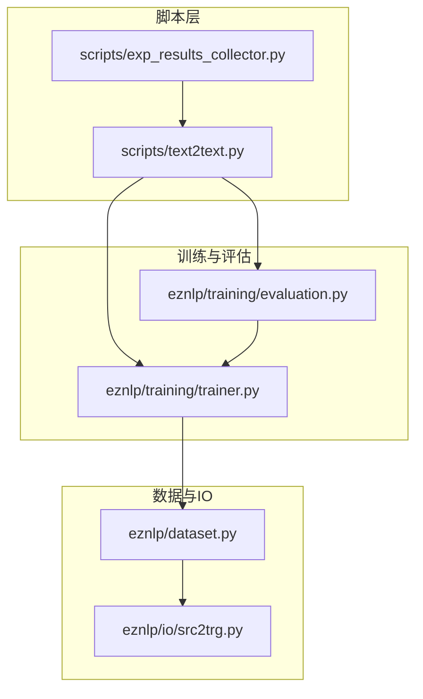
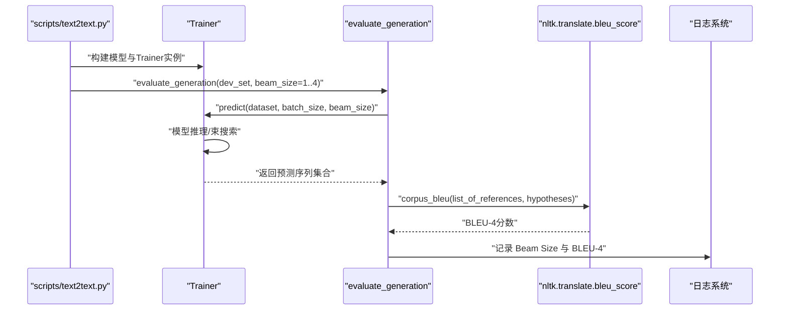
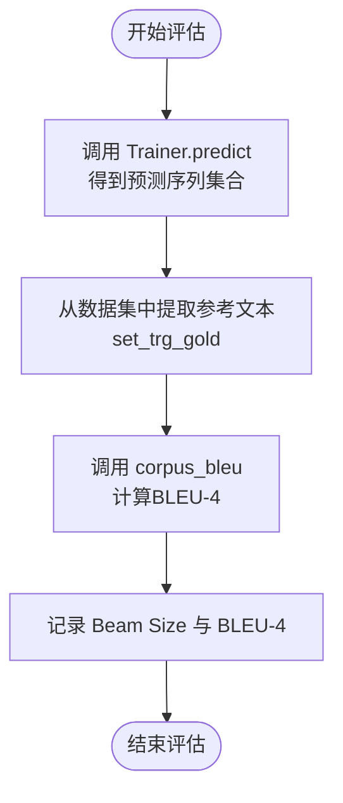
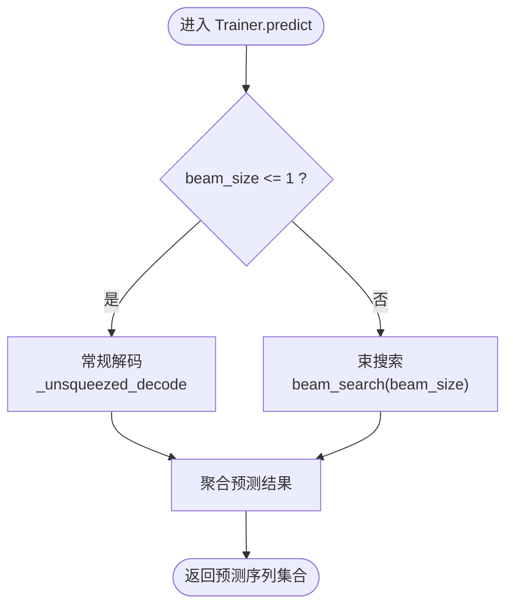
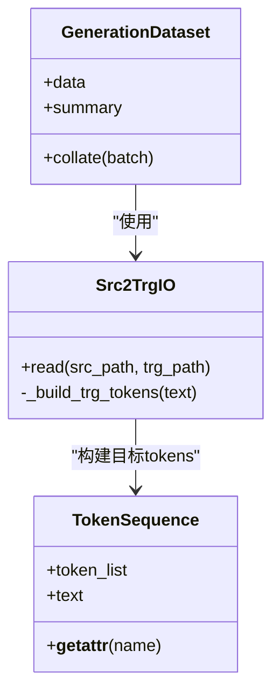
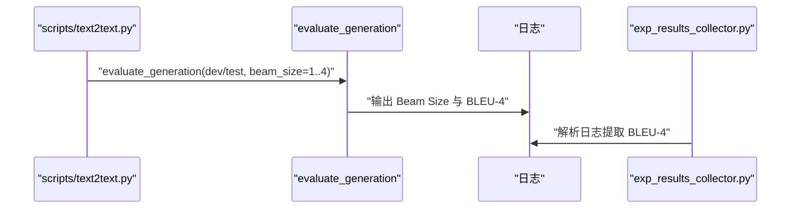
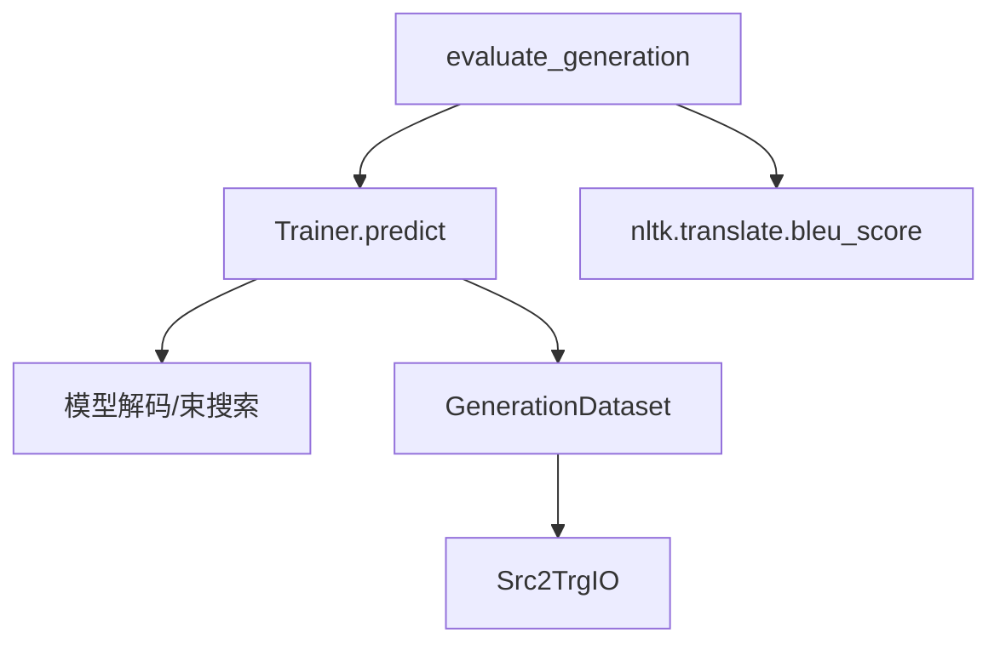

# 生成任务评估

<cite>
**本文引用的文件**
- [evaluation.py](file://eznlp/training/evaluation.py)
- [trainer.py](file://eznlp/training/trainer.py)
- [dataset.py](file://eznlp/dataset.py)
- [src2trg.py](file://eznlp/io/src2trg.py)
- [text2text.py](file://scripts/text2text.py)
- [exp_results_collector.py](file://scripts/exp_results_collector.py)
</cite>

## 目录
1. [简介](#简介)
2. [项目结构](#项目结构)
3. [核心组件](#核心组件)
4. [架构总览](#架构总览)
5. [详细组件分析](#详细组件分析)
6. [依赖关系分析](#依赖关系分析)
7. [性能考量](#性能考量)
8. [故障排查指南](#故障排查指南)
9. [结论](#结论)

## 简介
本文件系统性介绍文本生成任务的评估方法，重点围绕以下目标展开：
- 解释 evaluate_generation 函数如何使用 BLEU-4 指标评估生成质量；
- 说明 nltk.translate.bleu_score.corpus_bleu 的计算原理与参数配置；
- 阐述 beam_size 参数对生成结果的影响及其在评估中的作用；
- 说明参考文本（set_trg_gold）与预测文本（set_trg_pred）的数据结构构建方式；
- 解释评估结果的日志输出格式与性能指标解读方法。

## 项目结构
与生成任务评估直接相关的模块包括：
- 评估入口与实现：evaluation.py 中的 evaluate_generation
- 推理与解码：trainer.py 中的 Trainer.predict 与模型的 beam_search
- 数据组织：dataset.py 中的 GenerationDataset 与 src2trg.py 中的 Src2TrgIO
- 评估调用：scripts/text2text.py 中对 evaluate_generation 的批量调用
- 结果收集：scripts/exp_results_collector.py 中对日志中 BLEU-4 的解析

图表来源
- [evaluation.py](file://eznlp/training/evaluation.py#L191-L202)
- [trainer.py](file://eznlp/training/trainer.py#L124-L153)
- [dataset.py](file://eznlp/dataset.py#L117-L161)
- [src2trg.py](file://eznlp/io/src2trg.py#L41-L64)
- [text2text.py](file://scripts/text2text.py#L232-L241)
- [exp_results_collector.py](file://scripts/exp_results_collector.py#L1-L57)

章节来源
- [evaluation.py](file://eznlp/training/evaluation.py#L191-L202)
- [trainer.py](file://eznlp/training/trainer.py#L124-L153)
- [dataset.py](file://eznlp/dataset.py#L117-L161)
- [src2trg.py](file://eznlp/io/src2trg.py#L41-L64)
- [text2text.py](file://scripts/text2text.py#L232-L241)
- [exp_results_collector.py](file://scripts/exp_results_collector.py#L1-L57)

## 核心组件
- evaluate_generation：对给定数据集进行推理并计算 BLEU-4，同时记录 beam_size 与 BLEU-4 的日志。
- Trainer.predict：根据 beam_size 决定使用贪心解码或束搜索，并将解码结果按样本聚合。
- GenerationDataset：提供生成任务的数据组织与批处理接口。
- Src2TrgIO：从源-目标文件加载数据，构建 TokenSequence 并缓存到 full_trg_tokens。
- scripts/text2text.py：在训练结束后对开发集与测试集执行多 beam_size 的评估。
- exp_results_collector.py：从训练日志中提取 BLEU-4 指标用于实验结果汇总。

章节来源
- [evaluation.py](file://eznlp/training/evaluation.py#L191-L202)
- [trainer.py](file://eznlp/training/trainer.py#L124-L153)
- [dataset.py](file://eznlp/dataset.py#L117-L161)
- [src2trg.py](file://eznlp/io/src2trg.py#L41-L64)
- [text2text.py](file://scripts/text2text.py#L232-L241)
- [exp_results_collector.py](file://scripts/exp_results_collector.py#L1-L57)

## 架构总览
下图展示了从脚本到评估函数的整体调用链路，以及数据在各模块之间的流转。

图表来源
- [text2text.py](file://scripts/text2text.py#L232-L241)
- [evaluation.py](file://eznlp/training/evaluation.py#L191-L202)
- [trainer.py](file://eznlp/training/trainer.py#L124-L153)

## 详细组件分析

### evaluate_generation 评估流程与BLEU-4指标
- 输入：Trainer 实例、数据集、batch_size、beam_size
- 关键步骤：
  1) 使用 Trainer.predict 对数据集进行推理，beam_size 控制是否启用束搜索；
  2) 从数据集中提取参考文本（set_trg_gold），即每个样本的 full_trg_tokens 文本序列；
  3) 调用 nltk.translate.bleu_score.corpus_bleu 计算 BLEU-4；
  4) 将 beam_size 与 BLEU-4 输出到日志。
- 日志格式：包含 Beam Size 与 BLEU-4 百分比，便于对比不同 beam_size 下的生成质量。

图表来源
- [evaluation.py](file://eznlp/training/evaluation.py#L191-L202)

章节来源
- [evaluation.py](file://eznlp/training/evaluation.py#L191-L202)

### nltk.translate.bleu_score.corpus_bleu 计算原理与参数
- 计算原理（概述）：
  - BLEU-4 是基于 n-gram 精确率与长度惩罚的组合指标。对于每个候选句，计算其与参考句之间 1-gram 至 4-gram 的精确率，再乘以长度惩罚因子，最终得到 BLEU 分数。
  - corpus_bleu 接收 list_of_references（每条参考句由 token 列表组成）与 hypotheses（预测句列表），逐样本计算 BLEU 后取平均。
- 关键参数：
  - list_of_references：二维列表，形状为 [num_samples, num_refs_per_sample, num_tokens]。在本项目中，每个样本仅保留一条参考句，因此为 [N, 1, L]。
  - hypotheses：一维列表，形状为 [N, L_pred]。在本项目中，N 为样本数量，L_pred 为预测句长度。
- 注意事项：
  - 参考与预测均需是 token 列表形式；
  - 若存在空预测或空参考，需确保输入合法，避免除零或空序列问题。

章节来源
- [evaluation.py](file://eznlp/training/evaluation.py#L191-L202)

### beam_size 对生成结果的影响与评估中的作用
- beam_size=1：等价于贪心解码，速度快但易陷入局部最优，可能降低多样性与流畅度；
- beam_size>1：束搜索引入宽度，提升生成质量与稳定性，但增加计算开销；
- 在评估中，通过多次调用 evaluate_generation 并改变 beam_size，可以比较不同宽度下的 BLEU-4，从而选择合适的束宽。
- 代码层面，Trainer.predict 在 beam_size>1 时会调用模型的 beam_search，否则走常规解码路径。

图表来源
- [trainer.py](file://eznlp/training/trainer.py#L124-L153)

章节来源
- [trainer.py](file://eznlp/training/trainer.py#L124-L153)

### 参考文本与预测文本的数据结构构建
- 参考文本（set_trg_gold）：
  - 来自数据集的 full_trg_tokens 字段，每个样本是一个 TokenSequence；
  - evaluate_generation 将 TokenSequence 的 text 属性按顺序拼接为 token 列表，形成 [N, L] 的参考序列列表；
  - 这一步保证了参考与预测均为 token 列表，满足 corpus_bleu 的输入要求。
- 预测文本（set_trg_pred）：
  - 由 Trainer.predict 返回，内部根据 beam_size 决定使用贪心解码或束搜索；
  - 预测结果同样为 token 列表序列，与参考序列一一对应，用于 BLEU 计算。

图表来源
- [dataset.py](file://eznlp/dataset.py#L117-L161)
- [src2trg.py](file://eznlp/io/src2trg.py#L41-L64)

章节来源
- [dataset.py](file://eznlp/dataset.py#L117-L161)
- [src2trg.py](file://eznlp/io/src2trg.py#L41-L64)

### 评估调用与日志输出格式
- 调用方式：scripts/text2text.py 在训练完成后，对开发集与测试集分别以 beam_size=1,2,3,4 依次评估；
- 日志输出：evaluate_generation 使用 logger.info 输出形如 “Beam Size: X | BLEU-4: Y%” 的行，便于快速对比不同束宽下的 BLEU-4；
- 结果收集：exp_results_collector.py 通过正则从日志中提取 BLEU-4，支持后续实验结果汇总与可视化。

图表来源
- [text2text.py](file://scripts/text2text.py#L232-L241)
- [evaluation.py](file://eznlp/training/evaluation.py#L191-L202)
- [exp_results_collector.py](file://scripts/exp_results_collector.py#L1-L57)

章节来源
- [text2text.py](file://scripts/text2text.py#L232-L241)
- [evaluation.py](file://eznlp/training/evaluation.py#L191-L202)
- [exp_results_collector.py](file://scripts/exp_results_collector.py#L1-L57)

## 依赖关系分析
- evaluate_generation 依赖：
  - Trainer.predict：负责推理与束搜索；
  - nltk.translate.bleu_score：负责 BLEU-4 计算；
  - 日志系统：负责输出评估结果。
- Trainer.predict 依赖：
  - 模型的 forward2states 与 _unsqueezed_decode 或 beam_search；
  - DataLoader 与 Dataset.collate。
- GenerationDataset 与 Src2TrgIO：
  - 为 GenerationDataset 提供 full_trg_tokens 字段，作为参考文本来源。

图表来源
- [evaluation.py](file://eznlp/training/evaluation.py#L191-L202)
- [trainer.py](file://eznlp/training/trainer.py#L124-L153)
- [dataset.py](file://eznlp/dataset.py#L117-L161)
- [src2trg.py](file://eznlp/io/src2trg.py#L41-L64)

章节来源
- [evaluation.py](file://eznlp/training/evaluation.py#L191-L202)
- [trainer.py](file://eznlp/training/trainer.py#L124-L153)
- [dataset.py](file://eznlp/dataset.py#L117-L161)
- [src2trg.py](file://eznlp/io/src2trg.py#L41-L64)

## 性能考量
- beam_size 增大可提升生成质量，但会显著增加推理时间与显存占用；
- 批大小（batch_size）影响吞吐，建议在硬件允许范围内尽量增大以提升效率；
- 使用 autocast 与梯度累积等机制可提升训练阶段的效率，但推理阶段主要受 beam_size 影响；
- 对大规模数据集，建议分批评估并记录中间结果，避免一次性加载过多数据。

## 故障排查指南
- 参考与预测为空或不一致：
  - 确认数据加载正确，full_trg_tokens 是否存在且非空；
  - 确保 evaluate_generation 中的 set_trg_gold 与 set_trg_pred 长度一致。
- BLEU-4 异常为 0 或 NaN：
  - 检查 token 化是否一致（大小写、标点、空白处理）；
  - 确认 corpus_bleu 的输入均为 token 列表，且无空序列。
- 日志未包含 BLEU-4：
  - 检查 evaluate_generation 是否被调用；
  - 确认 exp_results_collector.py 的正则是否匹配日志格式。

章节来源
- [evaluation.py](file://eznlp/training/evaluation.py#L191-L202)
- [exp_results_collector.py](file://scripts/exp_results_collector.py#L1-L57)

## 结论
- evaluate_generation 通过 Trainer.predict 获取预测序列，并以 nltk.translate.bleu_score.corpus_bleu 计算 BLEU-4；
- beam_size 控制束搜索宽度，直接影响生成质量与性能；
- 参考文本与预测文本均来自 TokenSequence 的 text 属性，保证了评估的一致性；
- 日志输出格式清晰直观，便于对比不同束宽下的 BLEU-4，并可通过 exp_results_collector.py 自动化提取实验结果。