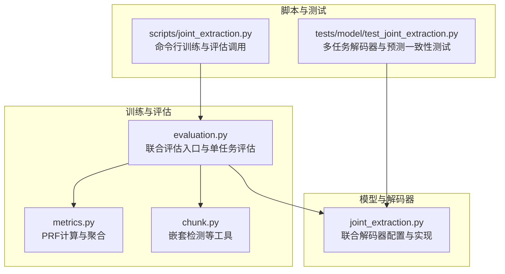
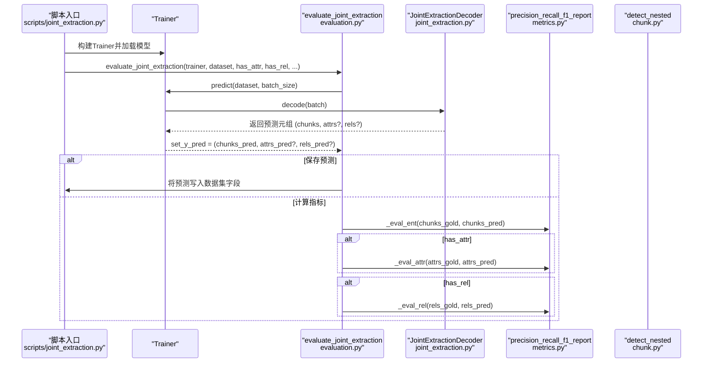
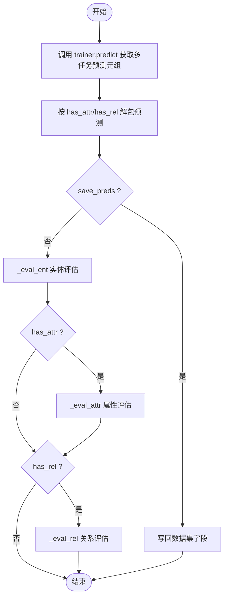
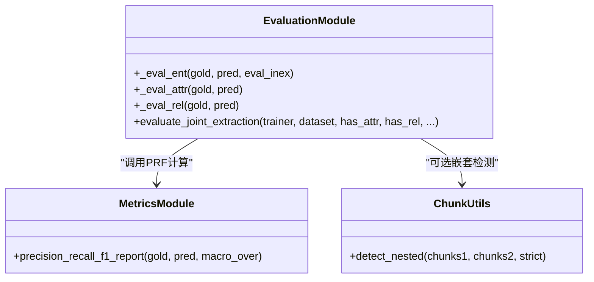
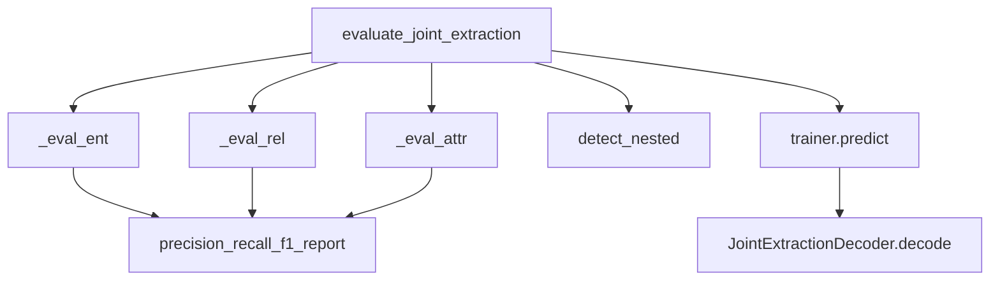
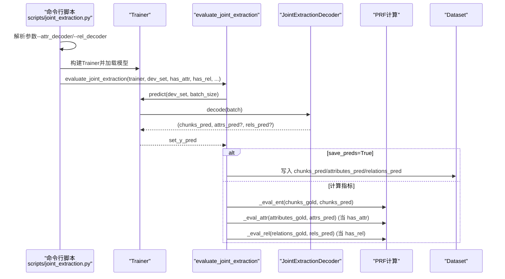

# 联合抽取评估

<cite>
**本文引用的文件列表**
- [evaluation.py](file://eznlp/training/evaluation.py)
- [joint_extraction.py](file://eznlp/model/decoder/joint_extraction.py)
- [metrics.py](file://eznlp/metrics.py)
- [chunk.py](file://eznlp/utils/chunk.py)
- [joint_extraction.py](file://scripts/joint_extraction.py)
- [test_joint_extraction.py](file://tests/model/test_joint_extraction.py)
</cite>

## 目录
1. [引言](#引言)
2. [项目结构与定位](#项目结构与定位)
3. [核心组件总览](#核心组件总览)
4. [架构概览](#架构概览)
5. [详细组件分析](#详细组件分析)
6. [依赖关系分析](#依赖关系分析)
7. [性能与可扩展性](#性能与可扩展性)
8. [故障排查指南](#故障排查指南)
9. [结论](#结论)
10. [附录：完整执行路径示例](#附录：完整执行路径示例)

## 引言
本文件系统化阐述联合抽取任务的综合评估方案，聚焦于 evaluate_joint_extraction 如何在统一入口下协调实体识别、属性抽取与关系抽取三类任务的评估；解释 has_attr 与 has_rel 参数如何动态裁剪评估流程；说明多输出预测结果的解包机制与黄金标签匹配方式；并分析其如何复用单任务评估逻辑（_eval_ent、_eval_attr、_eval_rel）实现模块化评估。最后通过脚本调用链路展示联合评估的完整执行路径。

## 项目结构与定位
- 评估入口位于训练模块，提供统一的联合评估接口，并内建对实体、属性、关系的单任务评估能力。
- 解码器层支持多任务解码器组合，统一返回多输出预测元组，供评估阶段按需解包。
- 指标计算由通用指标模块提供，支持宏平均与微平均两种聚合策略。
- 工具模块提供嵌套实体检测等辅助能力，用于细化 ER 的内部/外部实体评估。

图表来源
- [evaluation.py](file://eznlp/training/evaluation.py#L39-L202)
- [metrics.py](file://eznlp/metrics.py#L98-L153)
- [chunk.py](file://eznlp/utils/chunk.py#L63-L80)
- [joint_extraction.py](file://eznlp/model/decoder/joint_extraction.py#L154-L193)
- [joint_extraction.py](file://scripts/joint_extraction.py#L343-L359)
- [test_joint_extraction.py](file://tests/model/test_joint_extraction.py#L120-L134)

章节来源
- [evaluation.py](file://eznlp/training/evaluation.py#L39-L202)
- [metrics.py](file://eznlp/metrics.py#L98-L153)
- [chunk.py](file://eznlp/utils/chunk.py#L63-L80)
- [joint_extraction.py](file://eznlp/model/decoder/joint_extraction.py#L154-L193)
- [joint_extraction.py](file://scripts/joint_extraction.py#L343-L359)
- [test_joint_extraction.py](file://tests/model/test_joint_extraction.py#L120-L134)

## 核心组件总览
- evaluate_joint_extraction：联合评估入口，负责：
  - 统一预测：调用 trainer.predict 获取多任务解码器返回的元组预测；
  - 动态解包：根据 has_attr 与 has_rel 决定是否包含属性与关系预测；
  - 条件评估：仅当对应任务存在时才进行相应评估；
  - 可选保存：将预测结果写回数据集以离线查看或后续处理。
- 单任务评估函数：
  - _eval_ent：实体识别评估，支持内部/外部实体拆分评估；
  - _eval_attr：属性抽取评估，先按“类型+块坐标”格式化再评估；
  - _eval_rel：关系抽取评估，先按“类型+头尾块坐标”格式化再评估。
- JointExtractionDecoder：多任务解码器，统一返回 (chunks, attrs?, rels?) 元组，供评估阶段按序解包。

章节来源
- [evaluation.py](file://eznlp/training/evaluation.py#L39-L202)
- [joint_extraction.py](file://eznlp/model/decoder/joint_extraction.py#L154-L193)

## 架构概览
联合评估的整体流程如下：训练器对数据集进行批量预测，得到多任务解码器的元组输出；评估器根据 has_attr/has_rel 动态选择评估项，分别调用单任务评估函数完成 PRF 计算与日志输出。

图表来源
- [evaluation.py](file://eznlp/training/evaluation.py#L155-L189)
- [joint_extraction.py](file://eznlp/model/decoder/joint_extraction.py#L180-L193)
- [metrics.py](file://eznlp/metrics.py#L98-L153)
- [chunk.py](file://eznlp/utils/chunk.py#L63-L80)
- [joint_extraction.py](file://scripts/joint_extraction.py#L343-L359)

## 详细组件分析

### 1) evaluate_joint_extraction：联合评估入口
- 输入参数
  - has_attr：是否启用属性评估；
  - has_rel：是否启用关系评估；
  - batch_size：批大小；
  - save_preds：是否保存预测结果到数据集。
- 预测与解包
  - 调用 trainer.predict 获取多任务解码器返回的元组；
  - set_chunks_pred = set_y_pred[0]；
  - 若 has_attr，则 set_attrs_pred = set_y_pred[1]；
  - 若 has_rel，则 set_rels_pred = set_y_pred[2]（若存在属性分支）或 set_y_pred[1]（否则）。
- 保存预测
  - 分别写入 chunks_pred、attributes_pred、relations_pred 字段。
- 评估流程
  - 实体评估：_eval_ent(chunks_gold, chunks_pred, eval_inex=False)；
  - 属性评估（可选）：_eval_attr(attributes_gold, attributes_pred)；
  - 关系评估（可选）：_eval_rel(relations_gold, relations_pred)。

图表来源
- [evaluation.py](file://eznlp/training/evaluation.py#L155-L189)

章节来源
- [evaluation.py](file://eznlp/training/evaluation.py#L155-L189)

### 2) has_attr 与 has_rel 的动态控制
- has_attr 控制是否评估属性任务：
  - 为真时，从解包后的元组中取出属性预测，并在评估阶段调用 _eval_attr；
  - 同时，属性预测会写入 attributes_pred 字段以便保存模式使用。
- has_rel 控制是否评估关系任务：
  - 为真时，从解包后的元组中取出关系预测，并在评估阶段调用 _eval_rel；
  - 同时，关系预测会写入 relations_pred 字段以便保存模式使用。
- 两者默认值：
  - has_attr 默认 False；
  - has_rel 默认 True。

章节来源
- [evaluation.py](file://eznlp/training/evaluation.py#L155-L189)
- [joint_extraction.py](file://eznlp/model/decoder/joint_extraction.py#L154-L193)

### 3) 多输出预测解包与黄金标签匹配
- 解包机制
  - JointExtractionDecoder.decode 返回 (chunks, attrs?, rels?) 元组；
  - evaluate_joint_extraction 按索引解包，确保与数据集中 gold 标签一一对应。
- 黄金标签匹配
  - 实体：从每个样本的 "chunks" 字段取 gold；
  - 属性：从每个样本的 "attributes" 字段取 gold；
  - 关系：从每个样本的 "relations" 字段取 gold；
  - 评估时直接传入 set_y_gold 与 set_y_pred，保持样本级对齐。

章节来源
- [joint_extraction.py](file://eznlp/model/decoder/joint_extraction.py#L180-L193)
- [evaluation.py](file://eznlp/training/evaluation.py#L181-L189)

### 4) 单任务评估逻辑复用
- _eval_ent：对实体识别进行 PRF 计算；支持 eval_inex 时进一步拆分为内部/外部实体评估。
- _eval_attr：对属性抽取进行 PRF 计算；先将属性元组转换为 (attr_type, chunk坐标) 形式后再评估，避免类型维度影响。
- _eval_rel：对关系抽取进行 PRF 计算；先将关系元组转换为 (rel_type, head坐标, tail坐标) 形式后再评估，避免类型维度影响。
- 通用指标：precision_recall_f1_report 提供宏平均与微平均两种聚合方式，满足不同评估需求。

图表来源
- [evaluation.py](file://eznlp/training/evaluation.py#L39-L127)
- [metrics.py](file://eznlp/metrics.py#L98-L153)
- [chunk.py](file://eznlp/utils/chunk.py#L63-L80)

章节来源
- [evaluation.py](file://eznlp/training/evaluation.py#L39-L127)
- [metrics.py](file://eznlp/metrics.py#L98-L153)
- [chunk.py](file://eznlp/utils/chunk.py#L63-L80)

### 5) 嵌套实体评估（ER-in/ER-ex）
- 当 eval_inex=True 时，_eval_ent 会：
  - 使用 detect_nested 将预测与黄金中的嵌套实体分离；
  - 对嵌套与非嵌套部分分别计算 PRF，分别输出 ER-in 与 ER-ex 指标。
- 在联合评估中，实体评估默认不开启此拆分，但可在单任务评估中使用。

章节来源
- [evaluation.py](file://eznlp/training/evaluation.py#L39-L62)
- [chunk.py](file://eznlp/utils/chunk.py#L63-L80)

## 依赖关系分析
- evaluate_joint_extraction 依赖：
  - Trainer.predict：获取多任务解码器的元组预测；
  - _eval_ent/_eval_attr/_eval_rel：分别评估实体、属性、关系；
  - precision_recall_f1_report：通用 PRF 计算；
  - detect_nested：可选的嵌套实体拆分。
- JointExtractionDecoder 依赖：
  - 各子解码器（实体、属性、关系）的 evaluate/retrieve 接口；
  - 批级 assign_chunks_pred，确保关系解码基于实体预测。

图表来源
- [evaluation.py](file://eznlp/training/evaluation.py#L39-L189)
- [metrics.py](file://eznlp/metrics.py#L98-L153)
- [chunk.py](file://eznlp/utils/chunk.py#L63-L80)
- [joint_extraction.py](file://eznlp/model/decoder/joint_extraction.py#L180-L193)

章节来源
- [evaluation.py](file://eznlp/training/evaluation.py#L39-L189)
- [metrics.py](file://eznlp/metrics.py#L98-L153)
- [chunk.py](file://eznlp/utils/chunk.py#L63-L80)
- [joint_extraction.py](file://eznlp/model/decoder/joint_extraction.py#L180-L193)

## 性能与可扩展性
- 性能特征
  - 评估阶段仅进行集合比较与计数，时间复杂度近似 O(N_samples × avg_sample_size)，其中 avg_sample_size 为每样本实体/属性/关系数量；
  - 宏平均与微平均计算开销较小，适合大规模数据集离线评估。
- 可扩展性
  - 新增任务只需在 JointExtractionDecoder 中添加对应子解码器，并在 evaluate_joint_extraction 中按序解包与评估；
  - 评估逻辑保持模块化，新增任务无需修改已有评估函数。

[本节为通用指导，不涉及具体文件分析]

## 故障排查指南
- 症状：评估报错或指标异常
  - 检查数据集中是否存在 "chunks"/"attributes"/"relations" 字段；
  - 确认 has_attr/has_rel 与实际模型配置一致，避免漏评估或误评估。
- 症状：预测未保存
  - 确认 save_preds=True 且已正确写入对应字段；
  - 检查数据集构建时的 training 标志，避免在训练模式下覆盖字段。
- 症状：关系评估结果偏低
  - 检查关系元组格式是否为 (rel_type, head_chunk, tail_chunk)；
  - 确认 head/tail 坐标与实体预测一致，避免跨样本错配。

章节来源
- [evaluation.py](file://eznlp/training/evaluation.py#L170-L189)
- [joint_extraction.py](file://eznlp/model/decoder/joint_extraction.py#L180-L193)

## 结论
evaluate_joint_extraction 通过统一的多任务解码器输出与条件评估逻辑，实现了实体、属性、关系三类任务的一体化评估。has_attr 与 has_rel 参数提供了灵活的开关控制，使评估流程既能覆盖全量任务，也能按需裁剪。通过对单任务评估函数的模块化复用，评估体系具备良好的可维护性与可扩展性。

[本节为总结性内容，不涉及具体文件分析]

## 附录：完整执行路径示例
以下示例展示从命令行到评估的完整路径，涵盖 has_attr/has_rel 的动态控制与预测保存。

图表来源
- [joint_extraction.py](file://scripts/joint_extraction.py#L343-L359)
- [evaluation.py](file://eznlp/training/evaluation.py#L155-L189)
- [joint_extraction.py](file://eznlp/model/decoder/joint_extraction.py#L180-L193)

章节来源
- [joint_extraction.py](file://scripts/joint_extraction.py#L343-L359)
- [evaluation.py](file://eznlp/training/evaluation.py#L155-L189)
- [joint_extraction.py](file://eznlp/model/decoder/joint_extraction.py#L180-L193)