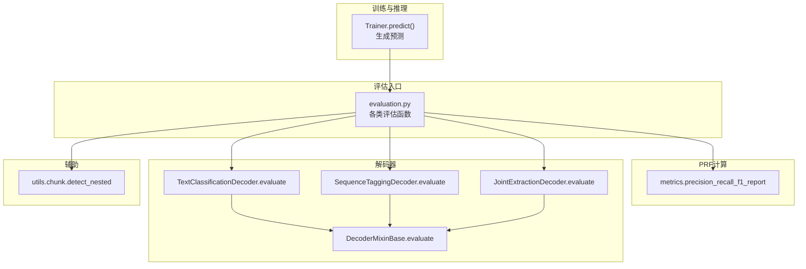
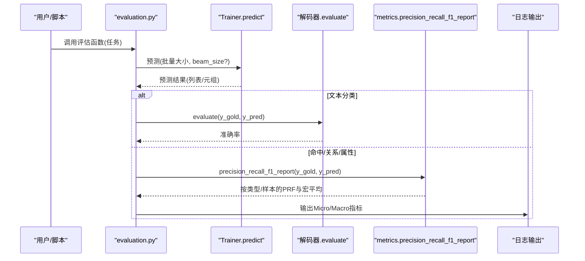
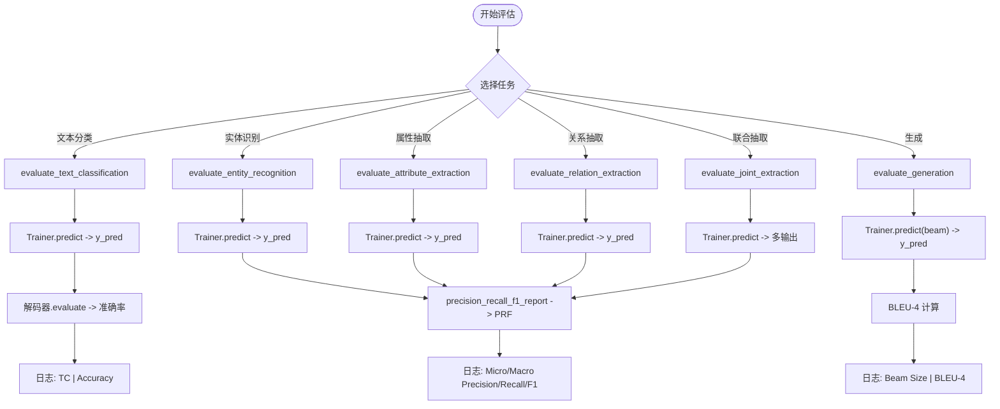
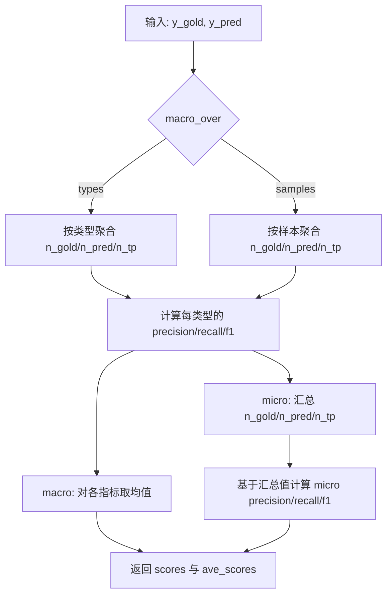
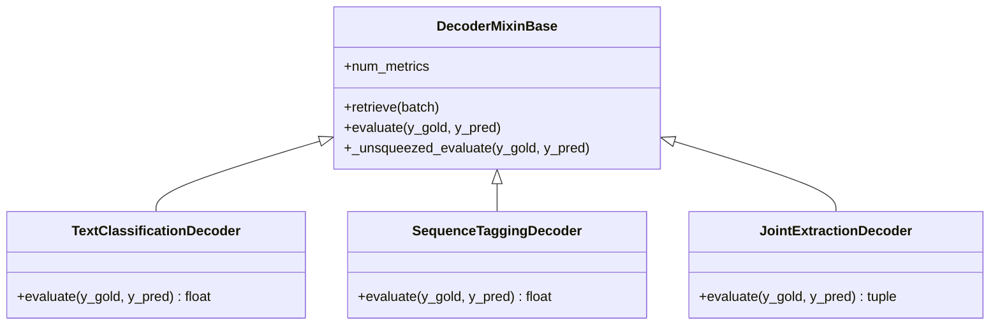
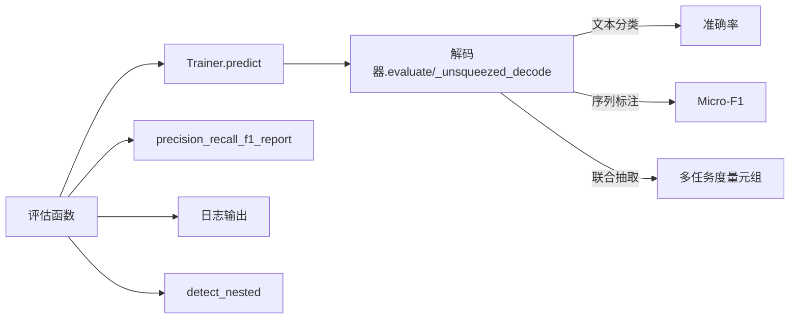

# 评估系统

<cite>
**本文引用的文件列表**
- [evaluation.py](file://eznlp/training/evaluation.py)
- [metrics.py](file://eznlp/metrics.py)
- [base.py](file://eznlp/model/decoder/base.py)
- [text_classification.py](file://eznlp/model/decoder/text_classification.py)
- [sequence_tagging.py](file://eznlp/model/decoder/sequence_tagging.py)
- [joint_extraction.py](file://eznlp/model/decoder/joint_extraction.py)
- [trainer.py](file://eznlp/training/trainer.py)
- [chunk.py](file://eznlp/utils/chunk.py)
- [test_metrics.py](file://tests/test_metrics.py)
</cite>

## 目录
1. [引言](#引言)
2. [项目结构](#项目结构)
3. [核心组件](#核心组件)
4. [架构总览](#架构总览)
5. [详细组件分析](#详细组件分析)
6. [依赖关系分析](#依赖关系分析)
7. [性能考量](#性能考量)
8. [故障排查指南](#故障排查指南)
9. [结论](#结论)

## 引言
本节概述评估系统的目标与范围：为不同自然语言处理任务提供统一的评估接口，包括文本分类（准确率）、命名实体识别（精确率/召回率/F1 分数，含 Micro/Macro 汇总）、关系抽取（Micro/Macro F1），并解释评估函数如何调用解码器的 evaluate 方法，以及评估结果的输出与日志记录方式。

## 项目结构
评估系统主要由以下模块组成：
- 训练器与预测：Trainer 负责批量推理，产出各类任务的预测结果。
- 解码器与评估：各任务解码器实现 evaluate 方法；评估函数通过 Trainer.predict 获取预测，并调用相应解码器的 evaluate 或内部 PRF 报告工具。
- PRF 计算：metrics.precision_recall_f1_report 提供按类型或样本的宏平均与微平均计算。
- 实体识别扩展：支持内部/外部实体拆分评估与后处理回调。

图表来源
- [evaluation.py](file://eznlp/training/evaluation.py#L1-L203)
- [metrics.py](file://eznlp/metrics.py#L1-L153)
- [base.py](file://eznlp/model/decoder/base.py#L1-L114)
- [text_classification.py](file://eznlp/model/decoder/text_classification.py#L1-L117)
- [sequence_tagging.py](file://eznlp/model/decoder/sequence_tagging.py#L1-L198)
- [joint_extraction.py](file://eznlp/model/decoder/joint_extraction.py#L1-L193)
- [chunk.py](file://eznlp/utils/chunk.py#L1-L250)

章节来源
- [evaluation.py](file://eznlp/training/evaluation.py#L1-L203)
- [metrics.py](file://eznlp/metrics.py#L1-L153)
- [base.py](file://eznlp/model/decoder/base.py#L1-L114)
- [text_classification.py](file://eznlp/model/decoder/text_classification.py#L1-L117)
- [sequence_tagging.py](file://eznlp/model/decoder/sequence_tagging.py#L1-L198)
- [joint_extraction.py](file://eznlp/model/decoder/joint_extraction.py#L1-L193)
- [trainer.py](file://eznlp/training/trainer.py#L124-L154)
- [chunk.py](file://eznlp/utils/chunk.py#L1-L250)

## 核心组件
- Trainer.predict：按批加载数据，调用模型解码器生成预测；对多度量任务返回元组，单度量任务返回列表。
- evaluation 中的评估函数：
  - 文本分类：evaluate_text_classification
  - 命名实体识别：evaluate_entity_recognition
  - 属性抽取：evaluate_attribute_extraction
  - 关系抽取：evaluate_relation_extraction
  - 联合抽取：evaluate_joint_extraction
  - 生成任务：evaluate_generation（BLEU-4）
- metrics.precision_recall_f1_report：通用 PRF 报告，支持按类型或按样本的宏平均，以及微平均汇总。
- 解码器 evaluate：
  - 文本分类：返回准确率
  - 序列标注：返回 Micro-F1
  - 联合抽取：返回各子任务的度量元组

章节来源
- [trainer.py](file://eznlp/training/trainer.py#L124-L154)
- [evaluation.py](file://eznlp/training/evaluation.py#L1-L203)
- [metrics.py](file://eznlp/metrics.py#L1-L153)
- [text_classification.py](file://eznlp/model/decoder/text_classification.py#L40-L46)
- [sequence_tagging.py](file://eznlp/model/decoder/sequence_tagging.py#L54-L63)
- [joint_extraction.py](file://eznlp/model/decoder/joint_extraction.py#L59-L66)

## 架构总览
评估流程自上而下分为三层：
- 任务层：针对不同任务的评估函数封装，负责组织预测与日志输出。
- 解码器层：各任务解码器实现 evaluate，用于计算具体指标（如准确率、F1）。
- 工具层：metrics 提供通用 PRF 计算，支持宏平均与微平均。

图表来源
- [evaluation.py](file://eznlp/training/evaluation.py#L1-L203)
- [metrics.py](file://eznlp/metrics.py#L98-L153)
- [text_classification.py](file://eznlp/model/decoder/text_classification.py#L40-L46)
- [sequence_tagging.py](file://eznlp/model/decoder/sequence_tagging.py#L54-L63)
- [joint_extraction.py](file://eznlp/model/decoder/joint_extraction.py#L59-L66)
- [trainer.py](file://eznlp/training/trainer.py#L124-L154)

## 详细组件分析

### 评估函数族与调用链
- evaluate_text_classification
  - 作用：对文本分类任务计算准确率。
  - 流程：预测 -> 若保存则写入样本 -> 否则调用解码器 evaluate 计算准确率并记录。
  - 日志：TC | Accuracy: XX.XXX%
- evaluate_entity_recognition
  - 作用：对命名实体识别计算 ER 的 Micro/Macro F1；可选内部/外部实体拆分评估；支持后处理回调。
  - 流程：预测 -> 可保存 -> 计算 PRF 报告 -> 可选内部/外部拆分再计算 -> 可选后处理回调再次评估。
  - 日志：ER | Micro/ Macro Precision/Recall/F1
- evaluate_attribute_extraction / evaluate_relation_extraction
  - 作用：分别对属性抽取与关系抽取计算 AE+/AE 与 RE+/RE 的 Micro/Macro F1。
  - 流程：预测 -> 可保存 -> 计算 PRF 报告 -> 对关系抽取进行类型前缀剥离后再次评估。
  - 日志：AE+/AE/RE+/RE | Micro/ Macro Precision/Recall/F1
- evaluate_joint_extraction
  - 作用：联合抽取时，分别评估实体、属性、关系三类指标。
  - 流程：预测 -> 可保存 -> 分别调用对应评估函数。
- evaluate_generation
  - 作用：对生成任务计算 BLEU-4。
  - 流程：预测（支持 beam 搜索）-> 计算 BLEU-4 -> 记录日志。

图表来源
- [evaluation.py](file://eznlp/training/evaluation.py#L1-L203)
- [metrics.py](file://eznlp/metrics.py#L98-L153)
- [trainer.py](file://eznlp/training/trainer.py#L124-L154)

章节来源
- [evaluation.py](file://eznlp/training/evaluation.py#L1-L203)
- [trainer.py](file://eznlp/training/trainer.py#L124-L154)

### precision_recall_f1_report 计算逻辑与实现细节
- 输入：两组“列表的列表”的元组集合（如实体/关系），每个样本内为若干元组。
- 计算步骤：
  - 样本级：对每条样本，将元组转为集合，统计 n_gold、n_pred、n_true_positive，进而得到该样本的 precision、recall、f1。
  - 类型级：遍历所有元组，提取类型维度，按类型聚合 n_gold、n_pred、n_true_positive，计算该类型的 precision、recall、f1。
  - 宏平均：按类型或样本取均值，得到 macro 级别的 precision、recall、f1。
  - 微平均：先对所有样本求和得到 micro 的 n_gold、n_pred、n_true_positive，再据此计算 micro 的 precision、recall、f1。
- 返回：scores（按样本/类型明细）与 ave_scores（包含 macro 与 micro）。

图表来源
- [metrics.py](file://eznlp/metrics.py#L98-L153)

章节来源
- [metrics.py](file://eznlp/metrics.py#L1-L153)
- [test_metrics.py](file://tests/test_metrics.py#L1-L79)

### 不同任务评估函数如何调用解码器 evaluate
- 文本分类
  - 评估函数直接调用解码器 evaluate(y_gold, y_pred)，返回准确率。
  - 解码器 evaluate 实现：逐样本比较 gold 与 pred，取平均。
- 命名实体识别
  - 评估函数不直接调用解码器 evaluate，而是调用 metrics.precision_recall_f1_report 计算 PRF，再由内部显示函数输出 Micro/Macro。
  - 解码器 evaluate（序列标注）：调用 precision_recall_f1_report 并返回 micro F1。
- 关系抽取/属性抽取
  - 评估函数调用 metrics.precision_recall_f1_report 计算 PRF，内部对关系抽取做类型前缀剥离后再评估一次。
- 联合抽取
  - 评估函数对实体、属性、关系分别调用对应评估逻辑；联合解码器 evaluate 返回各子任务度量元组。

图表来源
- [base.py](file://eznlp/model/decoder/base.py#L1-L114)
- [text_classification.py](file://eznlp/model/decoder/text_classification.py#L40-L46)
- [sequence_tagging.py](file://eznlp/model/decoder/sequence_tagging.py#L54-L63)
- [joint_extraction.py](file://eznlp/model/decoder/joint_extraction.py#L59-L66)

章节来源
- [base.py](file://eznlp/model/decoder/base.py#L1-L114)
- [text_classification.py](file://eznlp/model/decoder/text_classification.py#L1-L117)
- [sequence_tagging.py](file://eznlp/model/decoder/sequence_tagging.py#L1-L198)
- [joint_extraction.py](file://eznlp/model/decoder/joint_extraction.py#L1-L193)

### 评估结果输出格式与日志记录
- 文本分类：日志格式为“TC | Accuracy: XX.XXX%”。
- 命名实体识别/属性抽取/关系抽取：日志格式为“任务 | Micro/ Macro Precision/Recall/F1”，分别输出三次。
- 内部/外部实体拆分（ER-in/ER-ex）：当启用 eval_inex 时，额外输出内部与外部实体的 Micro/Macro 指标。
- 生成任务：日志格式为“Beam Size: X | BLEU-4: XX.XXX%”。

章节来源
- [evaluation.py](file://eznlp/training/evaluation.py#L1-L203)

## 依赖关系分析
- Trainer.predict 依赖模型解码器的 num_metrics 与 _unsqueezed_decode，以决定返回结构（单度量/多度量）。
- 评估函数依赖 Trainer.predict 产出的预测，再调用相应 evaluate 或 metrics 工具。
- 解码器 evaluate 的实现因任务而异：文本分类返回准确率，序列标注返回 micro F1，联合抽取返回各子任务度量元组。
- 实体识别支持内部/外部实体拆分，依赖 utils.chunk.detect_nested 进行嵌套检测。

图表来源
- [trainer.py](file://eznlp/training/trainer.py#L124-L154)
- [evaluation.py](file://eznlp/training/evaluation.py#L1-L203)
- [metrics.py](file://eznlp/metrics.py#L98-L153)
- [text_classification.py](file://eznlp/model/decoder/text_classification.py#L40-L46)
- [sequence_tagging.py](file://eznlp/model/decoder/sequence_tagging.py#L54-L63)
- [joint_extraction.py](file://eznlp/model/decoder/joint_extraction.py#L59-L66)
- [chunk.py](file://eznlp/utils/chunk.py#L63-L80)

章节来源
- [trainer.py](file://eznlp/training/trainer.py#L124-L154)
- [evaluation.py](file://eznlp/training/evaluation.py#L1-L203)
- [metrics.py](file://eznlp/metrics.py#L1-L153)
- [chunk.py](file://eznlp/utils/chunk.py#L1-L250)

## 性能考量
- 批量推理：Trainer.predict 使用 DataLoader 顺序批处理，避免计算损失，仅解码预测，适合评估阶段。
- 多度量任务：联合抽取返回元组，注意内存与 I/O 开销；建议按需保存预测而非打印大量中间结果。
- 宏/微平均：类型级宏平均对稀有类型更敏感，样本级宏平均对样本规模更敏感；根据任务目标选择合适的 macro_over。

## 故障排查指南
- 预测未保存：若 save_preds=True，评估函数会将预测写回 dataset.data；检查是否传入了 ground-truth 字段。
- 指标异常为零或 NaN：确认 y_gold 与 y_pred 长度一致且非空；检查评估函数是否正确传入了预测。
- 关系抽取类型前缀问题：关系评估内部会剥离类型前缀再评估一次；若期望保留原始类型，请勿使用该内部剥离逻辑。
- 内部/外部实体拆分：启用 eval_inex 时，确保输入的实体集合满足嵌套关系定义；必要时检查 detect_nested 的行为。
- 生成任务 BLEU：beam_size>1 时需确保 num_metrics==1；否则会触发断言。

章节来源
- [evaluation.py](file://eznlp/training/evaluation.py#L1-L203)
- [trainer.py](file://eznlp/training/trainer.py#L124-L154)
- [chunk.py](file://eznlp/utils/chunk.py#L63-L80)

## 结论
eznlp 的评估系统以 Trainer.predict 为核心，围绕任务评估函数与解码器 evaluate 组织，提供统一的日志输出与指标汇总。precision_recall_f1_report 支持宏/微平均，覆盖文本分类、命名实体识别、属性抽取、关系抽取与生成任务。通过内部/外部实体拆分与后处理回调，评估函数可灵活适配复杂场景。