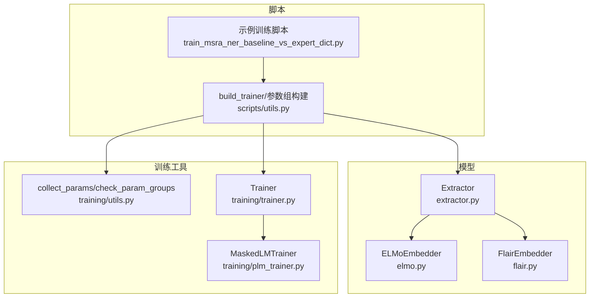
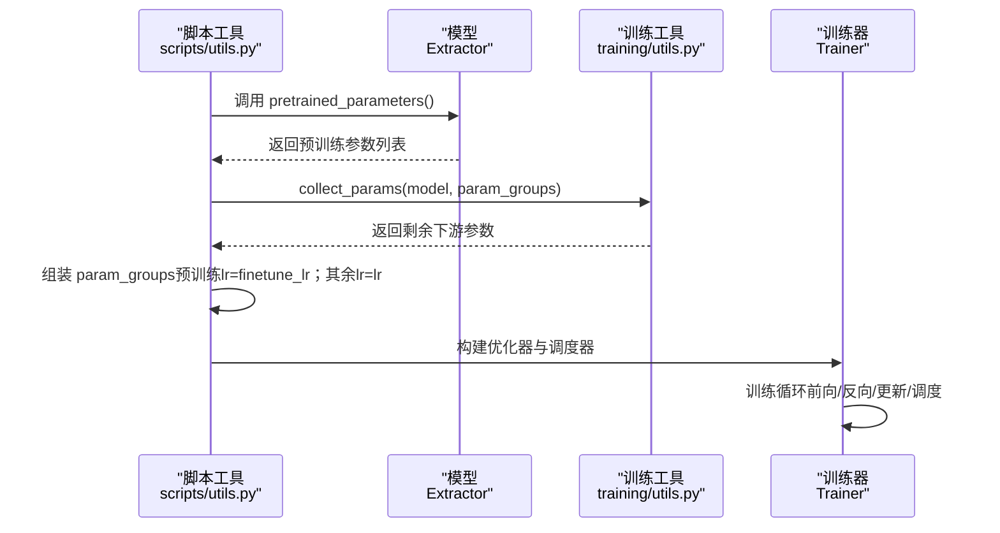
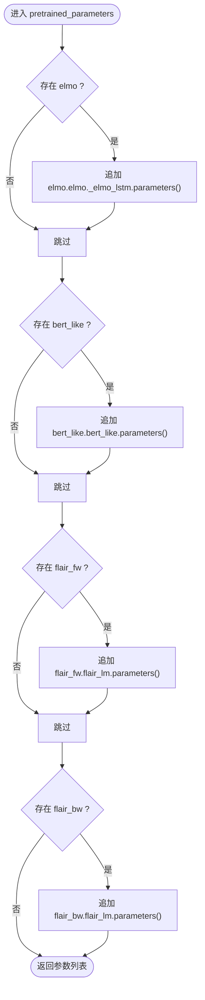
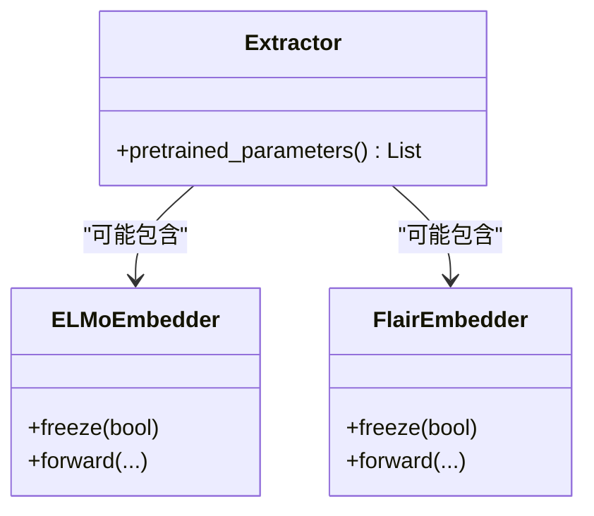
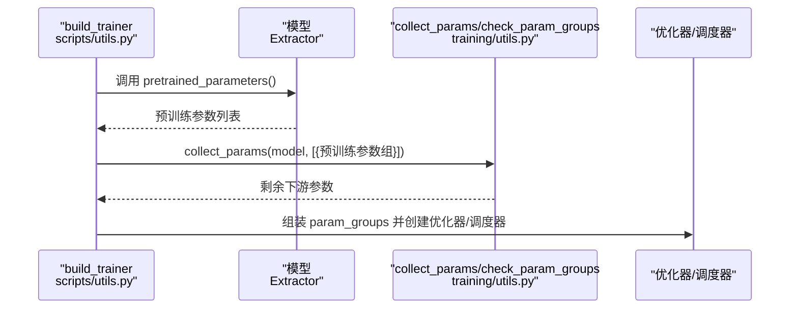
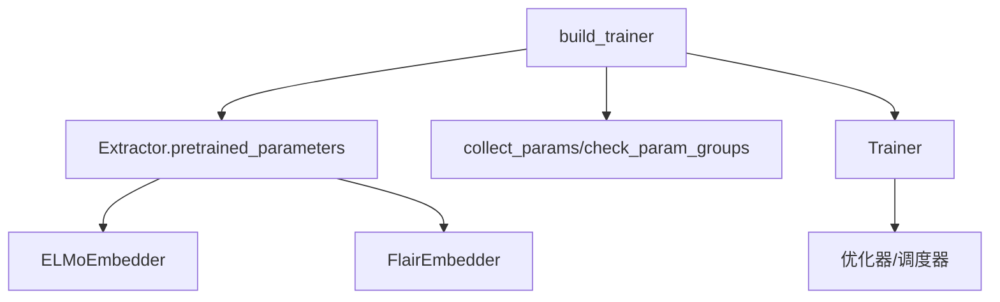

# 预训练模型参数优化

<cite>
**本文引用的文件列表**
- [extractor.py](file://eznlp/model/model/extractor.py)
- [elmo.py](file://eznlp/model/elmo.py)
- [flair.py](file://eznlp/model/flair.py)
- [utils.py（训练工具）](file://eznlp/training/utils.py)
- [utils.py（脚本工具）](file://scripts/utils.py)
- [trainer.py](file://eznlp/training/trainer.py)
- [plm_trainer.py](file://eznlp/training/plm_trainer.py)
- [train_msra_ner_baseline_vs_expert_dict.py](file://scripts/train_msra_ner_baseline_vs_expert_dict.py)
</cite>

## 目录
1. [引言](#引言)
2. [项目结构](#项目结构)
3. [核心组件](#核心组件)
4. [架构总览](#架构总览)
5. [详细组件分析](#详细组件分析)
6. [依赖关系分析](#依赖关系分析)
7. [性能考量](#性能考量)
8. [故障排查指南](#故障排查指南)
9. [结论](#结论)

## 引言
本文件聚焦于Extractor类中pretrained_parameters方法的实现机制，系统阐述其如何识别并分离预训练模型参数（ELMo、BERT-like、Flair前向/后向），并结合scripts/utils.py中的参数组管理逻辑，解释如何为预训练参数设置微调学习率（finetune_lr），为下游任务参数设置常规学习率（lr）。同时，展示该策略与AdamW优化器及学习率调度器（含热身）协同工作的完整流程，帮助读者理解如何在实际训练中实现更稳健、高效的微调。

## 项目结构
围绕“预训练参数分离与分组优化”的主题，涉及以下关键模块：
- 模型侧：Extractor及其配置、ELMo/Flair嵌入器
- 训练侧：参数收集与校验工具、训练器封装、脚本工具函数
- 调度器：LRLambda与多种调度策略



图表来源
- [extractor.py](file://eznlp/model/model/extractor.py#L256-L271)
- [elmo.py](file://eznlp/model/elmo.py#L68-L108)
- [flair.py](file://eznlp/model/flair.py#L82-L130)
- [utils.py（训练工具）](file://eznlp/training/utils.py#L86-L119)
- [utils.py（脚本工具）](file://scripts/utils.py#L1290-L1337)
- [trainer.py](file://eznlp/training/trainer.py#L1-L120)
- [plm_trainer.py](file://eznlp/training/plm_trainer.py#L1-L35)
- [train_msra_ner_baseline_vs_expert_dict.py](file://scripts/train_msra_ner_baseline_vs_expert_dict.py#L156-L185)

章节来源
- [extractor.py](file://eznlp/model/model/extractor.py#L256-L271)
- [utils.py（脚本工具）](file://scripts/utils.py#L1290-L1337)

## 核心组件
- Extractor.pretrained_parameters：按组件存在性检查并返回预训练参数集合（ELMo、BERT-like、Flair前/后向）
- scripts/utils.py.build_trainer：构建优化器与调度器，将预训练参数与下游参数分别赋予不同学习率
- training/utils.py.collect_params/check_param_groups：确保参数覆盖完整且不重复
- Trainer：统一的训练循环，支持梯度累积、梯度裁剪、AMP与调度器步进

章节来源
- [extractor.py](file://eznlp/model/model/extractor.py#L256-L271)
- [utils.py（脚本工具）](file://scripts/utils.py#L1290-L1337)
- [utils.py（训练工具）](file://eznlp/training/utils.py#L86-L119)
- [trainer.py](file://eznlp/training/trainer.py#L1-L120)

## 架构总览
下图展示了从脚本入口到训练器执行的关键交互，体现“参数分组—优化器—调度器—训练循环”的闭环。



图表来源
- [utils.py（脚本工具）](file://scripts/utils.py#L1290-L1337)
- [utils.py（训练工具）](file://eznlp/training/utils.py#L86-L119)
- [trainer.py](file://eznlp/training/trainer.py#L1-L120)
- [extractor.py](file://eznlp/model/model/extractor.py#L256-L271)

## 详细组件分析

### Extractor.pretrained_parameters 方法机制
- 功能目标：仅返回预训练组件的参数，便于单独设置微调学习率
- 实现要点：
  - 条件检查：逐个判断是否存在elmo、bert_like、flair_fw、flair_bw属性
  - 参数提取：分别从对应子模块中提取parameters（如ELMo的_LSTM参数、BERT-like的参数、Flair语言模型参数）
  - 返回聚合：将所有匹配到的参数合并为一个列表
- 复杂度：O(P)，其中P为预训练参数数量；空间开销O(P)
- 错误处理：通过hasattr进行安全访问，避免未配置组件时报错



图表来源
- [extractor.py](file://eznlp/model/model/extractor.py#L256-L271)

章节来源
- [extractor.py](file://eznlp/model/model/extractor.py#L256-L271)

### 预训练组件与参数归属
- ELMoEmbedder：通过冻结开关控制其_LSTM参数是否参与训练，最终由pretrained_parameters返回
- FlairEmbedder：通过冻结开关控制其语言模型参数是否参与训练，最终由pretrained_parameters返回
- BERT-like：直接暴露其参数给pretrained_parameters



图表来源
- [extractor.py](file://eznlp/model/model/extractor.py#L256-L271)
- [elmo.py](file://eznlp/model/elmo.py#L68-L108)
- [flair.py](file://eznlp/model/flair.py#L82-L130)

章节来源
- [elmo.py](file://eznlp/model/elmo.py#L68-L108)
- [flair.py](file://eznlp/model/flair.py#L82-L130)
- [extractor.py](file://eznlp/model/model/extractor.py#L256-L271)

### 参数组管理与学习率分配
- 脚本工具build_trainer：
  - 先构造“预训练参数组”，学习率为finetune_lr
  - 使用collect_params收集未被分组的参数，构成“下游参数组”，学习率为lr
  - 通过check_param_groups校验参数完整性（总数一致）
  - 创建优化器（默认AdamW），并根据调度器类型创建LambdaLR（含热身）
- 示例脚本train_msra_ner_baseline_vs_expert_dict.py展示了手动分组的等价做法



图表来源
- [utils.py（脚本工具）](file://scripts/utils.py#L1290-L1337)
- [utils.py（训练工具）](file://eznlp/training/utils.py#L86-L119)
- [extractor.py](file://eznlp/model/model/extractor.py#L256-L271)

章节来源
- [utils.py（脚本工具）](file://scripts/utils.py#L1290-L1337)
- [utils.py（训练工具）](file://eznlp/training/utils.py#L86-L119)
- [train_msra_ner_baseline_vs_expert_dict.py](file://scripts/train_msra_ner_baseline_vs_expert_dict.py#L156-L185)

### 与AdamW优化器和学习率调度器的协同
- 优化器：默认使用AdamW，支持权重衰减与梯度累积
- 调度器：
  - LinearDecayWithWarmup：线性热身+衰减
  - PowerDecayWithWarmup：幂律热身+衰减
  - ReduceLROnPlateau：基于验证指标的早停式降率
- 训练器Trainer：
  - 支持梯度裁剪、AMP混合精度
  - schedule_by_step控制按step或按epoch调度
  - 在backward_batch中按num_grad_acc_steps触发优化器更新

```mermaid
sequenceDiagram
participant TR as "Trainer<br/>trainer.py"
participant OPT as "优化器"
participant SCH as "调度器"
TR->>TR : 前向计算损失
TR->>OPT : 反向传播可能AMP缩放
TR->>TR : 达到累积步数则更新权重
TR->>SCH : 若按step则step()
TR->>TR : 若按epoch且非ReduceLROnPlateau则step()
```

图表来源
- [trainer.py](file://eznlp/training/trainer.py#L1-L120)
- [utils.py（脚本工具）](file://scripts/utils.py#L1308-L1327)

章节来源
- [trainer.py](file://eznlp/training/trainer.py#L1-L120)
- [utils.py（脚本工具）](file://scripts/utils.py#L1308-L1327)

## 依赖关系分析
- 组件耦合：
  - Extractor依赖ELMo/Flair嵌入器；若未启用某组件，则pretrained_parameters不会包含对应参数
  - 脚本工具依赖训练工具的参数收集与校验能力
  - 训练器对优化器与调度器的接口保持抽象，便于替换
- 潜在风险：
  - 若某预训练组件未正确设置requires_grad或freeze状态，可能导致参数未被纳入或重复分组
  - 参数组未覆盖全部参数会触发check_param_groups告警



图表来源
- [extractor.py](file://eznlp/model/model/extractor.py#L256-L271)
- [elmo.py](file://eznlp/model/elmo.py#L68-L108)
- [flair.py](file://eznlp/model/flair.py#L82-L130)
- [utils.py（脚本工具）](file://scripts/utils.py#L1290-L1337)
- [utils.py（训练工具）](file://eznlp/training/utils.py#L86-L119)
- [trainer.py](file://eznlp/training/trainer.py#L1-L120)

章节来源
- [extractor.py](file://eznlp/model/model/extractor.py#L256-L271)
- [utils.py（训练工具）](file://eznlp/training/utils.py#L86-L119)
- [utils.py（脚本工具）](file://scripts/utils.py#L1290-L1337)
- [trainer.py](file://eznlp/training/trainer.py#L1-L120)

## 性能考量
- 分组微调的优势：
  - 预训练参数使用较小的学习率（finetune_lr）以稳定上下文表示
  - 下游参数使用常规学习率（lr）以快速适配任务
- 训练稳定性：
  - 梯度裁剪与AMP有助于提升收敛稳定性与显存利用率
  - 学习率热身可缓解初期不稳定
- 参数完整性校验：
  - 使用check_param_groups确保未遗漏或重复参数，避免训练异常

[本节提供通用建议，无需特定文件分析]

## 故障排查指南
- 参数未覆盖问题：
  - 症状：check_param_groups返回False
  - 排查：确认每个预训练组件均正确初始化并设置freeze状态；确认hasattr分支均已覆盖
- 学习率未生效：
  - 症状：预训练参数组学习率未按预期
  - 排查：确认build_trainer中param_groups顺序与collect_params调用位置；核对args.finetune_lr与args.lr值
- 调度器步进异常：
  - 症状：按step与按epoch的调度时机不符
  - 排查：确认schedule_by_step标志与调度器类型；ReduceLROnPlateau需按epoch步进

章节来源
- [utils.py（训练工具）](file://eznlp/training/utils.py#L86-L119)
- [utils.py（脚本工具）](file://scripts/utils.py#L1290-L1337)
- [trainer.py](file://eznlp/training/trainer.py#L1-L120)

## 结论
通过Extractor.pretrained_parameters对预训练组件参数进行精准分离，并在脚本工具中将其与下游参数分别赋予不同的学习率，配合AdamW优化器与多种学习率调度策略，能够有效平衡预训练表示的稳定性与下游任务的拟合速度。训练工具链提供的参数收集与校验机制进一步保障了参数分组的正确性与完整性，为复杂模型的高效微调提供了可靠支撑。