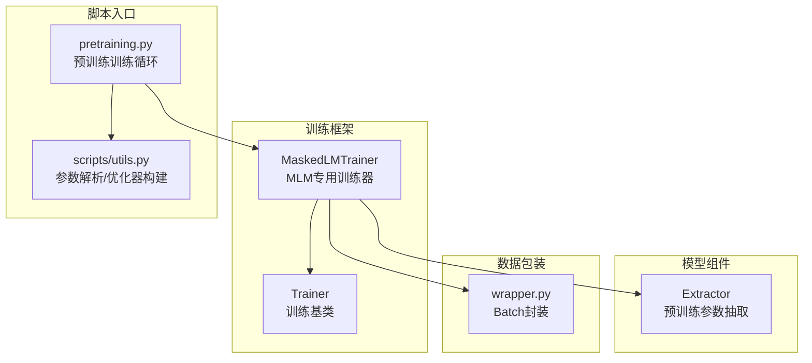
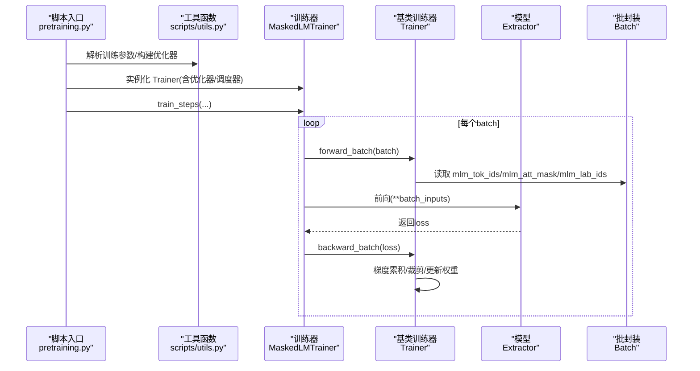
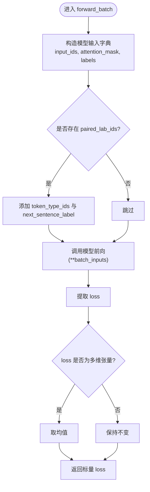
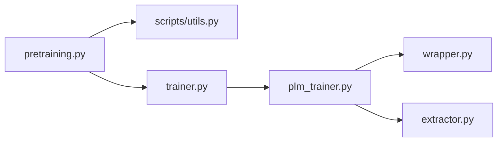

# 预训练语言模型微调

<cite>
**本文引用的文件列表**
- [plm_trainer.py](file://eznlp/training/plm_trainer.py)
- [trainer.py](file://eznlp/training/trainer.py)
- [extractor.py](file://eznlp/model/model/extractor.py)
- [utils.py（训练工具）](file://eznlp/training/utils.py)
- [utils.py（脚本工具）](file://scripts/utils.py)
- [pretraining.py](file://scripts/pretraining.py)
- [wrapper.py](file://eznlp/wrapper.py)
</cite>

## 目录
1. [简介](#简介)
2. [项目结构与入口](#项目结构与入口)
3. [核心组件](#核心组件)
4. [架构总览](#架构总览)
5. [组件详解](#组件详解)
6. [依赖关系分析](#依赖关系分析)
7. [性能与实践建议](#性能与实践建议)
8. [故障排查指南](#故障排查指南)
9. [结论](#结论)

## 简介
本文件面向希望使用仓库中的掩码语言模型（Masked Language Model, MLM）训练流程进行预训练语言模型微调的用户。重点说明以下内容：
- 如何通过 MaskedLMTrainer 类对 Trainer 进行扩展，以适配 MLM 的训练目标；
- 输入 batch 中 mlm_tok_ids、mlm_att_mask、mlm_lab_ids 字段的含义与作用；
- 如何结合 extractor.py 中的 pretrained_parameters 方法，为预训练模型参数与下游任务参数设置不同学习率；
- 在 scripts/utils.py 中如何构建微调优化器与调度器，并在 scripts/pretraining.py 中完成端到端训练。

## 项目结构与入口
- 训练框架位于 eznlp/training，包含通用 Trainer 基类与针对 MLM 的 MaskedLMTrainer 扩展；
- 模型侧的预训练参数抽取逻辑位于 eznlp/model/model/extractor.py；
- 脚本层提供预训练入口 scripts/pretraining.py，以及通用训练参数解析 scripts/utils.py；
- 数据批包装器 eznlp/wrapper.py 定义了 Batch 对象，用于承载 mlm_tok_ids、mlm_att_mask、mlm_lab_ids 等字段。

图表来源
- [plm_trainer.py](file://eznlp/training/plm_trainer.py#L1-L35)
- [trainer.py](file://eznlp/training/trainer.py#L1-L120)
- [extractor.py](file://eznlp/model/model/extractor.py#L256-L271)
- [pretraining.py](file://scripts/pretraining.py#L190-L249)
- [utils.py（脚本工具）](file://scripts/utils.py#L1-L120)
- [wrapper.py](file://eznlp/wrapper.py#L97-L122)

章节来源
- [plm_trainer.py](file://eznlp/training/plm_trainer.py#L1-L35)
- [trainer.py](file://eznlp/training/trainer.py#L1-L120)
- [extractor.py](file://eznlp/model/model/extractor.py#L256-L271)
- [pretraining.py](file://scripts/pretraining.py#L190-L249)
- [utils.py（脚本工具）](file://scripts/utils.py#L1-L120)
- [wrapper.py](file://eznlp/wrapper.py#L97-L122)

## 核心组件
- MaskedLMTrainer：继承自 Trainer，重写 forward_batch，专门处理 MLM 的输入与损失计算；
- Trainer：通用训练器，负责前向、反向、梯度累积、梯度裁剪、学习率调度等；
- Extractor.pretrained_parameters：返回预训练模块参数集合，便于按需设置不同学习率；
- Batch：统一的数据批封装，承载 mlm_tok_ids、mlm_att_mask、mlm_lab_ids 等字段；
- scripts/utils.py：提供训练超参解析与优化器/调度器构建的工具函数；
- scripts/pretraining.py：预训练脚本入口，组装优化器、调度器与 Trainer 并启动训练。

章节来源
- [plm_trainer.py](file://eznlp/training/plm_trainer.py#L1-L35)
- [trainer.py](file://eznlp/training/trainer.py#L1-L120)
- [extractor.py](file://eznlp/model/model/extractor.py#L256-L271)
- [wrapper.py](file://eznlp/wrapper.py#L97-L122)
- [utils.py（脚本工具）](file://scripts/utils.py#L1-L120)
- [pretraining.py](file://scripts/pretraining.py#L190-L249)

## 架构总览
下图展示了从脚本入口到训练器再到模型的调用链路，以及 MLM 输入字段在训练过程中的传递路径。

图表来源
- [pretraining.py](file://scripts/pretraining.py#L190-L249)
- [utils.py（脚本工具）](file://scripts/utils.py#L1-L120)
- [plm_trainer.py](file://eznlp/training/plm_trainer.py#L1-L35)
- [trainer.py](file://eznlp/training/trainer.py#L64-L120)
- [wrapper.py](file://eznlp/wrapper.py#L97-L122)

## 组件详解

### MaskedLMTrainer：面向MLM的训练器
- 继承关系：MaskedLMTrainer 继承 Trainer，复用其训练循环与优化流程；
- 关键点：
  - 重写 forward_batch：将 batch 中的 mlm_tok_ids、mlm_att_mask、mlm_lab_ids 映射为模型期望的 input_ids、attention_mask、labels；
  - 若存在 paired_lab_ids，则额外传入 token_type_ids 与 next_sentence_label，支持句子对预训练目标；
  - 多GPU场景下，若 loss 是张量维度大于0，取均值以保证一致性；
  - 返回标量 loss，供 Trainer.backward_batch 使用。

图表来源
- [plm_trainer.py](file://eznlp/training/plm_trainer.py#L11-L34)

章节来源
- [plm_trainer.py](file://eznlp/training/plm_trainer.py#L1-L35)

### Trainer：通用训练器
- 提供训练/验证循环、梯度累积、梯度裁剪、学习率调度等通用能力；
- forward_batch 默认行为：调用模型的 forward2states 并聚合损失；
- MaskedLMTrainer 重写该方法以适配 MLM 的输入与输出格式。

章节来源
- [trainer.py](file://eznlp/training/trainer.py#L64-L120)

### Batch：输入批封装
- Batch 封装了训练/推理所需的所有张量与元信息；
- 对于 MLM，Batch 中包含 mlm_tok_ids、mlm_att_mask、mlm_lab_ids 等字段，分别对应：
  - mlm_tok_ids：掩码语言建模的输入 token 序列（整数ID）；
  - mlm_att_mask：注意力掩码（通常为 0/1 或布尔），MaskedLMTrainer 中会取反并转为 long；
  - mlm_lab_ids：标签序列（通常是被掩码位置的真实词ID或-100忽略项）。

章节来源
- [wrapper.py](file://eznlp/wrapper.py#L97-L122)
- [plm_trainer.py](file://eznlp/training/plm_trainer.py#L11-L20)

### Extractor.pretrained_parameters：预训练参数抽取
- 该方法返回预训练模块（如 ELMO、BERT-like、Flair）的参数集合；
- 可用于构建参数分组，使预训练参数与下游任务参数采用不同学习率；
- 典型做法：将 pretrained_parameters 放入单独的 param_groups，并赋予较小的学习率（例如 finetune_lr）。

章节来源
- [extractor.py](file://eznlp/model/model/extractor.py#L256-L271)

### scripts/utils.py：微调优化器构建
- 脚本工具提供 add_base_arguments 与 parse_to_args 等参数解析函数；
- 训练超参包括：优化器类型、学习率 lr、微调学习率 finetune_lr、梯度裁剪、梯度累积步数等；
- 可基于这些参数构建优化器与调度器（例如 AdamW + Warmup/Linear Decay）。

章节来源
- [utils.py（脚本工具）](file://scripts/utils.py#L1-L120)

### scripts/pretraining.py：预训练训练入口
- 实例化模型后，直接创建 AdamW 优化器（整体学习率 args.lr）；
- 构造线性衰减带预热的学习率调度器；
- 创建 MaskedLMTrainer 并启动训练循环。

章节来源
- [pretraining.py](file://scripts/pretraining.py#L190-L249)

## 依赖关系分析
- MaskedLMTrainer 依赖 Trainer 的训练循环与优化流程；
- Trainer 依赖 Batch 的输入字段；
- MaskedLMTrainer 间接依赖 Extractor 的预训练参数抽取能力；
- 脚本层通过 scripts/utils.py 提供的参数解析与优化器构建，驱动预训练流程。

图表来源
- [pretraining.py](file://scripts/pretraining.py#L190-L249)
- [utils.py（脚本工具）](file://scripts/utils.py#L1-L120)
- [trainer.py](file://eznlp/training/trainer.py#L1-L120)
- [plm_trainer.py](file://eznlp/training/plm_trainer.py#L1-L35)
- [wrapper.py](file://eznlp/wrapper.py#L97-L122)
- [extractor.py](file://eznlp/model/model/extractor.py#L256-L271)

章节来源
- [pretraining.py](file://scripts/pretraining.py#L190-L249)
- [utils.py（脚本工具）](file://scripts/utils.py#L1-L120)
- [trainer.py](file://eznlp/training/trainer.py#L1-L120)
- [plm_trainer.py](file://eznlp/training/plm_trainer.py#L1-L35)
- [wrapper.py](file://eznlp/wrapper.py#L97-L122)
- [extractor.py](file://eznlp/model/model/extractor.py#L256-L271)

## 性能与实践建议
- 梯度累积：通过 num_grad_acc_steps 放大有效 batch size，同时保持内存可控；
- 梯度裁剪：grad_clip 控制梯度范数，避免爆炸；
- 自动混合精度：use_amp 启用 autocast 与 GradScaler，提升吞吐；
- 学习率策略：推荐 LinearDecayWithWarmup，warmup 步数可按总步数比例设定；
- 参数分组：将预训练参数与下游参数分开，预训练参数使用较小学习率（finetune_lr）。

章节来源
- [trainer.py](file://eznlp/training/trainer.py#L82-L120)
- [utils.py（训练工具）](file://eznlp/training/utils.py#L1-L120)
- [utils.py（脚本工具）](file://scripts/utils.py#L1-L120)
- [pretraining.py](file://scripts/pretraining.py#L190-L249)

## 故障排查指南
- 损失不收敛或不稳定
  - 检查是否正确设置了 num_grad_acc_steps 与 grad_clip；
  - 确认学习率调度器与 warmup 设置合理；
  - 参考 Trainer 的 backward_batch 流程定位问题。
- 多GPU训练报错
  - 确保 loss 为标量；MaskedLMTrainer 已在多GPU场景下取均值；
  - 检查分布式封装与设备映射。
- 参数未更新
  - 确认优化器已包含所有需要训练的参数；
  - 使用 check_param_groups 辅助核对参数分组完整性。

章节来源
- [trainer.py](file://eznlp/training/trainer.py#L82-L120)
- [plm_trainer.py](file://eznlp/training/plm_trainer.py#L27-L34)
- [utils.py（训练工具）](file://eznlp/training/utils.py#L103-L120)

## 结论
通过 MaskedLMTrainer 对 Trainer 的轻量扩展，结合 Batch 的标准化输入字段与 Extractor 的预训练参数抽取能力，可以高效地完成掩码语言模型的预训练微调。配合 scripts/utils.py 与 scripts/pretraining.py 提供的参数解析与优化器构建流程，用户可以在同一套框架下灵活设置学习率策略与参数分组，从而在预训练与下游任务之间取得良好的平衡。