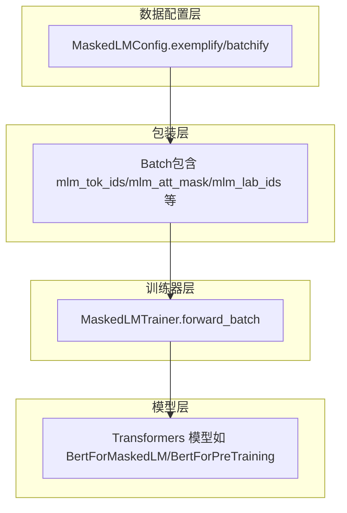
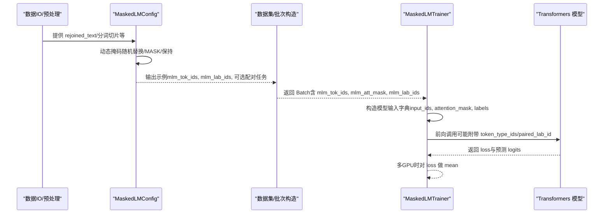
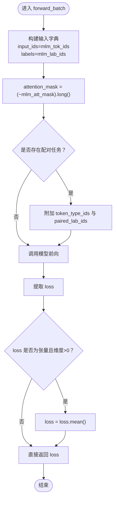
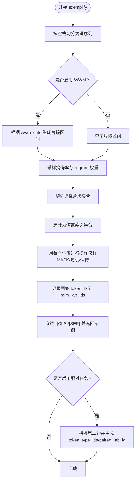
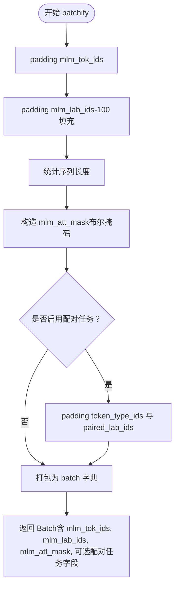
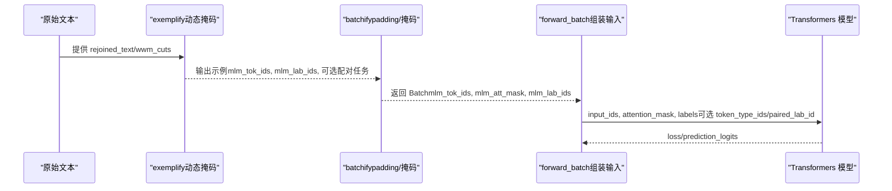
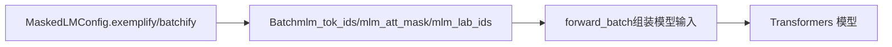

# 预训练语言模型数据处理

<cite>
**本文引用的文件列表**
- [plm_trainer.py](file://eznlp/training/plm_trainer.py)
- [mlm.py](file://eznlp/plm/mlm.py)
- [wrapper.py](file://eznlp/wrapper.py)
- [test_mlm.py](file://tests/plm/test_mlm.py)
</cite>

## 目录
1. [引言](#引言)
2. [项目结构与角色定位](#项目结构与角色定位)
3. [核心组件](#核心组件)
4. [架构总览](#架构总览)
5. [详细组件分析](#详细组件分析)
6. [依赖关系分析](#依赖关系分析)
7. [性能与数值稳定性建议](#性能与数值稳定性建议)
8. [故障排查指南](#故障排查指南)
9. [结论](#结论)

## 引言
本文件围绕 MaskedLMTrainer 类中的 forward_batch 方法，系统阐述掩码语言模型训练中输入数据 batch 的处理流程，重点解释 mlm_tok_ids、mlm_att_mask、mlm_lab_ids 三类字段在训练中的作用与转换方式，并结合 MaskedLMConfig 的 exemplify 和 batchify 流程，说明从原始文本到模型输入的完整数据流，包括子词对齐与标签映射机制。同时，文档给出与 Hugging Face Transformers 兼容的输入格式要求及注意力掩码的逻辑取反原因。

## 项目结构与角色定位
- 训练器层：MaskedLMTrainer 负责将 batch 转换为模型可接受的字典输入，并调用模型前向计算损失。
- 数据配置层：MaskedLMConfig 定义动态掩码策略、句子对任务（NSP/SOP）以及如何将示例转换为批次。
- 包装层：Batch 是张量包装容器，承载 mlm_tok_ids、mlm_att_mask、mlm_lab_ids 等字段。
- 测试层：通过单元测试验证批次一致性与可训练性，确保注意力掩码与标签映射正确。

**图表来源**
- [plm_trainer.py](file://eznlp/training/plm_trainer.py#L11-L34)
- [mlm.py](file://eznlp/plm/mlm.py#L133-L272)
- [wrapper.py](file://eznlp/wrapper.py#L97-L122)

**章节来源**
- [plm_trainer.py](file://eznlp/training/plm_trainer.py#L11-L34)
- [mlm.py](file://eznlp/plm/mlm.py#L133-L272)
- [wrapper.py](file://eznlp/wrapper.py#L97-L122)

## 核心组件
- MaskedLMTrainer.forward_batch：将 Batch 中的 mlm_tok_ids、mlm_att_mask、mlm_lab_ids 转换为模型所需的 input_ids、attention_mask、labels；若存在配对任务则附加 token_type_ids 与 next_sentence_label（或 paired_lab_id）。
- MaskedLMConfig.exemplify：基于动态掩码策略生成 mlm_tok_ids 与 mlm_lab_ids，并按需生成配对任务的 token_type_ids 与 paired_lab_id。
- MaskedLMConfig.batchify：对一批示例进行长度统计、padding、mask 构造，形成 mlm_tok_ids、mlm_lab_ids、mlm_att_mask 等字段。
- Batch：统一承载上述字段，便于在训练器与模型之间传递。

**章节来源**
- [plm_trainer.py](file://eznlp/training/plm_trainer.py#L11-L34)
- [mlm.py](file://eznlp/plm/mlm.py#L133-L272)
- [wrapper.py](file://eznlp/wrapper.py#L97-L122)

## 架构总览
下图展示了从原始文本到模型输入的关键步骤，以及注意力掩码与标签映射的对应关系。

**图表来源**
- [mlm.py](file://eznlp/plm/mlm.py#L133-L272)
- [plm_trainer.py](file://eznlp/training/plm_trainer.py#L11-L34)
- [test_mlm.py](file://tests/plm/test_mlm.py#L13-L55)

## 详细组件分析

### MaskedLMTrainer.forward_batch：输入字段到模型参数的映射
- 输入字段
  - mlm_tok_ids：经子词分词与掩码处理后的 token ID 序列，作为模型的 input_ids。
  - mlm_att_mask：布尔掩码，True 表示需要被掩码的位置（即被替换为 [MASK] 或随机 token 的位置）。注意：该掩码用于指示“被掩码”的位置。
  - mlm_lab_ids：对应位置的原始 token ID 标签，用于计算 MLM 损失；对于未参与预测或被忽略的位置，使用 -100。
- 映射规则
  - 将 mlm_tok_ids 映射为模型输入的 input_ids。
  - 将 mlm_att_mask 进行逻辑取反并转为长整型，得到 attention_mask，用于指示“有效位置”（非填充且未被掩码）。
  - 将 mlm_lab_ids 映射为 labels，作为交叉熵损失的标签。
  - 若存在配对任务（NSP/SOP），则附加 token_type_ids 与 paired_lab_ids（或 next_sentence_label）。
- 多 GPU 处理
  - 对于多 GPU 场景，若 loss 维度大于 0，则对其做均值化以保证梯度一致。

**图表来源**
- [plm_trainer.py](file://eznlp/training/plm_trainer.py#L11-L34)

**章节来源**
- [plm_trainer.py](file://eznlp/training/plm_trainer.py#L11-L34)

### MaskedLMConfig.exemplify：动态掩码与标签映射
- 动态掩码策略
  - 基于 n-gram 权重与 masking_rate，随机选择若干词片段（span）进行掩码。
  - 对每个被选中的位置，以多项式分布决定三种操作之一：
    - 替换为 [MASK]；
    - 替换为随机非特殊 token；
    - 保持原样。
- 标签映射
  - 对应位置的原始 token ID 写入 mlm_lab_ids；未参与预测或被忽略的位置使用 -100。
- 句子对任务（NSP/SOP）
  - 在示例层面拼接两个句子片段，生成 token_type_ids 与 paired_lab_id，并在首尾添加 [CLS]/[SEP]。

**图表来源**
- [mlm.py](file://eznlp/plm/mlm.py#L133-L238)

**章节来源**
- [mlm.py](file://eznlp/plm/mlm.py#L133-L238)

### MaskedLMConfig.batchify：批次构造与注意力掩码
- 批次构造
  - 对一批示例分别进行 padding，得到 mlm_tok_ids 与 mlm_lab_ids。
  - 统计每条序列长度，构造 mlm_att_mask（布尔掩码，True 表示被掩码位置）。
- 注意力掩码
  - 将 mlm_att_mask 作为注意力掩码的基础；在训练器 forward_batch 中再进行逻辑取反并转为长整型，以适配 Transformers 的 attention_mask 规范。
- 配对任务
  - 若启用 NSP/SOP，还需对 token_type_ids 与 paired_lab_ids 进行 padding 与堆叠。

**图表来源**
- [mlm.py](file://eznlp/plm/mlm.py#L240-L272)

**章节来源**
- [mlm.py](file://eznlp/plm/mlm.py#L240-L272)

### 从原始文本到模型输入的完整数据流
- 原始文本阶段
  - 输入为 rejoined_text（已分词的字符串），以及可选的 wwm_cuts（用于 WWM）。
- 掩码与标签阶段
  - 使用 MaskedLMConfig.exemplify 生成 mlm_tok_ids 与 mlm_lab_ids，并按需生成配对任务字段。
- 批次阶段
  - 使用 MaskedLMConfig.batchify 对一批示例进行 padding 与掩码构造，得到 Batch。
- 训练器阶段
  - MaskedLMTrainer.forward_batch 将 Batch 转换为模型输入字典，其中 attention_mask 为 (~mlm_att_mask).long()，以满足 Transformers 的注意力掩码约定。
- 模型阶段
  - Transformers 模型接收 input_ids、attention_mask、labels（以及可选 token_type_ids/paired_lab_id），返回 loss 与预测结果。

**图表来源**
- [mlm.py](file://eznlp/plm/mlm.py#L133-L272)
- [plm_trainer.py](file://eznlp/training/plm_trainer.py#L11-L34)

**章节来源**
- [mlm.py](file://eznlp/plm/mlm.py#L133-L272)
- [plm_trainer.py](file://eznlp/training/plm_trainer.py#L11-L34)

## 依赖关系分析
- MaskedLMTrainer.forward_batch 依赖 Batch 中的 mlm_tok_ids、mlm_att_mask、mlm_lab_ids 字段，以及可选的配对任务字段。
- MaskedLMConfig.exemplify/batchify 生成 Batch 的核心字段，决定训练时的掩码策略与标签映射。
- Batch 作为统一载体，贯穿数据准备、训练器转换与模型前向。

**图表来源**
- [mlm.py](file://eznlp/plm/mlm.py#L133-L272)
- [plm_trainer.py](file://eznlp/training/plm_trainer.py#L11-L34)
- [wrapper.py](file://eznlp/wrapper.py#L97-L122)

**章节来源**
- [mlm.py](file://eznlp/plm/mlm.py#L133-L272)
- [plm_trainer.py](file://eznlp/training/plm_trainer.py#L11-L34)
- [wrapper.py](file://eznlp/wrapper.py#L97-L122)

## 性能与数值稳定性建议
- 注意力掩码逻辑取反
  - 由于 mlm_att_mask 的语义是“被掩码位置为 True”，而 Transformers 的 attention_mask 通常要求“有效位置为 True”，因此在 forward_batch 中对 mlm_att_mask 进行逻辑取反并转为长整型，确保模型正确理解哪些位置应被关注。
- 标签填充
  - mlm_lab_ids 使用 -100 填充，避免在交叉熵损失中对被掩码位置进行惩罚，符合 Transformers 的约定。
- 多 GPU 梯度一致性
  - 当 loss 为张量且维度大于 0 时，对 loss 做 mean，有助于多 GPU 训练时的梯度一致性。

**章节来源**
- [plm_trainer.py](file://eznlp/training/plm_trainer.py#L11-L34)
- [mlm.py](file://eznlp/plm/mlm.py#L35-L41)

## 故障排查指南
- 训练不收敛或报错
  - 检查 attention_mask 是否与 input_ids 形状一致，确认 forward_batch 中的逻辑取反与类型转换是否正确。
  - 确认 mlm_lab_ids 的填充值是否为 -100，避免对被掩码位置施加损失。
- 批次一致性问题
  - 参考测试用例中的断言逻辑，验证相邻窗口的 logits 差异应在数值精度范围内，确保批次构造与掩码策略稳定。
- 配对任务异常
  - 若启用 NSP/SOP，检查 token_type_ids 与 paired_lab_ids 的 padding 与拼接是否正确。

**章节来源**
- [test_mlm.py](file://tests/plm/test_mlm.py#L13-L55)
- [plm_trainer.py](file://eznlp/training/plm_trainer.py#L11-L34)
- [mlm.py](file://eznlp/plm/mlm.py#L141-L238)

## 结论
本文系统梳理了 MaskedLMTrainer.forward_batch 如何将 Batch 中的 mlm_tok_ids、mlm_att_mask、mlm_lab_ids 转换为与 Transformers 兼容的输入格式，并解释了注意力掩码逻辑取反的原因。结合 MaskedLMConfig 的 exemplify 与 batchify，我们明确了从原始文本到模型输入的完整数据流，包括动态掩码策略、子词对齐与标签映射机制。遵循本文的映射规则与注意事项，可确保掩码语言模型训练的正确性与稳定性。