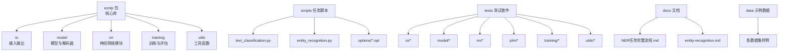
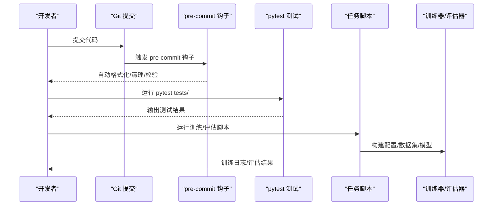
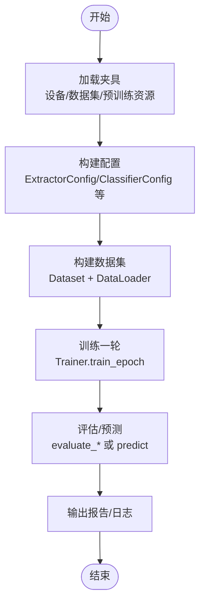
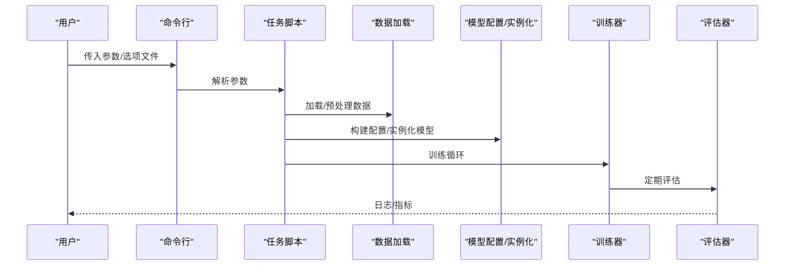
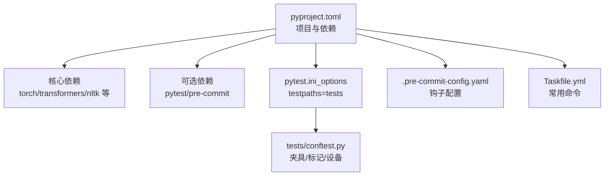

# 贡献指南

<cite>
**本文引用的文件**
- [README.md](file://README.md)
- [.pre-commit-config.yaml](file://.pre-commit-config.yaml)
- [pyproject.toml](file://pyproject.toml)
- [Taskfile.yml](file://Taskfile.yml)
- [tests/conftest.py](file://tests/conftest.py)
- [tests/test_dataset.py](file://tests/test_dataset.py)
- [tests/model/test_sequence_tagging.py](file://tests/model/test_sequence_tagging.py)
- [scripts/text_classification.py](file://scripts/text_classification.py)
- [scripts/entity_recognition.py](file://scripts/entity_recognition.py)
- [docs/NER任务完整流程.md](file://docs/NER任务完整流程.md)
- [docs/entity-recognition.md](file://docs/entity-recognition.md)
- [scripts/options/with_bert.opt](file://scripts/options/with_bert.opt)
</cite>

## 目录
1. [简介](#简介)
2. [项目结构](#项目结构)
3. [核心组件](#核心组件)
4. [架构总览](#架构总览)
5. [详细组件分析](#详细组件分析)
6. [依赖关系分析](#依赖关系分析)
7. [性能与测试建议](#性能与测试建议)
8. [故障排查指南](#故障排查指南)
9. [结论](#结论)
10. [附录](#附录)

## 简介
本贡献指南面向外部开发者，旨在帮助您高效参与本项目的开发与维护。内容涵盖：
- 代码风格与提交规范（通过 pre-commit 钩子强制执行）
- 测试策略与覆盖率建议（基于 tests/ 目录结构）
- Pull Request 提交流程与最佳实践
- 单元测试与集成测试的运行方法
- 新功能开发与 bug 修复的标准工作流
- 文档同步更新要求与示例
- 鼓励贡献新的数据处理器、模型组件或任务脚本

## 项目结构
本仓库采用按功能域分层的组织方式：
- eznlp 包：核心库，包含 IO、模型、神经网络模块、训练、工具等子模块
- scripts：任务脚本（如文本分类、实体识别、翻译等）
- tests：按领域划分的测试套件（io、model、nn、plm、training、utils）
- docs：用户与开发者文档
- data：示例数据与处理脚本
- third_party：第三方扩展
- 工具与配置：Taskfile.yml（常用命令）、.pre-commit-config.yaml（提交钩子）、pyproject.toml（项目与测试配置）

图表来源
- [README.md](file://README.md#L1-L116)
- [pyproject.toml](file://pyproject.toml#L1-L76)
- [Taskfile.yml](file://Taskfile.yml#L1-L81)

章节来源
- [README.md](file://README.md#L1-L116)
- [pyproject.toml](file://pyproject.toml#L1-L76)

## 核心组件
- 代码风格与提交规范
  - 使用 pre-commit 钩子统一格式化与静态检查，包括尾随空白、文件结尾、YAML 校验、大文件检测、自动清理无用导入、导入排序、黑盒格式化等。
  - 推荐在本地安装并启用 pre-commit，避免 CI 失败。
- 测试框架与配置
  - 使用 pytest，testpaths 指向 tests 目录；过滤部分警告以提升可读性。
  - 通过 conftest.py 注入设备选择、慢测试标记与数据集夹具，便于跨模块复用。
- 任务脚本与实验管理
  - scripts 下的任务脚本提供统一的参数解析、数据加载、模型配置、训练与评估流程。
  - Taskfile.yml 提供常用训练命令的快捷入口，便于批量实验与监控。

章节来源
- [.pre-commit-config.yaml](file://.pre-commit-config.yaml#L1-L24)
- [pyproject.toml](file://pyproject.toml#L52-L76)
- [tests/conftest.py](file://tests/conftest.py#L1-L356)
- [Taskfile.yml](file://Taskfile.yml#L1-L81)

## 架构总览
下图展示从“提交代码”到“运行测试/训练”的整体流程，以及关键文件之间的关系。

图表来源
- [.pre-commit-config.yaml](file://.pre-commit-config.yaml#L1-L24)
- [pyproject.toml](file://pyproject.toml#L52-L76)
- [tests/conftest.py](file://tests/conftest.py#L1-L356)
- [scripts/text_classification.py](file://scripts/text_classification.py#L1-L304)
- [scripts/entity_recognition.py](file://scripts/entity_recognition.py#L1-L928)

## 详细组件分析

### 组件一：代码风格与提交规范（pre-commit）
- 钩子清单
  - 清理尾随空白与文件结尾
  - YAML 校验与大文件检测
  - 自动删除未使用导入与变量
  - 导入排序（配合 black 风格）
  - 代码格式化（Black）
- 启用方式
  - 安装 dev 依赖后，初始化并启用 pre-commit，即可在每次提交前自动执行上述规则。
- 影响范围
  - 所有 Python 文件与配置文件均受此约束，减少 CI 失败概率，统一团队风格。

章节来源
- [.pre-commit-config.yaml](file://.pre-commit-config.yaml#L1-L24)
- [pyproject.toml](file://pyproject.toml#L36-L41)

### 组件二：测试体系与覆盖率建议
- 测试组织
  - tests 目录按领域拆分：io、model、nn、plm、training、utils，并在每个子包内按功能命名测试文件。
  - conftest.py 提供全局夹具（设备选择、慢测试标记、数据集夹具等），减少重复代码。
- 运行方式
  - 使用 pytest 运行 tests/ 目录，默认 testpaths 已配置。
  - 可通过命令行选项控制设备与慢测试开关，便于在 CPU/GPU 环境下调试。
- 覆盖率建议
  - 当前未设置覆盖率阈值，请在 PR 中明确说明覆盖率现状与改进计划。
  - 建议优先补齐关键路径（模型构建、数据加载、训练循环、评估流程）的单元测试。
- 关键测试示例
  - 数据集与 CUDA 设备一致性测试：验证批数据在 GPU 上的 pinned 与迁移行为。
  - 序列标注模型训练一致性测试：验证批次重叠时隐藏态与损失的一致性，以及可训练性。

图表来源
- [tests/test_dataset.py](file://tests/test_dataset.py#L1-L54)
- [tests/model/test_sequence_tagging.py](file://tests/model/test_sequence_tagging.py#L1-L213)
- [tests/conftest.py](file://tests/conftest.py#L1-L356)

章节来源
- [pyproject.toml](file://pyproject.toml#L52-L76)
- [tests/conftest.py](file://tests/conftest.py#L1-L356)
- [tests/test_dataset.py](file://tests/test_dataset.py#L1-L54)
- [tests/model/test_sequence_tagging.py](file://tests/model/test_sequence_tagging.py#L1-L213)

### 组件三：任务脚本与实验管理
- 文本分类脚本
  - 提供统一的参数解析、数据加载、配置构建、训练与评估流程，支持多种嵌入与预训练模型。
- 实体识别脚本
  - 支持多种解码器（序列标注、Span 分类、边界选择、特定 Span 分类），并提供中文/英文数据处理与预训练模型适配。
- Taskfile.yml
  - 提供常用训练命令的快捷入口，便于快速启动实验与监控 GPU/CPU 使用情况。
- 参数选项文件
  - 通过 .opt 文件集中管理常用参数，便于复现实验。

图表来源
- [scripts/text_classification.py](file://scripts/text_classification.py#L1-L304)
- [scripts/entity_recognition.py](file://scripts/entity_recognition.py#L1-L928)
- [Taskfile.yml](file://Taskfile.yml#L1-L81)
- [scripts/options/with_bert.opt](file://scripts/options/with_bert.opt#L1-L11)

章节来源
- [scripts/text_classification.py](file://scripts/text_classification.py#L1-L304)
- [scripts/entity_recognition.py](file://scripts/entity_recognition.py#L1-L928)
- [Taskfile.yml](file://Taskfile.yml#L1-L81)
- [scripts/options/with_bert.opt](file://scripts/options/with_bert.opt#L1-L11)

### 组件四：文档与示例
- 文档结构
  - docs 下包含任务流程与实验结果对比等文档，便于理解与复现实验。
- 示例流程
  - NER 任务完整流程文档展示了从数据准备、模型配置、训练到评估的端到端流程。
- 贡献建议
  - 新增功能或修改现有功能时，请同步更新相关文档，保持文档与代码一致。

章节来源
- [docs/NER任务完整流程.md](file://docs/NER任务完整流程.md#L1-L367)
- [docs/entity-recognition.md](file://docs/entity-recognition.md#L1-L229)

## 依赖关系分析
- 项目依赖与可选依赖
  - 项目依赖包括 PyTorch 生态、Transformers、Tokenizers、Scikit-learn 等。
  - 可选依赖包含 pytest、pre-commit 等开发工具。
- 测试依赖
  - pytest 配置指向 tests 目录；conftest.py 注入设备与数据集夹具，减少重复。
- 工具链
  - Taskfile.yml 提供常用命令；pre-commit 钩子保证代码质量。

图表来源
- [pyproject.toml](file://pyproject.toml#L1-L76)
- [tests/conftest.py](file://tests/conftest.py#L1-L356)
- [.pre-commit-config.yaml](file://.pre-commit-config.yaml#L1-L24)
- [Taskfile.yml](file://Taskfile.yml#L1-L81)

章节来源
- [pyproject.toml](file://pyproject.toml#L1-L76)
- [tests/conftest.py](file://tests/conftest.py#L1-L356)
- [.pre-commit-config.yaml](file://.pre-commit-config.yaml#L1-L24)
- [Taskfile.yml](file://Taskfile.yml#L1-L81)

## 性能与测试建议
- 测试性能与稳定性
  - 利用 conftest.py 的设备夹具在 CPU/GPU 环境下切换，避免不必要的 GPU 依赖。
  - 对于耗时测试，使用慢测试标记并在需要时通过命令行开启。
- 训练与评估
  - 任务脚本内置日志与缓存机制，便于追踪实验结果与复现实验。
  - 使用 Taskfile.yml 快速启动常见训练命令，结合 GPU 监控命令观察资源占用。

章节来源
- [tests/conftest.py](file://tests/conftest.py#L1-L356)
- [scripts/text_classification.py](file://scripts/text_classification.py#L1-L304)
- [scripts/entity_recognition.py](file://scripts/entity_recognition.py#L1-L928)
- [Taskfile.yml](file://Taskfile.yml#L1-L81)

## 故障排查指南
- 提交被拒绝（pre-commit）
  - 检查是否已安装并启用 pre-commit；查看钩子输出，逐条修复格式问题。
- 测试失败
  - 使用 --device 指定设备（auto/cpu/cuda:x），必要时添加 --runslow 运行慢测试。
  - 关注 conftest.py 中夹具下载与初始化（如 spaCy、预训练模型等）。
- 训练异常
  - 检查任务脚本参数与选项文件；确认数据路径与预处理逻辑。
  - 使用 Taskfile.yml 的 GPU 监控命令排查显存/温度等问题。

章节来源
- [.pre-commit-config.yaml](file://.pre-commit-config.yaml#L1-L24)
- [tests/conftest.py](file://tests/conftest.py#L1-L356)
- [scripts/text_classification.py](file://scripts/text_classification.py#L1-L304)
- [scripts/entity_recognition.py](file://scripts/entity_recognition.py#L1-L928)
- [Taskfile.yml](file://Taskfile.yml#L1-L81)

## 结论
本指南明确了代码风格、测试与提交流程、PR 规范、运行与调试方法，以及文档同步更新的要求。请在贡献新功能或修复 bug 时遵循上述流程，确保代码质量与可维护性。同时欢迎新增数据处理器、模型组件或任务脚本，共同完善本项目生态。

## 附录

### Pull Request 流程建议
- 分支策略
  - 基于 main 分支创建特性分支，命名清晰（如 feature/add-data-processor）。
- 提交信息
  - 使用简洁明了的标题与描述，说明动机、变更点与影响范围。
- 代码审查
  - 优先通过 pre-commit 与 pytest 本地自检；在 PR 描述中列出测试覆盖范围与运行环境。
- 文档更新
  - 新增功能需同步更新 docs/ 相关文档；修改现有功能需更新对应章节。

### 运行单元测试与集成测试
- 单元测试
  - 使用 pytest 运行 tests/ 目录；可通过 --device 与 --runslow 控制设备与慢测试。
- 集成测试
  - 通过任务脚本运行端到端流程（文本分类/实体识别），结合日志与缓存结果进行评估。

章节来源
- [pyproject.toml](file://pyproject.toml#L52-L76)
- [tests/conftest.py](file://tests/conftest.py#L1-L356)
- [scripts/text_classification.py](file://scripts/text_classification.py#L1-L304)
- [scripts/entity_recognition.py](file://scripts/entity_recognition.py#L1-L928)

### 新功能开发与 bug 修复工作流
- 新功能
  - 在 eznlp/ 对应子模块中新增实现；在 tests/ 对应领域补充单元测试；在 docs/ 更新相关文档。
- Bug 修复
  - 添加最小可复现测试；定位问题后修复并补充回归测试；更新相关文档与示例。

### 文档同步更新要点
- 与代码变更同步更新，确保示例与实现一致。
- 在 PR 中明确文档更新范围与链接。

章节来源
- [docs/NER任务完整流程.md](file://docs/NER任务完整流程.md#L1-L367)
- [docs/entity-recognition.md](file://docs/entity-recognition.md#L1-L229)