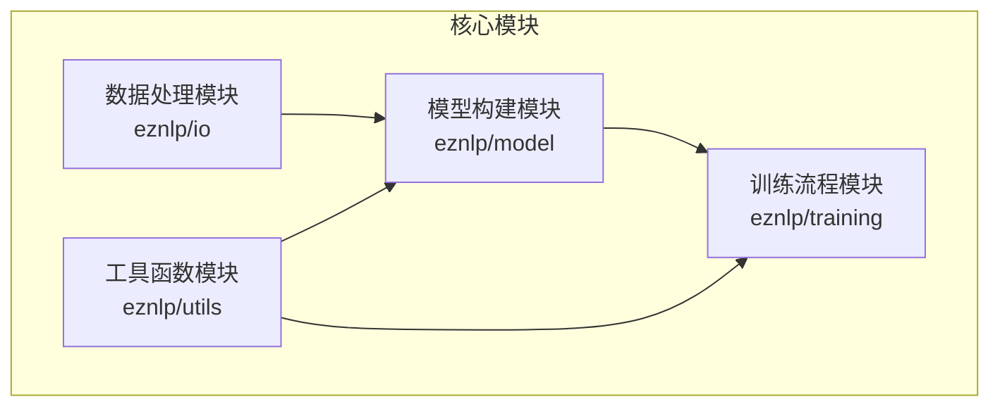
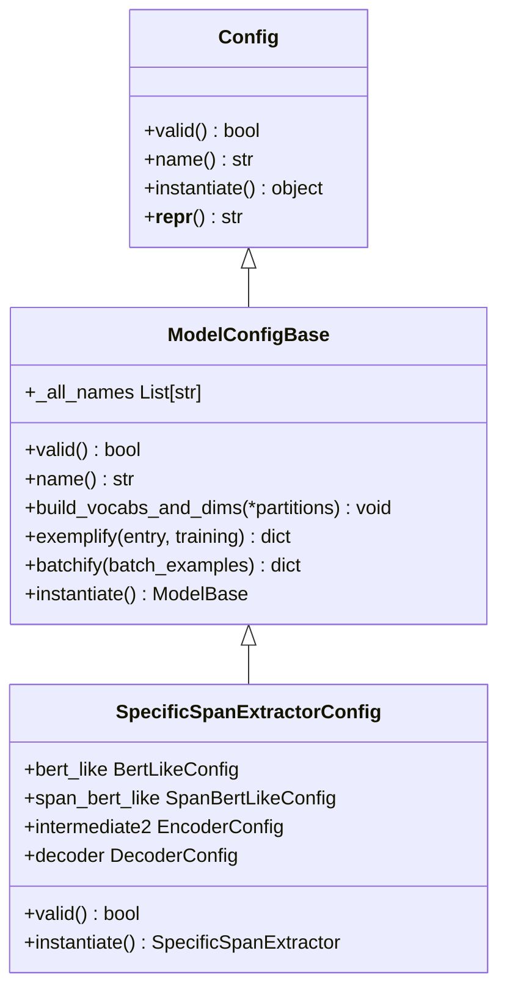
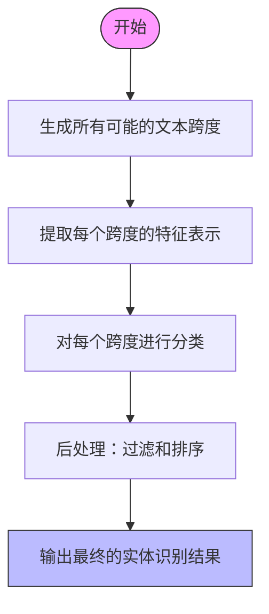
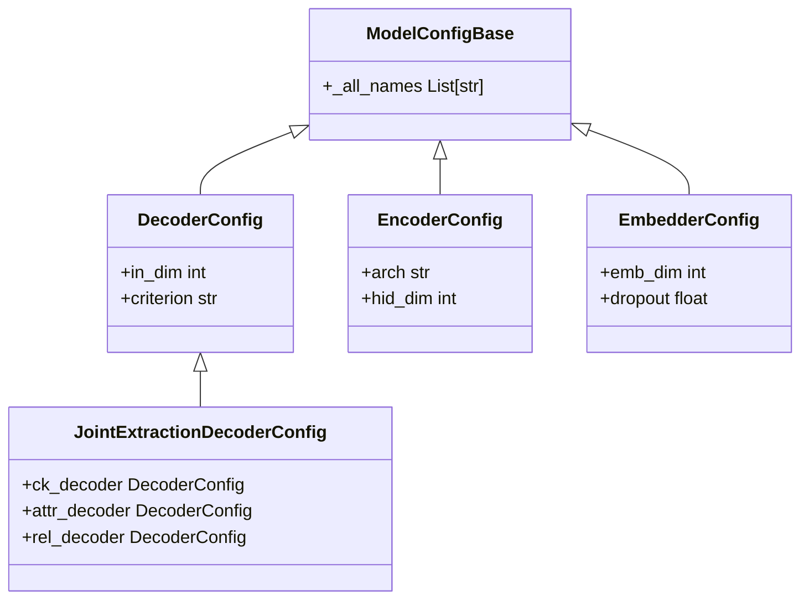

# 项目概述

<cite>
**本文档引用的文件**  
- [README.md](file://README.md)
- [readme_zh.md](file://readme_zh.md)
- [eznlp/\_\_init\_\_.py](file://eznlp/__init__.py)
- [eznlp/config.py](file://eznlp/config.py)
- [eznlp/dataset.py](file://eznlp/dataset.py)
- [eznlp/model/\_\_init\_\_.py](file://eznlp/model/__init__.py)
- [eznlp/training/\_\_init\_\_.py](file://eznlp/training/__init__.py)
- [eznlp/io/\_\_init\_\_.py](file://eznlp/io/__init__.py)
- [eznlp/utils/\_\_init\_\_.py](file://eznlp/utils/__init__.py)
- [eznlp/model/model/base.py](file://eznlp/model/model/base.py)
- [eznlp/model/decoder/joint_extraction.py](file://eznlp/model/decoder/joint_extraction.py)
- [eznlp/model/decoder/text_classification.py](file://eznlp/model/decoder/text_classification.py)
- [eznlp/model/span_bert_like.py](file://eznlp/model/span_bert_like.py)
- [eznlp/model/model/specific_span_extractor.py](file://eznlp/model/model/specific_span_extractor.py)
</cite>

## 目录
1. [项目简介](#项目简介)
2. [核心架构分层](#核心架构分层)
3. [配置驱动的设计模式](#配置驱动的设计模式)
4. [典型用户工作流](#典型用户工作流)
5. [核心技术范式](#核心技术范式)
6. [模块化组件关系](#模块化组件关系)
7. [训练与评估流程](#训练与评估流程)
8. [中文NER任务优化](#中文ner任务优化)

## 项目简介

eznlp是一个基于PyTorch的神经网络自然语言处理工具包，旨在为文本分类、命名实体识别（NER）、关系抽取等NLP任务提供一个灵活的实验平台。该项目的设计理念源于过参数化神经网络的"惰性"特性，通过设计更易优化的架构和目标函数来提升模型性能。

项目特别强调对中文NER任务的优化支持，包含多项已发表的前沿研究成果，如《命名实体识别中的深度跨度表示》（ACL 2023）和《命名实体识别中的边界平滑技术》（ACL 2022）。这些研究成果不仅体现在论文中，也直接集成到了工具包的核心功能中。

**Section sources**
- [README.md](file://README.md#L1-L116)
- [readme_zh.md](file://readme_zh.md#L1-L75)

## 核心架构分层

eznlp项目采用清晰的分层架构设计，主要分为四个核心模块：数据处理（eznlp/io）、模型构建（eznlp/model）、训练流程（eznlp/training）和工具函数（eznlp/utils）。这种分层结构使得各个功能模块职责分明，便于扩展和维护。

**Diagram sources**
- [eznlp/\_\_init\_\_.py](file://eznlp/__init__.py#L2-L6)
- [eznlp/io/\_\_init\_\_.py](file://eznlp/io/__init__.py#L2-L25)
- [eznlp/model/\_\_init\_\_.py](file://eznlp/model/__init__.py#L2-L30)
- [eznlp/training/\_\_init\_\_.py](file://eznlp/training/__init__.py#L2-L36)
- [eznlp/utils/\_\_init\_\_.py](file://eznlp/utils/__init__.py#L2-L11)

**Section sources**
- [eznlp/\_\_init\_\_.py](file://eznlp/__init__.py#L2-L6)

## 配置驱动的设计模式

eznlp采用配置驱动的设计模式，通过ExtractorConfig等配置类实现模块化组件的组装。核心配置基类Config定义了配置存储、验证和实例化的基本方法，而ModelConfigBase则作为模型配置的基类，管理模型各组件的配置。

这种设计模式允许用户通过简单的配置组合来构建复杂的模型架构，而无需修改底层代码。配置类不仅存储参数，还负责构建词汇表、维度信息，并将数据条目转换为模型可处理的示例。

**Diagram sources**
- [eznlp/config.py](file://eznlp/config.py#L20-L172)
- [eznlp/model/model/base.py](file://eznlp/model/model/base.py#L10-L62)
- [eznlp/model/model/specific_span_extractor.py](file://eznlp/model/model/specific_span_extractor.py#L20-L111)

**Section sources**
- [eznlp/config.py](file://eznlp/config.py#L20-L172)
- [eznlp/model/model/base.py](file://eznlp/model/model/base.py#L10-L62)

## 典型用户工作流

基于readme_zh.md中的示例，典型的用户工作流从数据准备开始，经过模型配置、训练到最终的评估。用户首先通过IO模块加载和处理数据，然后使用配置类定义模型架构，最后通过训练模块执行训练和评估过程。

对于文本分类任务，用户可以使用scripts/text_classification.py脚本，通过指定数据集和选项来启动训练。类似地，实体识别和关系抽取任务也有对应的脚本文件，体现了项目一致的使用接口设计。

**Section sources**
- [readme_zh.md](file://readme_zh.md#L48-L66)
- [README.md](file://README.md#L48-L66)

## 核心技术范式

eznlp选择Span分类而非传统的序列标注作为主要范式，这一技术决策基于对NER任务本质的深入理解。Span分类将NER任务视为对文本中所有可能跨度的分类问题，而不是对每个token的标签预测问题。

这种范式转变带来了多个优势：首先，它能够更好地处理嵌套实体；其次，它避免了BIO标签方案中的标签不一致性问题；最后，它为实体边界预测提供了更直接的优化目标。项目中的SpecificSpanExtractorConfig和SpanBertLikeConfig等类体现了这一核心技术范式。

**Diagram sources**
- [eznlp/model/model/specific_span_extractor.py](file://eznlp/model/model/specific_span_extractor.py#L20-L111)
- [eznlp/model/span_bert_like.py](file://eznlp/model/span_bert_like.py#L13-L54)

**Section sources**
- [eznlp/model/model/specific_span_extractor.py](file://eznlp/model/model/specific_span_extractor.py#L20-L111)
- [eznlp/model/span_bert_like.py](file://eznlp/model/span_bert_like.py#L13-L54)

## 模块化组件关系

eznlp的模块化设计体现在各个组件之间的清晰关系上。模型构建模块依赖于数据处理模块提供的数据格式，而训练流程模块则依赖于模型构建模块提供的模型实例。工具函数模块为其他所有模块提供通用的辅助功能。

在模型内部，组件关系更加精细：DecoderConfig负责定义解码器的配置，EncoderConfig管理编码器的配置，而Embedder则处理词嵌入相关的配置。这种层次化的组件关系使得模型的每个部分都可以独立配置和替换。

**Diagram sources**
- [eznlp/model/model/base.py](file://eznlp/model/model/base.py#L10-L62)
- [eznlp/model/decoder/joint_extraction.py](file://eznlp/model/decoder/joint_extraction.py#L68-L151)
- [eznlp/model/decoder/text_classification.py](file://eznlp/model/decoder/text_classification.py#L48-L76)

**Section sources**
- [eznlp/model/model/base.py](file://eznlp/model/model/base.py#L10-L62)
- [eznlp/model/decoder/joint_extraction.py](file://eznlp/model/decoder/joint_extraction.py#L68-L151)

## 训练与评估流程

训练与评估流程由eznlp/training模块管理，该模块提供了Trainer类作为主要的训练控制器，以及各种评估函数用于不同任务的性能评估。MaskedLMTrainer专门用于预训练任务，而标准的Trainer则用于下游任务的微调。

训练流程遵循典型的PyTorch模式：数据加载、前向传播、损失计算、反向传播和参数更新。评估流程则包括模型预测、结果解码和性能指标计算。OptionSampler类提供了超参数采样的功能，方便进行实验探索。

**Section sources**
- [eznlp/training/\_\_init\_\_.py](file://eznlp/training/__init__.py#L2-L36)
- [eznlp/training/plm_trainer.py](file://eznlp/training/plm_trainer.py)
- [eznlp/training/trainer.py](file://eznlp/training/trainer.py)

## 中文NER任务优化

针对中文NER任务的特殊性，eznlp进行了多项优化。中文文本没有明显的词边界，这使得实体识别更加具有挑战性。项目通过Span分类范式和边界平滑技术来应对这一挑战。

具体来说，SpanBertLikeConfig类中的min_span_size和max_span_size参数允许用户根据中文文本的特点调整跨度大小的范围。init_agg_mode参数则控制如何初始化跨度表示，这对于处理中文字符序列尤为重要。

此外，项目包含的HwaMei-500数据集和相关的标注规范为中文临床文本的医学信息抽取提供了专门的支持，体现了项目在特定领域的深度优化。

**Section sources**
- [eznlp/model/span_bert_like.py](file://eznlp/model/span_bert_like.py#L26-L37)
- [publications/framework/HwaMei-500.md](file://publications/framework/HwaMei-500.md)
- [publications/framework/scheme.pdf](file://publications/framework/scheme.pdf)