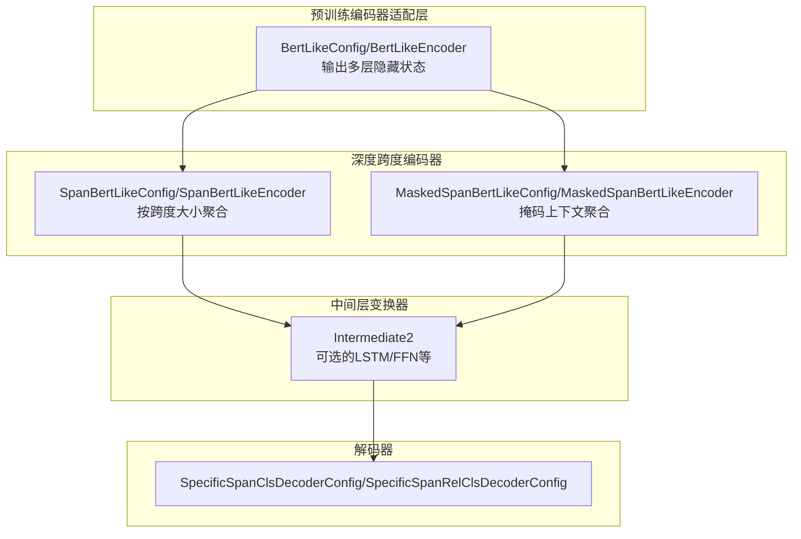
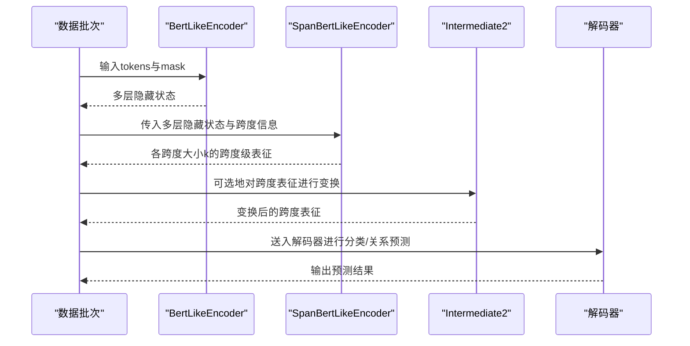
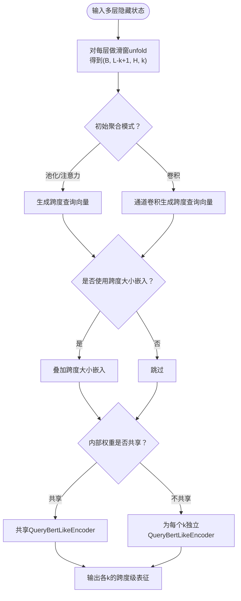
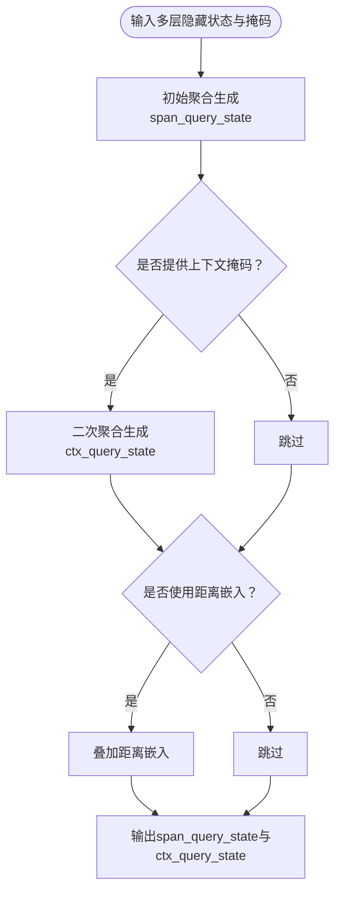
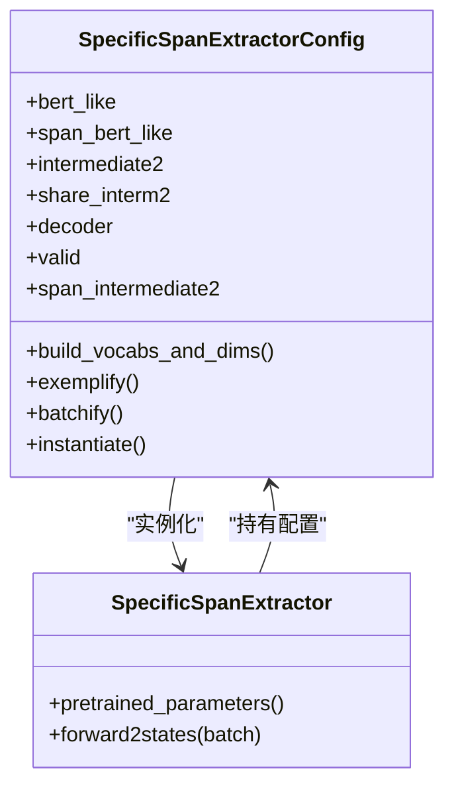
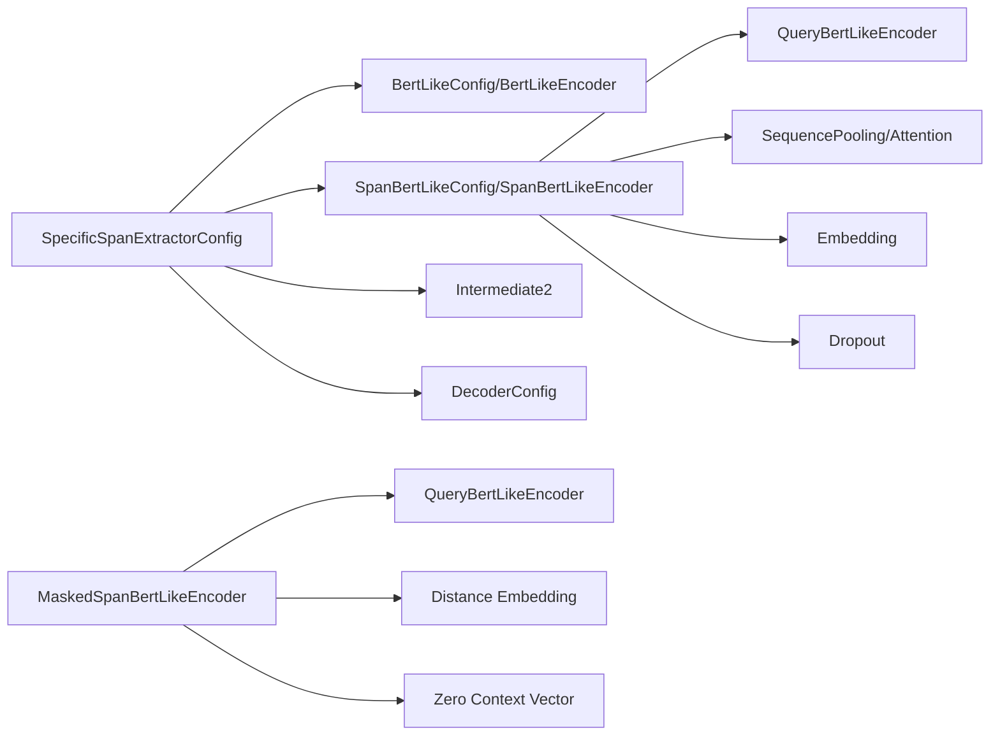

# Deep-Span架构

<cite>
**本文引用的文件列表**
- [docs/deep-span.md](file://docs/deep-span.md)
- [eznlp/model/model/specific_span_extractor.py](file://eznlp/model/model/specific_span_extractor.py)
- [eznlp/model/span_bert_like.py](file://eznlp/model/span_bert_like.py)
- [eznlp/model/masked_span_bert_like.py](file://eznlp/model/masked_span_bert_like.py)
- [eznlp/model/model/masked_span_extractor.py](file://eznlp/model/model/masked_span_extractor.py)
- [eznlp/config.py](file://eznlp/config.py)
- [eznlp/nn/modules/__init__.py](file://eznlp/nn/modules/__init__.py)
- [eznlp/nn/modules/query_bert_like.py](file://eznlp/nn/modules/query_bert_like.py)
- [eznlp/nn/modules/sequence_pooling.py](file://eznlp/nn/modules/sequence_pooling.py)
- [eznlp/nn/modules/sequence_attention.py](file://eznlp/nn/modules/sequence_attention.py)
- [eznlp/nn/modules/aggregation.py](file://eznlp/nn/modules/aggregation.py)
- [eznlp/nn/modules/dropout.py](file://eznlp/nn/modules/dropout.py)
- [eznlp/nn/modules/embedding.py](file://eznlp/nn/modules/embedding.py)
- [eznlp/nn/modules/loss.py](file://eznlp/nn/modules/loss.py)
- [eznlp/training/utils.py](file://eznlp/training/utils.py)
- [scripts/entity_recognition.py](file://scripts/entity_recognition.py)
- [tests/model/test_span_bert_like.py](file://tests/model/test_span_bert_like.py)
- [tests/model/test_specific_span_rel_classification.py](file://tests/model/test_specific_span_rel_classification.py)
- [tests/model/test_masked_span_bert_like.py](file://tests/model/test_masked_span_bert_like.py)
</cite>

## 目录
1. [引言](#引言)
2. [项目结构](#项目结构)
3. [核心组件](#核心组件)
4. [架构总览](#架构总览)
5. [详细组件分析](#详细组件分析)
6. [依赖关系分析](#依赖关系分析)
7. [性能考量与计算开销](#性能考量与计算开销)
8. [故障排查指南](#故障排查指南)
9. [结论](#结论)
10. [附录](#附录)

## 引言
本文件系统化解析Deep-Span架构的设计理念与实现机制，重点阐释其如何通过“深度跨度表示”增强对长实体与复杂嵌套结构的建模能力；并结合训练命令文档，给出在ACE、GENIA等数据集上的应用方式。同时，围绕关键配置参数sse_max_span_size、sse_no_share_weights_ext等进行深入解读，剖析specific_span_extractor.py中SpanBertLikeConfig与Intermediate2组件的协同工作机制，梳理深度跨度特征的提取流程，并评估该架构的性能优势与计算开销。

## 项目结构
Deep-Span位于命名实体识别子模块中，核心由三部分构成：
- 预训练编码器适配层：负责从预训练语言模型输出多层隐藏状态
- 深度跨度编码器（Span-BERT-like）：对不同长度跨度进行深度聚合，生成跨度级表征
- 中间层变换器（Intermediate2）：可选地对跨度表征进一步非线性变换，提升表达能力

图表来源
- [eznlp/model/span_bert_like.py](file://eznlp/model/span_bert_like.py#L13-L55)
- [eznlp/model/masked_span_bert_like.py](file://eznlp/model/masked_span_bert_like.py#L13-L55)
- [eznlp/model/model/specific_span_extractor.py](file://eznlp/model/model/specific_span_extractor.py#L20-L55)

章节来源
- [eznlp/model/span_bert_like.py](file://eznlp/model/span_bert_like.py#L13-L55)
- [eznlp/model/masked_span_bert_like.py](file://eznlp/model/masked_span_bert_like.py#L13-L55)
- [eznlp/model/model/specific_span_extractor.py](file://eznlp/model/model/specific_span_extractor.py#L20-L55)

## 核心组件
- SpanBertLikeConfig/Encoder：对每个跨度大小k生成跨度级表征，支持共享/不共享内部权重、初始聚合模式（池化/注意力/卷积）、是否使用跨度大小嵌入等
- MaskedSpanBertLikeConfig/Encoder：在Span基础上引入掩码上下文聚合，支持跨度大小与距离嵌入
- SpecificSpanExtractorConfig/Model：装配预训练编码器、Span编码器、可选Intermediate2与解码器，构建端到端的特定跨度分类/关系分类模型
- 训练脚本参数：提供针对Deep-Span的关键开关与超参，如sse_no_share_weights_ext、sse_no_share_interm2、sse_max_span_size等

章节来源
- [eznlp/model/span_bert_like.py](file://eznlp/model/span_bert_like.py#L13-L55)
- [eznlp/model/masked_span_bert_like.py](file://eznlp/model/masked_span_bert_like.py#L13-L55)
- [eznlp/model/model/specific_span_extractor.py](file://eznlp/model/model/specific_span_extractor.py#L20-L55)
- [scripts/entity_recognition.py](file://scripts/entity_recognition.py#L246-L310)

## 架构总览
Deep-Span通过“预训练编码器输出多层隐藏状态 → 深度跨度编码器按跨度大小聚合 → 可选Intermediate2变换 → 解码器”的流水线，实现对长实体与复杂嵌套结构的建模。其关键优势在于：
- 跨度级深度聚合：对每个跨度大小k独立或共享地进行深层编码，捕捉跨度内的复杂语义
- 多层隐藏状态复用：利用预训练模型多层表示，增强对长距离依赖与层次化语义的理解
- 可插拔中间层：Intermediate2可提升跨度表征的判别力，尤其在复杂嵌套场景

图表来源
- [eznlp/model/model/specific_span_extractor.py](file://eznlp/model/model/specific_span_extractor.py#L114-L157)
- [eznlp/model/span_bert_like.py](file://eznlp/model/span_bert_like.py#L132-L181)
- [eznlp/model/masked_span_bert_like.py](file://eznlp/model/masked_span_bert_like.py#L185-L236)

## 详细组件分析

### SpanBertLikeConfig与SpanBertLikeEncoder
- 设计要点
  - 初始聚合：支持最大池化、平均池化、注意力、通道卷积等多种模式，以不同方式生成跨度查询向量
  - 权重共享策略：可选择外部权重共享（与预训练编码器共享）与内部权重共享（不同跨度大小共享同一编码器）
  - 跨度大小嵌入：可选地为不同跨度大小注入嵌入，辅助模型区分跨度长度
  - 层堆叠：可指定使用预训练编码器的若干层，控制深度与计算成本
- 关键流程
  - 对每层隐藏状态执行滑窗unfold，得到形状为(B, L-k+1, H, k)的张量
  - 依据初始聚合模式生成跨度查询向量
  - 将查询向量与对应窗口状态喂入共享或独立的QueryBertLikeEncoder，得到跨度级最后隐藏状态

图表来源
- [eznlp/model/span_bert_like.py](file://eznlp/model/span_bert_like.py#L57-L181)
- [eznlp/nn/modules/query_bert_like.py](file://eznlp/nn/modules/query_bert_like.py)
- [eznlp/nn/modules/sequence_pooling.py](file://eznlp/nn/modules/sequence_pooling.py)
- [eznlp/nn/modules/sequence_attention.py](file://eznlp/nn/modules/sequence_attention.py)
- [eznlp/nn/modules/aggregation.py](file://eznlp/nn/modules/aggregation.py)

章节来源
- [eznlp/model/span_bert_like.py](file://eznlp/model/span_bert_like.py#L13-L55)
- [eznlp/model/span_bert_like.py](file://eznlp/model/span_bert_like.py#L57-L181)

### MaskedSpanBertLikeConfig与Encoder
- 设计要点
  - 掩码上下文聚合：在Span查询生成后，可基于掩码对上下文进行二次聚合，增强对上下文信息的利用
  - 距离嵌入：可选地为跨度对之间的距离注入嵌入，辅助关系抽取等任务
  - 零上下文向量：当全零掩码出现时，返回一个可学习的零上下文向量，避免NaN梯度
- 关键流程
  - 先对跨度进行初始聚合，得到span_query_state
  - 若提供上下文掩码，则对上下文进行二次聚合，得到ctx_query_state
  - 返回两类查询状态供后续使用

图表来源
- [eznlp/model/masked_span_bert_like.py](file://eznlp/model/masked_span_bert_like.py#L185-L236)
- [eznlp/nn/modules/embedding.py](file://eznlp/nn/modules/embedding.py)

章节来源
- [eznlp/model/masked_span_bert_like.py](file://eznlp/model/masked_span_bert_like.py#L13-L55)
- [eznlp/model/masked_span_bert_like.py](file://eznlp/model/masked_span_bert_like.py#L185-L236)

### SpecificSpanExtractorConfig与SpecificSpanExtractor
- 设计要点
  - 组合装配：将bert_like、span_bert_like、intermediate2与decoder组合为端到端模型
  - 权重共享控制：通过share_interm2控制是否在跨度编码器与预训练编码器之间共享Intermediate2
  - 有效性校验：要求bert_like输出多层隐藏状态且span_bert_like有效
- 关键流程
  - 前向：先获取预训练编码器的多层隐藏状态，再调用span_bert_like生成各跨度大小的跨度级表征
  - 可选Intermediate2：对跨度表征按跨度大小k分别进行变换，或共享同一变换模块
  - 返回：包含完整序列隐藏状态与所有跨度级表征的状态字典

图表来源
- [eznlp/model/model/specific_span_extractor.py](file://eznlp/model/model/specific_span_extractor.py#L20-L112)
- [eznlp/model/model/specific_span_extractor.py](file://eznlp/model/model/specific_span_extractor.py#L114-L157)

章节来源
- [eznlp/model/model/specific_span_extractor.py](file://eznlp/model/model/specific_span_extractor.py#L20-L112)
- [eznlp/model/model/specific_span_extractor.py](file://eznlp/model/model/specific_span_extractor.py#L114-L157)

### 关键配置参数与使用场景
- sse_max_span_size
  - 作用：限制最大跨度大小，控制跨度数量与计算开销
  - 使用场景：长文本或需要更强长程建模时增大该值；短文本或资源受限时减小该值
  - 训练脚本映射：在训练命令中作为--sse_max_span_size传入
- sse_no_share_weights_ext
  - 作用：关闭与预训练编码器的外部权重共享，使span_bert_like拥有独立参数
  - 使用场景：希望span_bert_like独立学习跨度专用表示，或与预训练权重冲突时启用
  - 训练脚本映射：通过--sse_no_share_weights_ext（等价于sse_share_weights_ext=False）开启
- sse_no_share_interm2
  - 作用：关闭Intermediate2在跨度编码器与预训练编码器之间的共享
  - 使用场景：需要为不同跨度大小或不同阶段学习不同的中间变换时启用
  - 训练脚本映射：通过--sse_no_share_interm2（等价于sse_share_interm2=False）开启
- sse_min_span_size/sse_init_agg_mode/sse_init_drop_rate/sse_num_layers/sse_use_init_size_emb
  - 作用：控制最小跨度、初始聚合模式、初始化dropout率、层数、是否使用跨度大小嵌入等
  - 使用场景：根据数据规模与任务复杂度调整，平衡表达能力与效率

章节来源
- [scripts/entity_recognition.py](file://scripts/entity_recognition.py#L246-L310)
- [docs/deep-span.md](file://docs/deep-span.md#L41-L67)

### 在ACE、GENIA等数据集上的应用
- 英文数据集（ACE 2004/2005、GENIA、KBP 2017、CoNLL 2003/2012、OntoNotes 5）
  - 训练命令示例：见docs/deep-span.md中的英文训练命令块
  - 关键参数：--dataset、--doc_level、--pre_subtokenize、--ck_decoder specific_span、--sse_no_share_weights_ext、--sse_no_share_interm2、--sse_max_span_size、--bert_arch、--use_interm2、--hid_dim等
- 中文数据集（Weibo NER、Resume NER）
  - 训练命令示例：见docs/deep-span.md中的中文训练命令块
  - 关键参数：--dataset、--pre_merge_enchars、--ck_decoder specific_span、--sse_no_share_weights_ext、--sse_no_share_interm2、--sse_max_span_size、--bert_arch、--use_interm2、--hid_dim等

章节来源
- [docs/deep-span.md](file://docs/deep-span.md#L41-L67)
- [docs/deep-span.md](file://docs/deep-span.md#L66-L87)

## 依赖关系分析
- 组件耦合
  - SpecificSpanExtractorConfig依赖bert_like、span_bert_like、intermediate2与decoder
  - SpanBertLikeEncoder依赖QueryBertLikeEncoder、SequencePooling/Attention、Embedding等模块
  - MaskedSpanBertLikeEncoder在Span基础上增加掩码上下文聚合与距离嵌入
- 外部依赖
  - transformers预训练模型（BERT/RoBERTa/Chinese-BERT等）
  - PyTorch模块（Dropout、Embedding、Conv1d等）

图表来源
- [eznlp/model/model/specific_span_extractor.py](file://eznlp/model/model/specific_span_extractor.py#L20-L112)
- [eznlp/model/span_bert_like.py](file://eznlp/model/span_bert_like.py#L57-L181)
- [eznlp/model/masked_span_bert_like.py](file://eznlp/model/masked_span_bert_like.py#L185-L236)
- [eznlp/nn/modules/query_bert_like.py](file://eznlp/nn/modules/query_bert_like.py)
- [eznlp/nn/modules/sequence_pooling.py](file://eznlp/nn/modules/sequence_pooling.py)
- [eznlp/nn/modules/sequence_attention.py](file://eznlp/nn/modules/sequence_attention.py)
- [eznlp/nn/modules/embedding.py](file://eznlp/nn/modules/embedding.py)
- [eznlp/nn/modules/dropout.py](file://eznlp/nn/modules/dropout.py)

## 性能考量与计算开销
- 计算复杂度
  - 跨度数量：随最大跨度大小呈二次增长，影响整体前向与反向开销
  - 层堆叠：增加span_bert_like的层数会线性增加计算量
  - 内部权重共享：共享编码器可显著减少参数与计算，但可能降低对不同跨度大小的特化能力
- 内存占用
  - 多层隐藏状态缓存与跨度级表征存储是主要内存消耗项
  - Intermediate2的存在会增加额外的中间张量存储
- 实践建议
  - 在长文本或复杂嵌套场景下适度增大sse_max_span_size与层数，但需监控显存
  - 在资源受限或快速推理场景下，优先考虑共享权重与较小的最大跨度
  - 使用掩码上下文聚合（MaskedSpan）时，注意上下文掩码构造的成本

章节来源
- [eznlp/model/span_bert_like.py](file://eznlp/model/span_bert_like.py#L132-L181)
- [eznlp/model/masked_span_bert_like.py](file://eznlp/model/masked_span_bert_like.py#L185-L236)
- [tests/model/test_span_bert_like.py](file://tests/model/test_span_bert_like.py#L50-L86)

## 故障排查指南
- 常见问题与定位
  - 配置无效：确保bert_like输出多层隐藏状态，且span_bert_like有效
  - 权重共享冲突：当禁用外部权重共享时，确认span_bert_like.query_bert_like参数被正确纳入优化器
  - 掩码异常：检查全零掩码分支，确保返回零上下文向量，避免NaN
  - 跨度数量过多：适当降低sse_max_span_size或减少层数
- 单元测试参考
  - 跨度表示一致性与可训练性验证
  - 掩码跨度表示与朴素跨度表示一致性验证

章节来源
- [eznlp/model/model/specific_span_extractor.py](file://eznlp/model/model/specific_span_extractor.py#L114-L157)
- [eznlp/model/masked_span_bert_like.py](file://eznlp/model/masked_span_bert_like.py#L185-L236)
- [tests/model/test_span_bert_like.py](file://tests/model/test_span_bert_like.py#L1-L86)
- [tests/model/test_specific_span_rel_classification.py](file://tests/model/test_specific_span_rel_classification.py#L1-L170)
- [tests/model/test_masked_span_bert_like.py](file://tests/model/test_masked_span_bert_like.py#L71-L103)

## 结论
Deep-Span通过“多层隐藏状态 + 深度跨度聚合 + 可选中间变换”的设计，在保持预训练语言模型强大语义能力的同时，增强了对长实体与复杂嵌套结构的建模。关键配置参数（如sse_max_span_size、sse_no_share_weights_ext、sse_no_share_interm2）提供了灵活的权衡空间，既能在资源受限场景下高效运行，也能在复杂任务中提升性能。配合训练脚本与数据集命令，Deep-Span可在ACE、GENIA等广泛数据集上取得良好效果。

## 附录
- 训练命令与参数映射
  - 英文数据集命令：见docs/deep-span.md英文段落
  - 中文数据集命令：见docs/deep-span.md中文段落
  - 关键参数映射：见scripts/entity_recognition.py中--sse_*相关参数定义

章节来源
- [docs/deep-span.md](file://docs/deep-span.md#L41-L67)
- [docs/deep-span.md](file://docs/deep-span.md#L66-L87)
- [scripts/entity_recognition.py](file://scripts/entity_recognition.py#L246-L310)