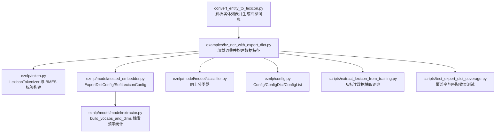
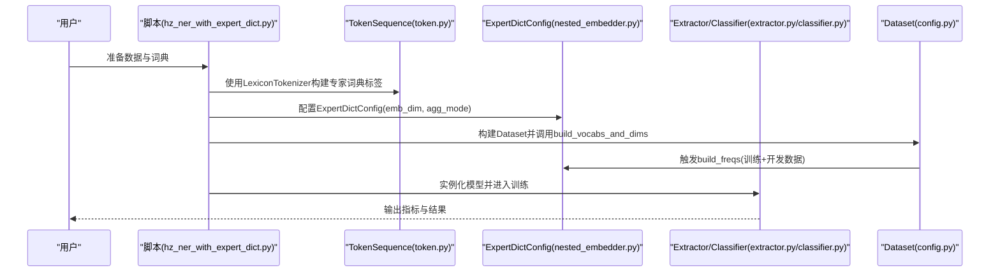
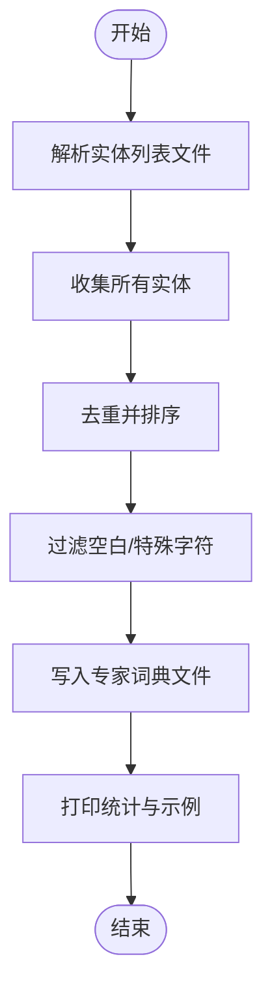
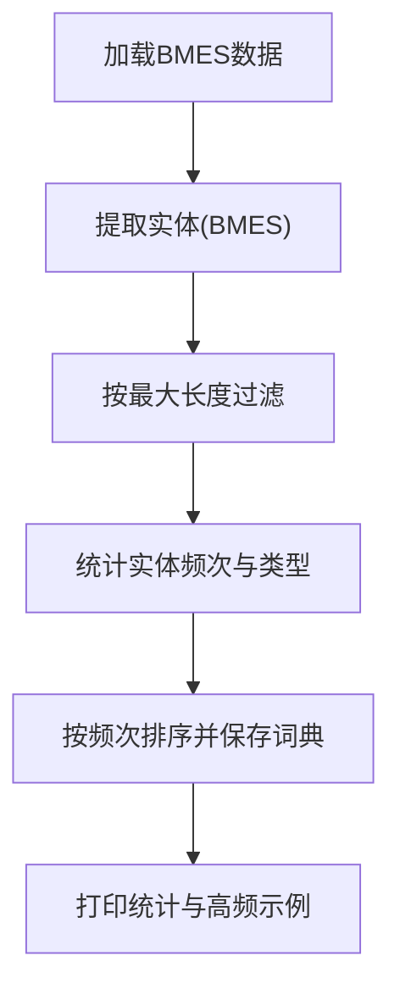
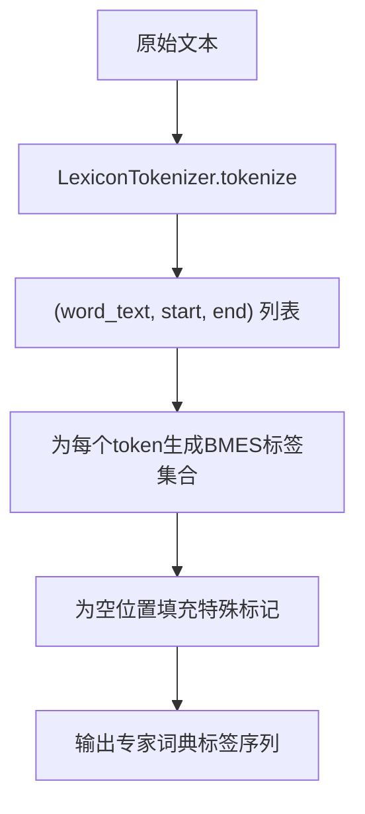
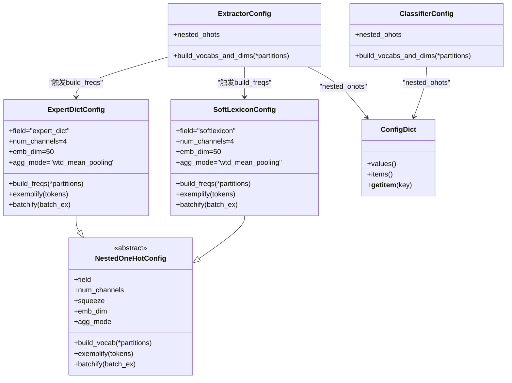
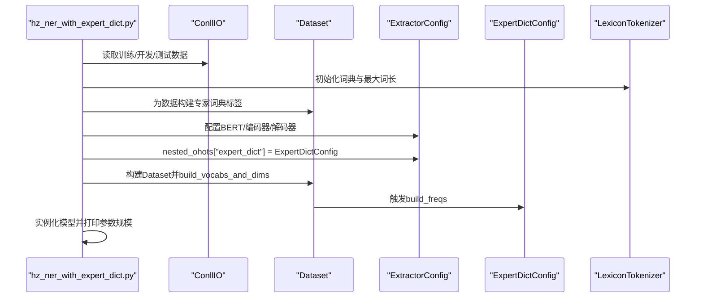
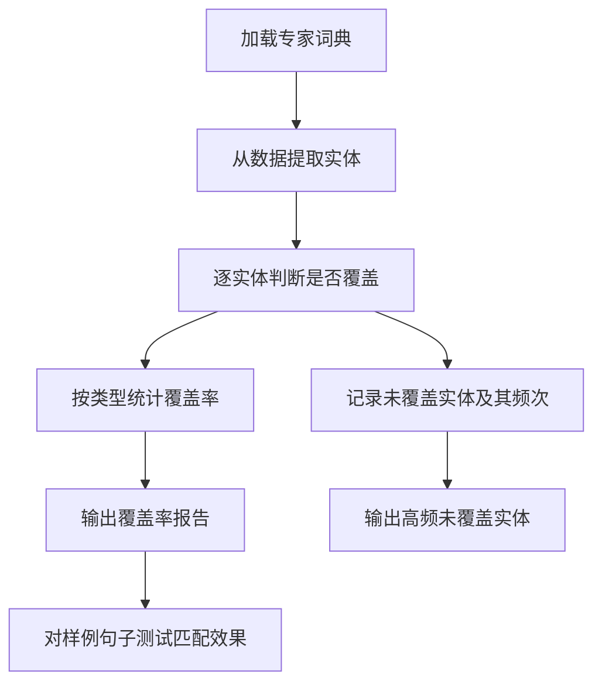
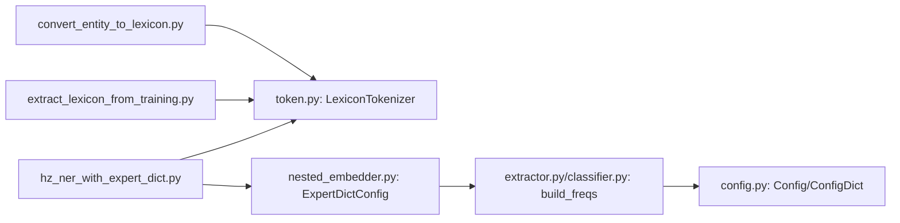

# 专家词典集成

<cite>
**本文引用的文件**
- [convert_entity_to_lexicon.py](file://scripts/convert_entity_to_lexicon.py)
- [hz_ner_with_expert_dict.py](file://examples/hz_ner_with_expert_dict.py)
- [nested_embedder.py](file://eznlp/model/nested_embedder.py)
- [extract_lexicon_from_training.py](file://scripts/extract_lexicon_from_training.py)
- [test_expert_dict_coverage.py](file://scripts/test_expert_dict_coverage.py)
- [token.py](file://eznlp/token.py)
- [extractor.py](file://eznlp/model/model/extractor.py)
- [classifier.py](file://eznlp/model/model/classifier.py)
- [config.py](file://eznlp/config.py)
</cite>

## 目录
1. [简介](#简介)
2. [项目结构与入口](#项目结构与入口)
3. [核心组件](#核心组件)
4. [架构总览](#架构总览)
5. [详细组件分析](#详细组件分析)
6. [依赖关系分析](#依赖关系分析)
7. [性能与可扩展性](#性能与可扩展性)
8. [故障排查指南](#故障排查指南)
9. [结论](#结论)
10. [附录：最佳实践与建议](#附录最佳实践与建议)

## 简介
本文件系统性阐述专家词典在中文命名实体识别（NER）中的集成流程与实现细节，覆盖从原始实体列表到模型内嵌词典的完整链路。重点包括：
- 将实体列表解析、去重与排序，并输出专家词典文件；
- 在数据预处理阶段构建专家词典匹配标签（BMES边界）；
- 在模型配置中启用专家词典嵌入（ExpertDictConfig），并与BERT等主干结合；
- 通过频率统计与加权池化实现软词典式的外部特征增强；
- 提供词典质量评估与覆盖率测试的实践方法。

## 项目结构与入口
- 实体列表转专家词典：scripts/convert_entity_to_lexicon.py
- 示例训练脚本（启用专家词典特征）：examples/hz_ner_with_expert_dict.py
- 词典嵌入配置与频率统计：eznlp/model/nested_embedder.py
- 从训练数据抽取专家词典：scripts/extract_lexicon_from_training.py
- 词典覆盖率与匹配效果测试：scripts/test_expert_dict_coverage.py
- 数据预处理与词典匹配工具：eznlp/token.py
- 模型配置与词表/维度构建：eznlp/model/model/extractor.py、eznlp/model/model/classifier.py、eznlp/config.py

图表来源
- [convert_entity_to_lexicon.py](file://scripts/convert_entity_to_lexicon.py#L1-L79)
- [hz_ner_with_expert_dict.py](file://examples/hz_ner_with_expert_dict.py#L1-L179)
- [nested_embedder.py](file://eznlp/model/nested_embedder.py#L150-L309)
- [extractor.py](file://eznlp/model/model/extractor.py#L107-L146)
- [classifier.py](file://eznlp/model/model/classifier.py#L80-L118)
- [config.py](file://eznlp/config.py#L121-L172)
- [extract_lexicon_from_training.py](file://scripts/extract_lexicon_from_training.py#L108-L249)
- [test_expert_dict_coverage.py](file://scripts/test_expert_dict_coverage.py#L1-L286)
- [token.py](file://eznlp/token.py#L630-L700)

章节来源
- [convert_entity_to_lexicon.py](file://scripts/convert_entity_to_lexicon.py#L1-L79)
- [hz_ner_with_expert_dict.py](file://examples/hz_ner_with_expert_dict.py#L1-L179)

## 核心组件
- 专家词典解析与输出：将形如类别定义的实体列表解析为去重排序后的词典文件。
- 数据预处理与特征构建：利用LexiconTokenizer进行最大正向匹配，为每个token生成专家词典匹配标签（BMES）。
- 模型配置与嵌入：ExpertDictConfig/SoftLexiconConfig负责词典嵌入与频率权重，Extractor/Classifier在构建词表时触发build_freqs。
- 词典质量评估：覆盖率统计、未覆盖实体频次分布、匹配效果可视化。

章节来源
- [convert_entity_to_lexicon.py](file://scripts/convert_entity_to_lexicon.py#L13-L75)
- [hz_ner_with_expert_dict.py](file://examples/hz_ner_with_expert_dict.py#L21-L84)
- [nested_embedder.py](file://eznlp/model/nested_embedder.py#L240-L309)
- [extractor.py](file://eznlp/model/model/extractor.py#L122-L146)
- [classifier.py](file://eznlp/model/model/classifier.py#L92-L118)
- [token.py](file://eznlp/token.py#L630-L700)

## 架构总览
专家词典集成的关键路径如下：
- 输入：原始实体列表（类别定义形式）或标注数据（BMES）。
- 处理：解析/抽取得到专家词典；用LexiconTokenizer在数据层面构建BMES边界标签。
- 配置：在ExtractorConfig的nested_ohots中加入ExpertDictConfig，设置嵌入维度与聚合方式。
- 训练：Dataset在build_vocabs_and_dims时调用ExpertDictConfig.build_freqs，构建内部频率权重；模型前向时使用这些权重进行加权池化。

图表来源
- [hz_ner_with_expert_dict.py](file://examples/hz_ner_with_expert_dict.py#L85-L138)
- [token.py](file://eznlp/token.py#L630-L700)
- [nested_embedder.py](file://eznlp/model/nested_embedder.py#L240-L309)
- [extractor.py](file://eznlp/model/model/extractor.py#L122-L146)
- [classifier.py](file://eznlp/model/model/classifier.py#L92-L118)
- [config.py](file://eznlp/config.py#L121-L172)

## 详细组件分析

### 实体列表解析与专家词典生成（convert_entity_to_lexicon.py）
- 功能要点
  - 解析形如类别定义的实体列表，提取各类别中的实体文本。
  - 去重并按字典序排序，过滤空白与特殊字符。
  - 输出为每行一个词条的专家词典文件。
- 关键流程
  - 正则匹配类别定义与实体集合；
  - 去重与排序；
  - 文件写入与统计信息打印。

图表来源
- [convert_entity_to_lexicon.py](file://scripts/convert_entity_to_lexicon.py#L13-L75)

章节来源
- [convert_entity_to_lexicon.py](file://scripts/convert_entity_to_lexicon.py#L13-L75)

### 从标注数据抽取专家词典（extract_lexicon_from_training.py）
- 功能要点
  - 从BMES标注数据中提取实体，统计实体频次与类型分布；
  - 支持按最小频次阈值与最大实体长度过滤；
  - 按频次降序输出专家词典，可选择保存类型与频次。
- 关键流程
  - 加载数据、遍历句子提取实体；
  - 统计实体计数与类型计数；
  - 排序并保存词典。

图表来源
- [extract_lexicon_from_training.py](file://scripts/extract_lexicon_from_training.py#L108-L249)

章节来源
- [extract_lexicon_from_training.py](file://scripts/extract_lexicon_from_training.py#L108-L249)

### 数据预处理与专家词典标签构建（token.py）
- 功能要点
  - LexiconTokenizer提供最大正向匹配，支持最大词长与单字返回策略；
  - TokenSequence.build_expert_dict_tags根据匹配结果为每个token生成BMES级别的专家词典标签集合；
  - 为空位置填充特殊标记，保证序列对齐。
- 关键流程
  - 对原始文本执行词典匹配；
  - 依据起止位置标注B/M/E/S；
  - 为每个位置维护候选词集合。

图表来源
- [token.py](file://eznlp/token.py#L630-L700)
- [token.py](file://eznlp/token.py#L863-L920)

章节来源
- [token.py](file://eznlp/token.py#L630-L700)
- [token.py](file://eznlp/token.py#L863-L920)

### 模型配置与嵌入（nested_embedder.py、extractor.py、classifier.py、config.py）
- ExpertDictConfig/SoftLexiconConfig
  - 字段名固定为expert_dict/softlexicon；
  - 默认通道数与嵌入维度可配置，默认聚合模式为加权平均池化；
  - build_freqs基于训练+开发数据统计内部词频，构造inner_weight用于前向加权。
- 频率统计触发
  - 在Extractor/Classifier的build_vocabs_and_dims中，当nested_ohots包含SoftLexiconConfig/ExpertDictConfig时，会调用其build_freqs；
  - 通常跳过最后一个分区（假设为测试集）。
- 配置组合
  - 通过Config/ConfigDict组织嵌套特征，最终由Extractor/Classifier统一构建维度与词表。

图表来源
- [nested_embedder.py](file://eznlp/model/nested_embedder.py#L150-L309)
- [extractor.py](file://eznlp/model/model/extractor.py#L122-L146)
- [classifier.py](file://eznlp/model/model/classifier.py#L92-L118)
- [config.py](file://eznlp/config.py#L121-L172)

章节来源
- [nested_embedder.py](file://eznlp/model/nested_embedder.py#L150-L309)
- [extractor.py](file://eznlp/model/model/extractor.py#L122-L146)
- [classifier.py](file://eznlp/model/model/classifier.py#L92-L118)
- [config.py](file://eznlp/config.py#L121-L172)

### 示例脚本：启用专家词典特征（hz_ner_with_expert_dict.py）
- 关键步骤
  - 加载专家词典并构建LexiconTokenizer；
  - 对训练/开发/测试数据调用build_expert_dict_tags生成BMES标签；
  - 配置ExpertDictConfig并加入ExtractorConfig的nested_ohots；
  - 构建Dataset并触发ExpertDictConfig.build_freqs；
  - 实例化模型并准备训练。

图表来源
- [hz_ner_with_expert_dict.py](file://examples/hz_ner_with_expert_dict.py#L52-L179)

章节来源
- [hz_ner_with_expert_dict.py](file://examples/hz_ner_with_expert_dict.py#L52-L179)

### 词典质量评估与覆盖率测试（test_expert_dict_coverage.py）
- 功能要点
  - 加载专家词典，构建SimpleLexiconMatcher进行最大正向匹配；
  - 统计实体覆盖率、按类型统计覆盖率；
  - 分析未覆盖实体的出现频次，给出高频未覆盖项；
  - 可视化样例句子的实体与词典匹配结果。
- 关键流程
  - 覆盖率统计：遍历实体，判断是否在词典中；
  - 类型覆盖：按实体类型分别统计；
  - 未覆盖实体频次：统计出现次数并排序；
  - 匹配效果测试：对若干样本输出原文、真实实体与词典匹配结果。

图表来源
- [test_expert_dict_coverage.py](file://scripts/test_expert_dict_coverage.py#L1-L286)

章节来源
- [test_expert_dict_coverage.py](file://scripts/test_expert_dict_coverage.py#L1-L286)

## 依赖关系分析
- 组件耦合
  - 数据预处理依赖LexiconTokenizer与TokenSequence的标签构建；
  - 模型配置依赖Config/ConfigDict组织嵌套特征；
  - 频率统计依赖Extractor/Classifier的build_vocabs_and_dims统一触发。
- 外部依赖
  - 词典匹配依赖集合查找，时间复杂度与词典规模、最大词长相关；
  - 频率统计依赖Counter，内存占用与词汇表规模相关。

图表来源
- [convert_entity_to_lexicon.py](file://scripts/convert_entity_to_lexicon.py#L1-L79)
- [extract_lexicon_from_training.py](file://scripts/extract_lexicon_from_training.py#L108-L249)
- [hz_ner_with_expert_dict.py](file://examples/hz_ner_with_expert_dict.py#L1-L179)
- [token.py](file://eznlp/token.py#L863-L920)
- [nested_embedder.py](file://eznlp/model/nested_embedder.py#L240-L309)
- [extractor.py](file://eznlp/model/model/extractor.py#L122-L146)
- [classifier.py](file://eznlp/model/model/classifier.py#L92-L118)
- [config.py](file://eznlp/config.py#L121-L172)

章节来源
- [convert_entity_to_lexicon.py](file://scripts/convert_entity_to_lexicon.py#L1-L79)
- [extract_lexicon_from_training.py](file://scripts/extract_lexicon_from_training.py#L108-L249)
- [hz_ner_with_expert_dict.py](file://examples/hz_ner_with_expert_dict.py#L1-L179)
- [token.py](file://eznlp/token.py#L863-L920)
- [nested_embedder.py](file://eznlp/model/nested_embedder.py#L240-L309)
- [extractor.py](file://eznlp/model/model/extractor.py#L122-L146)
- [classifier.py](file://eznlp/model/model/classifier.py#L92-L118)
- [config.py](file://eznlp/config.py#L121-L172)

## 性能与可扩展性
- 词典规模与匹配效率
  - 词典越大，匹配开销越高；可通过max_len限制匹配范围，减少无效尝试。
  - 词典存储采用集合查找，命中近似O(1)，但整体仍与文本长度与词典规模相关。
- 频率统计与内存
  - build_freqs使用Counter统计内部词频，内存占用与词汇表规模线性相关；
  - 可通过最小频次阈值与最大长度过滤降低词典规模。
- 嵌入维度与计算
  - ExpertDictConfig的嵌入维度影响特征维度与计算成本；
  - 聚合模式为加权平均池化，计算复杂度与序列长度与词典通道数相关。

[本节为通用指导，不直接分析具体文件]

## 故障排查指南
- 词典未生效
  - 确认在Dataset构建后调用了ExpertDictConfig.build_freqs；
  - 检查nested_ohots中字段名为"expert_dict"且配置正确。
- 匹配不到词
  - 检查LexiconTokenizer初始化时的词典是否加载成功；
  - 调整max_len以覆盖更长实体。
- 覆盖率低
  - 使用test_expert_dict_coverage.py分析未覆盖实体，针对性扩充词典；
  - 优先补充高频未覆盖实体，提升整体覆盖率。
- 训练不稳定
  - 适当降低ExpertDictConfig的emb_dim或调整聚合模式；
  - 检查数据BMES标注一致性与边界标签生成逻辑。

章节来源
- [hz_ner_with_expert_dict.py](file://examples/hz_ner_with_expert_dict.py#L127-L138)
- [nested_embedder.py](file://eznlp/model/nested_embedder.py#L240-L309)
- [test_expert_dict_coverage.py](file://scripts/test_expert_dict_coverage.py#L1-L286)

## 结论
专家词典集成通过“词典构建—数据预处理—模型配置—频率统计—前向加权”的闭环，有效增强了中文NER对领域实体的识别能力。结合覆盖率与匹配效果测试，可持续迭代优化词典质量，从而稳定提升模型性能。

[本节为总结，不直接分析具体文件]

## 附录：最佳实践与建议
- 词典构建
  - 优先使用标注数据抽取高频实体，再结合专家知识进行人工校正与扩充；
  - 保持实体粒度一致，避免歧义与多义词导致的边界模糊。
- 数据预处理
  - 使用BMES边界标签确保模型学习到正确的实体边界；
  - 对超长实体设置合理max_len，平衡召回与误报。
- 模型配置
  - 合理设置ExpertDictConfig的emb_dim与聚合模式；
  - 在Extractor/Classifier的build_vocabs_and_dims中确保build_freqs被调用。
- 评估与迭代
  - 定期运行覆盖率测试，关注未覆盖实体的类型分布；
  - 以高频未覆盖实体为优先扩充目标，逐步收敛覆盖率。

[本节为通用指导，不直接分析具体文件]